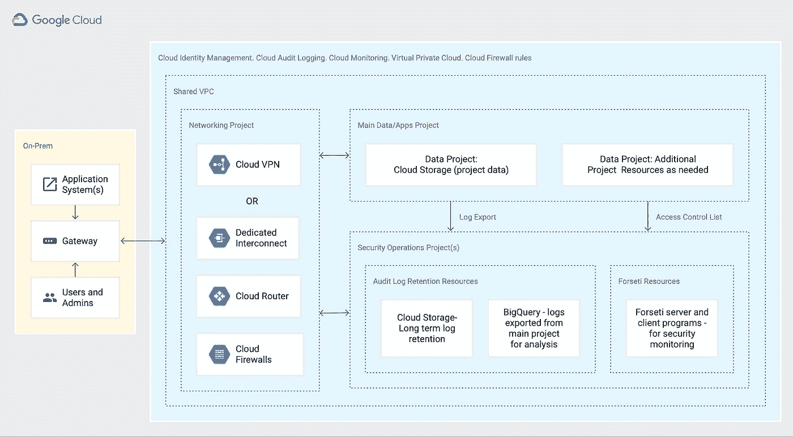
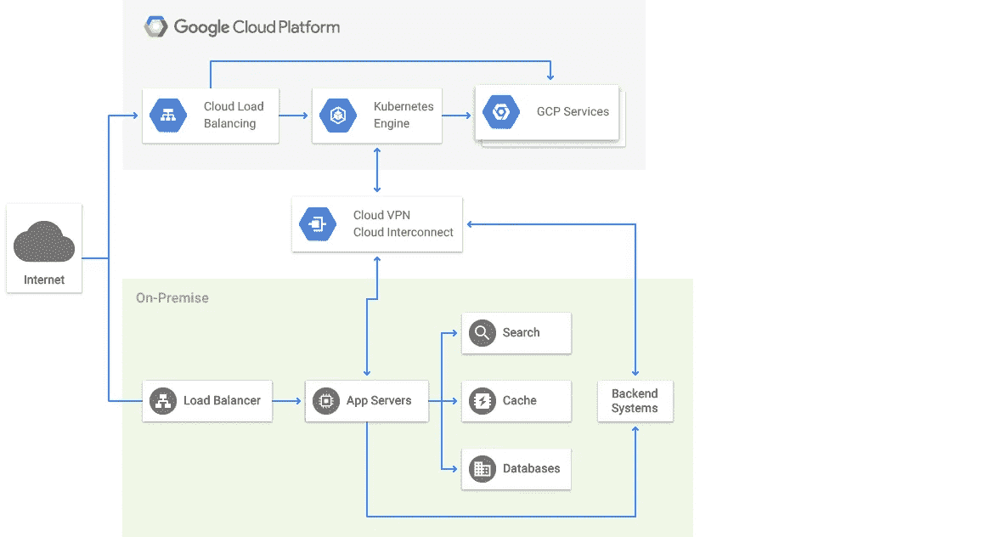

# 机器学习解决方案架构

> 原文：<https://pub.towardsai.net/machine-learning-solution-architecture-b73a093a78b2?source=collection_archive---------1----------------------->

## [云计算](https://towardsai.net/p/category/cloud-computing)

## 本文将重点关注[第二节:GCP 专业机器学习工程师认证的 ML 解决方案架构](https://cloud.google.com/certification/guides/machine-learning-engineer)。

[GCP 架构图:HIPAA 对齐项目](https://cloud.google.com/solutions/architecture-hipaa-aligned-project)

如果你打算参加认证，这将是一个很好的起点。如果你没有，这将帮助你开发在快速发展的机器学习生态系统中取得成功所需的基本知识。

**这不是认证学习指南。**

本文的目的是对复杂的想法提供一个简单的解释，并给出一个广泛的主题观点。大纲模仿了 [GCP 专业机器学习工程师认证](https://cloud.google.com/certification/guides/machine-learning-engineer)指南。

我嵌入了有用阅读材料的链接，如果你愿意的话，可以深入研究一下。

# ML 解决方案架构

***架构的目的是提高用户的体验。***

## 设计可靠、可扩展、高度可用的 ML 解决方案

云技术和虚拟化使得基础设施易于配置，但尽管如此，一个实施糟糕的基于云的解决方案与一个设计糟糕的内部解决方案一样糟糕，甚至更糟。因此，它必须设计得可靠、可伸缩，并且可用于任何解决方案，以交付期望的业务成果。

**可靠性**是对解决方案在一段时间内持续交付特定功能的信心。

**可伸缩性**是根据需要进行伸缩的能力。随着需求的增加，基础设施应该自行扩展，解决方案应该继续提供服务。随着需求下降，基础设施应该在不降低服务质量的情况下收缩，从而使解决方案变得可靠。您可以水平或垂直缩放。**水平扩展**是添加额外的服务器，而**垂直扩展**是添加更多内存或更好的 CPU。

**可用性**是解决方案在需要时使用的准备状态。对于有用的 ML 解决方案，它必须是可用的、可靠的和可伸缩的。

 [## 技术指南|解决方案|谷歌云

### 了解如何利用从教程到解决方案的技术指南构建 GCP。

cloud.google.com](https://cloud.google.com/docs/tutorials#architecture) 

## ML 解决方案的核心是数据。这只是数据——没别的了

现有的数据通常很难收集、使用和理解。您很少会看到这样一幅画面:您需要的所有数据都在一个存储库中，并且采用您可以理解的格式。数据的一些常见问题是:

*   它分散在整个组织的地域孤岛中(有情感和技术方面的原因。)
*   并非所有的数据都与手头的问题相关。
*   构建解决方案所需的数据可能不可用。
*   格式、布局、时间表(新鲜度)和链接会增加复杂性。

在构建解决方案时，从整体上进行思考是非常重要的，因此:优化、联系、准备数据、培训、测试，然后是部署。

*   **优化数据使用和存储:**一般来说，您可以根据数据的使用方式将数据分为三种类型。日常使用的数据显然必须存储在最高效、最易访问的存储中。因此它很贵。第二种类型是按月或按季度使用的数据。这样的数据集可以转移到更便宜的存储设备上，并且可以选择偶尔访问一次。第三种是您可以出于法律或合规性目的而暂时搁置的数据，您可能一年左右需要一次。分层将直接影响持续运营成本和性能。
*   **数据连接:**你无法将所有需要的数据放在一起。需要通过 API、批处理和实时进行集成的策略。大多数情况下，您的解决方案将在混合环境中使用。混合环境可能包括多家云供应商、一个私有云以及一个传统的本地数据中心。数据结构将有助于构建所有数据源的公共视图，而无需物理移动数据。

 [## 什么是数据结构？| NetApp

### 数据结构是一种体系结构和一组数据服务，可跨多种选择提供一致的功能…

www.netapp.com](https://www.netapp.com/data-fabric/what-is-data-fabric/) 

*   **软件开发生命周期(SDLC):** 可以使用敏捷交付模型，如 Scrum、看板、SAFe 或传统的瀑布 SDLC。然而，CRISP-DM 模型具有敏捷、迭代的思维模式，非常适合 ML 解决方案开发或任何数据扩展工作。

 [## CRISP-数据挖掘和大数据领域的数据挖掘方法领导者

### 机器学习方法的一步一步的简短指南

towardsdatascience.com](https://towardsdatascience.com/crisp-dm-methodology-leader-in-data-mining-and-big-data-467efd3d3781) 

## 选择合适的谷歌云软件组件

谷歌云平台(GCP)有大约 150 多种[产品](https://cloud.google.com/products)，只需点击一个按钮就可以供应。

然而，在选择产品之前，你必须评估 ***你独特的需求*** 。如果您希望服务提供商拥有基础架构管理，包括升级、补丁等。，那么托管服务就是最佳选择。如果没有，那么您可以在云中构建自己的环境，并使用您的专业知识来管理环境。

在深入决策之前，参考最佳实践是值得的。

 [## 企业组织的最佳实践|文档

### 本指南介绍了最佳实践，以帮助像您这样的企业客户踏上谷歌云之旅。指南…

cloud.google.com](https://cloud.google.com/docs/enterprise/best-practices-for-enterprise-organizations) 

从使用和成本角度来看，另一个重要因素是配额的概念。

如"*"指南中所述:*

> *Google Cloud 对项目所有者的资源使用实行配额制，对您的项目可以使用多少特定的 Google Cloud 资源设置了硬性限制。我们通过配额限制两种类型的资源使用:*
> 
> **速率配额*例如每天的 API 请求。此配额在指定时间后重置，如一分钟或一天。*
> 
> **分配配额*例如您的项目使用的虚拟机或负载平衡器的数量。此配额不会随着时间的推移而重置，但必须在您不再需要使用该资源时明确释放，例如通过删除 GKE 集群。*

## ***监管和安全问题。***

*法规遵从性和安全性是每个人的责任。当系统向云迁移时，这变得非常重要。*

*一个环境只有在您的努力下才是安全的。在云上，管理安全性是您的责任。云供应商将保证网络和基础设施的物理安全，但如果你将你的访问权分享给未经授权的用户或管理不当，你将承担后果。*

*法规遵从性也是如此。GCP 将为您提供支持、指导方针和框架，以满足监管要求。但是遵从是你的责任。例如，对于 HIPAA，GCP 将提供所有必要的基础设施认证和安全性，以确保合规性，如 [GCP 安全性/合规性文档](https://cloud.google.com/security/compliance/hipaa)中所述:*

> *谷歌全面的第三方审计方法旨在保证谷歌对同类最佳信息安全的承诺。客户可以参考这些第三方审计报告来评估谷歌的产品如何满足他们的 HIPAA 合规性需求。*

**

*[谷歌云解决方案架构参考](https://gcp.solutions/)*

***总之，回顾用例研究(******[**医疗保健和生命科学**](https://cloud.google.com/solutions/healthcare-life-sciences) **)和参考架构有助于理解、联系和可视化规划&执行的解决方案前景。*******