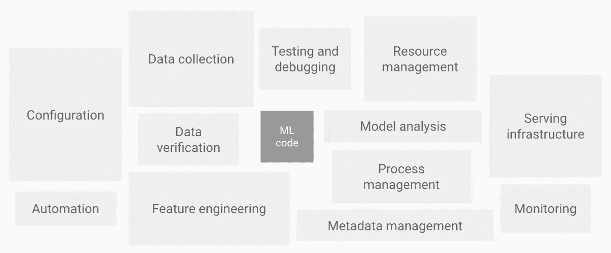
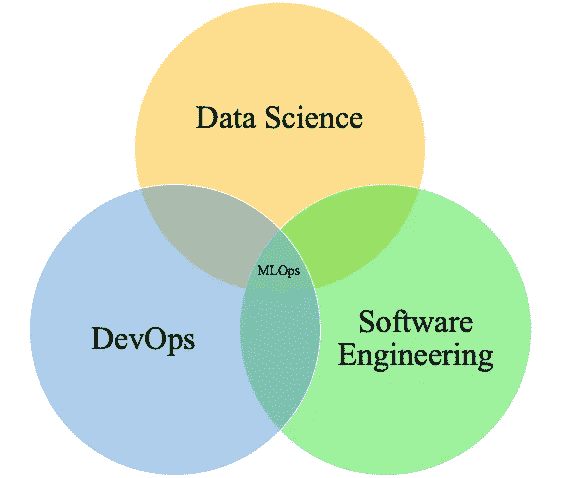
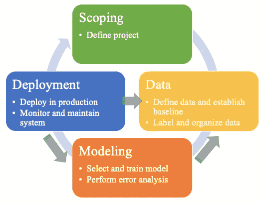

# 机器学习系统。1:概述和挑战

> 原文：<https://pub.towardsai.net/machine-learning-systems-pt-1-overview-and-challenges-2e3f60381583?source=collection_archive---------0----------------------->

## 对 MLOps 的简单介绍

大规模艺术。作者图片

2015 年，一篇机器学习研究论文掀起了讨论“机器学习系统中隐藏的技术债务”的巨大波澜。在本文中，斯卡利等人。艾尔。强调了构建机器学习模型的代码只是整个项目的一小部分。从那以后，这个概念在整个行业得到了验证，因为数据科学家和机器学习工程师试图在 Jupyter 笔记本上生产模型，但收效甚微。

ML 系统的元素。改编自机器学习系统中隐藏的技术债务。谷歌云，公共领域。

事实上，即使市场上出现了各种各样的工具，今天仍在构建的大多数模型都无法投入生产。由于这个原因，这个领域近年来在机器学习产品中占据了中心位置。尽管我对未来持乐观态度，但对当今 MLOps 产品广阔多样的前景的一瞥很容易让您望而却步。米哈伊尔·埃里克在他的博客文章中写了一篇很好的文章讨论这个问题，“MLOps 是一团糟，但这是意料之中的”

MLOps，即机器学习操作，是一套工具、实践、技术和文化，可确保机器学习系统的可靠和可扩展部署。这是数据科学家在未来十年应该采用的最重要的专业之一，如果不是最重要的话，因为实现机器学习系统在生产中的价值对商业成功至关重要。

MLOps 的纪律。作者图片

# 机器学习项目生命周期

ML 项目的生命周期是无限迭代的。这条路上的每一步都会产生新的信息或见解，这需要你后退一两步，这样你才能前进三步。这种反复从根本上使工作变得如此困难；机器学习专家在实验方面表现非凡，但在处理快速变化的信息和见解时，有效地进行实验可能具有挑战性。

机器学习项目分为以下几类:

1.  辖域
2.  数据
3.  建模
4.  部署

让我们在较高的层次上讨论这些问题。

## 辖域

在范围界定中，我们创建项目并评估业务是否准备好从数据中实现价值。首先要有一个清晰的问题陈述。我们真的知道我们在努力解决什么，我们在为谁解决这个问题吗？是不是实际上需要解决的事情？我们是否完全理解我们渴望做的事情背后的原因和人？

在充分了解问题和我们要解决的人之后，评估资源、约束和时间表是很重要的。数据实际上是为我们的用例收集的吗？有登月想法很好，但没有数据就不会有机器学习。如果数据没有被收集(或者保持高质量)，那么这就是一个很大的限制。最好在开始工作前说不，而不是花几个月的时间研究一个“伟大的想法”却发现数据收集得不够充分。

通常最好在这个阶段开始一个项目文档，以确定参与项目的关键人员、与使用相关的数据源、数据质量的限制、预期的时间表、潜在的道德考虑和粗略的进度时间表。这份文件也应该概述你到底计划在这个项目中做什么；是推荐引擎，预测，聚类等。？每个都有不同的需求，应该尽早确定。

这份文件应被视为一项正在进行的工作，尤其是与时间表有关的工作。数据工作的高度迭代性使得在项目早期给出精确的期限估计是不现实的。事实上，管理不当的数据项目首先会忽略这一点，并导致数据科学家错过过多的截止日期和/或高度倦怠。

最后，但肯定不是最不重要的，要重点考虑的是模型的实现场景。你的解决方案真的准备好被涉众使用了吗？是要活在网站、app、独立表等上面？？你的用户打算如何与你的结果互动？太多的项目在没有考虑这一步的情况下就开始了，如果不能提供一个好的答案，就应该停止——机器学习项目的价值只有在人们使用它的情况下才能实现。

## 数据

这一阶段的第一部分可能与范围界定有所重叠，因为您试图定义数据源并为可以做的事情建立基线。这可能意味着很多 EDA 狩猎、采集和视觉化工作。在这一步，确定质量约束是必要的，因为如果数据在某一细节层次上不充分可用，或者对于一个子组来说基本上是空的，当你进入项目的后期阶段时，这可能是一个大问题。

我见过人们在这个阶段做的最糟糕的事情之一就是没有在这个阶段停留足够长的时间。匆忙通过这个阶段或做低质量的工作只是为了通过它(即。盲目地输入意味着获得数值)是一个非常有害的问题。这是具有讽刺意味的，因为大多数机器学习项目都是由数据清理组成的，但我认为，即使这样，也有太多的捷径被用来“完成事情”，这导致了下游的重大问题。

这一阶段的一个不幸的副作用是它可能会非常混乱。这需要大量的搜索和寻找高质量的数据，这会导致无效的代码或混乱的查询。当您结束这一阶段的第一遍时，我建议清理您的代码，并在合理的区域组织您的数据。确保您的标签定义良好，使用描述性名称创建数据表，并提供关于如何对新数据重新运行代码的文档。

当你进行采购时，注意你的机器学习系统的实现是至关重要的。你可以找到高质量的数据来训练你的模型，这很好，但是有新的数据吗？如何建立一个系统来确保这一点？快速迭代和健壮实现之间的平衡很难达到，但是非常需要。幸运的是，你练习得越多，就越擅长。

## 建模

机器学习项目背后的“乐趣”，以及大多数人在课程和项目中学到了什么。我不会在这个系列中深入讨论选择和训练正确的模型，因为已经有太多的内容了，但是知道你选择什么以及为什么选择是至关重要的。

我个人不认为你需要知道模型的每一个数学深度才能恰当地使用它们，但你应该深入了解它们的优点和缺点，以理解为什么有些成功，有些失败。这就引出了这个阶段的第二部分——错误分析。

这个阶段可能是大量的实验和迭代，您应该有敏锐的眼光来调试模型失败的地方以及如何解决这些失败(以及是否值得您花时间这样做)。通常，模型性能需要在业务和技术成本(资源、计算、延迟、吞吐量等)之间取得微妙的平衡。).

应用机器学习现在正进入一个阶段，在这里选择一个强模型并不是真正困难的部分，在实验和调试中具有战略性要困难得多。知道如何尝试特定的策略或错误分析技术，以了解您的模型正在学习什么以及它在哪里失败(适当或不适当)，这是一门艺术。拥有一个协作团队真的很有帮助，因为随着人们获得更多的经验，他们知道如何对模型进行有效的事后分析。

## 部署

部署不是每个单一模型都需要的步骤，但它是构建机器学习系统所需要的。这是因为要求你的用户或利益相关者运行 Jupyter 笔记本来查看你的结果不会给他们提供价值。通常，模型需要集成到网站、应用程序或公司已经在使用的一些平台中，这种生产可能很困难。

此外，这个项目的工作并不是因为你把它投入生产就“完成”了。需要建立监控和系统维护，以确保模型随着时间的推移有效运行。这是因为模型是由数据驱动的，而数据不是静态的资源。它会随着时间的推移而发展和变化，这可能会导致模型在生产中恶化。这可能是由于数据漂移(特性分布的变化)、概念漂移(特性到目标的映射变化)、数据质量问题等。

除了模型监控之外，在这个阶段还有大量的软件工程项目需要设置:

*   实时或批处理
*   云还是边缘/浏览器
*   CPU/GPU 内存
*   延迟、吞吐量
*   记录
*   安全性和隐私

从第一次部署到维护，这些都是需要注意的重要事项，并且很难做到正确。这是构建机器学习系统经常失败的一个重要原因；它需要软件和数据的基础设施，这些基础设施需要到位以充分实现建模项目的价值。

对于每个机器学习项目，其中包含两个项目，第二个项目在您部署第一个项目时开始。

> 对于每个机器学习项目，其中包含两个项目，第二个项目在您部署第一个项目时开始。

# 迭代、实验和挑战

Al 虽然这些步骤具有顺序性，但每一步都会产生信息，使你在之前的步骤中做出不同的决定。部署模型可以产生关于哪些模型具有最佳性能或新数据/概念漂移检查的新见解，建模可以产生关于数据质量需求或基线的新见解，等等。

需要强大的战略思维来处理大量的不确定性，并揭示项目成功的关键因素。你应该带着一些假设来处理这些项目，比如为什么某些想法可行，为什么事情进展顺利，为什么事情失败，哪里可能是个问题，等等。构建系统的经验非常有助于建立这种判断。

这种通过迭代来推动事情向前发展的需求，以及测试各种想法的实验，必须与性能、时间表和成本进行仔细的平衡，这也是这项技术如此具有挑战性的最终原因。每一步都充满了不确定性和最佳的知识，以合理的判断在不确定的水域中航行。

机器学习项目生命周期。作者图片

## 为什么是 MLOps

在介绍特雷维尔等人的 MLOps 时。艾尔。，作者概述了进行 MLOps(以及拥有强大的 MLOps 基础设施)的三个主要原因，它们都是许多试图构建机器学习系统的组织的中心焦点。

*   *风险缓解。*让一个 ML 模型存在于您的本地 Jupyter 笔记本中，需要每月运行一次，这带来的风险很小，但当您的网站上存在一个每天为数百万客户提供服务的模型时，这很容易成为一项高风险的冒险。在生产中监控和维护大量这类模型的集中团队可能会承担许多与模型相关的风险:在给定的一段时间内不可用，模型对给定的样本返回糟糕的预测，模型准确性或公平性随着时间的推移而降低，维护模型所需的技能(即数据科学人才)丢失，开源软件库下降或发生重大变化。即使有了数据治理委员会，您也需要真正的 MLOps 基础设施来缓解这些业务关键型问题。
*   *负责任的艾。*如今，仅仅建立一个高性能的模型是不够的，也不应该不公平地歧视不同的人口统计数据或子群体。虽然机器学习明确地从过去的例子中学习，但过去的例子很容易受到人类偏见的影响。克服这些可能非常具有挑战性，但机器学习系统必须在两个维度上取得成功:意向性和责任性。
*   *规模。* MLOps 不仅仅是规模的一个选项，也是一种必需。以下是随之而来的一些好处:跟踪版本控制，特别是在设计阶段的实验，了解重新训练的模型是否比以前的版本更好(并将执行更好的模型推广到生产中)，确保(在定义的周期内——每天、每月等)。)模型性能在生产中不会降低，等等。

## 基本挑战

特雷维尔等人。艾尔。强调使大规模管理整个机器学习生命周期如此具有挑战性的三个关键原因。

*   *依赖性强。*数据和业务需求不断变化，因此需要持续监控和评估生产中的模型，以确保它们按照预期运行并解决原始问题。
*   *多国语言。这也不仅仅是指编码语言。在这个过程中涉及到各种各样的人——商业领袖、数据科学家/分析师/工程师、机器学习工程师、IT 团队等。这些人中的大多数都在使用各种各样的工具和概念，因此在整个企业中进行协调是一项挑战。*
*   许多技能。与前一期类似，期望数据科学家了解软件工程的所有细节可能是一个巨大的要求(反之亦然)。虽然 MLOps 工具可能会使这座桥梁随着时间的推移更容易通过，但目前的情况很难在不导致精疲力竭的情况下找到一个角色来支持。这种困难自然会导致很多失误，因此，当期望管理不是您创建的模型时，会导致更大的复杂性。

我想补充另一个挑战:

*   *缺乏强大的数据基础设施。*成熟的数据组织有一个数据字典系统，一个很好的文档，记录了人们用来获取共同需求的示例查询，一个质量指示器，指示哪些字段/表/系统出现故障或有问题，等等。拥有一个简单的 EDA 工具来监控快速变化环境中的现有数据和新数据，对于构建机器学习系统来说是一个巨大的帮助。

在本系列的后续部分中，我将通过更详细地阐明概念，甚至展示如何通过 TensorFlow 实现这一点，来更深入地讨论每个部分。我目前正在阅读一些关于 O'Reilly 的 MLOps 书籍，通过 DeepLearning.ai 完成了这个生产专业化的机器学习工程，并在我的日常工作中实践了这项工作，所以如果你想了解更多，请跟随我！

# 参考

[1]特雷维尔等人。艾尔。O'Reilly Media 介绍 MLOps

[2] DeepLearning.ai，Coursera，面向生产的机器学习工程(MLOps)专业化

[3] Chip Huyen，斯坦福，po CS 329S:机器学习系统设计