# 机器学习系统。2:扩展 TensorFlow 的数据管道

> 原文：<https://pub.towardsai.net/machine-learning-systems-pt-2-data-pipelines-with-tensorflow-extended-92da85180d0f?source=collection_archive---------2----------------------->

## 使用 TFX 构建生产 ML 的所有数据管道组件


Oculus Rift。作者图片

在第 1 部分中，我介绍了 MLOps 的概况和一些主要挑战。由于数据、业务和代码不断变化的性质，大规模实现模型可能是一项困难的工作。

[](https://animadurkar.medium.com/machine-learning-systems-pt-1-overview-and-challenges-2e3f60381583) [## 机器学习系统。1:概述和挑战

### 对 MLOps 的简单介绍

animadurkar.medium.com](https://animadurkar.medium.com/machine-learning-systems-pt-1-overview-and-challenges-2e3f60381583) 

在这一部分，我将展示如何使用 TensorFlow Extended (TFX)构建数据管道组件。这将遵循 DeepLearning.ai 在生产专业化中的机器学习工程(MLOps)中教授的工作和技能，特别是关于生产中的数据生命周期的第二个课程。我将在这里讨论最后一个作业，但是我将把它应用到一个新的数据集。我将使用的数据集是通过 Kaggle 得到的这个[中风预测数据集。](https://www.kaggle.com/datasets/fedesoriano/stroke-prediction-dataset?datasetId=1120859&sortBy=voteCount)

# 目录

1.  数据摄取
2.  特征选择
3.  数据验证和管道
4.  特征工程
5.  ML 元数据
6.  摘要

# 数据摄取

我们将使用的主要软件包是 TFX 的 TensorFlow Extended。这个包有一些我们也需要的主要库，比如 tensorflow_data_validation 和 tensorfow _ transform。还有更多的库值得注意，但是我们现在只关注这些。

```
TensorFlow version: 2.8.0
TFX version: 1.7.0
TensorFlow Data Validation version: 1.7.0
TensorFlow Transform version: 1.7.0
```

因为我是在 Google Colab 中运行的，所以我安装了驱动器来连接数据。这对于您来说可能会有所不同，这取决于您接收数据的位置和方式。

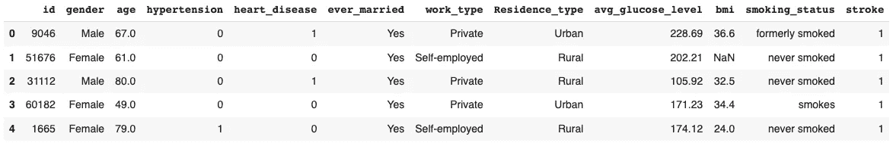

```
(5110, 12)
```

我选择这个数据集是因为它是我非常感兴趣的领域，还因为它包含了要处理的很好的列组合——分类的、数值的等等。这些特征类型中的每一种都需要不同的预处理和转换步骤，更重要的是，我们需要它是一致的、可再现的和可记录的。这是因为尽管我是在一个 Colab 笔记本上做的，但我们想模拟大规模构建一个 ML 系统的体验。

值得注意的是，与真实世界的数据集相比，该数据集的清理、验证和转换步骤将*大大*减少。

我们可以从简单的第一步开始，检查数据集中有多少空值。

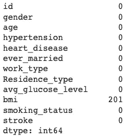

处理这些空值的一个好主意是估算按性别和年龄段分组的患者的平均值(或者根据健康指标对相似的组进行聚类，然后估算平均值)，但是因为我们没有很好的理由知道为什么身体质量指数在这里可能会丢失，所以让我们从简单的开始，去掉空值。

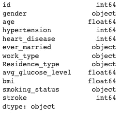

# 特征选择

我们有几个数字或分类特征，假设我们已经设置了一个基线模型，我们可以使用 sklearn 的 SelectKBest 进行特征选择，以选择具有高预测能力的特征。理想情况下，我们会在构建基线模型后进行特征选择，以确定快速、易于解释的模型可能产生的结果。特征选择也由无数的技术组成，例如过滤方法、包装方法和嵌入方法；但是我们这里只关注单变量特征选择。

根据您要评估的输入(数值或分类)和输出(分类)数据类型，您可能需要使用不同的评分函数。

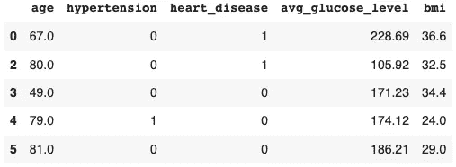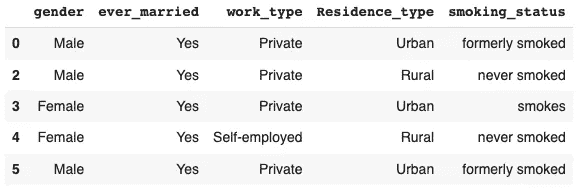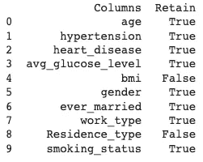

我们可以选择顶部的特征列，并将文件保存到指定的位置。

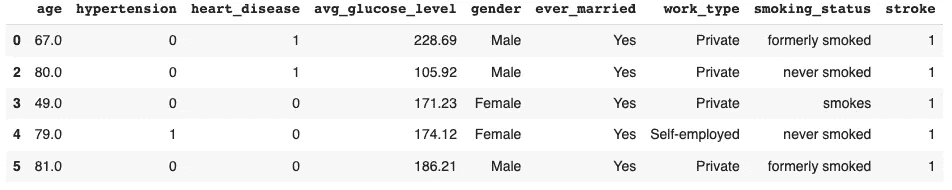

# 数据验证和管道

## 数据摄取

使用 TensorFlow 方法构建数据管道的第一步是设置交互上下文，以便手动执行笔记本中的组件。前两行将 SQLite 数据库保存在预定义的目录中。

然后，我们开始将数据集加载到 ExampleGen 中，这使我们能够将原始数据转换为 TFRecords，以便在管道的后续阶段进行更快的计算。

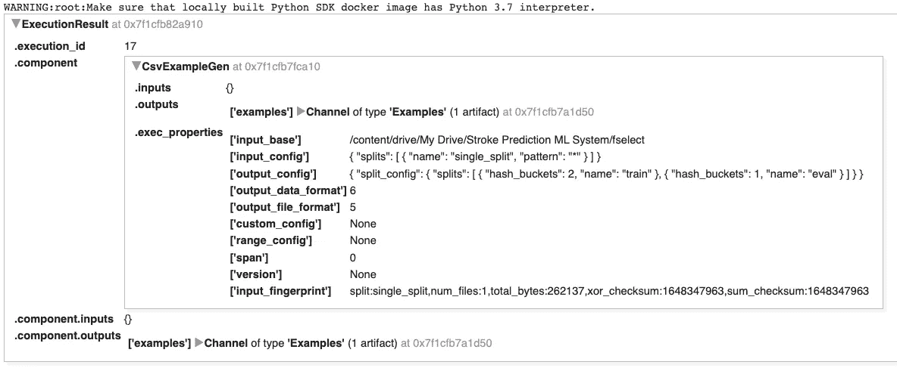

我们的文件是 CSV 格式的，所以我们使用 CsvExampleGen，但是我们输入的参数是目录路径，而不是文件位置本身。

数据摄取是 ML 项目中经常被忽略的一个步骤，因为当你埋头于一个项目时，很容易只想开始“真正的建模工作”。数据摄取是所有道德考虑的起点，询问有关安全性、隐私和质量的适当问题至关重要。

## 计算统计数据

我们可以使用加载的数据集来计算统计数据。虽然这并没有涵盖您通常需要做的所有 EDA，但是它提供了对可能存在的突出问题或数据质量问题的深刻见解。

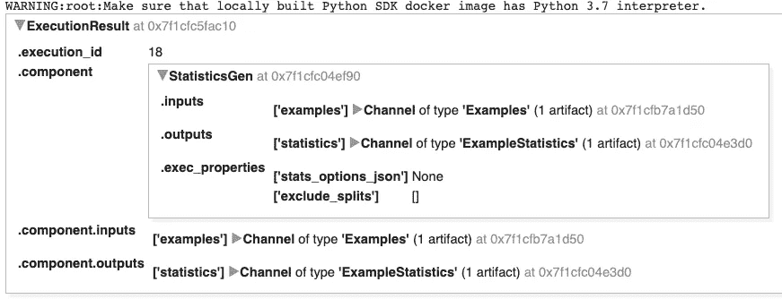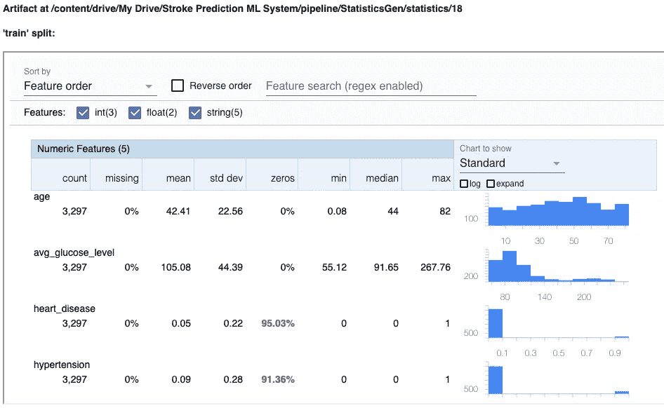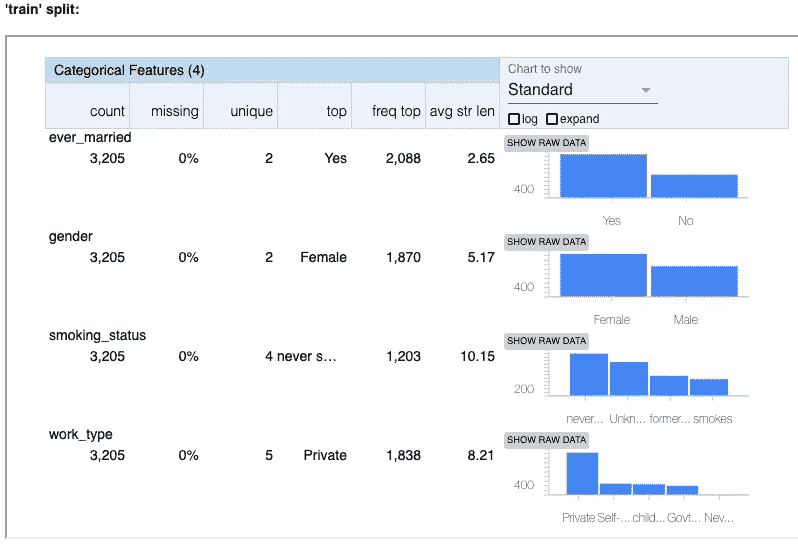

统计模块展示了要素的类型、每个要素的值计数、缺失百分比、唯一性等等。您可以观察每个要素的分布，以确保协变量平衡，还可以比较 train_split 和 eval_split，这对于确保您的模型可以推广到新数据至关重要。

您可以立即看到，像心脏病和高血压(以及我们的目标中风，它没有在图像中显示)这样的特征在零列中以红色突出显示。这表明我们有大量的零，这可能是一个问题，但对这些列来说是有意义的，因为它们已经被编码为 0/1。

这是确保数据集来源和设计公平的重要一步。如果没有，在继续前进之前，必须停下来整理一个更好的数据集；将一个有偏见的 ML 系统发布到现实世界中是非常有害的。选择构建机器学习系统也意味着你要负责任地进行构建。

## 推断和管理模式

我们可以使用 SchemaGen 组件在训练和服务期间验证传入的数据集。这对于确保高数据质量至关重要，因为 ML 系统旨在实时预测新数据。

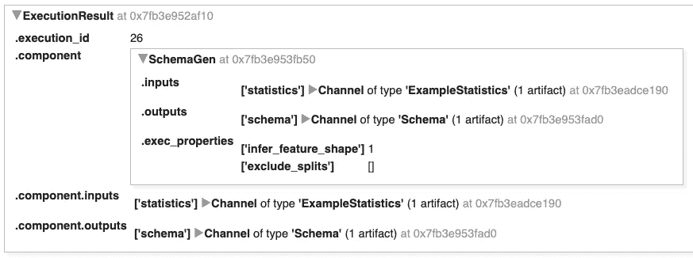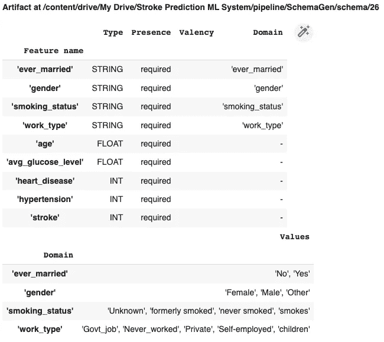

该模式向我们展示了每个特征的类型、存在、化合价、域和域值。我们也可以编辑 SchemaGen 来编辑这里的值。

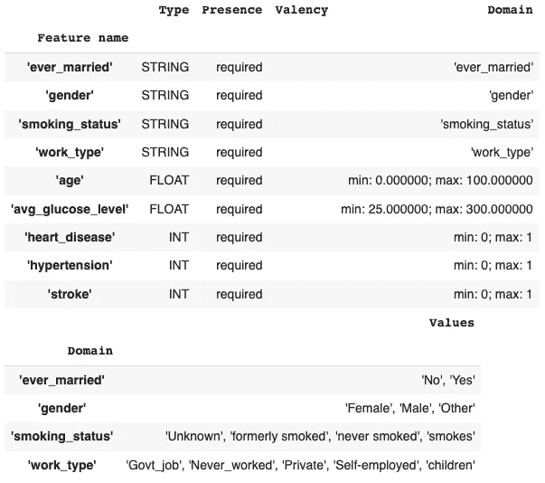

TFX 让我们可以轻松地根据自己的需求来设计模式。这是一个重要的步骤，因为我们的参数表明，如果超出我们的限制，何时发出数据失败或错误的信号。例如:如果我们的系统接收新数据，并且心脏病的值为“是”,它将在这里抛出一个错误，而不是继续前进并完全破坏系统。类似地，如果输入的患者年龄超过 100，我们的模型就会标记出来。这表明，要做好这件事，需要(业务和客户的)重要领域知识。

## 模式环境和异常检测

当我们考虑实现监督模型时，我们必须意识到培训和服务环境。在训练期间，我们的数据集包含输入要素和目标变量，我们的模式被配置为检测这些要素。

在训练和模型用于推断之后，新的输入数据将不再具有标签。当在那个阶段使用我们策划的模式进行模式验证时，这可能会出现问题。我们可以很容易地调整这一点，以确保它理解环境之间的差异。

我们可以通过简单地删除标签列并将我们的数据集保存到我们的服务数据集的新位置来模拟展示这个问题。

然后，使用 StatsOptions 组件，我们可以推断模式并生成/验证统计数据，以检测我们提供的数据集中的异常。

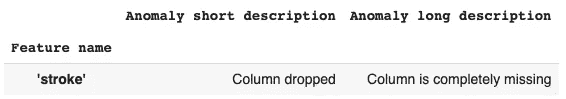

解决这个问题的方法是创建两个环境，并更新我们的模式，以便在我们的服务环境中不会出现“stroke”。


现在我们已经设置好了，我们需要保存更新的模式以供以后参考。

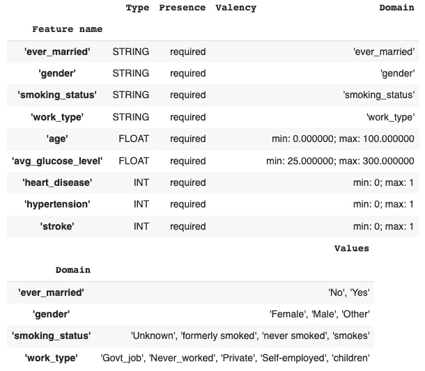

```
['TRAINING', 'SERVING']
```

我们可以导入精选的模式来生成新的统计数据并检测异常。

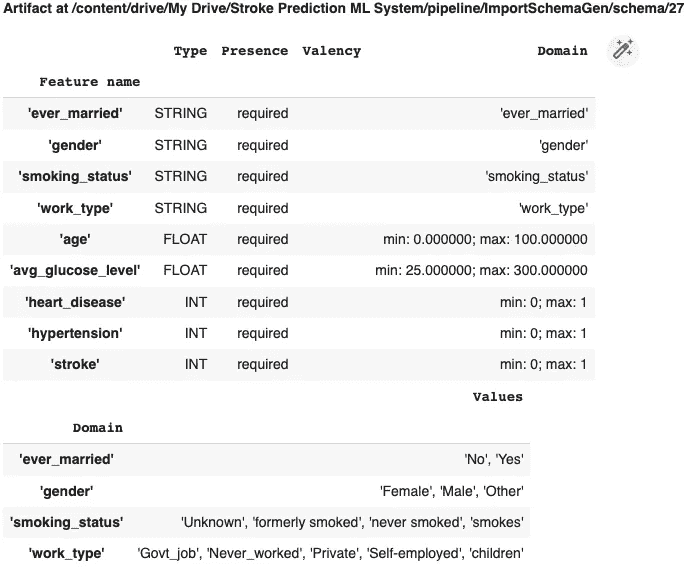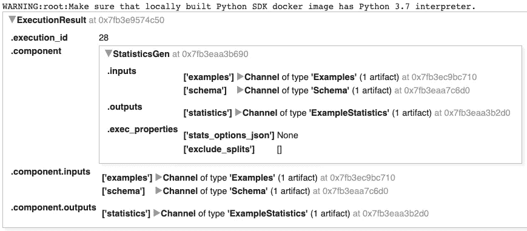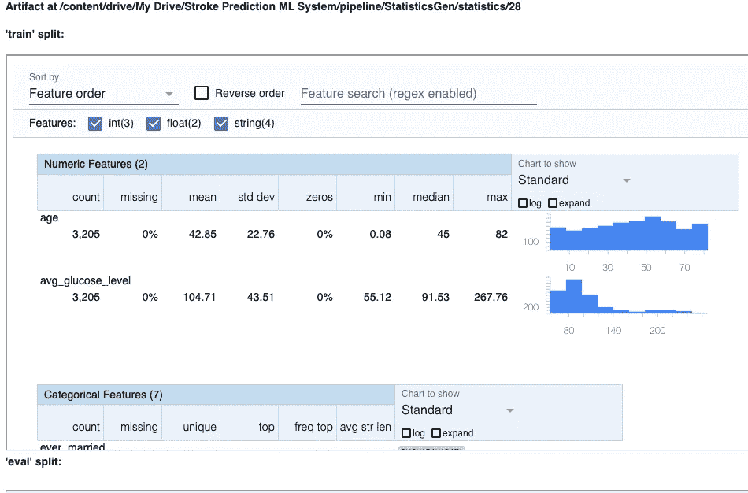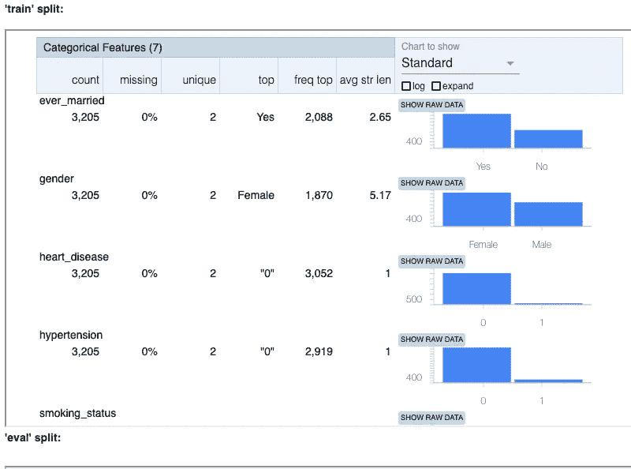

以上步骤类似于我们到目前为止已经看到的，只是不同之处在于导入新的管理模式。现在我们可以在它上面使用 ExampleValidator 来检测我们的每个 train 和 eval 分割中的异常。

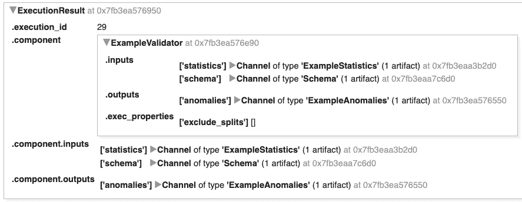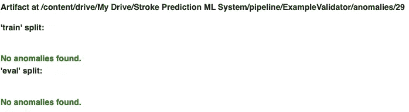

为什么标准化和规模化很重要？

有三种类型的偏差很容易在实现中破坏我们的模型。

1.  架构偏差:服务和培训数据不符合相同的架构。比如 int！=浮动。
2.  特征偏斜:训练特征值不同于服务特征值。例如，转换只应用于一个环境。
3.  分布偏斜:训练数据集和服务数据集的分布有很大不同。可能是由于训练期间的错误采样方法、训练和服务数据之间的不同数据源，或者数据随时间变化。这可以是数据集偏移(特征和目标分布的显著差异)、协变量偏移(特征分布的显著差异)或概念偏移(特征到目标映射分布的显著差异)。

# 特征工程

一旦我们验证并管理了我们的数据集和模式，我们就可以继续进行特征工程。数据预处理是将原始数据转化为干净的、可用于训练的数据集所必需的。特征工程映射:将原始数据映射为特征向量，将整数值映射为浮点值，将归一化数值、字符串和分类值映射为数值向量，将数据从一个空间映射到另一个空间。

这可以包括多种方法，例如将字符串缩放和转换为词汇索引。这些转换在您的训练数据中保持一致是很重要的，在部署模型进行推理时，对服务数据也是如此。TFX 通过生成一个在训练和推理过程中处理输入数据的图表来确保这一点。

我们可以创建一个常量文件来存放我们需要缩放或编码的特性。当我们希望基于每个元素所需的特定预处理对它们进行迭代时，这将很方便。

```
Writing stroke_constants.py
```

```
Writing stroke_transform.py
```

使用 TFX 转换组件，我们可以执行转换并生成转换图。这包括数据集示例、管理模式和具有预处理功能的模块。

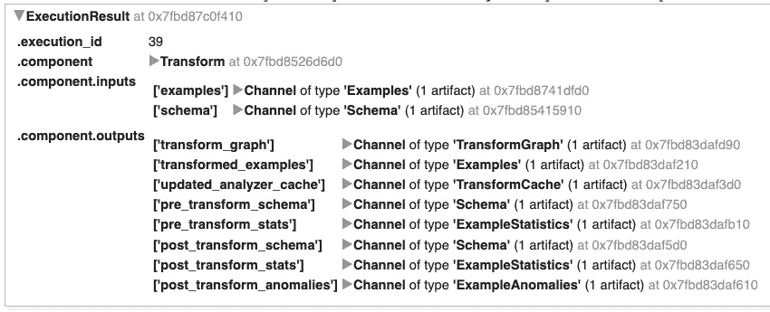

我们可以从转换后的数据集中打印出一些记录，以确保我们的转换按预期执行。

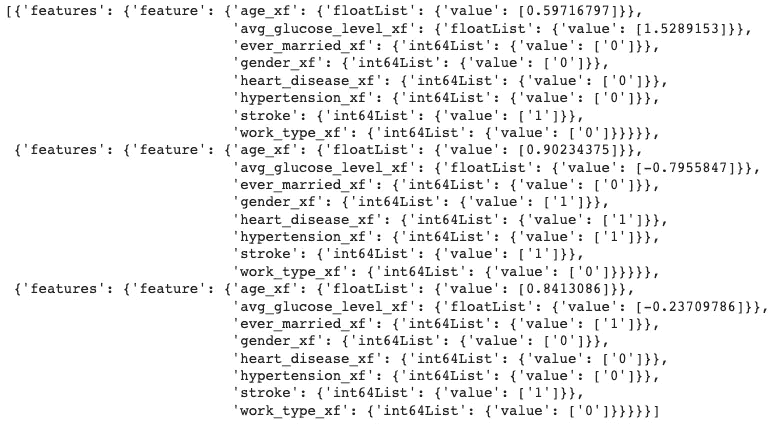

看起来准备好建模了！

# ML 元数据

ML 元数据是 TFX 用来记录、跟踪和检索管道中每一步的东西。我不会在这个故事中覆盖代码，但这段 TFX 是非常重要的注意。过程中的每一步都通过交互上下文作为工件记录下来。您可以通过 id 或类型查询每个工件，以回忆哪些输入被提供给管道的特定阶段，重现结果，或者进行一般的故障排除。

如今，每个机器学习项目(做得好的)都附有一个治理文档，概述了项目的每个步骤，使用了什么数据及其原因，如何操作、建模等等。利用 ML 元数据不仅提供了一种简单的回滚方法，还可以调用精确的训练数据集或用于审计目的的预处理阶段。

关于 [ML 元数据](https://www.tensorflow.org/tfx/guide/mlmd)的文档做得很好，我推荐回顾一下。如果有足够的愿望，我很乐意写一个未来的故事，展示如何使用 ML 元数据来检索记录的工件。

# 摘要

在这个故事中，我概述了如何使用 TensorFlow Extended 设计完整的数据管道，包括:数据接收、数据验证和数据转换。这包括但不限于:

*   执行特征选择
*   摄取数据集
*   生成数据集的统计数据
*   根据领域知识创建模式
*   创建模式环境
*   可视化数据集异常
*   预处理、转换和工程特征
*   用 ML 元数据跟踪数据管道的来源

在下一个故事中，我将展示如何在生产中建立建模管道，所以请务必跟随学习更多！

# 参考

[1]中风预测数据集，Kaggle

[2]特雷维尔等人。艾尔。O'Reilly Media 介绍 MLOps

[3] DeepLearning.ai，Coursera，面向生产的机器学习工程(MLOps)专业化

[4] Chip Huyen，斯坦福，CS 329S:机器学习系统设计