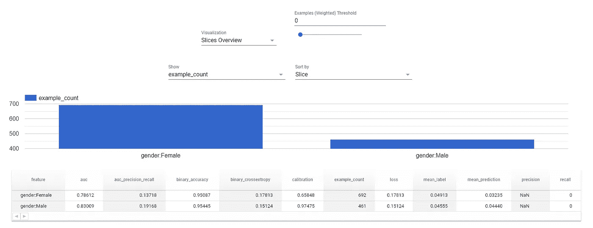
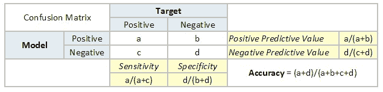
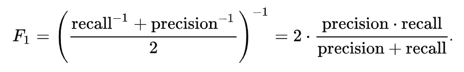
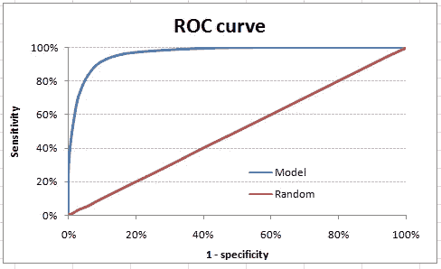
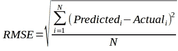
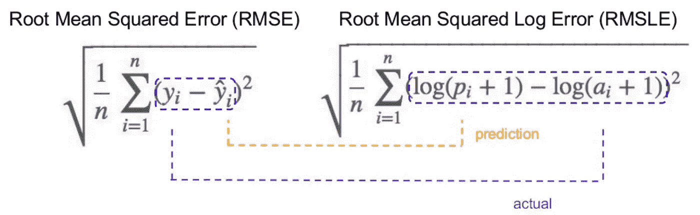
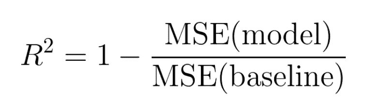
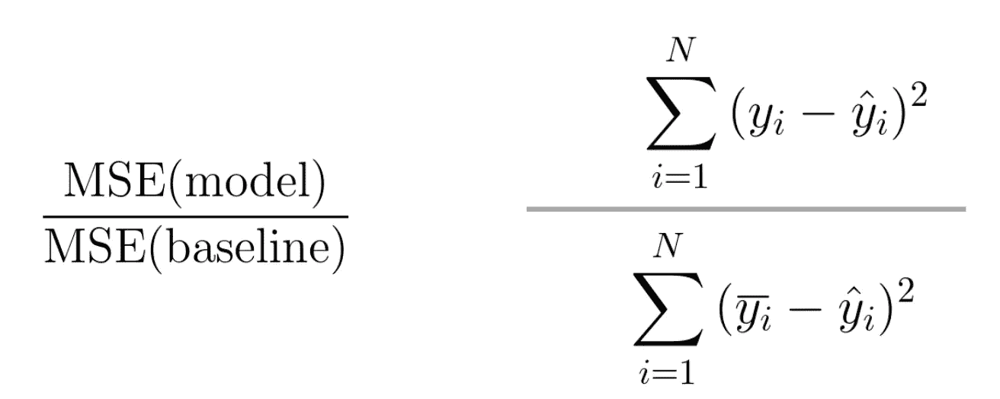
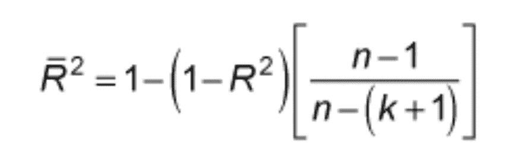

# 机器学习系统。3:使用 TensorFlow Extended 建模管道

> 原文：<https://pub.towardsai.net/machine-learning-systems-pt-3-modeling-pipelines-with-tensorflow-extended-976d01702b4c?source=collection_archive---------0----------------------->

## 建模概念验证完成后去哪里


大海捞针。作者图片

各种公司中有数不清的数据从业者正在 Jupyter 笔记本上进行大量的建模概念验证工作，他们很难过渡到项目的下一阶段。这个故事是为了帮助你了解如何在训练/验证/测试数据集上获得强大的初始模型之后，将你的工作概念化。

在本系列的第 1 部分中，我讨论了 MLOps 的概述和挑战:

[](/machine-learning-systems-pt-1-overview-and-challenges-2e3f60381583) [## 机器学习系统。1:概述和挑战

### 对 MLOps 的简单介绍

pub.towardsai.net](/machine-learning-systems-pt-1-overview-and-challenges-2e3f60381583) 

在第 2 部分中，我展示了在将建模管道部署到生产环境中时构建健壮的数据管道的重要性，以及如何通过 TensorFlow Extended:

[](/machine-learning-systems-pt-2-data-pipelines-with-tensorflow-extended-92da85180d0f) [## 机器学习系统。2:扩展 TensorFlow 的数据管道

### 使用 TFX 构建生产 ML 的所有数据管道组件

pub.towardsai.net](/machine-learning-systems-pt-2-data-pipelines-with-tensorflow-extended-92da85180d0f) 

在这一部分中，我将展示如何将建模、服务和后期制作分析添加到您的工作流中，以完善您的机器学习管道。我相信 TFX 有一些最好的开源内容，所以我会继续使用这个框架。话虽如此，今天人们在为这项工作筛选什么工具或语言方面仍然有很大的差异。在云产品、第三方工具和专用笔记本之间，本故事中讨论的工作很大程度上是通过公司中任何可用的手段稀疏地完成的。

# 目录

1.  导入和模块文件
2.  建模管道
3.  模型性能分析
4.  公平指标
5.  消融测试和引导
6.  摘要

# 导入和模块文件

正如第 1 部分和第 2 部分所示，我们将从所有的导入和设置路径变量开始。这有助于设置管道，因为它指示从哪里读取数据以及在哪里保存工件。这是必要的，主要是因为我们可以使用版本控制来回滚某些功能，并保留所有已完成活动的注册表。

```
TensorFlow version: 2.9.1 
TFX version: 1.9.1 
TensorFlow Data Validation version: 1.9.0
```

然后，我们需要创建一个模块文件，其中包含管道将调用的所有所需函数。这包括执行特征工程的功能，并将初始数据集转换成一个现成的建模、建模和服务。

这个模块文件包含所有需要的函数，这些函数可以传递给我们将要介绍的新组件:

1.  适当地预处理特征并保存新的特征规范
2.  将初始数据集转换为转换后的数据集
3.  构建深度和广度的神经网络
4.  将模型与数据进行拟合以产生预测
5.  创建服务签名并将模型保存到适当的目录中

对于大多数习惯于使用 sklearn 在 Jupyter 中进行建模 POC 工作的人来说，这个过程可能显得有些多余。这里要记住的关键是，这是生产 ML，我们要在其中维护一个特性库、模型注册、版本控制等等，这样我们就可以重现结果、在失败的情况下回滚、应用触发器来指示数据漂移和其他隐藏的更改等等。这种方式需要建立更多的基础设施。

# 建模管道

这个管道与我们在第 2 部分中构建的非常相似，除了它有一些新的组件:

*   训练器:用于建立模型和拟合训练数据。内置的模型注册中心来访问以前的迭代。
*   解析器。用于应用模型验证指标，以便触发器可以指示重新训练或比较多次运行并生成最佳模型。
*   评估器:用于利用 TFMA(张量流模型分析)进行建模后分析。
*   推动器:用于将模型推向生产或服务于输出目的地。

使用计算器的另一个重要功能是 eval_config 文件。这允许用户配置特定的方式来分割数据，或者基于上下文阈值和逻辑来设置验证触发器。稍后可以通过 TFMA 使用它来分割数据，从各种因素进行分析，并快速判断我们的模型是否表现公平。

值得注意的是，我将保存的模块文件传递给管道的 run 函数。这就是组件如何知道为转换调用预处理函数，为训练和服务调用 run_fn 函数，等等。

在每个组件之后，记录的历史被存储在本地，但是在企业范围内，通常最好将特性保存到特性存储中，将模型保存到模型注册表中。通常也使用 MLFlow 或 DAGSHub 进行模型日志记录和实验。

然后，我们可以使用第 2 部分中相同的助手函数来提取最新的训练者和评估者工件。

这样做的目的是使用通过 TFMA 渲染的评估器工件输出，这样我们就可以对模型进行后期制作分析。



作者图片

我们可以根据 eval_config 文件中输入的规格轻松地分割数据，以评估性别或其他人口统计数据等关键特征的差异。通过总体指标评估您的模型是一个很好的起点，但是这通常不足以真正理解您的建模管道的性能和影响，尤其是随着时间的推移。

在现实世界的机器学习系统中，必须通过跨多个指标的大量关键切片来评估模型，评估一段时间内的性能，比较多次运行，等等。这可以相对容易地设置使用 TFX。虽然我不会在这里详尽地涵盖分析模型的每一种方法，但是接下来我将讨论一些评估和验证性能和影响的重要方法。

# 模型性能分析

这是目前对模型进行的最常见的分析。建模任务通常分为分类和回归类型。对于分类模型，我们通常得到一个概率输出，该概率输出指示属于一个类别或另一个类别的概率。对于回归模型，我们通常预测一个连续变量，因此我们需要以不同的方式衡量性能。在这一节中，我将简要地介绍一下要点，但是这值得单独写一篇文章，所以在这一节中我不会做得太深入。

分类模型的主要分析是混淆矩阵，因为它们编码了如此多的信息，但是其他度量也通常被添加到上下文中。

*   **准确率**:正确预测总数的比例。
*   **精度(阳性预测值)**:被正确识别的阳性病例的比例。
*   **【灵敏度】**:被正确识别的实际阳性病例的比例。
*   **阴性预测值**:被正确识别的阴性病例的比例。
*   **特异性**:被正确识别的实际阴性病例的比例。



*   **F1 评分:**精度和召回率的调和平均值。用来平衡精确度和召回率。



*   **ROC 曲线下面积(AUC-ROC):**ROC 曲线是灵敏度和(1-特异性)之间的图。(1-特异性)也称为假阳性率，灵敏度也称为真阳性率。该曲线下的面积给出了灵敏度和特异性相对于检测阳性的平衡程度。



除了这些主要指标，以下是其他非常有用的性能分析:

*   **提升/增益图表:**增益是达到十分位数的累积正观察数与数据中的正观察总数之间的比率。累积增益图告诉你你的模型如何区分有反应者和无反应者。Lift 是使用模型达到十分位数 I 的阳性观察数与基于随机模型达到十分位数 I 的预期阳性数之比。提升图表示如果我们没有模型，而是简单地随机选择案例，我们可以预测的积极因素的预期数量。它提供了一个基准，我们可以根据它来查看模型的性能。
*   **Kolmogorov-Smirnov (KS)检验:**测量正负分布之间的分离程度。

对于回归模型，您预测的是一个连续的输出，所以指标看起来也有点不同。

*   **均方根误差(RMSE):** 测量每个预测值和实际值之间的差异，并平均平方损失。n 代表观察的总数。随着更多的观察，这个度量变得更加可靠，平方根使它能够显示与预期的更大偏差。它对异常值很敏感，但通过对值求平方，确实抵消了误差的正/负性质。



*   **均方根对数误差(RMSLE):** 基本上与 RMSE 相同，除了由于首先采用预测值和实际值的对数，它没有惩罚较大的差异。



*   **R-Squared:** 一个基准度量，它给出了模型相对于基线(例如预测每次的平均值)。



*   **调整后的 R 平方:**考虑添加了多少特性，以及它们是否为模型增加了价值。



通常，模型性能分析以对上面讨论的度量标准的简要概述结束。如果某些指标下降到某个任意水平以下，则提示需要进一步调查或重新培训。

最好的数据科学/机器学习团队天生好奇，以实验为导向。按照特定的特性对度量进行切片，以调查特定的性能下降或提高，可以提供关于模型使用什么模式以及它在哪里失败的重要见解。

只查看所有预测的一个整体指标的问题是，它可能会隐藏模型未能检测到的特定模式，这些模式可能会对生产造成严重损害。

例如，您的模型总体上可以产生 98%的准确性，但是在进一步的调查中，您发现您的模型对于特定的小生境种族和性别组合几乎 100%失败。怎么会这样？如果你只有一个很小的人口统计组的例子，那么一个模型就很难很好地概括这个子组。理想的方法是获得更大数量的干净数据，更公平地代表这个群体，但是如果他们已经因为这个模型而感到被边缘化，这可能会减少他们使用你的产品的动机。这可能是一个大规模的大问题。处理它的方法可以根据上下文的不同而不同，但这可以在您运行模型结果的特征交叉切片时看到。通过种族和性别的各种指标来评估表现，可以很快显示出你的预测服务的弱点。

# 公平指标

理想情况下，我们希望我们所有的模型都能公平运行，但现实是，我们通常是在杂乱的数据上建模，在构建这些大规模系统时，可能会出现过多的人为错误。

当我们构建它们时，我们应该不断地思考我们的模型可能失败的方式，公平指标是一种很好的方式，可以将这些问题带到前台和中心，以便解决它们。

这是一个结合了 TFDV (TensorFlow 数据验证)和 Google 的[假设分析工具](https://pair-code.github.io/what-if-tool/)的功能，您可以快速对数据进行分段，然后评估分段之间的性能，以查看结果是否存在不公平的歧视。大多数时候，这些问题很难回答，甚至更难解决，但我们现在努力工作，而不是生活在一个充满后果的世界里，这仍然对社会有利。

通常，你会发现建模不是问题的根源——而是数据。有太多的例子支持某种现实，而支持更公平的现实的例子太少，所以一个强有力的模型只是学习那些模式，并通过概率来复述它们。

这就是为什么解决这些问题可能具有挑战性，但并非不可能。

# 消融测试和引导

当建模 POC 工作仍在进行中时，这两项工作通常是在竖井中完成的，但是我强烈建议设置一个系统来链接到您的建模管道，以便您可以更频繁地运行这些工作。

烧蚀测试是有选择地或有计划地移除特征以评估模型性能和影响的实践。这是一种强有力的方法，可以看出哪些特征组合对结果产生了最大的影响，以及模型真正采用了哪些模式。当您的模型暴露于真实世界的数据时，这可能是一种强有力的方法，可用于了解不同要素如何相互作用，以及这种相互作用是否可能会随着时间的推移而发生变化，最终对您的结果产生影响。

Bootstrapping 是一种令人难以置信的统计方法，通过多次模拟对结果的平均值进行多次重新采样，并将输出绘制成直方图。做了很多次，你得到一个正态分布，然后你就能评估你的模型结果的不确定性。我们通常运行我们的模型一次或两次(或交叉验证 X 次)，但这种方法运行模型模拟，因此您可以构建模型性能指标的置信区间，让您更完整地了解建模管道中的小世界不确定性。

# 摘要

在这个故事中，我将使用 TensorFlow Extended 来构建建模管道，其中涉及到数据的转换、训练和服务。我强调了用于评估性能的常用指标，以及如何剖析模型结果的不同视角。

最终，你将面对大量的不确定性，你应该始终以批判的眼光看待你所看到的结果。不断注意你的建模管道是如何失败的，并不断迭代改进你的系统。

这将是这个系列的最后一部分，但是我会在 MLOps 上创建更多的故事，这些故事可能会更具体地深入某些主题！

# 参考

[1]中风预测数据集，Kaggle

[2]特雷维尔等人。艾尔。O'Reilly Media 介绍 MLOps

[3] DeepLearning.ai，Coursera，面向生产的机器学习工程(MLOps)专业化

[4] Chip Huyen，斯坦福，CS 329S:机器学习系统设计