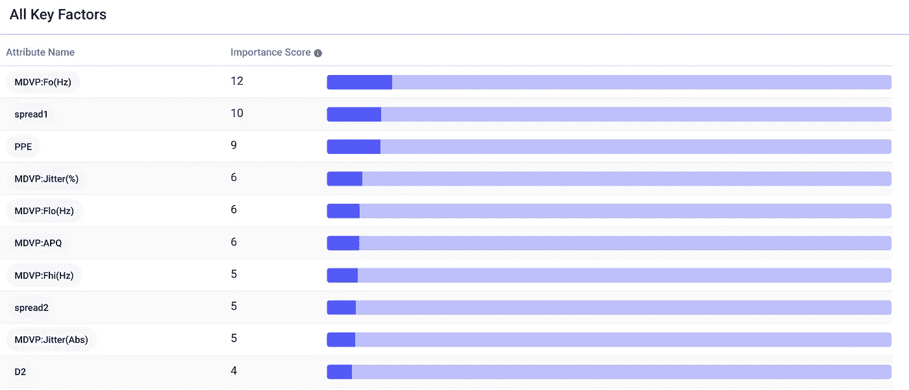

# 机器学习预测帕金森病

> 原文：<https://pub.towardsai.net/machine-learning-to-predict-parkinsons-disease-62fac70c071?source=collection_archive---------5----------------------->

## [机器学习](https://towardsai.net/p/category/machine-learning)

## 汽车指南。

由[布鲁诺·马丁斯](https://unsplash.com/@brunus?utm_source=medium&utm_medium=referral)在 [Unsplash](https://unsplash.com?utm_source=medium&utm_medium=referral) 上拍摄的照片

%的老年人患有帕金森氏症——一种使人衰弱的神经退行性疾病——但多达四分之一的病例被误诊。

正如梅奥诊所所写的，诊断帕金森氏症并不是一项简单的任务。没有特定的诊断测试，训练有素的神经学家需要审查患者的病史、症状，并进行神经和身体检查，使用多巴胺转运蛋白扫描等技术，以及血液测试和成像测试来帮助排除其他疾病。

在医疗资源较少的发展中国家，诊断的难度更大。与许多其他疾病一样，在这次疫情期间，未诊断和未治疗的帕金森病病例可能有所增加。帕金森病甚至可能成为第三波疫情。

幸运的是，有更快、更简单的方法来诊断帕金森氏症，这并不需要密集的亲自出诊。帕金森患者表现出特有的发声特征，机器学习可以用来捕捉这些特征，有效地筛选潜在的患者。

# (小)数据

帕金森氏病影响说话，症状包括发音困难、音量降低和音高范围缩小。

牛津大学收集了 31 个人的 195 段录音:23 人患有帕金森症，8 人没有。这些列包括提取的特征，如平均声音基频以及频率和振幅变化的测量值。

只有 195 行数据，这是“小数据”用例的一个很好的例子。一个普遍的神话是，人工智能需要大数据，尽管深度神经网络的准确性往往会随着数据的增加而增加，但并非所有的人工智能都必然是数据密集型的。在另一篇文章中，我展示了一个不到 100 行的数据集如何被用来[预测 2020 年的政治不稳定性](https://medium.com/@frederikbussler/how-one-man-predicted-2020s-insanity-e79a2a95789b)。

# 分析

我们可以将[数据](https://archive.ics.uci.edu/ml/datasets/parkinsons)原样上传到 AutoML 工具 [Apteo](http://apteo.co) 来制作帕金森病的预测模型。

我们选择`status`作为我们的 KPI，它指的是受试者的健康状况，`1`表示他们患有帕金森病，`0`表示他们很健康。所有其他列都用作属性。后台做一套机器学习模型来预测`status`。我们还可以看到每个属性(或不同的音频特征)如何影响`status`。

梯度增强分类模型被自动选择为最准确的模型，交叉验证的 Jaccard 得分为 0.892。粗略地说，该模型的预测与患者是否患有帕金森症的现实有 89.2%的相似性。

回想一下，帕金森氏症的 *mis* 分类率高达 25%，因此，在没有神经科医生或亲自出诊的情况下，仅通过声音特征就能准确预测帕金森氏症的模型是非常不可思议的。

## 在实践中

事实上，在现实世界中部署这些模型正在取得进展，例如通过[帕金森声音倡议](http://www.parkinsonsvoice.org/index.php)，该倡议旨在记录 10，000 个声音(大约 50 倍的数据)，承诺极高的准确性。

# 摘要

这是一个预测分析的惊人案例研究，它将成为帕金森氏症患者的游戏规则改变者。即使只有很小的数据集，我们也可以在一项困难的医疗任务中获得很高的准确性。