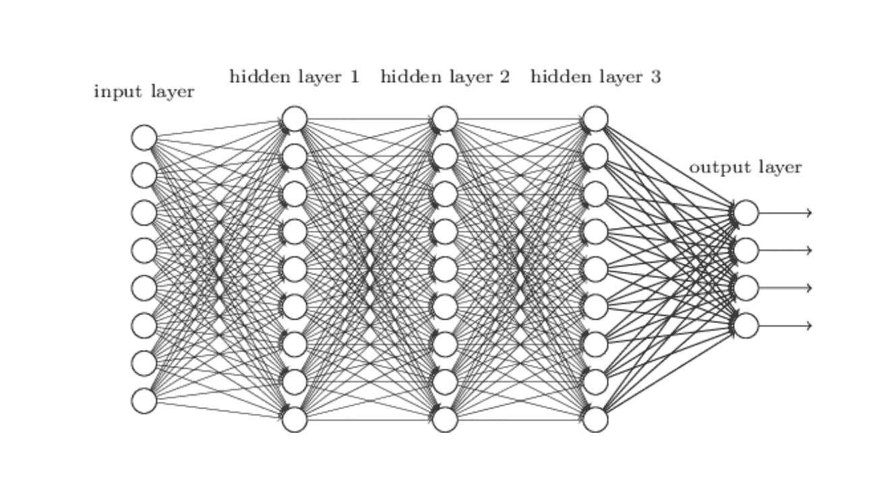
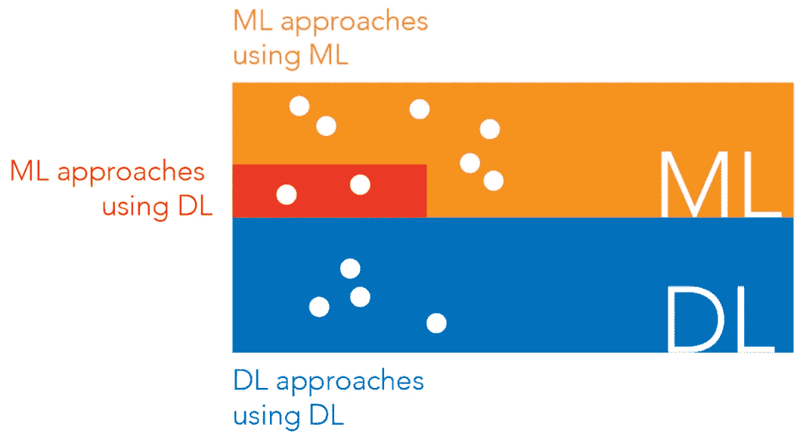

# 机器学习与深度学习

> 原文：<https://pub.towardsai.net/machine-learning-vs-deep-learning-783a87e00126?source=collection_archive---------3----------------------->

## [机器学习](https://towardsai.net/p/category/machine-learning)，[深度学习](https://towardsai.net/p/category/machine-learning/deep-learning)

## 我对人工智能算法的核心区别的解释

[**点击这里了解我，我的项目，我的最新文章。**](http://www.michelangiolo.best/)

初学数据科学家面临的首要问题之一是理解深度学习和机器学习之间的区别。一般来说，机器学习涵盖了整个人工智能世界，而深度学习是机器学习的一个子类。然而，这并没有给你任何有价值的见解。在这篇文章中，我想更深入地挖掘机器学习和深度学习算法之间的结构差异，以便您可以了解它们的关键差异是什么，以及如何发现它们。

## 为什么要理解其中的区别？

如果你渴望成为一名更好的数据科学家，知道使用哪种算法是非常重要的。此外，了解如何对算法进行分类将有助于你将它们放在一个结构中，并让你理解它们在主题内容层次中的位置。

## 技术上有什么区别？

实际上，理解这两类算法之间的区别非常简单:它们的架构不同。没有一个简单的方法来定义架构这个词，除非你已经习惯了编程，把它想象成所有结构的集合和序列。这是深度学习架构的图形表示:

神经网络(深度学习)架构

相反，机器学习没有任何特色架构。几种不同的算法，有不同的任务，可以归为深度学习。

深度学习有两层或更多层神经元。因此，所有使用神经网络架构构建的算法都被归类为深度学习。所有其他算法都被归类为机器学习。

机器学习(ML)和深度学习(DL)之间差异的可视化

## 他们的算法混合在一起

在现实中，有一些算法可以解决机器学习解决的相同任务，例如回归或分类问题，但具有部分或整体架构。一些例子是多层感知器，它仅使用深度学习来解决回归和分类问题，但也支持向量机，它部分使用神经层来解决分类问题。

## 如何轻松分辨？

就我个人而言，这是我如何轻松地将它们分类。首先，我确定我能够用机器学习解决哪些任务:

*   回归
*   分类
*   使聚集
*   降维
*   联合

如果我使用的算法正在解决这些任务中的一个，并且没有任何神经层，那么它就是机器学习。如果它的架构有一个神经层(有一些额外的任务只有像生成对抗网络这样的神经网络才能解决)，就可以归为深度学习。