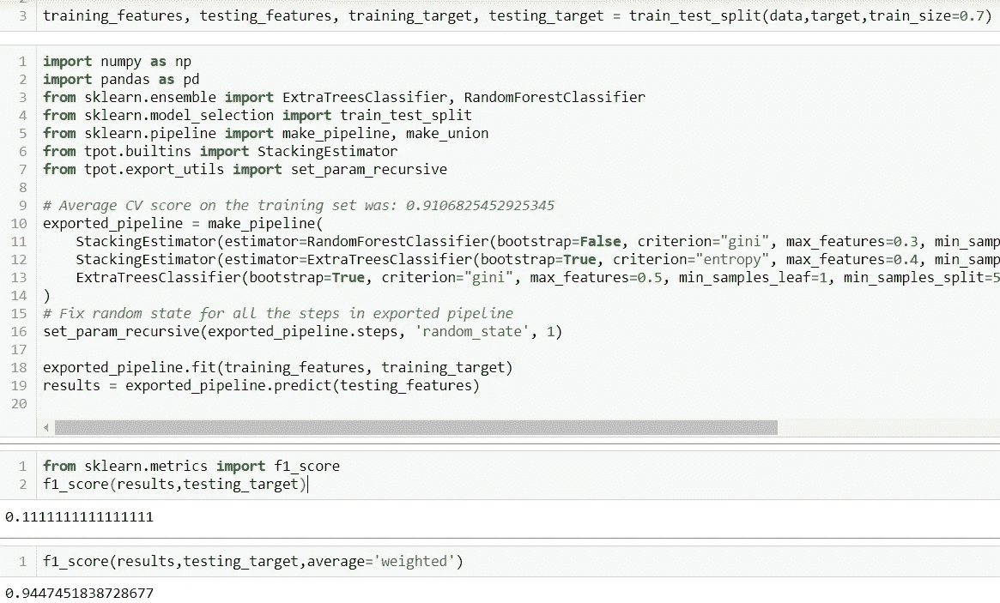
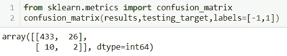
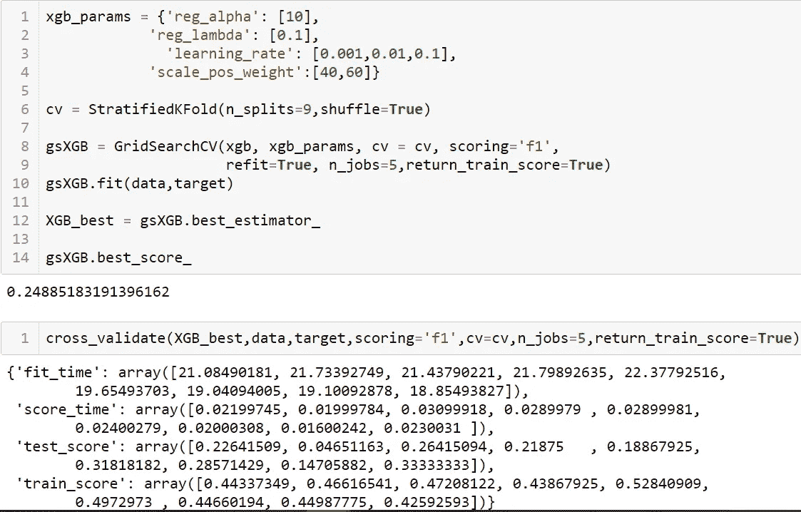
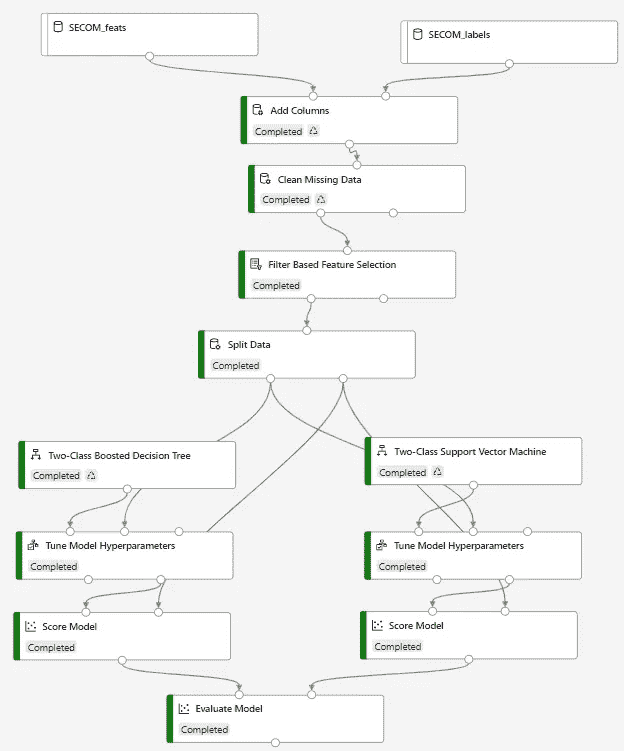
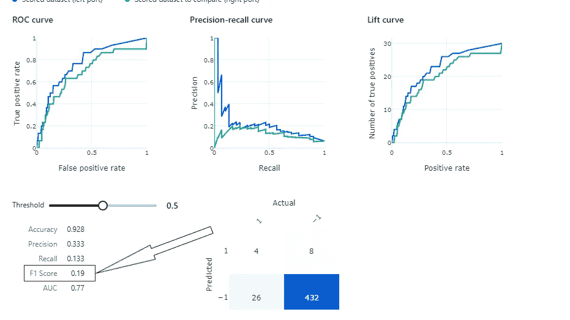
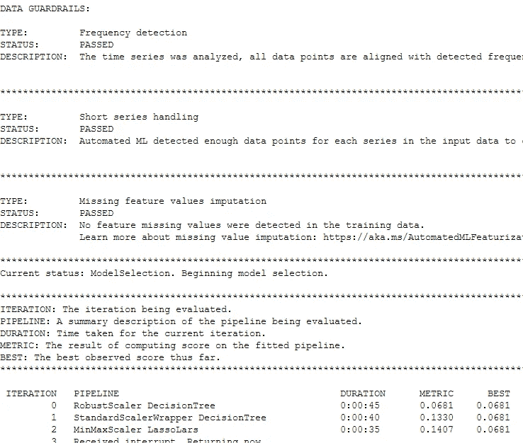

# Azure 免费层的机器学习

> 原文：<https://pub.towardsai.net/machine-learning-with-azures-free-tier-d85071545c07?source=collection_archive---------3----------------------->

## [云计算](https://towardsai.net/p/category/cloud-computing)

## 我如何继续不再依赖我的 CPU 而使用云—达到 Azure 的免费层限制。


由 [Unsplash](https://unsplash.com?utm_source=medium&utm_medium=referral) 上的[恰拉尔·奥斯卡伊](https://unsplash.com/@analoglugunler?utm_source=medium&utm_medium=referral)拍摄的照片

在用完我的免费 [Udacity Nanodegree 的](/machine-learning-in-the-cloud-using-azure-ml-studio-5948b1347bc6?gi=8ea349035e46)许可访问后，我注册了 Azure 的免费订阅。免费层为运行机器学习模型的计算机提供 30 天或 200 美元的免费积分，以先到者为准。我首先花了这些时间来总结我之前关于时间序列预测的[工作](/time-series-forecasting-building-and-deploying-models-continued-deee0588b28c)，其次是 SECOM 数据集，遵循第 11 章【微软 Azure 机器学习预测分析】第二版。

这篇文章讲述了这些经历。原代码在这个 GitHub[repo](https://github.com/Ranga2904/AzureML_TS_SECOM)里。

# SECOM 数据集

本书第 226 页的例子考虑了半导体制造过程中的数据。监控各种信号以预测最终产品是失败(标记为 1)还是通过(标记为-1)。

## 我电脑上的 Jupyter 笔记本

我将特性和标签导入到 Python 中，然后在观察到包含不到 1%的条目后，删除了包含空值的行。

```
# Featuresdata = pd.read_csv('secom.data',sep=' ',header=None)
data.isna().sum()
data.fillna(data.mean(),inplace=True)# Labels / targetlabels = pd.read_csv('secom_labels.data',sep=' ',header=None)
labels.columns = ['Class','Time']
target = labels['Class']
```

由于 TPOT AutoML 包结合了方便的预处理和算法选择，我用 pip 安装了这个包，并用它来拟合给定的数据和标签，使用 7-cross 验证

```
%pip install tpot
from tpot import TPOTClassifierfrom sklearn.model_selection import StratifiedKFold
cv = StratifiedKFold(n_splits=7,shuffle=True)model = TPOTClassifier(generations=5, population_size=50, cv=cv, scoring='f1_weighted',verbosity=2, random_state=1, n_jobs=-1)
# perform the search
model.fit(data,target)
# export the best model
model.export('tpot_secom_best.py')
```

TPOT 产生了一系列分类器。在将数据和目标数据帧分成训练和测试之后，我训练了 TPOT 的管道，并评估了测试数据的性能。下面第二个框中的代码是 TPOT 的输出。



图 1: TPOT 输出和性能

F1 分数 0.11 并不好，有趣的是加权 F1 分数是 0.94。这告诉我们，在预测故障时有很大的改进空间，下面的混淆矩阵强化了这一结论。



图 2:混淆矩阵

令人失望的 TPOT 性能促使我尝试在 XGBoost 分类器上使用 GridSearchCV 进行超参数调优，以解决标签中的不平衡问题。

```
xgb_params = {'reg_alpha': [0.1,1,10], 
            'reg_lambda': [0.1,1,10],
            'scale_pos_weight':[7,20,40]}cv = StratifiedKFold(n_splits=9,shuffle=True)gsXGB = GridSearchCV(xgb, xgb_params, cv = cv, scoring='f1', 
                     refit=True, n_jobs=5,return_train_score=True)
gsXGB.fit(data,target)XGB_best = gsXGB.best_estimator_gsXGB.best_score_
```

这导致了微小的进步——F1 分数为 0.21。基于下面的训练和测试分数，调整学习率进一步提供了更多的改进



图 3:调整以减少过度拟合

Azure ML 和这个比怎么样？让我们按照书中第 226 页的例子

## Azure 设计师

这本书使用 Azure 的机器学习工作区中的设计器来拖放数据集和模块。



图 Azure ML 中的设计器模块

这种用户友好的低代码体验很大程度上反映了我在电脑上使用 Jupyter 笔记本执行的工作流程:

*   删除丢失的数据
*   选择最显著的特征，通过与目标标签的 Pearson 相关性进行测量。我尝试了 40-50 个功能
*   分割数据，70%用于训练，其余用于测试
*   使用训练数据训练增强树和支持向量机—回想一下，TPOT 最终选择了随机森林分类器，它也是基于树的
*   运行超参数调整，并使用测试数据对最佳模型进行评分
*   使用选择的指标评估性能:我选择了 F1 分数，但 Azure 的默认分数似乎是加权分数而不是标准二进制分数。由于超参数设置的微小变化，最终性能略低于全代码体验。



图 5: F1 得分

关键要点:这个练习和书中的其他练习给了我一些机会，让我可以继续在 Azure 中尝试不同的工具，见下一篇时间序列预测。

令人沮丧的是，免费计算(仅 CPU)的能力在免费层受到限制，并且任何计算在 30 天或花费 200 美元后都成为禁区。考虑到微软的巨大资源，持续期望一些边际 CPU 或 GPU 能力并不是不合理的。

# 使用 Azure ML 笔记本进行时间序列预测

我的[上一篇关于时间序列预测的文章](/time-series-forecasting-building-and-deploying-models-continued-deee0588b28c)的结论总结了各种方法的性能，包括 ARIMA、H2O.ai AutoML 和有/无特征提取的 LSTM。以下是我对 AzureML 的 AutoML 预测的观察 Azure ML 的 Jupyter 笔记本中使用的代码在这个 [repo](https://github.com/Ranga2904/AzureML_TS_SECOM) 中。

在将数据导入 AzureML 并进行必要的调整以获得可操作的数据框架之后(参见本文[的特性工程部分](/time-series-forecasting-building-and-deploying-models-f647c2ec7567#45dd)，我将标签和特性结合起来，然后创建了一个时间序列数组。

由于 UCI [存储库](https://archive.ics.uci.edu/ml/datasets/Condition+monitoring+of+hydraulic+systems)中的原始问题没有陈述任何时间序列，所以我简单地使用 pandas datetime 创建了一个时间序列数组，该数组从 2021 年 1 月 1 日开始，并为每一行添加一秒。然后我把这个新专栏叫做《时代》。

```
import datetime
base = datetime.datetime(2021, 1, 1)
arr = np.array([base + datetime.timedelta(seconds=i) for i in range(132240)])together['time'] = pd.Series(arr,index=together.index)
```

正如有用的微软[文档](https://docs.microsoft.com/en-us/azure/machine-learning/how-to-auto-train-forecast)所概述的，Azure AutoML 中的时间序列预测选项需要比传统 ML 多一点的工作。我首先通过识别前面创建的“time”列来设置预测参数，并设置一个随机选择的 100 秒的预测范围。

```
from azureml.automl.core.forecasting_parameters import ForecastingParameters

forecasting_parameters_hydraulic_accum = ForecastingParameters(time_column_name='time', 
                                               forecast_horizon=100)
```

接下来的步骤是为目标变量配置实验，然后实际运行实验来观察性能。我完成了液压累积和泵泄漏的这些步骤；参见下面的例子。我正在建立目标指标、防止过度使用资源的超时、交叉验证的 5 倍，并选择不启用集成技术——回想起来有些东西需要更改。

```
from azureml.train.automl import AutoMLConfig

automl_config_leak = AutoMLConfig(task='forecasting',                             primary_metric='normalized_mean_absolute_error',
                             experiment_timeout_minutes=25,
                             enable_early_stopping=True,
                             training_data=together,
                             label_column_name="pump_leak",
                             n_cross_validations=5,
                             enable_ensembling=False,
                             verbosity=logging.INFO,
                             forecasting_parameters=forecasting_parameters_hydraulic_accum)# *Having set experiment parameters above, create workspace for running experiment.*from azureml.core.experiment import Experiment
from azureml.core import Workspace

ws = Workspace.from_config()

# Choose a name for the experiment and specify the project folder.
experiment_name = 'AutoTSForecasting_hyd'
project_folder = './sample_projects/automl-classification'

experiment = Experiment(ws, experiment_name)from azureml.widgets import RunDetails

hydrun = experiment.submit(automl_config_hydraulic_accum, show_output=True)
RunDetails(hydrun).show()
hydrun.wait_for_completion(show_output=True)
```

这里有一个泵泄漏结果的快照:AutoML 达到了 0.06 的平均绝对误差，无法超过 LSTM。



图 6:泵泄漏的 AutoML 时间序列预测建模结果

这个练习继续强调计算的价值，特别是当我的工作需要越来越大的计算能力时。