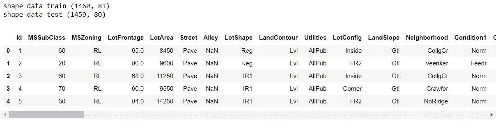
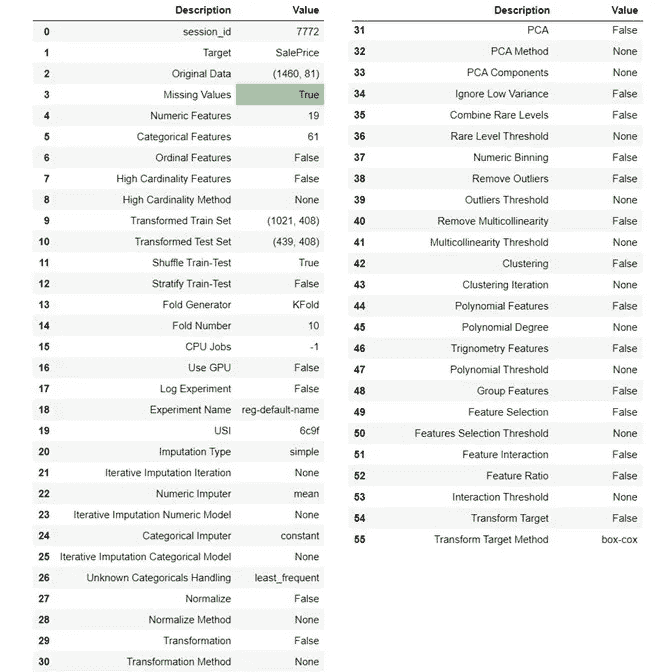
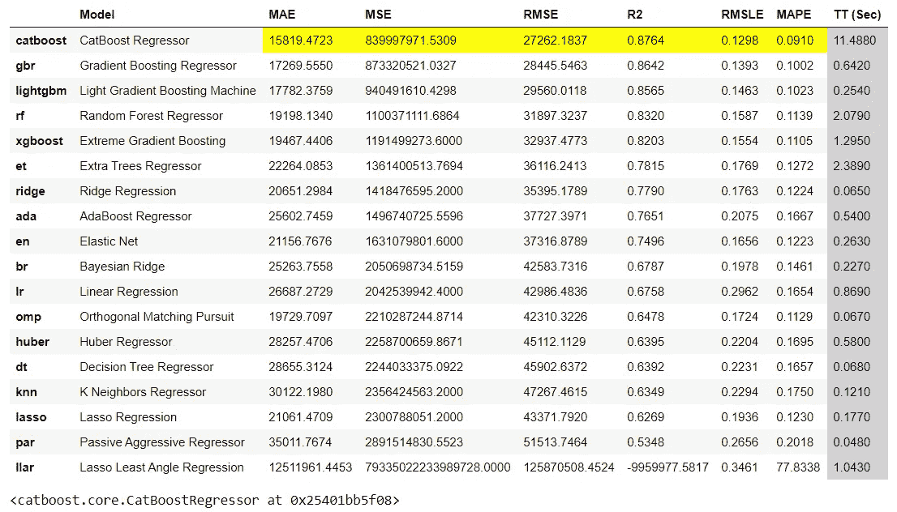
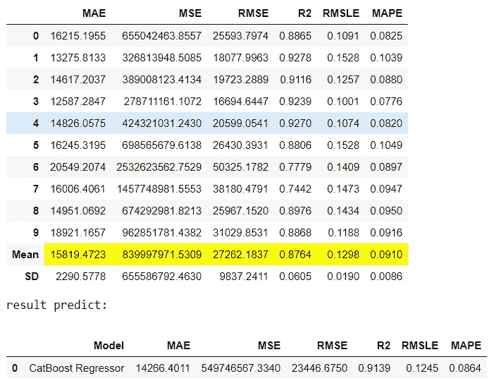
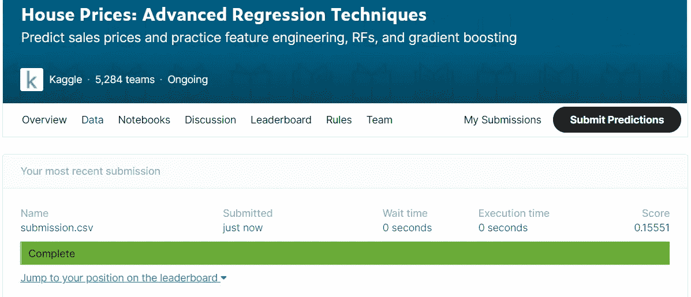

# 低代码的机器学习

> 原文：<https://pub.towardsai.net/machine-learning-with-low-code-75d152172e4b?source=collection_archive---------0----------------------->

## [机器学习](https://towardsai.net/p/category/machine-learning)

## 用 PyCaret 实现房价预测


[瑞兰德·迪恩](https://unsplash.com/@ryland_dean?utm_source=unsplash&utm_medium=referral&utm_content=creditCopyText)在 [Unsplash](https://unsplash.com/s/photos/low-code?utm_source=unsplash&utm_medium=referral&utm_content=creditCopyText) 上的照片

# 介绍

M 有没有人说构建机器学习这么难，用复杂的代码。那绝对不是真的。其实我们可以用一个简单的代码来开发。但在实际情况下，建立机器学习的重要之处在于了解问题并找到解决方案。不知道这个问题，我们就找不到解决办法。编码只是找到解决方案的桥梁。所以我们必须保持心态。因此，作为一名数据科学家，我们有很好的判断力。

这对我们来说是个好消息，我们必须感谢 Python 的 Moez Ali 先生作为 PyCaret 的作者。我们可以用最少的代码构建机器学习，找到与我们的数据集相匹配的最佳算法来解决问题。我们可以用 PyCaret 构建分类、回归和聚类。但在本节中，我们将练习一个回归问题来预测 Kaggle 的房价。请下载 [*上的数据集本*](https://www.kaggle.com/c/house-prices-advanced-regression-techniques/data) *练习*。

在这里，我们只关注使用 Pycaret 进行自动预处理和建模机器学习。我们还没有进行探索性数据分析(EDA)。实际上，在建模之前，我们必须让 EDA 获得一些洞察力，或许获得一些新功能。但在这里，我们只建立模型。我们建议遵循这些要点，以便更好地理解:

1.  定义问题
2.  需求评估
3.  用 Pycaret 预处理
4.  建模和评估
5.  屈服

我们走吧…

我们从大纲开始，一步一步用低编码练习机器学习建模。

# 讨论

> 1.定义问题

我们曾被一位购房者要求描述他们梦想中的房子，他们可能不会从地下室天花板的高度或靠近东西向铁路开始。但是这个游乐场竞赛的数据集证明，影响价格谈判的远不止卧室的数量或白色尖桩栅栏。

有 79 个解释变量描述了(几乎)爱荷华州埃姆斯住宅的每个方面，这个比赛挑战你预测每个家庭的最终价格。

从那个问题中，我们发现目标建模就是预测每套房子的价格。因此，我们使用“S *alePrice"* 变量作为预测的目标，因为该变量的值定义了每套房屋的价格。

> 2.需求评估

> a.[预科评估](https://www.kaggle.com/c/house-prices-advanced-regression-techniques/overview/evaluation) : RMSE

[预测值对数和观察销售价格对数之间的均方根误差(RMSE)](https://en.wikipedia.org/wiki/Root-mean-square_deviation) 。(取日志意味着预测贵房子和便宜房子的误差会同等影响结果)。最佳性能是具有最小 RMSE 分数的模型。因此，在这种情况下，我们选择产生最小 RMSE 分数的模型。

> 3.用 Pycaret 预处理

> a.从笔记本安装 PyCaret

在笔记本上，你可以安装 python 的库，以“！”开始。

```
!pip install pycaret
```

> b.加载数据

你可以从这个[站点](https://www.kaggle.com/c/house-prices-advanced-regression-techniques/data)下载数据集。下载该数据集后，请使用以下代码加载数据:

```
# import library all we needimport os import pandas as pd
from pycaret.regression import *  #we import all package with '*' os.chdir('D:/dataset') # we process data from "D:/datasets" train = pd.read_csv('train.csv')
test = pd.read_csv('test.csv') print('shape data train',train.shape)
print('shape data test',test.shape) train.head()
```

如果你运行上面的代码，你可以看到结果是这样的:



按作者列出的结果代码加载数据

我们有一个 1460 行 81 列的列车组。在测试中，我们有 1459 行和 80 列。你看到 NaN 值了吗？

是的，我们这里有缺失值，但不能解释 NaN 值。接下来，我将在数据准备部分编写缺失值的处理。我们只专注于建立一个机器学习模型。

> c.预处理数据

a)自动预处理

好的。我们正在完成数据加载。我们已经开始对数据进行自动预处理。让我们遵循这个代码:

```
# our target is SalePrice
sal_clf = setup(train, target='SalePrice')
```



作者自动预处理的结果

在这里，我们有一个 NaN 值和一个 PyCaret 自动句柄。

> 4.建模和评估

> a.建模比较

通过对所有模型进行比较，我们可以找到最佳模型。像这样:

```
compare_models()
```



作者比较模型的结果

好了，我们发现最好的模型是 Catboost 回归器。因为它的 RMSE 分数最小。然后我们尝试用 catboost 进行预测。

> b.创建并预测最佳模型

我们用交叉验证来制作我们的模型。在 PyCaret 默认值中，交叉验证是 10 倍。

```
print('result train:')catboost = create_model('catboost', cross_validation = True)print('result predict:')
pred_cb = predict_model(catboost)
```



创建和预测模型的结果

太好了！我们用 RMSE 的得分得到的模型是 27262.18，用 RMSE 的得分得到的预测模型是 23446.68。做一个模型很棒，因为不会过度拟合。但这不是最好的模式。而且我又想起来了，你要做数据分析和数据准备。

> 5.屈服

要提交，您可以遵循以下代码:

```
fcb = finalize_model(catboost) #make model to variables #making 
test_predictions = predict_model(fcb, data=test)submission = test_predictions[['Id', 'Label']]
submission.columns = ['Id','SalePrice']
submission.to_csv('submission.csv', index=False)
```



作者提交的结果

那是我的投稿分数。到目前为止，它还没有登上排行榜榜首。这是显而易见的，因为我们还没有进行探索性的数据分析和数据清理。

# 结论

在这一部分，我们可以得出一些结论，用低代码构建一个机器学习模型是非常可行的。但是，我们得到的性能模型并不是更好。因为我们不做 EDA，不做数据预处理，不做特征工程。所以，如果你想改善你的绩效模型，请做那些。

我希望我的写作对你有用。

谢谢，学习愉快！

如果你想要这篇文章的印尼语言版本，请点击这里。

# 参考

[1] [Moez Ali](https://medium.com/u/fba05660b60f?source=post_page-----75d152172e4b--------------------------------) ， [PyCaret 主页](https://pycaret.org/)，(2020)

[2] [Moez Ali](https://medium.com/u/fba05660b60f?source=post_page-----75d152172e4b--------------------------------) ，[回归模块](https://pycaret.org/regression/)，【2020】