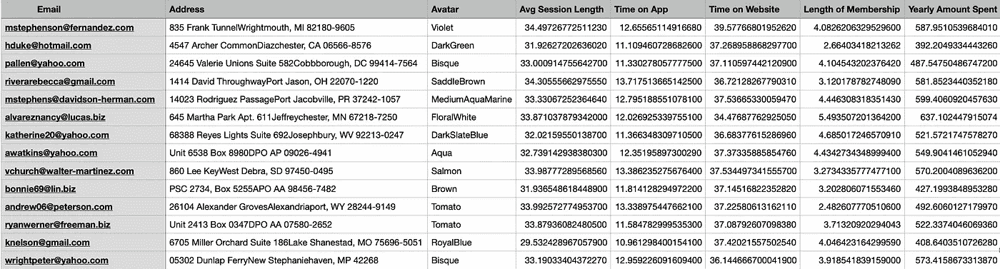
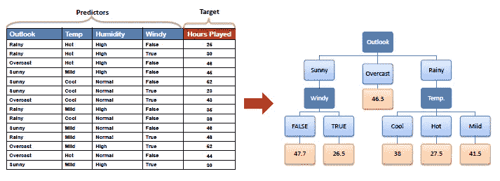
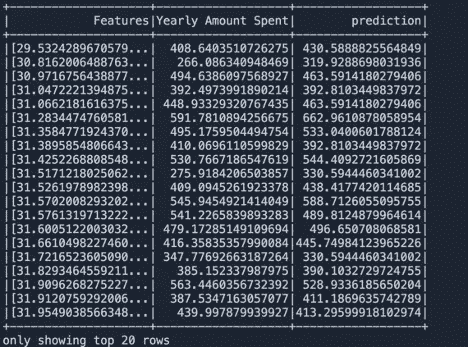
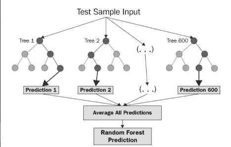
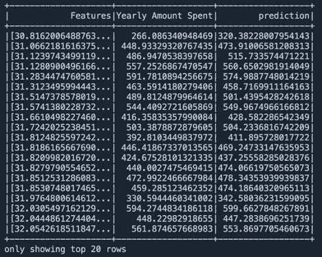
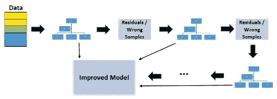
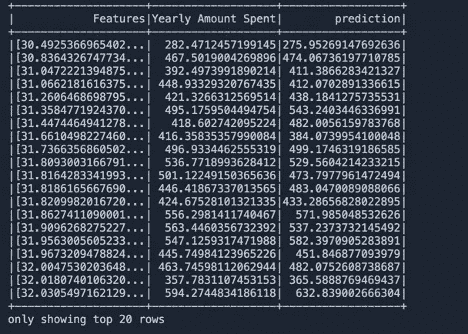

# 使用 PySpark 进行机器学习

> 原文：<https://pub.towardsai.net/machine-learning-with-pyspark-23d54d82dbc4?source=collection_archive---------1----------------------->

## [机器学习](https://towardsai.net/p/category/machine-learning)，[编程](https://towardsai.net/p/category/programming)

在这篇文章中，我将分享我使用 PySpark 在 spark 中完成的几个机器学习工作。

机器学习是人工智能的热点应用之一。人工智能是一个更大的生态系统，有许多令人惊叹的应用。机器学习简单来说就是在没有明确编程的情况下，机器自动学习并根据经验进行改进的能力。学习过程从观察数据开始，然后发现数据中的模式，并根据数据做出更好的学习决策。

## 机器学习算法的类别

通常有监督学习和非监督学习，但有些介于两者之间

1.  监督机器学习算法
2.  无监督机器学习算法
3.  半监督机器学习算法
4.  强化机器学习算法

为什么要给机器输入数据？

主要原因之一是数据量。你能想象亚马逊服务器一天产生多少数据吗？很多。第二个原因是质量。一台机器通常更快、更准确、更省力。

# **Spark 中的机器学习**

Apache spark 有一个名为 MLlib 的机器学习库。

来自[https://spark.apache.org/docs/1.1.0/mllib-guide.html](https://spark.apache.org/docs/1.1.0/mllib-guide.html)。

MLlib 是 Spark 的可扩展机器学习库，由常见的学习算法和实用程序组成，包括分类、回归、聚类、协同过滤、降维以及底层优化原语。

该库中内置了许多机器学习方法，有助于数据科学家专注于任务，而不是配置和基础设施。

我们将讨论三种流行的机器学习算法。他们

1.  决策树回归
2.  随机森林回归
3.  梯度推进树回归

那么，什么是机器学习中的回归呢？

通过建立基于一个或多个预测因素的模型来预测目标值(主要是数字变量)是一项任务。预测值可以是数字变量或分类变量。范畴变量也叫名义变量，是那些有类别但没有内在顺序的变量。一个例子可以是性别、头发颜色等。

你也可以用统计术语来描述回归。这是一个统计过程，用于估计因变量和一个或多个自变量之间的关系。更多信息，你可以阅读本页。[https://en.wikipedia.org/wiki/Regression_analysis](https://en.wikipedia.org/wiki/Regression_analysis)

## 数据集和问题

我们根据今年的房价预测明年的房价。



资料组

## 决策树回归

这是一个非常简单的回归模型。它以树形结构的形式创建一个回归模型。这是它的工作原理。它将数据集分解成小的子集组，直到达到某个阈值，例如 50。这些小数据集是回归模型的抽样方法。这种情况递归地发生，直到所有的数据都除以一个最小的阈值。然后，它从数据集计算相对重要性，并将其划分为叶。决策树可以处理分类数据和数字数据。以下是关于决策树的更多细节。



图片来源:[https://saedsayad.com/decision_tree_reg.htm](https://saedsayad.com/decision_tree_reg.htm)

密码

```
# To add a new cell, type '# %%'
# To add a new markdown cell, type '# %% [markdown]'
# %%
#Creating a spark session in order to have access to creating dataframes
from pyspark.sql import SparkSession
spark = SparkSession.builder.getOrCreate()# %%
#Importing the algorithms and evaluator needed for creating the model and evaluating its performancefrom pyspark.ml.regression import DecisionTreeRegressor
from pyspark.ml.regression import RandomForestRegressor
from pyspark.ml.regression import GBTRegressor
from pyspark.ml.evaluation import RegressionEvaluator# %%
#Loading in the data, printing the schema, and showing the top 20 rowsecommerceData = spark.read.csv(r'Data/ServiceUsage.csv', header = True, inferSchema = True)
ecommerceData.printSchema()
ecommerceData.show()# %%
#Immporting the vector libraries in order to transform the datasetfrom pyspark.ml.linalg import Vectors
from pyspark.ml.feature import VectorAssembler# %%
#Feeding the dataframe into the vector assembler (transformer) and combining 4 columns into one column called "features"assembler = VectorAssembler(inputCols = ['Avg Session Length', 'Time on App', 'Time on Website', 'Length of Membership'], outputCol = 'Features')
transformedEcommerceData = assembler.transform(ecommerceData)
transformedEcommerceData.show()# %%
#Preparing the data for the model by only having two columns: the features and the column of known data we're trying to predictfinalData = transformedEcommerceData.select('Features', 'Yearly Amount Spent')
finalData.show()# %%
#Splitting the data into training and testing sets by randomly choosing 70% of the rows for training and 30% of the rows for testingtrainingData, testingData = finalData.randomSplit([0.7, 0.3])# %%
#Decision Tree Regression
decisionTree = DecisionTreeRegressor(featuresCol = "Features", labelCol = "Yearly Amount Spent", maxDepth = 15, maxBins = 32)
decisionTreeModel = decisionTree.fit(trainingData)
dtresults = decisionTreeModel.transform(testingData)
dtresults.select("Prediction", "Yearly Amount Spent", "Features")
dtresults.show()
#Using RMSE to evaluate the model
gbtevaluator = RegressionEvaluator(labelCol="Yearly Amount Spent", predictionCol="prediction", metricName="rmse")
gbtrmse = gbtevaluator.evaluate(dtresults)
print("Gradient-Boosted Tree RMSE: ", gbtrmse)
```

预言；预测；预告



决策树回归的输出

## 2.随机森林回归:

随机森林回归是预测的最有效和最准确的机器学习模型之一。这是一种监督学习算法。它是一种元估计器，在数据集的各个子样本上拟合几个分类决策树，并使用平均来提高预测精度和控制过拟合。它非常擅长处理表格数据、数字或分类特征。有关随机森林回归的更多信息，请阅读本文。[https://level up . git connected . com/random-forest-regression-209 c0f 354 c 84](https://levelup.gitconnected.com/random-forest-regression-209c0f354c84)



来自中等邮政的随机森林结构

密码

```
# To add a new cell, type '# %%'
# To add a new markdown cell, type '# %% [markdown]'
# %%
#Creating a spark session in order to have access to creating dataframesfrom pyspark.sql import SparkSession
spark = SparkSession.builder.getOrCreate()

# %%
#Importing the algorithms and evaluator needed for creating the model and evaluating its performancefrom pyspark.ml.regression import DecisionTreeRegressor
from pyspark.ml.regression import RandomForestRegressor
from pyspark.ml.regression import GBTRegressor
from pyspark.ml.evaluation import RegressionEvaluator

# %%
#Loading in the data, printing the schema, and showing the top 20 rowsecommerceData = spark.read.csv(r'Data/ServiceUsage.csv', header = True, inferSchema = True)
ecommerceData.printSchema()
ecommerceData.show()

# %%
#Immporting the vector libraries in order to transform the datasetfrom pyspark.ml.linalg import Vectors
from pyspark.ml.feature import VectorAssembler

# %%
#Feeding the dataframe into the vector assembler (transformer) and combining 4 columns into one column called "features"assembler = VectorAssembler(inputCols = ['Avg Session Length', 'Time on App', 'Time on Website', 'Length of Membership'], outputCol = 'Features')
transformedEcommerceData = assembler.transform(ecommerceData)
transformedEcommerceData.show()

# %%
#Preparing the data for the model by only having two columns: the features and the column of known data we're trying to predictfinalData = transformedEcommerceData.select('Features', 'Yearly Amount Spent')
finalData.show()

# %%
#Splitting the data into training and testing sets by randomly choosing 70% of the rows for training and 30% of the rows for testingtrainingData, testingData = finalData.randomSplit([0.7, 0.3])

# %%
#Random Forest Regression
randomForest = RandomForestRegressor(featuresCol = "Features", labelCol = "Yearly Amount Spent",  maxDepth = 15, maxBins = 32, numTrees = 200)
randomForestModel = randomForest.fit(trainingData)
rfresults = randomForestModel.transform(testingData)
rfresults.select("Prediction", "Yearly Amount Spent", "Features")
rfresults.show()
#Using RMSE to evaluate the model
gbtevaluator = RegressionEvaluator(labelCol="Yearly Amount Spent", predictionCol="prediction", metricName="rmse")
gbtrmse = gbtevaluator.evaluate(rfresults)
print("Gradient-Boosted Tree RMSE: ", gbtrmse)
```

预言；预测；预告



随机森林回归的输出

## 3.梯度推进树回归

机器学习中的 Boosting 是一种将弱学习者转化为强学习者的方法。它结合了许多样本模型。那么最终的模型将会是一个强有力的预测器。它使用梯度下降来最小化损失。它可以执行回归、分类和排序。这是一种强大的机器学习算法。



图片来源:[https://towards data science . com/gradient-boosted-decision-trees-explained-9259 BD 8205 af](https://towardsdatascience.com/gradient-boosted-decision-trees-explained-9259bd8205af)

它构建了一系列树，其中每棵树都进行了训练，以便尝试纠正该系列中前一棵树的错误。通常，梯度构建树集成使用大量被称为弱学习器的浅树。它们是以一种非随机的方式建立起来的，随着树的增加，模型的错误越来越少。它速度很快，不会占用太多内存。要了解更多关于梯度推进决策树的信息，请关注 Coursera 上的这个精彩视频。[https://www . coursera . org/lecture/python-machine-learning/gradient-boosted-decision-trees-emwn 3](https://www.coursera.org/lecture/python-machine-learning/gradient-boosted-decision-trees-emwn3)

密码

```
# To add a new cell, type '# %%'
# To add a new markdown cell, type '# %% [markdown]'
# %%
#Creating a spark session in order to have access to creating dataframesfrom pyspark.sql import SparkSession
spark = SparkSession.builder.getOrCreate()# %%
#Importing the algorithms and evaluator needed for creating the model and evaluating its performancefrom pyspark.ml.regression import DecisionTreeRegressor
from pyspark.ml.regression import RandomForestRegressor
from pyspark.ml.regression import GBTRegressor
from pyspark.ml.evaluation import RegressionEvaluator# %%
#Loading in the data, printing the schema, and showing the top 20 rowsecommerceData = spark.read.csv(r'Data/ServiceUsage.csv', header = True, inferSchema = True)
ecommerceData.printSchema()
ecommerceData.show()# %%
#Immporting the vector libraries in order to transform the dataset
from pyspark.ml.linalg import Vectors
from pyspark.ml.feature import VectorAssembler# %%
#Feeding the dataframe into the vector assembler (transformer) and combining 4 columns into one column called "features"assembler = VectorAssembler(inputCols = ['Avg Session Length', 'Time on App', 'Time on Website', 'Length of Membership'], outputCol = 'Features')
transformedEcommerceData = assembler.transform(ecommerceData)
transformedEcommerceData.show()# %%
#Preparing the data for the model by only having two columns: the features and the column of known data we're trying to predictfinalData = transformedEcommerceData.select('Features', 'Yearly Amount Spent')
finalData.show()# %%
#Splitting the data into training and testing sets by randomly choosing 70% of the rows for training and 30% of the rows for testingtrainingData, testingData = finalData.randomSplit([0.7, 0.3])# %%
#Gradient Boosted Tree Regression to do the prediction
boostedTree = GBTRegressor(featuresCol = "Features", labelCol = "Yearly Amount Spent", maxDepth = 5, maxBins = 32, maxIter = 200)
boostedTreeModel = boostedTree.fit(trainingData)
gbtresults = boostedTreeModel.transform(testingData)
gbtresults.select("Prediction", "Yearly Amount Spent", "Features")
gbtresults.show()
#Using RMSE to evaluate the model
gbtevaluator = RegressionEvaluator(labelCol="Yearly Amount Spent", predictionCol="prediction", metricName="rmse")
gbtrmse = gbtevaluator.evaluate(gbtresults)
print("Gradient-Boosted Tree RMSE: ", gbtrmse)
```

预言；预测；预告



GBT 成果

## 结论

预测的结果令人惊讶。这真的很容易实现，但随机森林和 GBT 需要更长的时间来运行。就得分和预测而言，最好的算法是 GBT 算法。