# 使用 SQL 的机器学习

> 原文：<https://pub.towardsai.net/machine-learning-with-sql-30e942c75240?source=collection_archive---------0----------------------->

## [机器学习](https://towardsai.net/p/category/machine-learning)


https://unsplash.com/photos/fPkvU7RDmCo

是的，你没听错。我们可以使用 SQL 来运行机器学习模型

起初，当我听到这个消息时，我真的很想知道 SQL 如何用于机器学习模型，以及我们如何用 SQL 生成预测，

那么我们要使用标准的 SQL 查询吗？嗯，答案是肯定的，

由于谷歌的 BigQuery ML，我们可以只使用标准的 SQL 查询直接创建一个机器学习模型。

# **但是等等……什么是 BigQuery ML？**

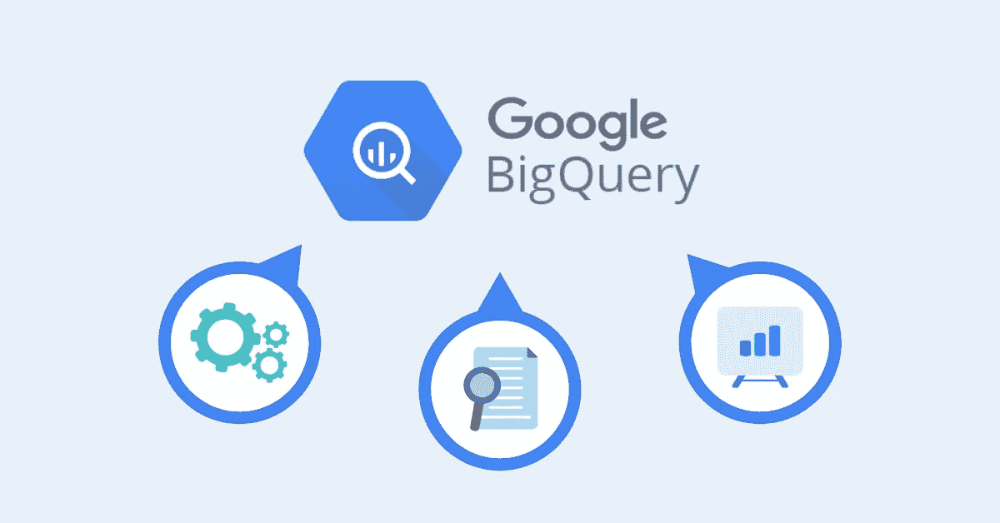

oogle BigQuery 是一个无服务、低成本、高度可扩展的数据仓库系统，BigQuery ML 允许您仅使用标准 SQL 查询在 BigQuery 中创建和执行机器学习模型。

BigQuery ML 允许数据科学家、ML 工程师和数据工程师直接使用 SQL 快速构建和分析机器学习模型

# BigQuery ML 支持什么样的模型？

> 回归模型

*   线性回归，二元逻辑回归，多元逻辑回归

> 使聚集

*   k 均值聚类

> 用于创建推荐系统等产品的矩阵分解
> 
> 预测的时间序列模型
> 
> 提升树模型-> XGBoost(分类和回归)
> 
> 深度神经网络(DNN) ->分类和回归

[https://cloud.google.com/bigquery-ml/docs/introduction](https://cloud.google.com/bigquery-ml/docs/introduction)

# 大查询在幕后做什么

*   利用 BigQuery 的处理能力来构建模型
*   自动调整学习率
*   自动将数据分为训练和测试
*   L1/L2 正规化
*   培训/测试分割的 3 种策略:随机、顺序、定制
*   设置学习率

# 使用 BigQuery ML 创建模型的步骤

既然我们已经了解了 BigQuery ML，现在是时候看看如何加载和创建 ML 来对数据集进行预测了

我将向你们展示我们如何使用一个众所周知的泰坦尼克号数据集来训练模型，模型评估和模型测试。我将建立一个简单的基线模型来演示。

**将数据加载到 BigQuery:-**

登录到您的 GCP 控制台，并导航到大查询

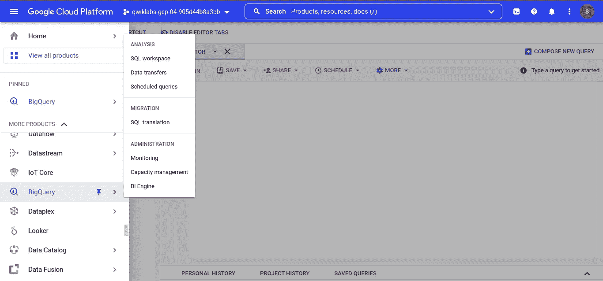

bigQuery 控制台

现在创建一个新的数据集

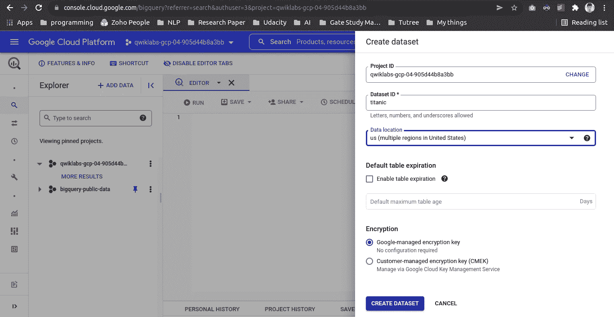

创建数据库

现在在数据集上创建一个表，选择 upload 并选择您的 test.csv 文件，然后选择文件格式为 csv。为您的表命名

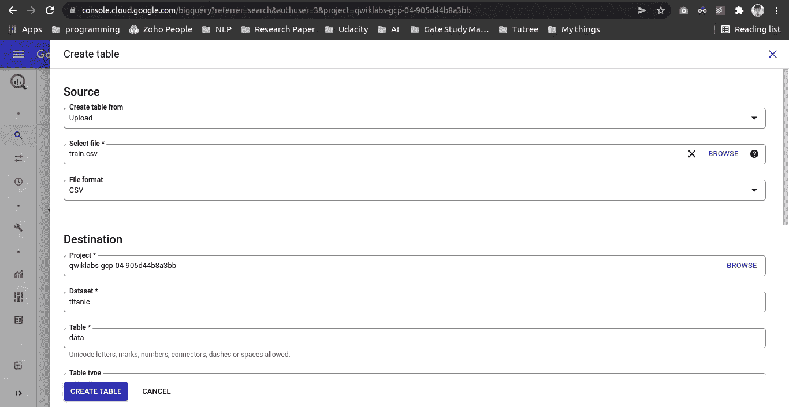

创建表格

现在点击创建表格和按钮，你会看到你的表格方案，你也可以预览表格

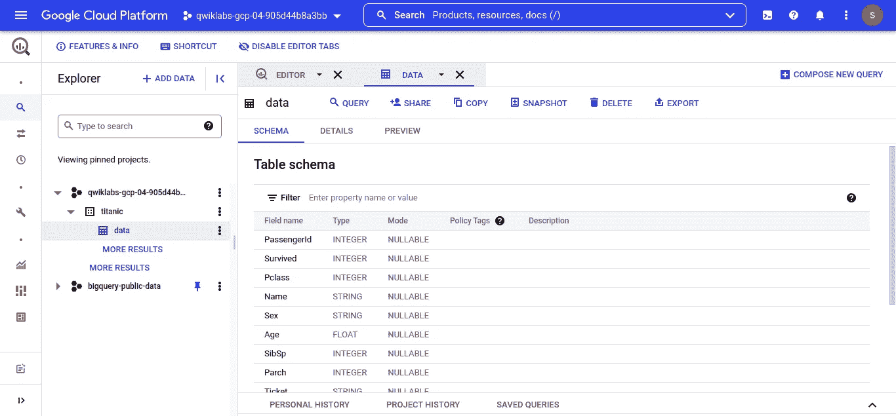

表格模式

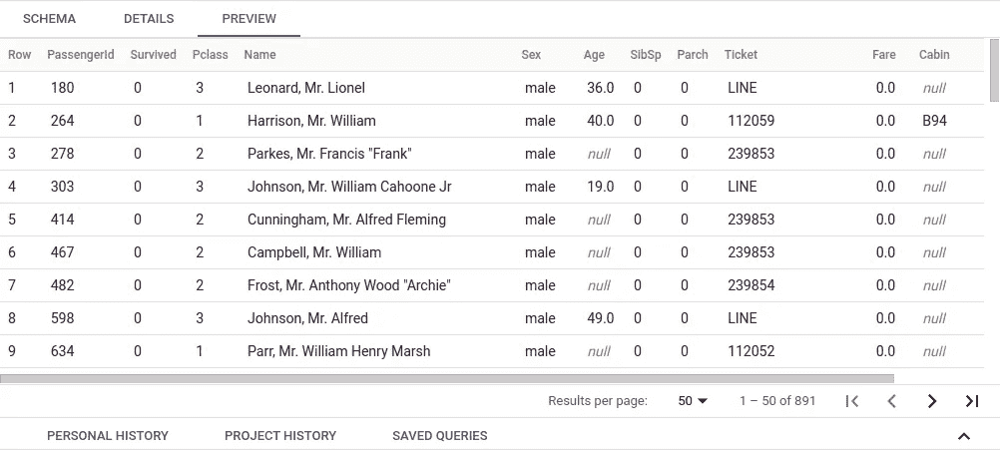

试映

**创建机器学习模型:-**

现在该写一些 SQL 查询了，在查询编辑器中写这个查询

```
**CREATE OR REPLACE MODEL
`qwiklabs-gcp-04-905d44b8a3bb.titanic.credit_classification_model`
OPTIONS
(
model_type='logistic_reg',
labels = ['Pclass']
)
AS
SELECT
* EXCEPT(Survived)
FROM
`qwiklabs-gcp-04-905d44b8a3bb.titanic.data`**
```

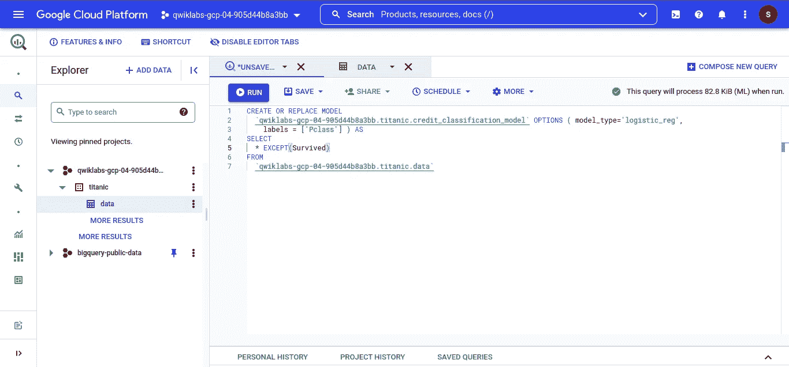

查询编辑器

点击运行按钮，等待它训练和处理模型，一旦完成，你会看到在侧边栏有一个新的文件夹称为模型，点击模型文件夹，你会看到所有关于你的模型，损失，持续时间，F1 分数，ROC，AUC，学习率，困惑矩阵等信息

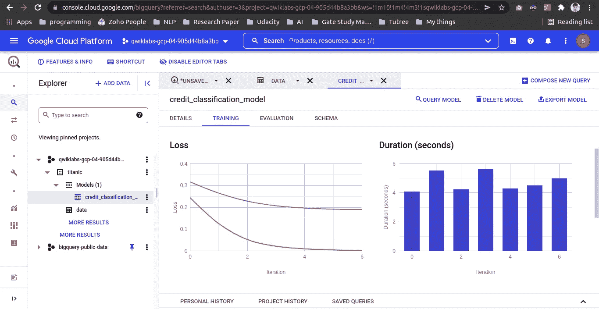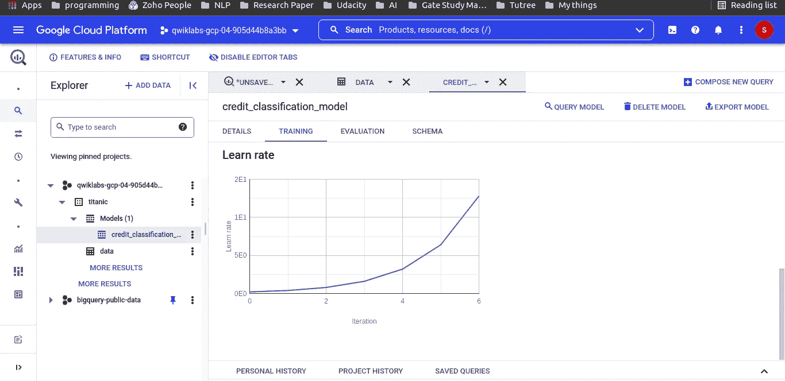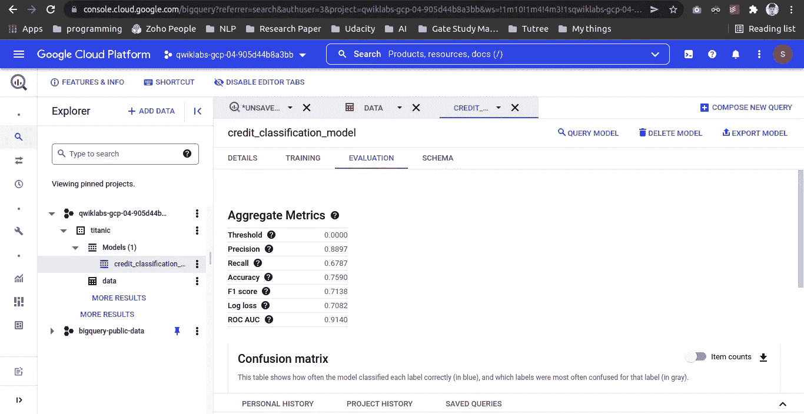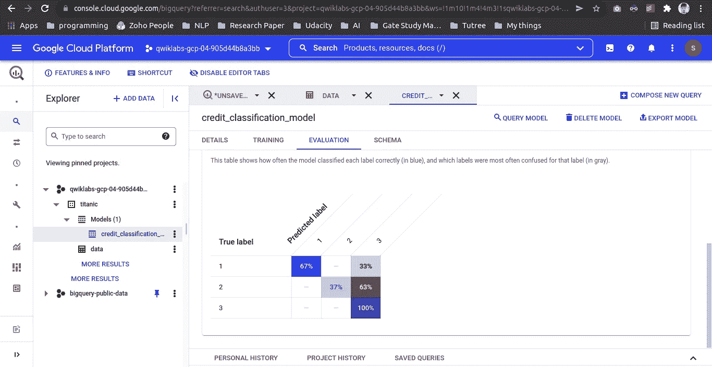

**评估 ml 模型的 SQL 查询**

我们将基于 roc_auc 得分比较我们的模型，单击查询编辑器并粘贴此查询

```
**SELECT
roc_auc,
CASE
WHEN roc_auc > .8 THEN 'good'
WHEN roc_auc > .7 THEN 'fair'
WHEN roc_auc > .6 THEN 'not great'
ELSE
'poor'
END
AS model_quality
FROM
ML.EVALUATE(MODEL `qwiklabs-gcp-04-905d44b8a3bb.titanic.credit_classification_model`,
(
SELECT
* EXCEPT(Survived)
FROM
`qwiklabs-gcp-04-905d44b8a3bb.titanic.data` ) )**
```

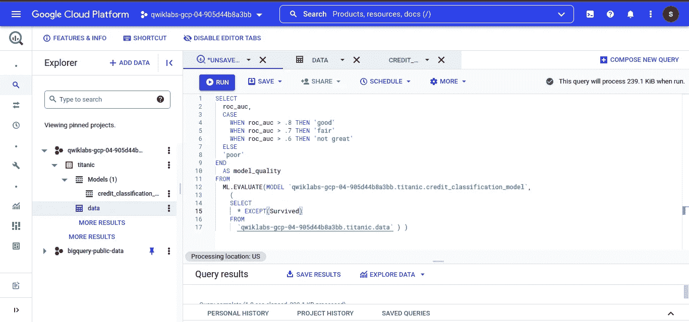

如您所见，我们的 roc_auc 得分为 0.9，这非常好，但我只是使用一种非常简单的方法来训练模型，因此我们的模型可能会有偏差和过度拟合。

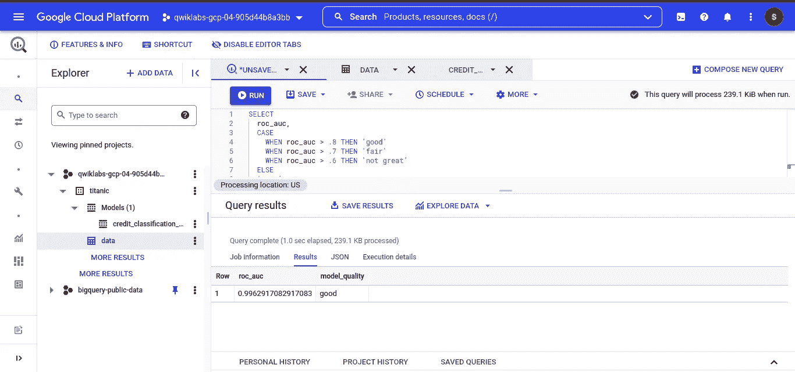

**模型预测**

现在是做预测的时候了，复制这个查询，并将其粘贴到查询编辑器中

```
**SELECT
*
FROM
ml.PREDICT(MODEL `qwiklabs-gcp-04-905d44b8a3bb.titanic.credit_classification_model`,
(
SELECT
* EXCEPT(Survived)
FROM
`qwiklabs-gcp-04-905d44b8a3bb.titanic.data` ) );**
```

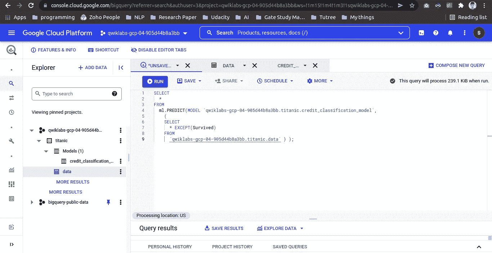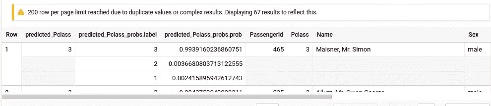

我们可以用 google sheets 和 Data Studio 查看我们的探索结果，让我们在 sheets 上探索一下。

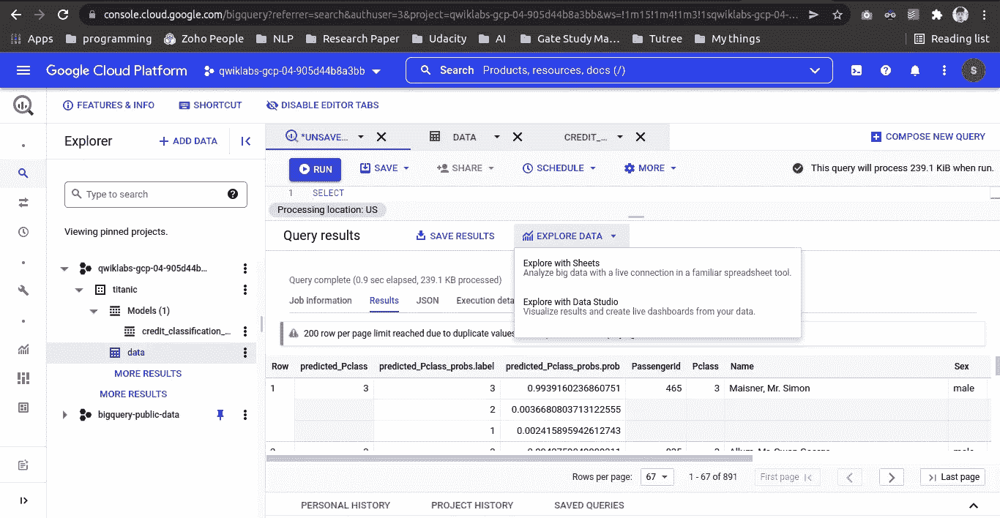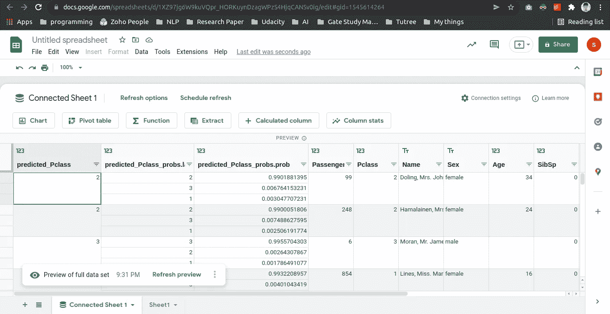

# 看看 BigQuery ML Cheatsheet

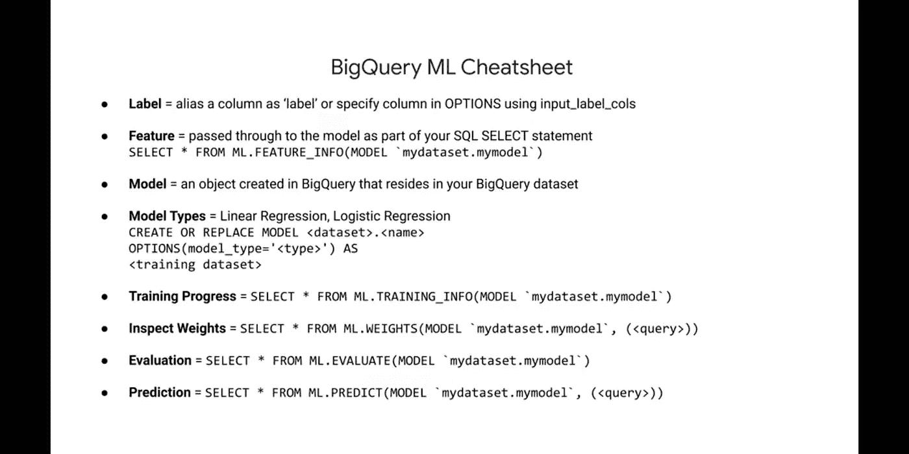

# 回顾一下为了建立一个 ML 模型我们需要做什么

> ETL 到 BigQuery
> 
> 创建模型
> 
> 模型评估
> 
> 模型预测法

# BigQuery ML 的优势

*   不需要使用 Python、Java 编写代码来构建 ML 解决方案，使用 SQL 在 BigQuery 中直接训练和访问模型
*   BigQuery 提高了速度和模型运行时间，因为我们不需要从任何其他源加载数据，数据已经存储在 BigQuery 表上
*   正如我们之前所讨论的，BigQuery ML 是无服务器的，因此我们不需要担心随着数据量的增加而维护服务器，也不需要在制定 ML 解决方案之前设置一些环境。

**参考文献:**

[](https://www.coursera.org/specializations/gcp-data-machine-learning) [## GCP 的数据工程、大数据和机器学习

### 谷歌云的数据工程。开始你的数据工程职业生涯。利用大数据和……

www.coursera.org](https://www.coursera.org/specializations/gcp-data-machine-learning) [](https://cloud.google.com/bigquery-ml/docs/introduction) [## 什么是 BigQuery ML？|谷歌云

### BigQuery ML 允许您使用标准 SQL 查询在 BigQuery 中创建和执行机器学习模型。大查询 ML…

cloud.google.com](https://cloud.google.com/bigquery-ml/docs/introduction) [](https://hevodata.com/learn/google-bigquery-ml/) [## 理解 Google BigQuery ML:简化 101 - Learn | Hevo

### 如今，机器学习在根据数据做出计算决策和预测方面发挥着至关重要的作用。万亿字节的数据…

hevodata.com](https://hevodata.com/learn/google-bigquery-ml/) 

就这样吧，下一篇文章再见。

**我们连线上**[**Linkedin**](https://www.linkedin.com/in/iamhimanshu0/)**[**Twitter**](https://twitter.com/iam_himanshu0)**[**insta gram**](https://instagram.com/iamhimanshu0/)**[**Github**](https://github.com/iamhimanshu0)**[**脸书**](https://www.facebook.com/iamhimanshu0) **。**********

******感谢阅读！******