# 神经网络的主要类型及其应用——教程

> 原文：<https://pub.towardsai.net/main-types-of-neural-networks-and-its-applications-tutorial-734480d7ec8e?source=collection_archive---------0----------------------->

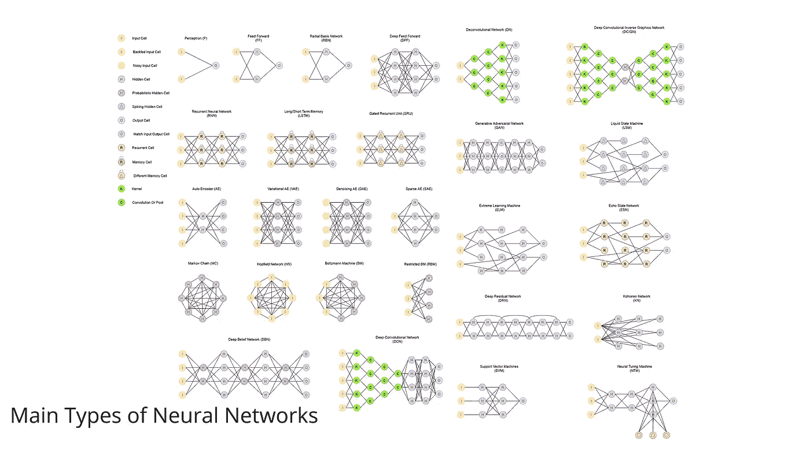

图 1:神经网络的主要类型，由 app.diagrams.net 设计，该图是由[斯蒂芬·莱伊宁](https://www.researchgate.net/profile/Stefan_Leijnen)和[弗约德尔·范·维恩](https://www.researchgate.net/profile/Fjodor_Van_Veen)在 [CC 下通过 4.0](https://creativecommons.org/licenses/by/4.0/)[5](https://www.asimovinstitute.org/neural-network-zoo/)[6](https://creativecommons.org/licenses/)授权的[知识共享神经网络动物园](https://www.researchgate.net/publication/341373030_The_Neural_Network_Zoo)的衍生物。

## [深度学习](https://towardsai.net/p/category/machine-learning/deep-learning)、[机器学习](https://towardsai.net/p/category/machine-learning)、[教程](https://towardsai.net/p/category/tutorial)

## 关于神经网络的主要类型及其在现实世界挑战中的应用的教程。

**作者:**普拉蒂克·舒克拉，[罗伯特·伊里翁多](https://mktg.best/vguzs)

最后更新于 2022 年 3 月 17 日

 [## 加入我们吧↓ |面向人工智能成员|数据驱动的社区

### 加入人工智能，成为会员，你将不仅支持人工智能，但你将有机会…

members.towardsai.net](https://members.towardsai.net/) 

NOWA days[**深度学习**](https://mld.ai/mldcmu) 中有多种类型的神经网络，用于不同的目的。在本文中，我们将浏览神经网络中最常用的拓扑，简要介绍它们的工作原理，以及它们在现实世界挑战中的一些应用。

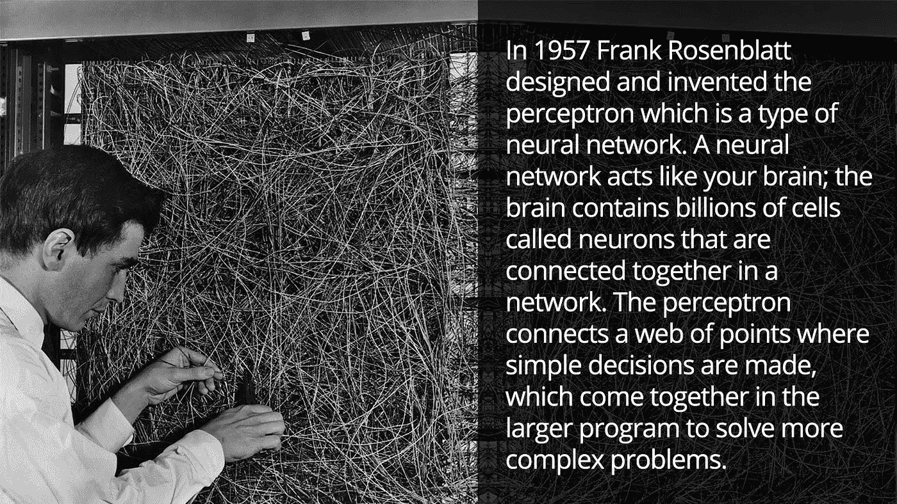

图 2:感知机:大脑中信息存储和组织的概率模型[3] |来源:康奈尔航空实验室 Frank Rosenblat 的 Mark I 感知机。纽约布法罗，1960 年[4]

> 📚这篇文章是我们关于神经网络的第三篇教程，从第一篇开始，用 Python 代码和数学详细检查神经网络。📚

# 神经网络拓扑

图 3:感知器(p)的表示。

# 1.感知机(P):

感知器模型也称为单层神经网络。这个神经网络只包含两层:

*   **输入层**
*   **输出层**

在这种类型的神经网络中，没有隐藏层。它接受一个输入，并计算每个节点的加权输入。然后，它使用一个激活函数(通常是一个 sigmoid 函数)进行分类。

**应用:**

*   分类。
*   编码数据库(多层感知器)。
*   监控访问数据(多层感知器)。

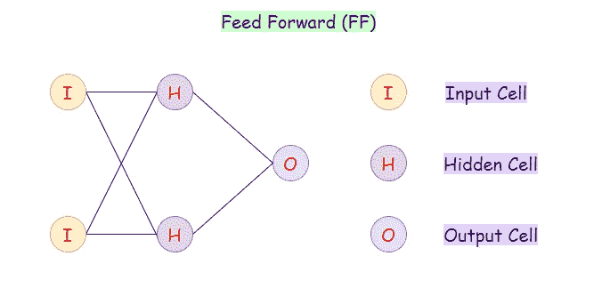

图 4:前馈神经网络的表示。

# 2.前馈(FF):

前馈神经网络是一种人工神经网络，其中的节点从不形成循环。在这种神经网络中，所有的感知器都按层排列，输入层接受输入，输出层产生输出。隐藏的层与外部世界没有联系；这就是为什么它们被称为隐藏层。在前向神经网络中，一层中的每个感知器都与下一层中的每个节点相连。因此，所有节点都是完全连接的。另外需要注意的是，同一层中的节点之间没有可见或不可见的连接。前馈网络中没有反馈回路。因此，为了最小化预测中的误差，我们通常使用反向传播算法来更新权重值。

**应用:**

*   数据压缩。
*   模式识别。
*   计算机视觉。
*   声纳目标识别。
*   语音识别。
*   手写字符识别。

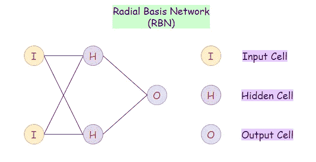

图 5:径向基网络(RBN)的表示。

# 3.径向基网络(RBN):

径向基函数网络一般用于函数逼近问题。它们可以与其他神经网络相区别，因为它们具有更快的学习速度和通用逼近能力。径向基网络和前馈网络的主要区别在于，RBNs 使用**径向基函数**作为**激活函数**。逻辑函数(sigmoid 函数)给出一个介于 0 和 1 之间的输出，以确定答案是“是”还是“否”。这样做的问题是，如果我们有连续的值，那么就不能使用 RBN。RBIs 决定了我们的产出与目标产出的差距。这些在连续值的情况下非常有用。总之，RBI 表现为使用不同激活函数的 FF 网络。

**应用:**

*   函数逼近。
*   时间序列预测。
*   分类。
*   系统控制。

图 6:深度前馈神经网络的表示。

# 4.深度前馈(DFF):

深度前馈网络是使用多于一个隐藏层的前馈网络。仅使用一个隐藏层的主要问题是过度拟合，因此通过添加更多的隐藏层，我们可以(并非在所有情况下)减少过度拟合并提高泛化能力。

**应用:**

*   数据压缩。
*   模式识别。
*   计算机视觉。
*   ECG 噪声滤波。
*   财务预测。

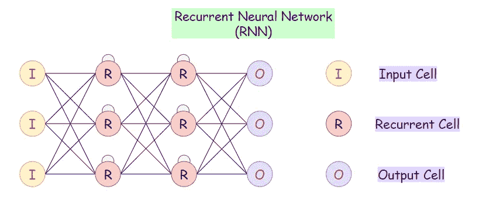

图 7:递归神经网络(RNN)的表示

# 5.递归神经网络(RNN):

递归神经网络(RNNs)是前馈(FF)网络的变体。在这种类型中，隐藏层中的每个神经元以特定的时间延迟接收输入。当我们需要在当前迭代中访问以前的信息时，我们使用这种类型的神经网络。例如，当我们试图预测句子中的下一个单词时，我们需要首先知道以前使用的单词。rnn 可以处理输入，并随时共享任何长度和重量。模型的大小不会随着输入的大小而增加，此模型中的计算会考虑历史信息。然而，这种神经网络的问题是计算速度慢。此外，它不能考虑当前状态的任何未来输入。它不记得很久以前的信息。

**应用:**

*   机器翻译。
*   机器人控制。
*   时间序列预测。
*   语音识别。
*   语音合成。
*   时间序列异常检测。
*   节奏学习。
*   音乐创作。

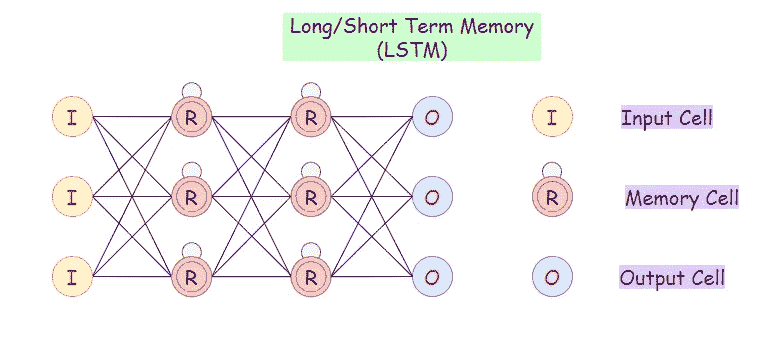

图 8:一个长短期记忆(LSTM)网络的图示。

# 6.长/短时记忆(LSTM):

LSTM 网络引入了存储单元。它们可以处理有内存间隙的数据。上面，我们可以注意到，我们可以在 RNNs 中考虑时间延迟，但如果我们的 RNN 在我们有大量相关数据的时候失败了，我们想从中找出相关数据，那么 LSTMs 就是要走的路。此外，与 LSTMs 相比，rnn 不能记住很久以前的数据。

**应用:**

*   语音识别。
*   书写识别。

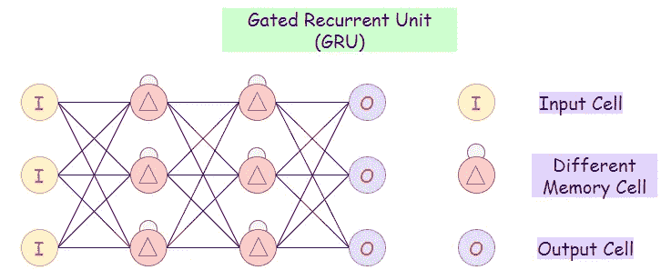

图 9:门控循环单元(GRU)网络的示意图。

# 7.门控循环单元(GRU):

门控循环单位是 LSTMs 的一种变体，因为它们都具有相似的设计，并且大多产生同样好的结果。GRUs 只有三个门，并且它们不维持内部细胞状态。

**a.** 更新门:决定将多少过去的知识传递给未来。
**b.** 重置门:决定了要忘记多少过去的知识。
**c.** 当前记忆门:复位命运的子部分。

**应用:**

*   复调音乐造型。
*   语音信号建模。
*   自然语言处理。

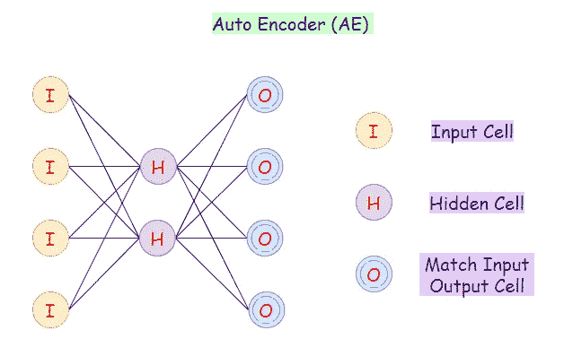

图 10:自动编码器(AE)网络示意图。

# 8.自动编码器(AE):

自动编码器神经网络是一种无监督的机器学习算法。在自动编码器中，隐藏单元格的数量小于输入单元格的数量。自动编码器中输入单元的数量等于输出单元的数量。在 AE 网络上，我们训练它显示输出，输出与 fed 输入一样接近，这迫使 AEs 找到共同的模式并概括数据。我们对输入的较小表示使用自动编码器。我们可以从压缩数据中重建原始数据。该算法相对简单，因为 AE 要求输出与输入相同。

*   编码器:转换低维输入数据。
*   解码器 **:** 重建压缩数据。

**应用:**

*   分类。
*   聚类。
*   特征压缩。

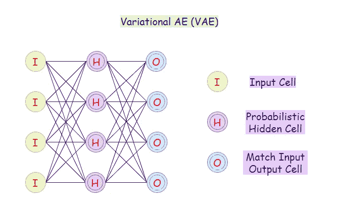

图 11:变化的自动编码器网络(VAE)的表示。

# 9.可变自动编码器(VAE):

变分自动编码器(VAE)使用概率方法来描述观测值。它显示了特征集中每个属性的概率分布。

**应用:**

*   在句子之间插入。
*   自动图像生成。

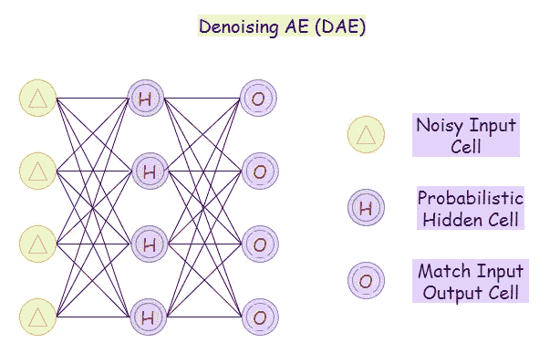

图 12:去噪自动编码器网络(DAE)示意图。

# 10.去噪自动编码器(DAE):

在这种自动编码器中，网络不能简单地将输入复制到其输出，因为输入也包含随机噪声。在 DAE 上，我们生产它是为了减少噪音并在其中产生有意义的数据。在这种情况下，该算法迫使隐藏层学习更鲁棒的特征，使得输出是噪声输入的更精确版本。

**应用:**

*   特征提取。
*   降维。

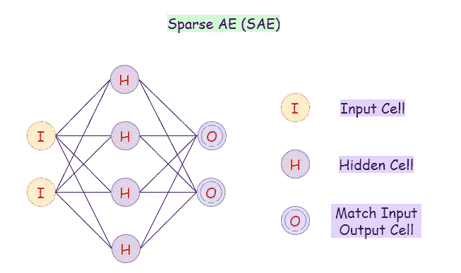

图 13:稀疏自动编码器网络(SAE)的表示。

# 11.稀疏自动编码器(SAE):

在稀疏自动编码器网络上，我们将通过惩罚隐藏层的激活来构造我们的损失函数，使得当我们将单个样本馈送到网络中时，只有少数节点被激活。这种方法背后的直觉是，例如，如果一个人声称自己是科目 A、B、C 和 D 的专家，那么这个人可能是这些科目的多面手。然而，如果此人仅声称致力于主题 D，则很可能会从其对主题 D 的了解中获得洞察力。

**应用:**

*   特征提取。
*   手写数字识别。

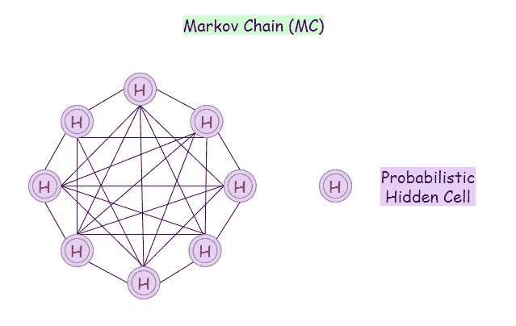

图 14:马尔可夫链网络(MC)表示。

# 12.马尔可夫链(MC):

马尔可夫链是一种数学系统，它根据一些概率规则经历从一种状态到另一种状态的转换。转换到任何特定状态的概率仅取决于当前状态和经过的时间。

例如，一些可能的状态集合可以是:

*   信件。
*   数字。
*   天气状况。
*   棒球比分。
*   股票表现。

**应用:**

*   语音识别。
*   信息和通信系统。
*   排队理论。
*   统计学。

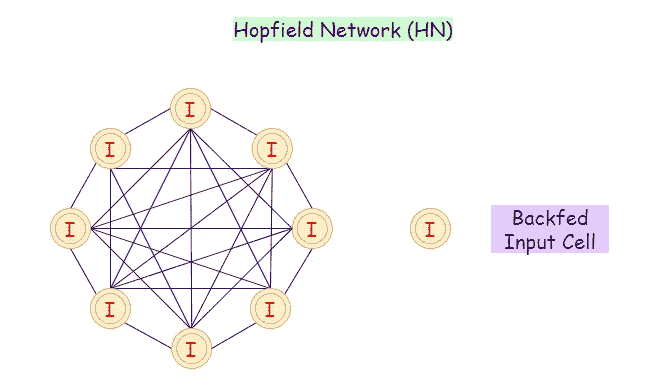

图 15:霍普菲尔德网络(HN)表示。

# 13.霍普菲尔德网络(HN):

在 Hopfield 神经网络中，每个神经元都与其他神经元直接相连。在这个网络中，神经元不是开就是关。神经元的状态可以通过接收来自其他神经元的输入而改变。我们通常使用 Hopfield 网络(HNs)来存储模式和记忆。当我们在一组模式上训练神经网络时，它可以识别模式，即使它有些扭曲或不完整。当我们给它输入不完整的信息时，它可以识别完整的模式，从而返回最佳猜测。

**应用:**

*   优化问题。
*   图像检测和识别。
*   医学图像识别。
*   增强 x 光图像。

图 16:波尔兹曼机器网络(BM)的表示

# 14.玻尔兹曼机器(BM):

玻尔兹曼机器网络涉及从原始数据集中学习概率分布，并使用它来推断看不见的数据。在 BMs 中，有输入节点和隐藏节点，一旦我们所有的隐藏节点改变了它的状态，我们的输入节点就转换成输出节点。例如:假设我们在一家核电厂工作，在那里安全必须是第一位的。我们的工作是确保动力装置中的所有组件都可以安全使用，每个组件都有相关的状态，为简单起见，使用布尔 1 表示可用，0 表示不可用。但是，也将有一些组件，我们将无法定期测量其状态。

此外，我们没有数据告诉我们，如果隐藏的组件停止工作，发电厂将在何时爆炸。因此，在这种情况下，我们构建一个模型，当组件改变它的状态时，它会注意到。因此，当它发生时，我们将被通知检查那个部件，并确保电厂的安全。

**应用:**

*   降维。
*   分类。
*   回归。
*   协同过滤。
*   特征学习。

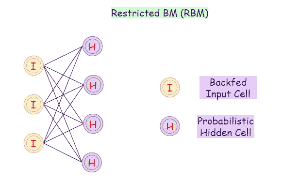

图 17:受限玻尔兹曼机器(RBM)网络的示意图。

# 15.受限玻尔兹曼机(RBM):

RBM 是 BMs 的变体。在该模型中，输入层和隐藏层中的神经元之间可能具有对称连接。需要注意的一点是，每一层内部都没有内部连接。相比之下，玻尔兹曼机器在隐藏层可能有内部联系。BMs 中的这些限制允许模型的有效训练。

**应用:**

*   过滤。
*   特征学习。
*   分类。
*   风险检测。
*   商业和经济分析。

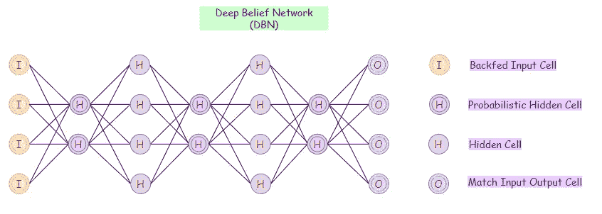

图 18:深层信念网络的代表(DBN)。

# 16.深度信仰网络(DBN):

深度信念网络包含许多隐藏层。我们可以用无监督算法调用 DBNs，因为它首先在没有任何监督的情况下学习。DBN 中的图层充当要素检测器。在非监督训练之后，我们可以用监督方法训练我们的模型来执行分类。我们可以将 DBNs 表示为受限玻尔兹曼机器(RBM)和自动编码器(AE)的组合，最后 DBNs 使用概率方法来处理其结果。

**应用:**

*   文档/图像的检索。
*   非线性降维。

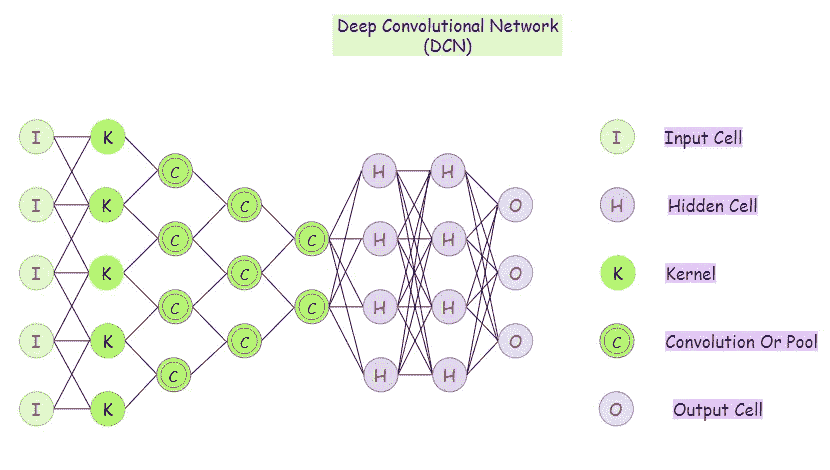

图 19:深度卷积神经网络(DCN)的表示。

# 17.深度卷积网络(DCN):

卷积神经网络是主要用于图像分类、图像聚类和对象识别的神经网络。DNNs 能够无监督地构建分层图像表示。DNNs 用于向它添加更复杂的功能，以便它可以更准确地执行任务。

**应用:**

*   辨认面孔，街道标志，肿瘤。
*   图像识别。
*   视频分析。
*   NLP。
*   异常检测。
*   药物发现。
*   跳棋游戏。
*   时间序列预测。

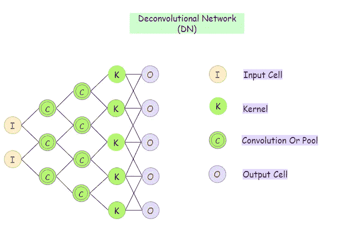

图 20:去卷积神经网络(DN)的表示。

# 18.去进化神经网络(DN):

去卷积网络是以相反过程工作的卷积神经网络(CNN)。尽管 DN 在工作性质上类似于 CNN，但它在 AI 中的应用是非常不同的。反进化网络有助于在网络中找到以前认为有用的丢失特征或信号。DN 可能由于与其他信号进行了卷积而丢失信号。反进化网络可以提取一个矢量，并把它做成一幅图像。

**应用:**

*   图像超分辨率。
*   从图像估计表面深度。
*   光流估计。

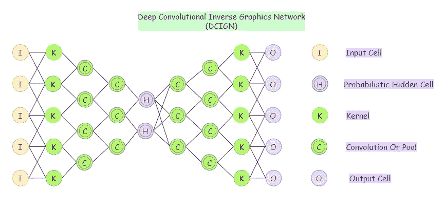

图 21:深度卷积反图形网络(DC-IGN)的表示

# 19.深度卷积逆图形网络(DC-IGN)；

深度卷积反图形网络(DC-IGN)旨在将图形表示与图像相关联。它使用照明、物体位置、纹理和图像设计的其他方面的元素来进行非常复杂的图像处理。它使用不同的层来处理输入和输出。深度卷积反图形网络使用初始层通过各种卷积进行编码，利用最大池，然后使用后续层以反卷积进行解码。

**应用:**

*   对人脸的处理。

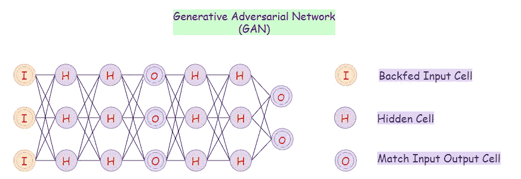

图 22:生成对抗网络(GAN)的表示

# 20.生成对抗网络(GAN):

给定训练数据，gan 学习生成具有与训练数据相同的统计数据的新数据。例如，如果我们在照片上训练我们的 GAN 模型，那么经过训练的模型将能够生成人眼看起来真实的新照片。GANs 的目标是区分真实结果和合成结果，以便生成更真实的结果。

**应用:**

*   生成新的人体姿态。
*   照片到表情符号。
*   面部衰老。
*   超分辨率。
*   服装翻译。
*   视频预测。

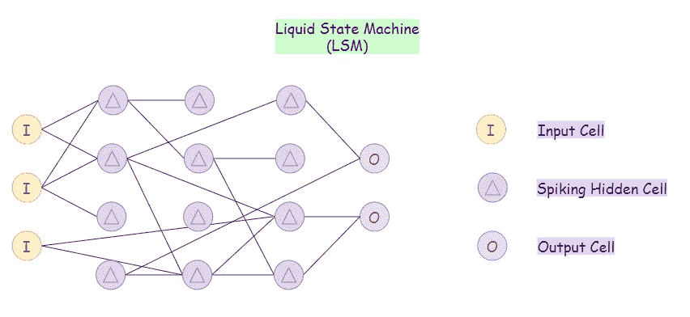

图 23:表示液态状态机(LSM)。

# 21.液态机器(LSM):

液态状态机(LSM)是一种特殊的脉冲神经网络。LSM 由大量的神经元组成。这里，每个节点从外部源和其他节点接收输入，这些输入会随时间而变化。请注意，LSM 上的节点随机地相互连接。在 LSM 中，激活函数由阈值水平代替。只有当 LSM 达到阈值水平时，特定的神经元才会发出其输出。

**应用:**

*   语音识别。
*   计算机视觉。

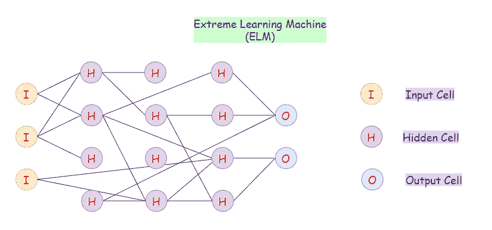

图 24:极限学习机(ELM)网络的表示。

# 22.极限学习机(ELM):

对于更大规模的数据集，传统系统的主要缺点是:

*   基于梯度算法的学习速度慢。
*   反复调整所有参数。

ELMs 随机选择隐藏节点，然后解析地确定输出权重。因此，这些算法比一般的神经网络算法要快得多。还有，在极限学习机网络上，随机分配的权重一般不会更新。ELMs 只需一步就能学习输出权重。

**应用:**

*   分类。
*   回归。
*   聚类。
*   稀疏近似。
*   特征学习。

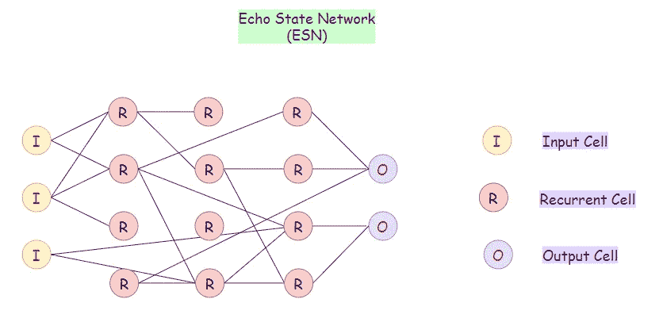

图 25:回声状态网络(ESN)的表示。

# 23.回声状态网络(ESN):

回声状态网络(ESN)是递归神经网络的一个子类型。这里，每个输入节点接收非线性信号。在 ESN 中，隐藏节点是稀疏连接的。隐藏节点的连接性和权重是随机分配的。在 ESN 上，最终输出权重是可训练的，并且可以更新。

**应用:**

*   时间序列预测。
*   数据挖掘。

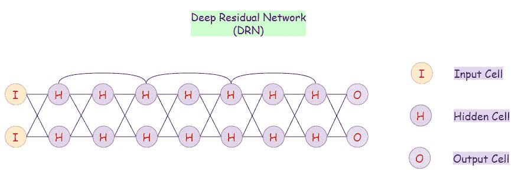

图 26:深层剩余网络的表示(DRN)。

# 24.深度剩余网络(DRN):

具有许多层的深度神经网络可能很难训练，并且在训练阶段花费很多时间。也可能导致成绩下降。深度残差网络(drn)防止结果降级，即使它们有许多层。对于 DRNs，其输入的一些部分传递到下一层。因此，这些网络可能相当深(可能包含大约 300 层)。

**应用:**

*   图像分类。
*   物体检测。
*   语义分割。
*   语音识别。
*   语言识别。

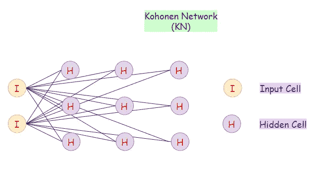

图 27:koho nen 网络(KN)的表示。

# 25.科霍宁网络公司(KN):

Kohonen 网络是一种无监督算法。Kohonen 网络也被称为自组织地图，当我们的数据分散在多个维度中，而我们只希望它在一个或两个维度中时，它非常有用。可以认为是一种降维的方法。我们使用 Kohonen 网络来可视化高维数据。他们使用竞争学习而不是纠错学习。

**各种拓扑:**

*   矩形网格拓扑。
*   六边形网格拓扑。

**应用:**

*   降维。
*   水质评价和预测。
*   沿海水域管理。

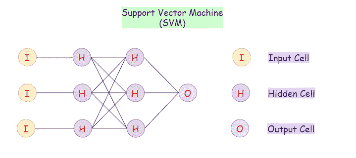

图 28:支持风险投资机器(SVM)的表示。

# 26.支持向量机(SVM):

支持向量机神经网络是支持向量机和神经网络的混合算法。对于一组新的例子，它总是试图将它们分为两类是或否(1 或 0)。支持向量机通常用于二元分类。这些通常不被认为是神经网络。

**应用:**

*   人脸检测。
*   文本分类。
*   分类。
*   生物信息学。
*   手写识别。

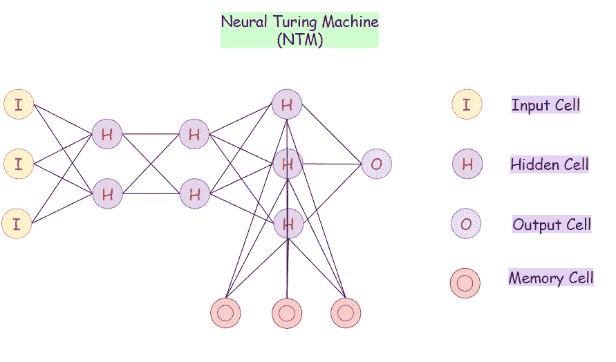

图 29:神经转向机器(NTM)的代表。

# 27.神经图灵机(NTM):

神经图灵机(NTM)架构包含两个主要组件:

*   神经网络控制器。
*   记忆银行。

在这个神经网络中，控制器通过输入和输出向量与外部世界进行交互。它还通过与存储器矩阵交互来执行选择性读和写 R/W 操作。图灵机据说在计算上等同于现代计算机。因此，ntm 通过与外部存储器交互来扩展标准神经网络的能力。

**应用:**

*   机器人技术。
*   建造一个人造人脑。

我们希望你喜欢这个主要类型的神经网络概述。如果您有任何反馈，或者有什么需要修改或重新审视的地方，请在评论中告诉我们，或者发送电子邮件至**pub@towardsai.net**。

> 📚查看[机器学习算法的概述](https://towardsai.net/machine-learning-algorithms)，为初学者提供 Python 代码示例📚

**使用条款:**本作品是在 [**知识共享署名 4.0 国际许可**](https://creativecommons.org/licenses/by/4.0/) 下许可的衍生作品。原参考图归于 [**Stefan Leijnen**](https://www.researchgate.net/profile/Stefan_Leijnen) 和[**Fjodor van Veen**](https://www.researchgate.net/profile/Fjodor_Van_Veen)，可在 [**研究门**](https://www.researchgate.net/publication/341373030_The_Neural_Network_Zoo) 找到。

**免责声明:**本文所表达的观点为作者个人观点，不代表卡内基梅隆大学的观点。这些文章并不打算成为最终产品，而是当前思想的反映，同时也是讨论和改进的催化剂。

通过[向艾](https://towardsai.net/)发布

## 推荐文章

一、[机器学习和数据科学最佳数据集](https://towardsai.net/p/machine-learning/best-datasets-for-machine-learning-and-data-science-d80e9f030279)
二。[艾薪资冲天](http://towardsai.net/ai-salaries)三世
。[什么是机器学习？](https://towardsai.net/p/machine-learning/what-is-machine-learning-ml-b58162f97ec7)
四世。[2020 年最佳机器学习硕士项目](https://towardsai.net/ml-masters)
五、[2020 年最佳机器学习博士项目](https://towardsai.net/ml-phd)
六、[最佳机器学习博客](https://towardsai.net/p/machine-learning/best-machine-learning-blogs-6730ea2df3bd)
七。[关键机器学习定义](https://towardsai.net/p/machine-learning/key-machine-learning-ml-definitions-43e837ec6add)
八。[用机器学习在 0.05 秒内破解验证码](https://towardsai.net/ml-captcha)
九。[机器学习 vs. AI 及其重要区别](https://towardsai.net/p/machine-learning/machine-learning-vs-ai-important-differences-between-them/robiriondo/3432/)
十.[确保成功开创机器学习事业(ML)](https://towardsai.net/p/machine-learning/moocs-vs-academia-ensuring-success-starting-in-a-machine-learning-ml-career-304b2e42315e)
XI。[机器学习算法初学者](https://towardsai.net/p/machine-learning/machine-learning-algorithms-for-beginners-with-python-code-examples-ml-19c6afd60daa)
十二。[神经网络从零开始详细用 Python 代码和数学](https://towardsai.net/neural-networks-with-python)
XIII。[用 Python 构建神经网络](https://towardsai.net/p/machine-learning/building-neural-networks-with-python-code-and-math-in-detail-ii-bbe8accbf3d1)
XIV。[神经网络的主要类型](https://towardsai.net/p/machine-learning/main-types-of-neural-networks-and-its-applications-tutorial-734480d7ec8e)
十五。[用 Python 编写的蒙特卡洛模拟教程](https://towardsai.net/p/machine-learning/monte-carlo-simulation-an-in-depth-tutorial-with-python-bcf6eb7856c8)
XVI。[Python 自然语言处理教程](https://towardsai.net/p/nlp/natural-language-processing-nlp-with-python-tutorial-for-beginners-1f54e610a1a0)

## 参考资料:

[1]激活功能|维基百科|[https://en.wikipedia.org/wiki/Activation_function](https://en.wikipedia.org/wiki/Activation_function)

[2]感知器:大脑中信息存储和组织的概率模型| Frank Rosenblatt |宾夕法尼亚大学|[https://www . ling . upenn . edu/courses/cogs 501/Rosenblatt 1958 . pdf](https://www.ling.upenn.edu/courses/cogs501/Rosenblatt1958.pdf)

[3]康奈尔航空实验室的弗兰克·罗森布拉特的 Mark I 感知机。纽约州布法罗，1960 | Instagram，卡耐基梅隆大学机器学习系|【https://www.instagram.com/p/Bn_s3bjBA7n/ 

[4]反向传播|维基百科|[https://en.wikipedia.org/wiki/Backpropagation](https://en.wikipedia.org/wiki/Backpropagation)

[5]神经网络动物园| Stefan Leijnen 和 Fjodor van Veen | Research Gate |[https://www . Research Gate . net/publication/341373030 _ The _ Neural _ Network _ Zoo](https://www.researchgate.net/publication/341373030_The_Neural_Network_Zoo)

[6]https://creativecommons.org/licenses/by/4.0/知识共享许可 CCBY |