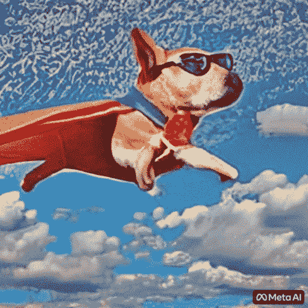
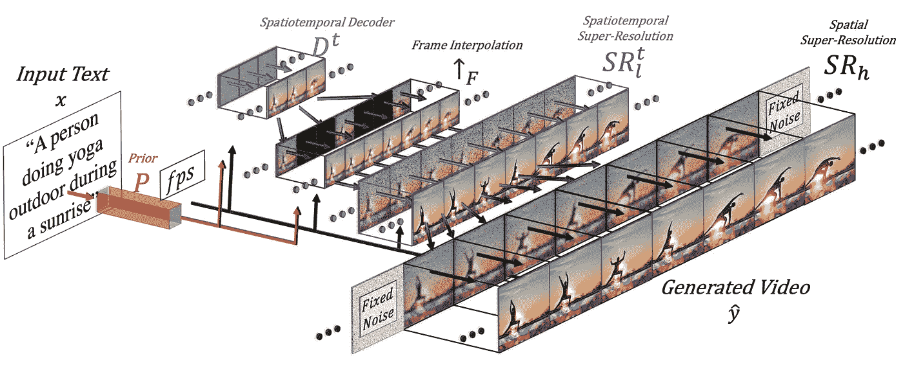
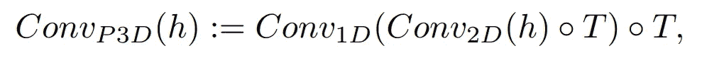
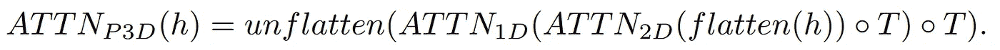

# 人工智能电影制作人！

> 原文：<https://pub.towardsai.net/make-a-video-the-ai-film-maker-85bced0904bb?source=collection_archive---------3----------------------->

## 从文本生成视频！

> 最初发表于 [louisbouchard.ai](https://www.louisbouchard.ai/make-a-video/) ，前两天在[我的博客上读到的！](https://www.louisbouchard.ai/make-a-video/)

## 观看视频

Meta AI 的新模型 make-a-video 问世了，简单来说就是:它从文本中生成视频。它不仅能够生成视频，而且是新的最先进的方法，比以往任何时候都能够生成更高质量和更连贯的视频！

你可以把这个模型看作是视频的稳定扩散模型。在能够生成图像之后的下一步。这些信息你肯定已经在新闻网站上看到过，或者只是通过阅读文章的标题，但是你还不知道它到底是什么，以及它是如何工作的。

Make-A-Video 是 Meta AI 的最新出版物，它允许你从文本输入中生成一个短视频，就像这样。

一只穿着红色斗篷的超级英雄套装的狗飞过天空。辛格等人用 Make-A-Video 生成的视频(Meta AI)，2022。

因此，您不仅必须生成同一主题和场景的多个帧，而且还必须在时间上保持一致，从而增加了图像生成任务的复杂性。你不能简单地用 [DALLE](https://www.louisbouchard.ai/openais-new-model-dall-e-2-is-amazing/) 生成 60 张图像并生成一个视频。它只会看起来很糟糕，没有任何现实意义。

你需要一个更好地理解世界的模型，并利用这种理解水平来生成一系列融合良好的连贯图像。你基本上想模拟一个世界，然后模拟它的记录。但是你怎么能这样做呢？

通常，您需要大量的文本-视频对来训练您的模型，以便从文本输入中生成这样的视频，但在这种情况下不是这样。由于这种数据真的很难获得，而且训练成本超级昂贵，所以他们处理这个问题的方式不同。

另一种方法是采用最佳的文本到图像模型，并将其应用于视频，这就是 Meta AI 在他们刚刚发布的一篇研究论文中所做的。在他们的例子中，文本到图像模型是 Meta 的另一个模型，叫做 Make-A-Scene，如果你想了解它，我在以前的文章中已经介绍过了。但是你如何调整这样一个模型来考虑时间呢？您可以为您的模型添加时空管道，以便能够处理视频。

方法概述。图片来自辛格等人(Meta AI)，2022。

这意味着该模型不仅会生成一个图像，而且在这种情况下，16 个低分辨率的图像会以与文本到图像模型类似的方式创建一个短的连贯视频，但除了常规的 2D 卷积之外，还添加了 1D 卷积。这种简单的添加允许他们保持预训练的 2D 卷积不变，并添加他们将从头开始训练的时间维度，重新使用来自他们开始的图像模型的大部分代码和模型参数。

在文本到图像方法中使用的常规二维卷积模块之后添加一维卷积模块。

我们还希望用文本输入来指导我们的世代，这将非常类似于使用剪辑嵌入的图像模型。如果你不熟悉这个方法，我会在我的稳定扩散视频中详细介绍这个过程。但是，当混合文本特征和图像特征时，他们还会添加空间维度，做同样的事情:保留我在制作场景视频中描述的注意力模块，并添加一维注意力模块以考虑时间因素——复制粘贴图像生成器模型，并复制一个维度的生成模块以获得所有 16 个初始帧。

在文本到图像方法中使用的常规二维注意模块之后添加一维注意模块。

但 16 帧不会带你走远视频。我们需要用那 16 台主机制作一个高清视频。它将通过访问先前和未来的帧并同时根据时间和空间维度从它们进行迭代内插来做到这一点。因此，基本上，根据之前和之后的帧在这 16 个初始帧之间生成新的和更大的帧将有助于使运动连贯和整体视频流畅。这是使用帧插值网络完成的，我在其他视频中也描述过，但基本上会采用我们现有的图像，并填充间隙，产生中间信息。它将对空间组件做同样的事情，放大图像并填充像素间隙，使其更加高清。

因此，总而言之，他们微调了视频生成的文本到图像模型。这意味着他们采用一个已经训练好的强大模型，适应并训练它多一点，以适应视频。由于我们讨论的时空模块的增加，这种技术将简单地使模型适应这种新类型的数据，而不是必须重新训练它，这是非常昂贵的。这种重新训练将用未标记的视频来完成，只是为了教会模型理解视频和视频帧的一致性，这使得数据集构建过程简单得多。然后，我们再次使用图像优化模型来提高空间分辨率，并使用最后一帧插值组件来添加更多帧，以使视频流畅。

瞧！

小丑鱼游过珊瑚礁。辛格等人用 Make-A-Video 生成的视频(Meta AI)，2022。

当然，结果还不完美，就像文本到图像的模型一样，但是我们知道进展有多快。

这是这篇伟大论文中 Meta AI 如何成功解决文本到视频任务的概述。如果你想了解他们的方法，所有的链接都在描述中。社区也已经在开发 PyTorch 实现，所以如果您想自己实现它，请继续关注！

感谢大家看完整个视频，下期再来一篇惊艳的论文！

## 参考

梅塔的博文:[https://ai.facebook.com/blog/generative-ai-text-to-video/](https://ai.facebook.com/blog/generative-ai-text-to-video/)
辛格等人(梅塔艾)，2022，《制作视频:没有文本-视频数据的文本-视频生成》，[https://makeavideo.studio/Make-A-Video.pdf](https://makeavideo.studio/Make-A-Video.pdf)
《制作视频》(官方页面):[https://makeavideo.studio/?FB clid = iwar 0 tu L9 UC 6 kjzamojhcngamunp 9 bzbyhlmdouvej 9 leyyfl 9 awry 4 seqgw 4](https://makeavideo.studio/?fbclid=IwAR0tuL9Uc6kjZaMoJHCngAMUNp9bZbyhLmdOUveJ9leyyfL9awRy4seQGW4)
py torch 实现:[https://github.com/lucidrains/make-a-video-pytorch](https://github.com/lucidrains/make-a-video-pytorch)