# 用数学创造艺术。成为艺术家

> 原文：<https://pub.towardsai.net/make-art-with-math-become-an-artist-3517720708f8?source=collection_archive---------1----------------------->


## 叶序

## 不仅仅是分析… R 也能做出漂亮的东西…

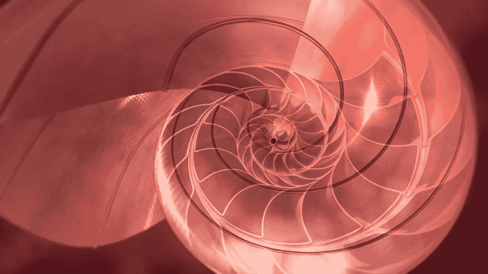

> "数学是关于模式的科学，自然界几乎利用了所有的模式. "(伊恩·斯图尔特)

# **叶序**

植物茎上叶子的排列在植物学上称为叶序或叶序。自然界中一类独特的图案是叶状螺旋。

让我们来看一个数学如何在自然界创造模式的好例子。

# 性质和模式

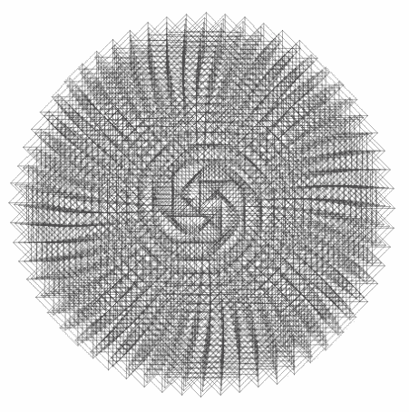

许多自然事实可以用数学术语来描述。

> **例子:**雪花的形状，浪漫西兰花的分形几何或者自相似性如何支配植物的生长。

R 是做严肃分析的工具，但是 R 可以用来找乐子，也可以用来做美好的事情。R 的图形能力也可以用来制作艺术图像。

> **R 包:** ggplot2

# 热身:圆圈上的点

对于这个示例，我们将使用 R 中的“ggplot 2”包来绘制花朵。

我们将使用`geom_point()`来绘制二维的点(散点图)。我们将创建一个包含两个变量的数据集，分别称为“x”和“y”。

我们将画一个半径为 1 的圆，圆上有 50 个点。

毕达哥拉斯三角恒等式指出，对于任何实数θ，sin (θ) + cos (θ) = 1 将帮助我们实现这一点。

由于我们需要单位圆内的每一个`(x, y)`点，所以它应该遵循 x + y = 1。

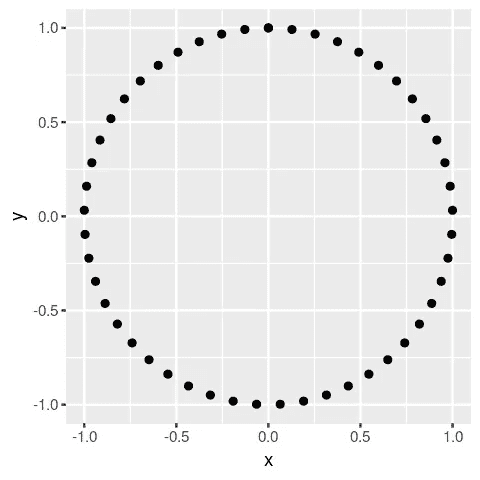

```
 t <- **seq**(0, 2*****pi, length.out = 50)
x <- **sin**(t)
y <- **cos**(t)
df <- **data.frame**(t, x, y)

*# Make a scatter plot of points in a circle*
p <- **ggplot**(df, **aes**(x, y))
p **+** **geom_point**()
```

**与黄金角协调**

将树叶排成螺旋形。螺线是一条曲线，它从原点出发，绕着原点旋转，然后离开这个点。

上图中所有点离原点的距离都相同。要螺旋排列它们，将 *x* 和 *y* 乘以一个系数，该系数随着每个点的增加而增加。

我们将使用黄金角，使它看起来更加和谐。

[黄金角度](https://en.wikipedia.org/wiki/Golden_angle)=π(3√5)

这个数字的灵感来自于黄金比例，这是数学史上最著名的数字之一。

想象你有一个圆周，你把它分成两个长度为 a 和 b 的弧，a 和 b(一个弧是圆周的一部分)。

打破圆使得 a/b=(a+b)/a 的角称为黄金角。

换句话说:黄金角打破了一个圆，使大弧与小弧的比例是黄金比例。

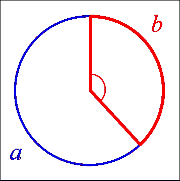

较小的(红色)弧所对的角称为黄金角。

在自然界意想不到的地方，黄金角和黄金比例都会出现。花瓣、树叶、种子、松果、葵花籽、贝壳、飓风等。

# 开始画螺旋

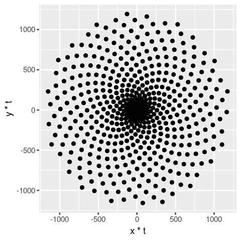

使用黄金分割角排列成螺旋形的点

```
 # Defining the number of points
points <- 500# Defining the Golden Angle
angle <- pi * (3 -sqrt(5))t <- (1:points) * angle
x <- sin(t)
y <-cos(t)
df <- data.frame(t, x, y)# Make a scatter plot of points in a spiral
p <- ggplot(df, aes(x*t, y*t))
p + geom_point() 
```

# 保持简单

为了让剧情看起来更艺术，让我们从剧情中移除令人分心的项目。

1.  灰色背景。
2.  水平和垂直白线网格。
3.  沿轴刻度。
4.  每个轴上的标题。
5.  沿轴标注标记的文本

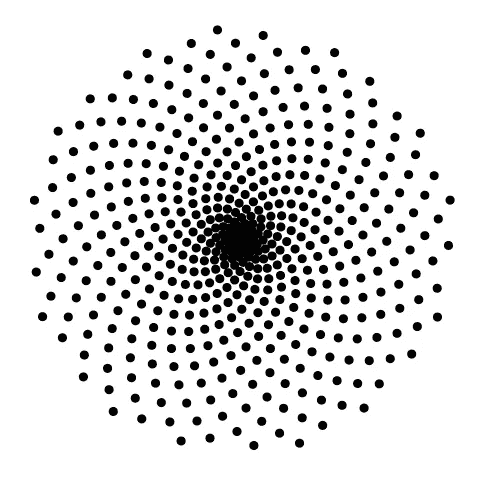

不要分心…

```
df <- data.frame(t, x, y)# Make a scatter plot of points in a spiral
p <- ggplot(df, aes(x*t, y*t))p + geom_point() + theme(legend.position="none",panel.background = element_rect(fill = "white"),panel.grid=element_blank(),axis.ticks=element_blank(),axis.title=element_blank(),axis.text=element_blank())
```

既然已经排除了干扰，让我们试着让它们看起来漂亮一点。

让我们看看当我们改变颜色、透明度(也称为 *alpha* )和点的大小时会发生什么。

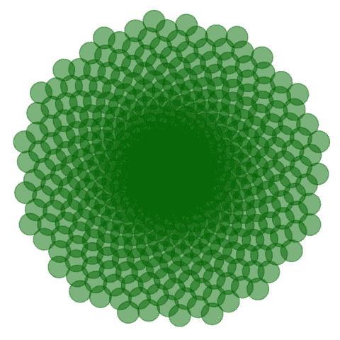

吸引人？

```
# Modify the size, transparency, and color of the points
p <- ggplot(df, aes(x*t, y*t))
p + geom_point(size = 8, alpha = 0.5, color = "darkgreen") + theme(legend.position="none",panel.background = element_rect(fill = "white"),panel.grid=element_blank(),axis.ticks=element_blank(),axis.title=element_blank(),axis.text=element_blank())
```

# 蒲公英

如果你注意到，所有的点都有相同的外观。大小、颜色、形状和 alpha 都是一样的。

有时，您可能希望使点的外观依赖于数据集中的某个变量。

这里，我们将使“大小”成为变量。我们还将改变点的形状。

当你看到下面的图片时，你会想起蒲公英吗？

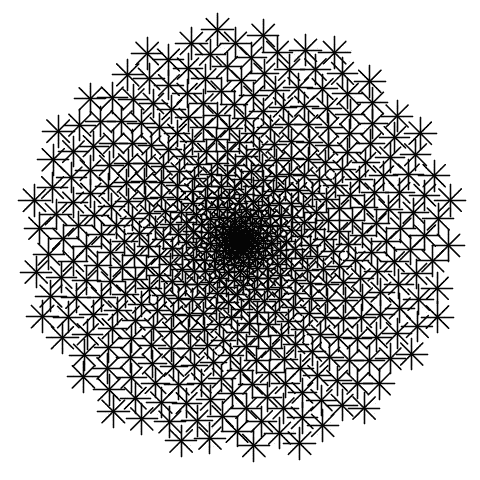

蒲公英？

```
p <- ggplot(df, aes(x*t, y*t))
p + geom_point(aes(size = t), shape = 8 ) +
theme(legend.position="none", panel.background = element_rect(fill = "white"),panel.grid=element_blank(),axis.ticks=element_blank(),axis.title=element_blank(),axis.text=element_blank())
```

# 集齐所有:向日葵

植物不仅使用黄金角来排列叶子。它也用于葵花籽排列。

我们只需要混合一些我们已经知道的东西来创造一个向日葵。

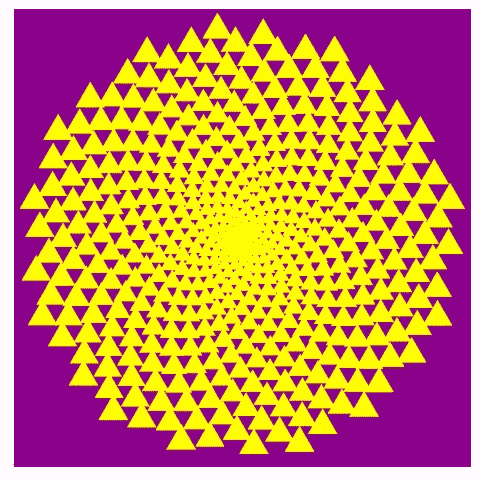

向日葵？

```
p <- ggplot(df, aes(x*t, y*t))
p + geom_point(aes(size = t), shape = 17,color = "yellow" ) +
theme(legend.position="none",panel.background = element_rect(fill = "darkmagenta"),panel.grid=element_blank(),axis.ticks=element_blank(),axis.title=element_blank(),axis.text=element_blank())
```

# 如果我们修改角度，会有什么变化吗？

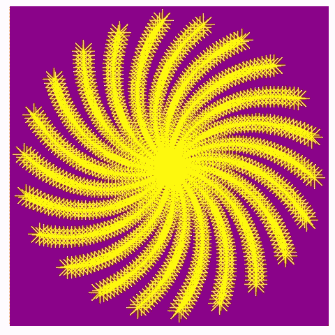

哇！仅仅改变角度就产生了如此剧烈的变化

```
angle <- 2.0
points <- 1000t <- (1:points)*angle
x <- sin(t)
y <- cos(t)
df <- data.frame(t, x, y)# Copy the plotting code from Task 7
p <- ggplot(df, aes(x*t, y*t))
p + geom_point(aes(size = t), shape = 8,color = "yellow" ) +
theme(legend.position="none",panel.background = element_rect(fill = "darkmagenta"),panel.grid=element_blank(),axis.ticks=element_blank(),axis.title=element_blank(),axis.text=element_blank()
```

# 花在哪里？

现在我们知道了如何处理点、角度和颜色，让我们看看通过改变形状和颜色我们能创造出什么

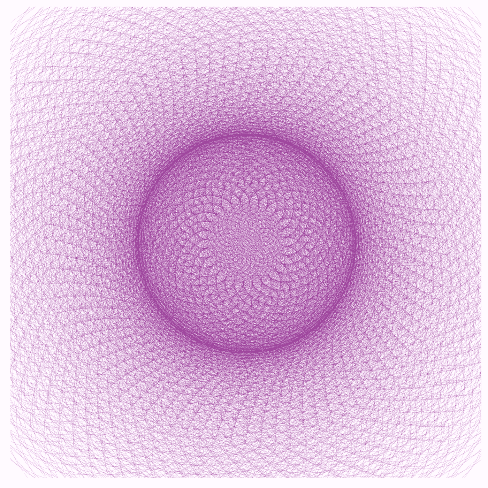

左边的图片是前一朵花的简单变体，非常类似于我们在一个圆中绘制 50 个点的第一个图形。

我希望你喜欢这个简单的圆圈和这朵美丽的花之间的旅程