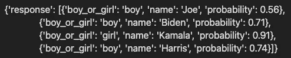
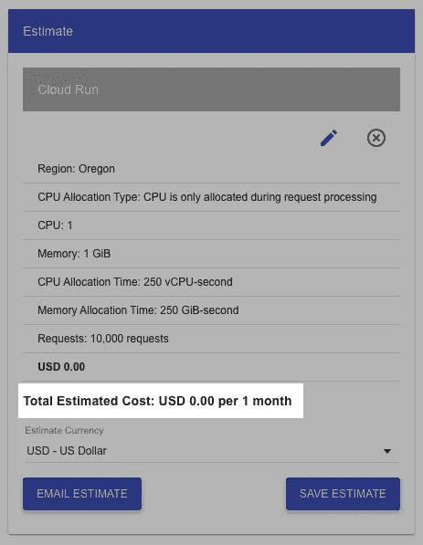
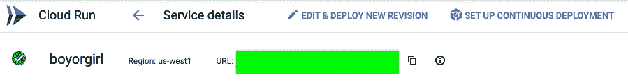
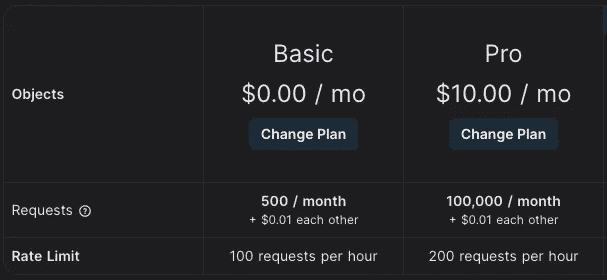
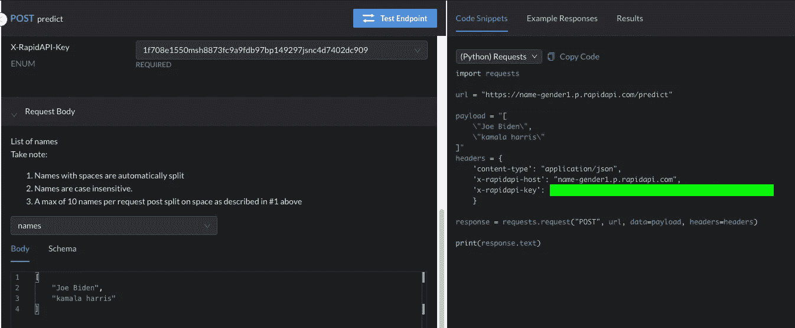
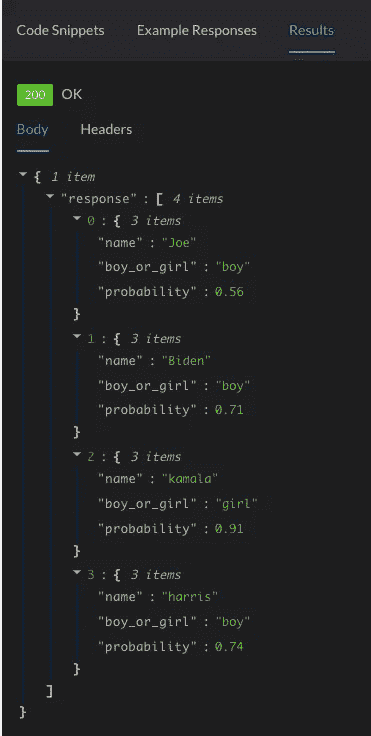

# 利用数据科学赚外快！

> 原文：<https://pub.towardsai.net/make-extra-money-on-the-side-with-data-science-984a623c53f5?source=collection_archive---------0----------------------->

## 在 5 个简单的步骤中使用 FastAPI、Docker、GCP 云运行和 Rapid API 将您的机器学习模型货币化！

亚历山大·密尔斯在 [Unsplash](https://unsplash.com?utm_source=medium&utm_medium=referral) 上拍摄的照片

️The 梦想每一个[火(财务独立，提前退休)](https://en.wikipedia.org/wiki/FIRE_movement)爱好者是赚足够的被动收入，提前退休，在热带海滩啜饮椰子🏖️ !在我对 FIRE 的追求中，我偶然发现了一种通过将模型部署为 API 并出售对它的访问权来将我的数据科学副业项目货币化的巧妙方法。虽然这些知识还没有让我赚到几百万，但我认为这是一个很好的学习经历，也是一个赚取咖啡钱的好方法。以下是利用数据科学赚钱的五个步骤，并附有代码说明！

# 🌟第一步:发明一个奇特的 API

照片由 [JJ 英](https://unsplash.com/@jjying?utm_source=medium&utm_medium=referral)在 [Unsplash](https://unsplash.com?utm_source=medium&utm_medium=referral) 上拍摄

第一步也是最难的。你首先需要创造一个别人会为之付费的产品或服务。谢天谢地，数据科学家可以解决的问题并不缺乏！

我将从重用我以前在开发的[的名字到性别的预测模型开始。该模型将姓名串作为输入和输出，如果这些姓名更多地与男孩或女孩相关联的话。有关数据、预处理和训练程序的更多信息，请参考此](https://towardsdatascience.com/boy-or-girl-a-machine-learning-web-app-to-detect-gender-from-name-16dc0331716c)[帖子](https://towardsdatascience.com/boy-or-girl-a-machine-learning-web-app-to-detect-gender-from-name-16dc0331716c)。训练出来的模型准确率超过 80%！

一旦我们有了训练好的模型，我们可以使用 [FastAPI](https://fastapi.tiangolo.com/) 或 [Flask](https://flask.palletsprojects.com/en/2.0.x/) 将模型包装成 API。API 代码相对简单，如下所示。首先，我们导入必要的库，它也可以包含本地模块，比如`preprocess`。然后我们从`models`目录中加载保存的模型文件。接下来，我们实例化一个 FastAPI 应用程序，然后创建由以下操作组成的`predict`端点。

1.  接受一个名字列表作为输入。
2.  拆分非字母字符上的所有名称。例如，如果输入名称是“乔·拜登”，它将被分成两个单词:“乔”和“拜登”我们这样做是因为我们只根据名字训练模型，名字中没有空格。因此，我们确保在预测过程中名称也是分开的。
3.  只保留前十个名字，以确保我们的 API 在合理的时间内完成运行。
4.  将名称预处理成模型期望的格式，例如将它们转换成小写，拆分各个字符，将所有名称填充到相同的长度，并将字符编码成数字。
5.  通过模型预测运行预处理的名称
6.  将概率转换为“男孩”或“女孩”预测。
7.  格式化输出并作为 API 的响应返回。

作者代码

作者代码

最后，应用程序的主要模块只是在端口`8080`上运行带有`uvicorn`的 API，因为这是 GCP 云运行默认使用的端口。

# 🐳步骤 2:将 API 包装到 Docker 容器中

[伊恩·泰勒](https://unsplash.com/@carrier_lost?utm_source=medium&utm_medium=referral)在 [Unsplash](https://unsplash.com?utm_source=medium&utm_medium=referral) 上的照片

一旦你把你的 API 开发成 Flask 或 FastAPI 应用程序，你可以通过添加一个非常简单的`Dockerfile`到你的存储库中，把它包装成 Docker 容器，如下所示。Dockerfile 将所有必需的文件添加到映像中，从`requirements.txt`文件安装所需的依赖项，并启动`gunicorn`服务器来运行 API。

作者代码

我们可以在本地测试 docker 映像，首先运行 Docker 容器，然后使用 python `requests`库向它发送一些数据。

作者代码

作者代码

作者图片

现在我们的 Docker 容器在本地工作，我们可以继续下一步。

# ☁️第 3 步:使用云服务(比如 GCP Cloud Run)托管 API

由[泰勒维克](https://unsplash.com/@tvick?utm_source=medium&utm_medium=referral)在 [Unsplash](https://unsplash.com?utm_source=medium&utm_medium=referral) 上拍摄的照片

部署 docker 容器有几种方式，比如 [Heroku](https://devcenter.heroku.com/categories/deploying-with-docker) 、 [AWS Fargate](https://aws.amazon.com/fargate/) 和 [GCP 云运行](https://cloud.google.com/run)。在这篇文章中，我将使用 GCP 云来部署我们的 Docker 容器，只需要一行代码，如下所示。在运行下面的代码之前，记得按照这里[的说明](https://cloud.google.com/sdk/docs/install)安装并初始化 Gcloud CLI。

作者代码

如下所示，GCP 云运行部署实际上是免费的，我们预计适度使用，从而最大限度地提高我们的利润率！

图片由作者提供，使用 [GCP 的免费定价计算器](https://cloud.google.com/products/calculator#id=69e7f4b4-65aa-462b-9cb1-bb45fa9ddc3b)生成

# 🚀步骤 4:通过在 Rapid API 上发布来出售对 API 的访问权

詹姆斯·哈里森在 [Unsplash](https://unsplash.com?utm_source=medium&utm_medium=referral) 上拍摄的照片

Rapid API 中心是一项免费服务，可以发布你喜欢的 API 并将其货币化！只需点击`My APIs` → `Add New API`，按照 UI 中的步骤在 Rapid API 上注册您的 API 即可。您可以从 GCP 云运行控制台获取您的 API URL，如下所示。如果你需要关于如何在 RapidAPI 上设置 API 的进一步分步指导，请看看这个由 [Ania Kubów](https://www.youtube.com/channel/UC5DNytAJ6_FISueUfzZCVsw) 制作的[精彩视频](https://www.youtube.com/watch?v=GK4Pl-GmPHk&t=3224s)。

作者图片

Rapid API 允许您为访问您的 API 设置自定义定价层。如下所示，我强烈推荐一个免费层，以及一个或多个付费层。

图片作者来自 [RapidAPI](https://rapidapi.com/stephenleo87-DGFI1at-XQ/api/name-gender1/)

您还可以为您的 API 创建文档站点，这是您的用户将看到并用来试验您的 API 的页面。

图片作者来自 [RapidAPI](https://rapidapi.com/stephenleo87-DGFI1at-XQ/api/name-gender1/)

使用文档 UI，让我们测试一下 Rapid API 端点，以确认一切按预期工作。

图片作者来自 [RapidAPI](https://rapidapi.com/stephenleo87-DGFI1at-XQ/api/name-gender1/)

# 💸第五步:让它下雨吧！

[Eyestetix 工作室](https://unsplash.com/@eyestetix?utm_source=medium&utm_medium=referral)在 [Unsplash](https://unsplash.com?utm_source=medium&utm_medium=referral) 拍摄的照片

就是这样。现在剩下的就是坐以待毙，等待金钱滚滚而来！写一篇关于你的 API 的媒体文章，并在你的社交媒体上分享，这将有助于宣传你的 API，这正是我写这篇文章的目的🙂

我希望这篇文章是有益的。请点击[链接](https://rapidapi.com/stephenleo87-DGFI1at-XQ/api/name-gender1/)查看我的姓名性别快速 API。你可以在[我的 Github repo](https://github.com/stephenleo/cloud-run-apis/tree/master/src/boyorgirl) 上找到这篇文章的所有代码。感谢阅读！

如果你喜欢我的文章，请考虑关注我，并使用我下面的推荐链接成为一名灵媒会员。谢谢！

 [## 加入我的介绍链接媒体-玛丽斯蒂芬利奥

### 作为一个媒体会员，你的会员费的一部分会给你阅读的作家，你可以完全接触到每一个故事…

stephen-leo.medium.com](https://stephen-leo.medium.com/membership)