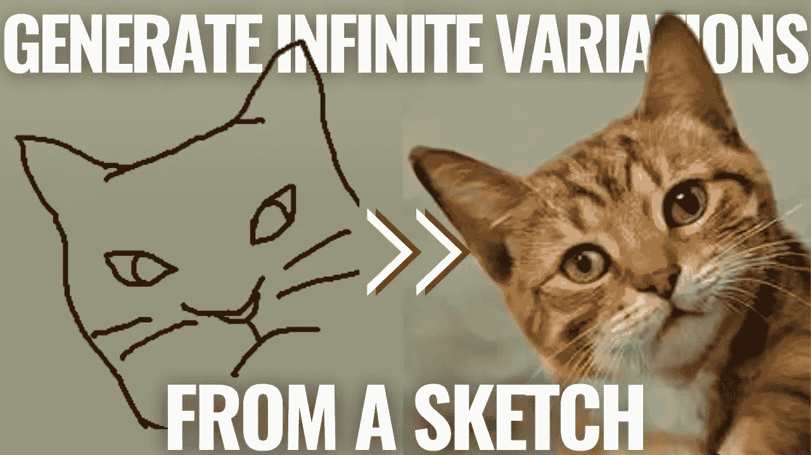
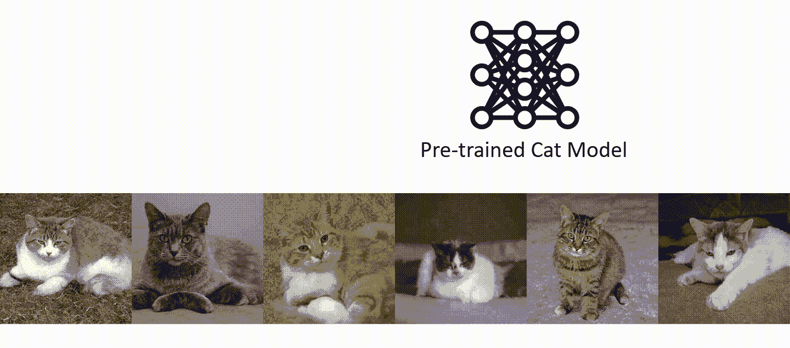
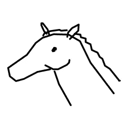
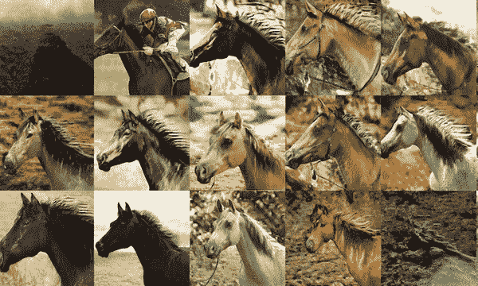
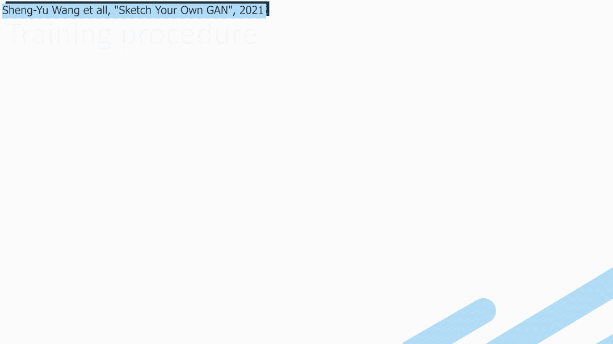

# 让 GANs 训练对每个人都更容易:根据草图生成图像

> 原文：<https://pub.towardsai.net/make-gans-training-easier-for-everyone-generate-images-following-a-sketch-a2bc4fd6ec8c?source=collection_archive---------1----------------------->

## [机器学习](https://towardsai.net/p/category/machine-learning)

## 根据你能提供的最简单的知识类型控制 GANs 输出:手绘草图。

> 原载于 [louisbouchard.ai](https://www.louisbouchard.ai/make-gans-training-easier/) ，前两天在[我的博客](https://www.louisbouchard.ai/make-gans-training-easier/)上看到的！

听听这个故事…

## 生成对抗网络

机器学习模型现在可以根据它从现有的一组图像中看到的内容生成新的图像。我们真的不能说这个模型是有创意的，因为即使图像确实是新的，结果也总是受到过去看过的类似照片的高度启发。这种类型的架构被称为生成性对抗网络，或 GAN。如果你已经知道 GANs 是如何工作的，你可以跳到下一部分去了解研究人员的新发现。如果没有，我将快速浏览一下它是如何工作的。

发生器和鉴别器。图片作者。

这种强大的架构基本上是采用一堆图像，并试图模仿它们。通常有两个网络，发生器和鉴别器。它们的名字包含了相当多的信息……生成器试图生成新的图像，鉴别器试图鉴别这些图像。

训练过程如下:向鉴别器显示来自我们的训练数据集的图像，这是我们的真实图像集，或者是由生成器制作的称为假图像的图像。然后，鉴别者试图判断图像是真的还是假的。如果发送的图像 guessed real 是假的，我们说鉴别器被愚弄了，我们更新其参数以提高其下次尝试的检测能力。反过来，如果鉴别器猜对了，说它是假的，生成器被惩罚，并以同样的方式更新，从而提高未来生成的图像的质量。这个过程一遍又一遍地重复，直到鉴别器被骗了一半时间，这意味着生成的图像与我们在真实数据集中的图像非常相似。因此，生成的图像现在看起来像是从我们的数据集中挑选出来的，具有相同的风格。

如果你想知道更多关于生成器和鉴别器模型如何工作的细节，以及它们内部的样子，我推荐你阅读我写的许多关于它们的文章中的一篇，比如[这篇关于动画](https://www.louisbouchard.ai/toonify/)的文章。

这里的问题是，这个过程有一段时间是黑箱，极难训练，尤其是控制生成什么样的图像。在了解发电机网络的哪一部分负责什么方面已经取得了很大进展。

## 素描自己的 GAN[【1】](https://arxiv.org/pdf/2108.02774v1.pdf)

传统上，建立一个控制生成图像风格的模型来产生我们想要的东西，就像生成具有特定位置的猫的图像一样，
需要深度学习的专业知识，工程工作，耐心和大量的试错。它还需要大量的图像示例，手动策划，你的目标是生成什么，以及对模型如何工作的理解，以适应你自己的需求正确。并重复这一过程，以进行您想要的任何更改。

根据卡特彼勒示例绘制草图。图片来自[赶集](https://github.com/peterwang512/GANSketching)。

相反，来自卡耐基梅隆大学和麻省理工学院的盛·等人提出的这种新方法名为 Sketch Your Own GAN，它可以采用现有的模型，例如，经过训练可以生成猫的新图像的生成器
，并根据你可以提供的最简单的知识类型来控制输出:手绘草图。任何人都可以做的事情，让 GANs 训练变得更加容易。没有更多的艰苦工作和模型调整几个小时来生成猫在你想要的位置，通过计算出模型的哪个部分负责图像中的哪个组件！

多酷啊。它肯定至少值得在你的群聊中分享这篇文章！；)当然，在特定位置生成一只猫也没什么特别的，但是想象一下这能有多强大。它可以让一个经过训练的模型生成任何东西，并从少量的草图中控制将出现的东西，同时保留其他细节和相同的风格！这是一种重新训练生成器模型的架构，鼓励它使用草图提供的结构生成图像，同时保留原始模型的多样性和尽可能高的图像质量。这也称为微调模型，您可以采用一个强大的现有模型，并对其进行调整以更好地执行您的任务。

山墙教堂一代的例子…图片来自 [GANSketching](https://github.com/peterwang512/GANSketching) 。

想象一下，你很想建一座山墙教堂，但不知道颜色或具体的建筑？只要把草图发给模特，就能获得无限的创作灵感！当然，这仍然是早期的研究，它将始终遵循您用来训练生成器的数据集中的样式，但图像仍然是全新的，并且可以惊人地美丽！

素描到图像示例(马头)。图片来自 GANSketching。

但是他们是怎么做到的呢？他们对可用于**控制输出**的生成模型有什么想法？

这项任务面临着各种挑战，比如所需的数据量和模型专业知识。通过使用已经训练好的模型来解决数据问题，我们只是试图使用少量草图来适应我们的任务，而不是通常需要的成百上千的草图和图像对。为了解决专业技术问题，他们不是手动计算出对模型进行的更改，而是使用另一个经过训练的模型(称为 Photosketch)将生成的图像转换为草图表示。然后，类似于传统的 GAN 训练来训练发生器，但是使用两个鉴别器而不是一个。

新发电机的培训程序。图片来自[赶制](https://github.com/peterwang512/GANSketching)。

第一个鉴频器用于控制输出质量，就像常规 GAN 架构遵循我们之前描述的相同训练过程一样。

第二个鉴别器被训练来区分生成的草图和用户绘制的草图。从而鼓励生成的图像匹配用户草图结构，类似于第一鉴别器如何鼓励生成的图像匹配初始训练数据集中的图像。

通过这种方式，模型会自己计算出要更改哪些参数，以适应模拟草图的新任务，并删除模型专业知识要求，以处理创成式模型。

这个研究领域令人兴奋，允许任何人玩生成模型并控制输出。它比最初的模型更接近于在现实世界中有用的东西，在最初的模型中，你需要大量的时间、金钱和专业知识来建立一个能够生成这种图像的模型。相反，从少数草图，任何人都可以做，结果模型可以产生无限数量的新图像，类似于输入草图，允许更多的人玩这些生成网络。

让我知道你的想法，如果这对你和对我一样令人兴奋！如果你想了解更多关于这种技术的细节，我强烈推荐你阅读下面链接的他们的论文！

感谢您的阅读！

## 观看视频，查看更多示例，并在 YouTube 上支持我

如果你喜欢我的工作，并想与人工智能保持同步，你绝对应该关注我的其他社交媒体账户( [LinkedIn](https://www.linkedin.com/in/whats-ai/) 、 [Twitter](https://twitter.com/Whats_AI) )并订阅我的每周人工智能[简讯](http://eepurl.com/huGLT5) ！

## 支持我:

*   支持我的最好方式是成为这个网站的成员，或者如果你喜欢视频格式，在[**YouTube**](https://www.youtube.com/channel/UCUzGQrN-lyyc0BWTYoJM_Sg)**上订阅我的频道。**
*   **在经济上支持我在 T21 的工作**
*   **跟我来这里上 [**中**](https://whats-ai.medium.com/)**

## **参考资料:**

*   **盛-等著，《素描你自己的甘》，2021，**
*   **项目链接:[https://peterwang512.github.io/GANSketching/](https://peterwang512.github.io/GANSketching/)**
*   **代号:[https://github.com/PeterWang512/GANSketching](https://github.com/PeterWang512/GANSketching)**