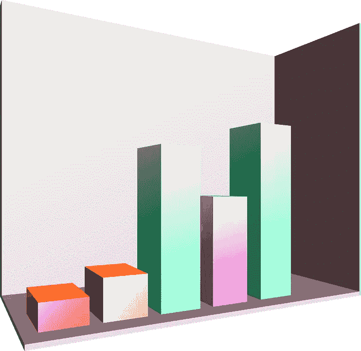
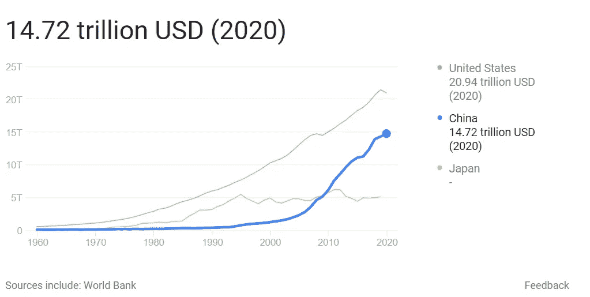
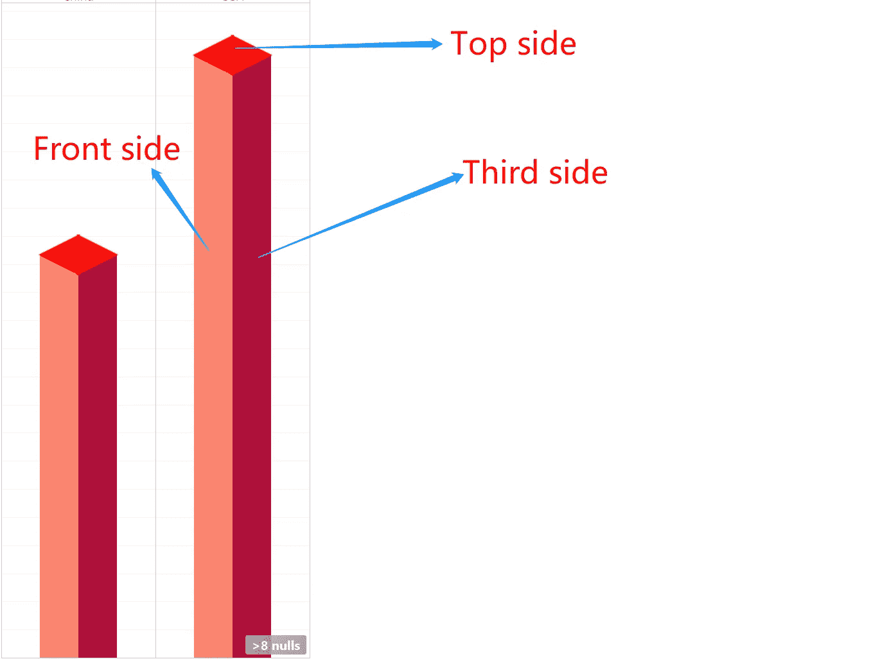
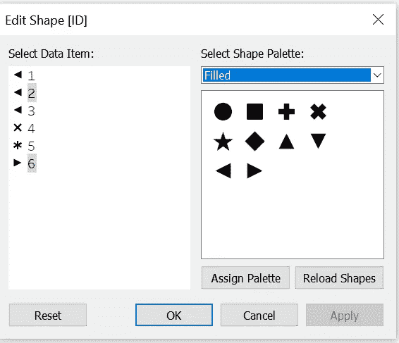
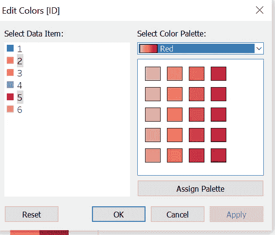
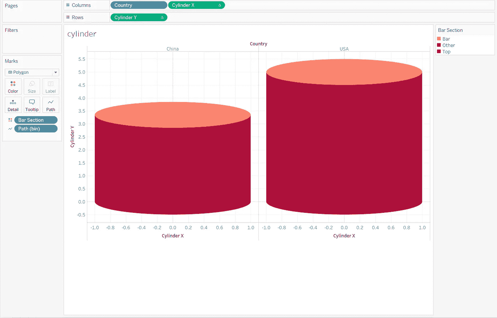

# 让您的仪表板脱颖而出—三维条形图

> 原文：<https://pub.towardsai.net/make-your-dashboard-stand-out-3d-bar-chart-e58cba848c0f?source=collection_archive---------1----------------------->


图片由 tableau.com 拍摄

## [数据可视化](https://towardsai.net/p/category/data-visualization)

## 打动你的客户和老板！

对我来说，Tableau 是唯一一种能让我像艺术家一样做数据科学的工具。然而，如果每个人都用 Tableau 做同样的可视化，那就没什么意思了。本文是我的系列文章“*让你的仪表盘脱颖而出*”中的一集，该系列文章为你提供了一些出色但非默认的可视化想法。如果你对我来说是新的，一定要看看下面的文章:

[](/make-your-dashboard-stand-out-sunshine-chart-7e6049d6b5a7) [## 让您的仪表盘脱颖而出—阳光图表

### 打动你的观众和老板！

pub.towardsai.net](/make-your-dashboard-stand-out-sunshine-chart-7e6049d6b5a7) [](/make-your-dashboard-stand-out-waffle-chart-70232488ebba) [## 让你的仪表板脱颖而出-华夫格图

### 打动你的客户和老板！

pub.towardsai.net](/make-your-dashboard-stand-out-waffle-chart-70232488ebba) [](/make-your-dashboard-stand-out-slope-chart-7b565a0bb35b) [## 让您的仪表盘脱颖而出—斜率图表

### 打动你的观众和老板！

pub.towardsai.net](/make-your-dashboard-stand-out-slope-chart-7b565a0bb35b) [](/make-your-dashboard-stand-out-dumbbell-chart-ae36d399e85) [## 让你的仪表盘脱颖而出——哑铃图表

### 让你的仪表盘脱颖而出——哑铃图表

让你的仪表盘脱颖而出——哑铃 Chartpub.towardsai.net](/make-your-dashboard-stand-out-dumbbell-chart-ae36d399e85) [](/make-your-dashboard-stand-out-radial-pie-guage-chart-482ecc7c80f8) [## 让您的仪表板脱颖而出—棒棒糖图表

### 打动你的客户和老板！

pub.towardsai.net](/make-your-dashboard-stand-out-radial-pie-guage-chart-482ecc7c80f8) 

(*未完待续*

在这篇文章的结尾，你将会享受到把简单的条形图转换成有趣的 3D 样式的乐趣。



图片来自[openclipbart-Vectors](https://pixabay.com/users/openclipart-vectors-30363/)上的 [pixabay](https://pixabay.com/vectors/chart-graph-columns-3d-diagram-152152/)

# 主意

Tableau 不支持内置的 3D 视觉效果。实际上，3D 可能不是展示信息图和吸引观众的好方法。这就是为什么一些 viz 大师会说 [3D 是字面上的反 Tableau](https://boraberan.wordpress.com/2015/12/18/going-3d-with-tableau/) 。

然而，没有什么能阻止我们娱乐自己。因此，在本文的下一部分，我将向您展示我如何使用 Tabeau 分别创建长方体图表和圆柱体图表。

# 履行

作为这种可视化的一个例子，我将展示 2020 年美国和中国的 GDP 总量。



数据来源:世界银行(图片来自 google.com)

## 长方体

现在让我们看看我们的最终造型:



作者图片

众所周知，3D 图形只是一组使用不同颜色/阴影的 2D 图像，以假装成一个实体。一般来说，我们的工作被认为是由 3 个不同颜色的主要部分组成，如上图所示。

为此，需要对数据集进行一些重组。以下是我的好去数据:

然后还有一些新的领域需要创造:

```
Cuboid X:
IIF([ID] = 1,1,
IIF([ID] = 2 OR [ID] = 3, 2,
IIF([ID] = 4, 4,
IIF([ID] = 5 OR [ID] = 6, 3, NULL))))Adjusted Amount Bar:
IIF([Bar Section] = 'Bar', [Amount], NULL)Adjusted Amount Top:
IIF([Bar Section] = 'Top', [Amount], NULL)
```

*长方体 X* 是定义各段水平位置的变量，而*调整量条*和*调整量顶*将用于定义顶段和条段的**标记类型**。

现在，这里是工作表构建:

1.  拖动*国家*和*长方体 X* 到**立柱**；
2.  将*调节量条*和*调节量条*拖动至**行**；
3.  允许双轴垂直，并使它们同步；
4.  在*调整后的可能性最高*下，将**标记类型**切换到**形状**，将 ID 字段放在形状标记卡上，并分配一个合适的形状，如下图:



你可以只注意第 3 和第 6 项。(图片由作者提供)

5.在*调整后的似然顶部*下，放大尺寸使两个三角形相互贴合，看起来像一个菱形。

6.在*调整似然条* **下，**将**标记类型**切换到**条**，将 ID 字段放在颜色标记卡上，并按照透视技术(由浅入深)添加您想要的颜色，使其生成 3D 外观。就我个人而言，我将坚持一种风格中的所有颜色，即红色、绿色。



你可以只注意第二和第五项。(图片由作者提供)

7.在*调整后的似然条* **下，**放大尺寸使两个矩形相互贴合。

如果一切顺利。这是你最终会看到的:


作者图片

## 圆筒

总的来说，两者的构造没有太大区别。最关键的部分是我们需要定义数据如何行进(路径)并利用三角函数。

首先，我们应该根据 id 的值创建一个字段:

```
Path:
IF DIV([ID], 4) = 0 THEN 1
ELSE 361 END
```

使用“路径”创建一个 bin，只需确保 bin 的大小为 1。

然后还需要一些其他字段:

```
Index:
INDEX() - 1TC_Value:
WINDOW_MAX(MAX([Amount]))TC_Max_Value:
WINDOW_MAX(MAX([Amount]))TC_Percentage:
[TC_Amount]/[TC_Max_Amount] TC_Type:
WINDOW_MAX(MAX([Bar Section]))Cylinder X:
COS(RADIANS([Index]))Cylinder Y:
IF [TC_Type] = "Bottom" THEN
    IF [Index] < 181 THEN
        SIN(RADIANS([Index]))/2*-1
    ELSE    
        SIN(RADIANS([Index]))/2+[TC_Percentage]*5
    END
ELSE
    SIN(RADIANS([Index]))/2+[TC_Percentage]*5
END
```

下面是构建工作表的过程:

1.  将**标记类型**改为**多边形**；

2.将**国家**拖动到**列**上；

3.拖动**国家**到**颜色**上；

4.将**路径(bin)** 拖到**路径**卡上；

5.将**气缸**X 拖动到**立柱**上；右击该对象，进入**计算使用，**并选择**路径(bin)**；

6.将**气缸** **Y** 拖动到**行**上，并执行以下操作:

*   右击该对象，进入**计算使用，**并选择**路径(bin)**；
*   右击该对象，选择**编辑表格计算**；
*   在**嵌套计算**中选择 **TC_Max_Value** 并转到**具体尺寸**；
*   勾选**国家**和**路径(bin)** 。

7.为每个元素分配合适的颜色，以便它们可以反映实体的色调。

当没有任何东西损坏时，希望这就是你能看到的:



作者图片

# 在我走之前…

我希望你喜欢被 3D 图表娱乐。如果你对我在这方面的实际成就感兴趣，请随意查看我在画廊的作品:

[https://public . tableau . com/views/3d barchart _ 16332076347860/长方体？:language = en-US&publish = yes&:display _ count = n&:origin = viz _ share _ link](https://public.tableau.com/views/3Dbarchart_16332076347860/cuboid?:language=en-US&publish=yes&:display_count=n&:origin=viz_share_link)

> 今天使用我的[邀请](https://anzhemeng.medium.com/membership)成为一名普通会员。那你就和我以及平台上千千万万更不平凡的作家一起敬请期待吧！