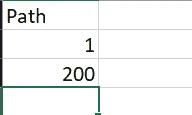
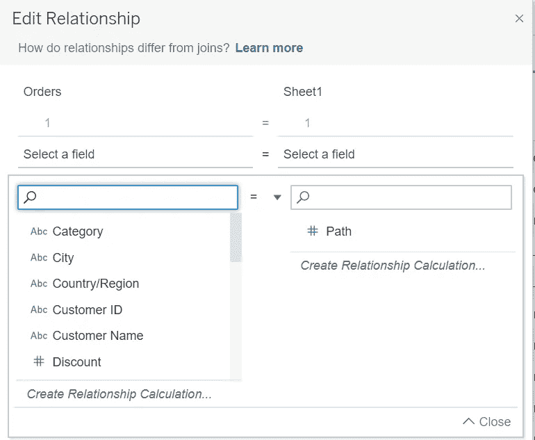
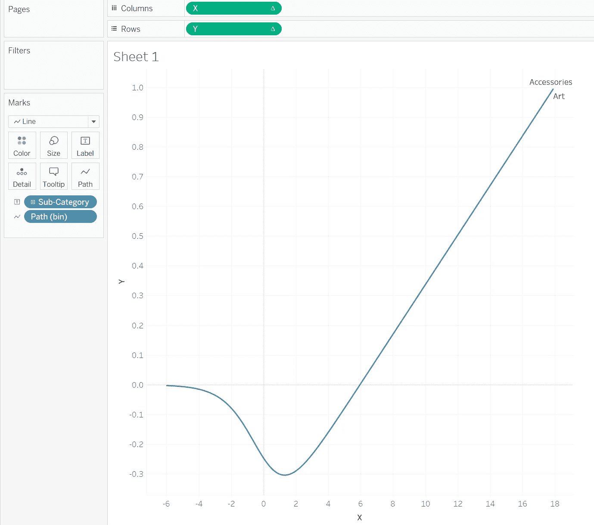
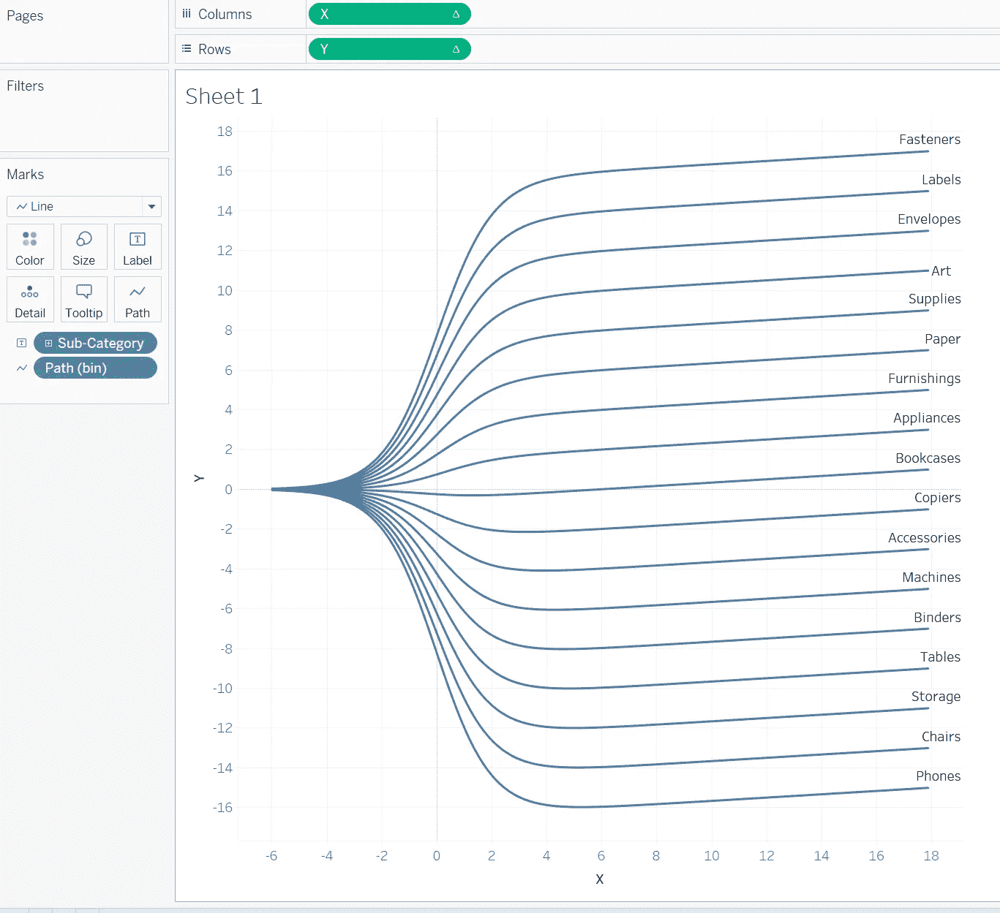
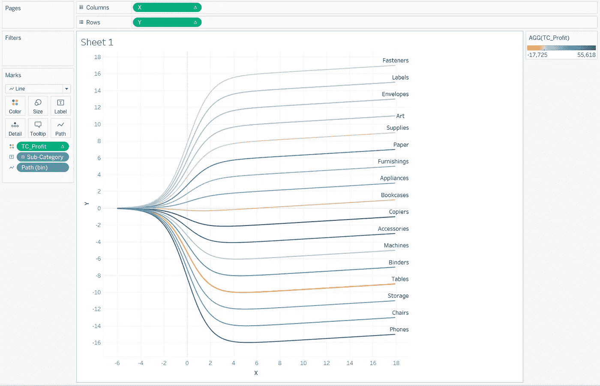
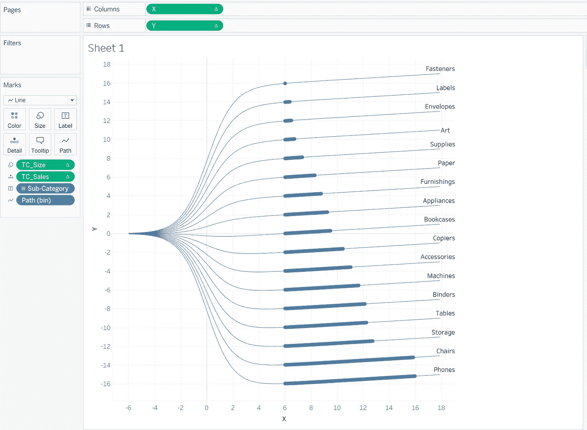
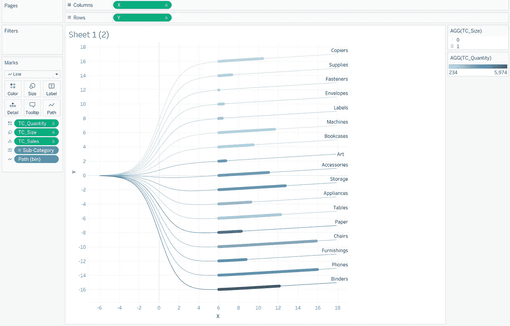

# 让您的仪表板脱颖而出—树状图

> 原文：<https://pub.towardsai.net/make-your-dashboard-stand-out-dendrogam-chart-13f4ca1cc39b?source=collection_archive---------1----------------------->


图片由 Tableau.com 拍摄

## [数据可视化](https://towardsai.net/p/category/data-visualization)

## 打动你的观众和老板！

对我来说，Tableau 是唯一一种能让我像艺术家一样做数据科学的工具。然而，如果每个人都用 Tableau 做同样的可视化，那就没什么意思了。这篇文章是我的系列文章“让你的仪表板脱颖而出”中的一集，该系列文章为你提供了一些精彩但非默认的可视化想法。如果你对我来说是新的，一定要看看下面的文章:

[](/make-your-dashboard-stand-out-3d-bar-chart-e58cba848c0f) [## 让您的仪表板脱颖而出—三维条形图

### 打动你的客户和老板！

pub.towardsai.net](/make-your-dashboard-stand-out-3d-bar-chart-e58cba848c0f) [](/make-your-dashboard-stand-out-sunshine-chart-7e6049d6b5a7) [## 让您的仪表盘脱颖而出—阳光图表

### 打动你的观众和老板！

pub.towardsai.net](/make-your-dashboard-stand-out-sunshine-chart-7e6049d6b5a7) [](/make-your-dashboard-stand-out-radial-pie-guage-chart-482ecc7c80f8) [## 让您的仪表板脱颖而出—棒棒糖图表

### 打动你的客户和老板！

pub.towardsai.net](/make-your-dashboard-stand-out-radial-pie-guage-chart-482ecc7c80f8) [](/make-your-dashboard-stand-out-radar-chart-34d0497eddb8) [## 让您的仪表盘脱颖而出—雷达图

### 打动你的观众和老板！

pub.towardsai.net](/make-your-dashboard-stand-out-radar-chart-34d0497eddb8) [](/make-your-dashboard-stand-out-fill-percentage-ball-chart-cd9484b4f37f) [## 让您的仪表板脱颖而出—填充百分比球图

### 打动你的观众和老板！

pub.towardsai.net](/make-your-dashboard-stand-out-fill-percentage-ball-chart-cd9484b4f37f) 

(*未完待续*

在这篇文章的最后，我会让你拥抱**树状图**的美丽！


照片由[扎克·赖纳](https://unsplash.com/@_zachreiner_?utm_source=unsplash&utm_medium=referral&utm_content=creditCopyText)在 [Unsplash](https://unsplash.com/s/photos/branch?utm_source=unsplash&utm_medium=referral&utm_content=creditCopyText) 上拍摄

# 想法

据 [**百科**](https://en.wikipedia.org/wiki/Dendrogram):*一张* ***树状图*** *是一张* [*图*](https://en.wikipedia.org/wiki/Diagram) *代表一棵* [*树*](https://en.wikipedia.org/wiki/Tree_(graph_theory)) 。“树状图”作为一个单词，最初是由两个希腊语单词 [δένδρον](https://en.wiktionary.org/wiki/%CE%B4%CE%AD%CE%BD%CE%B4%CF%81%CE%BF%CE%BD#Ancient_Greek) ( *德恩德隆*)，意为“树”，和[γράμμα](https://en.wiktionary.org/wiki/%CE%B3%CF%81%CE%AC%CE%BC%CE%BC%CE%B1#Ancient_Greek)(*gráMMA*)，意为“绘图，数学图形”(根据维基百科)。由于树图的性质，我们可以有把握地说，树状图是我们在 Tableau 中表示聚类层次的一种方式。

# **实现**

与之前的几篇文章一样，我们也将使用样本数据集— *Superstore* 进行演示，同时还应该添加一个项目。

我们需要创建一个电子表格文件(csv 或 xlsx，这是你的电话！)其中应该只有两个值的列“Path ”:



作者图片

然后在 Tableau 的数据源窗格中，您应该添加一个连接并选择您刚刚创建的文件。将文件的页面(通常称为“Sheet1 ”)拖到画布上。确保它与“订单”相关，您会注意到这种关系是无效的，因为根本没有公共列。

因此，您需要在面条的左侧和右侧创建一个关系计算，其中的值应该是 1。在这种情况下，您可能会认为这是一个完全联接，两个表中的所有行将相互联接。



作者图片

接下来，需要一些计算字段:

```
TC_Sales:
WINDOW_SUM(SUM([Sales]))/2TC_Total_Sales:
WINDOW_SUM(SUM([Sales]))/2TC_Percentage:
[TC_Sales]/[TC_Total_Sales]Adjusted_TC_Percentage:
[TC_Percentage]/WINDOW_MAX([TC_Percentage])TC_Rank:
RANK_UNIQUE([TC_Sales],"desc")X:
((INDEX()-1)*0.12)-6TC_Sigmoid:
1/(1+EXP(-[X]))Y:
[TC_Sigmoid]*([TC_Rank]-(WINDOW_MAX([TC_Rank])+1)/2)/100TC_Size:
IF [X] >=6 AND [X] <= 6+(10*[Adjusted_TC_Percentage]) THEN 
    1
ELSE
    0
ENDTC_Quantity:
WINDOW_SUM(SUM([Quantity])) / 2
```

现在让我们配置工作表。

1.  使用**路径**创建一个 bin 字段，并使 bin 宽度= 1；
2.  将**标志类型**改为**线；**
3.  将**子类**拖动到**标签标记上；**
4.  启用**路径(bin)** 到*显示缺失值*并拖动到**明细**；
5.  将 **X** 拖到**立柱架**上；右击该药丸，进入**计算使用，**选择**路径(bin)**；
6.  将 **Y** 拖到**排货架**上；右击该药丸，进入**计算使用，**并选择**路径(bin)** 。

这是你现在应该做的:



作者图片

要改变图表的外观，我们应该坚持这样做:

1.  右键点击 **Y 药丸**并选择**编辑表格计算**:

*   在**嵌套计算**中选择 **Y** ，同时选择**路径(bin)** 和**子类别**在**具体尺寸**下，拖动子类别到**路径(bin)的顶部。**
*   在**嵌套计算**中选择 **TC_Rank** ，同时选择**路径(bin)** 和**具体尺寸**下的**子类别**，将子类别拖动到**路径(bin)的顶部。**



作者图片

你有一个完整的树状图了！

# 改进

美化树状图有很多创造性的方法。在这一节中，我总结了 4 个这样做的想法。

## 颜色形状

我们可以指定颜色阴影来表示一个特征的多少。例如，我将看到每个子类别使用不同的颜色获得了多少利润。我需要做的就是创建一个名为 *TC_Profit* 的字段(请参考 *TC_Sales* 或者 *TC_Quantity* )。拖动到**色标**，切换到使用**路径(bin)** 计算，你会看到分支的不同。



作者图片

## 大小

同样，前面的方法也适用于**尺寸**。在下面的图表中，我使用了同样的方法，让 size 代表每个子类别中商品的销售数量。


作者图片

长度

我们还可以在分叉后定义每个流的长度。为此，只需遵循以下步骤:

1.  拖动 **TC_Size** 到**尺寸标记**上，右键点击该药丸，进入**计算使用，**选择**路径(bin)**；
2.  右键点击 **TC_Size 药丸**，选择**编辑表格计算**:

*   在**嵌套计算**中选择 **TC_Total_Sales** ，同时选择**具体维度**下的**路径(bin)** 和**子类别**，将子类别拖动到**路径(bin)的顶部。**
*   在**嵌套计算**中选择**Adjusted _ TC _ per%**



作者图片

## 等级/位置

在 **TC_Rank** 的定义中，我们按照销售额降序排列数据行。实际上，排序方式和列完全可以定制，所以你可以考虑用这种方式在一个图中包含更多的信息。

## 最终作品

在最终的树状图中，我设法将所有不同子类别的销售额、折扣和数量包含在一个工作表中，它们分别由长度、等级和颜色阴影表示。



作者图片

# 在我走之前…

我真的很喜欢创造这个有趣的场景。所以如果你有更好的想法，请在评论中告诉我，让我们一起成为数据 Viz 大师！

在这里查看我的最终作品:[https://public . tableau . com/app/profile/Memphis 4346/viz/Dendrogram _ 16338997539670/Dendrogram？发布=是](https://public.tableau.com/app/profile/memphis4346/viz/Dendrogram_16338997539670/Dendrogram?publish=yes)

> 今天使用我的[邀请](https://anzhemeng.medium.com/membership)成为一名普通会员。那你就和我以及平台上千千万万更不平凡的作家一起敬请期待吧！