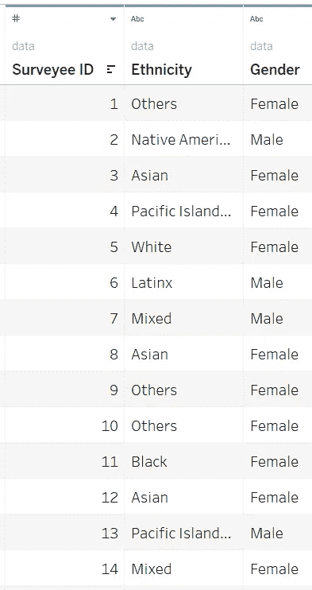
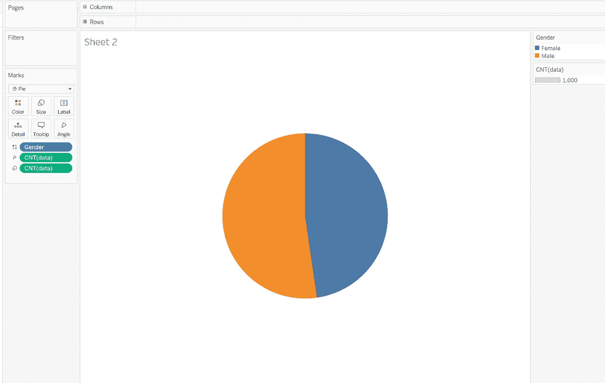
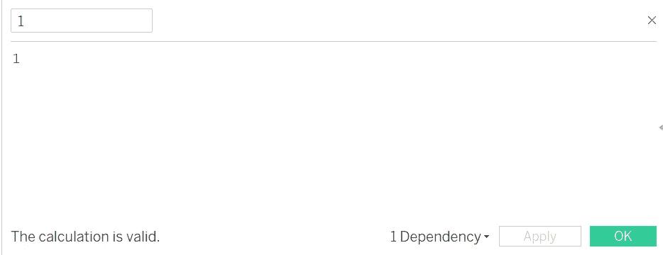
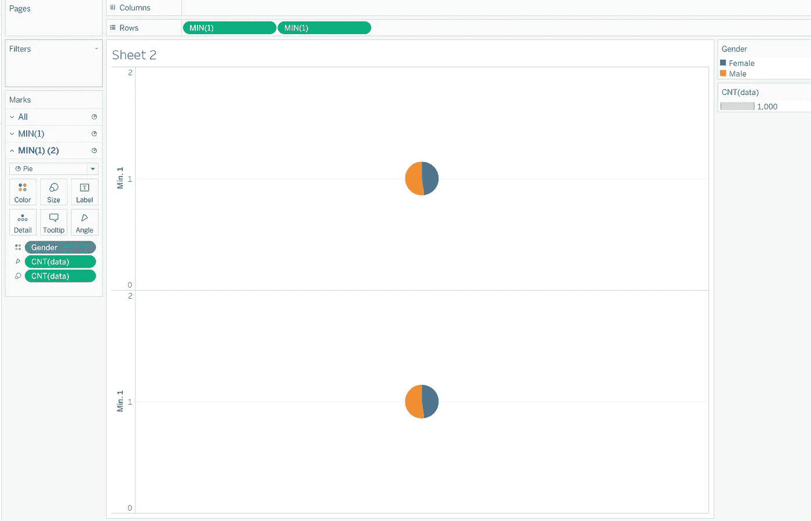
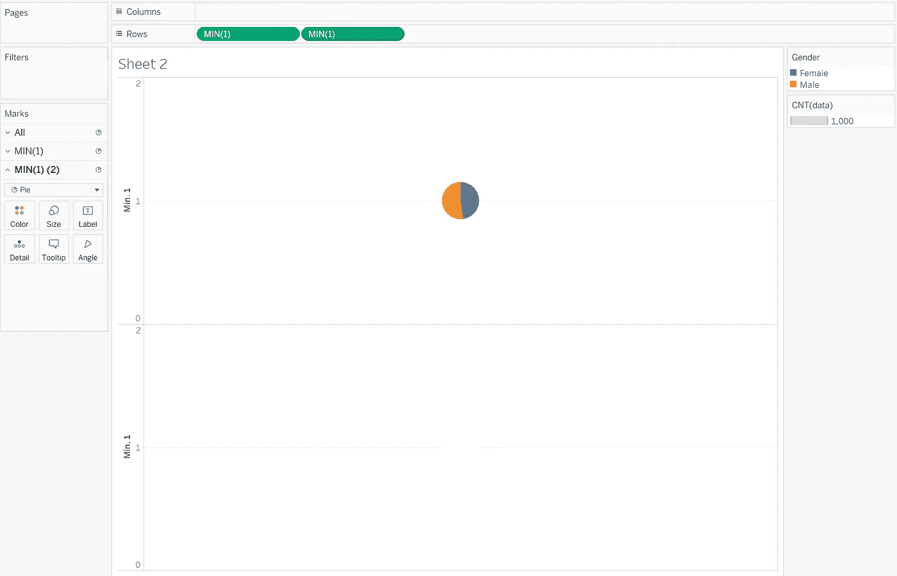
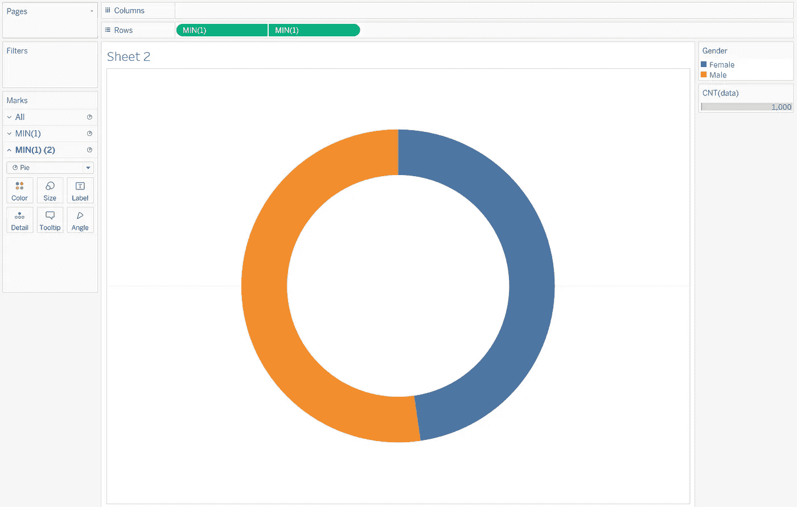

# 让您的仪表板脱颖而出-圆环图

> 原文：<https://pub.towardsai.net/make-your-dashboard-stand-out-donut-chart-bdfa82c25be?source=collection_archive---------2----------------------->

图片来自 Tableau.com

## [数据可视化](https://towardsai.net/p/category/data-visualization)

## 打动你的客户和老板！

对我来说，Tableau 是唯一一种允许我作为艺术家进行数据科学研究的工具。然而，如果每个人都用 Tableau 做同样的可视化，那就没什么意思了。本文是我的系列文章“*让你的仪表盘脱颖而出*”中的一集，该系列文章为你提供了一些出色但非默认的可视化想法。如果你对我来说是新的，一定要看看下面的文章:

 [## 让您的仪表盘脱颖而出— Word Cloud

### 打动你的观众和老板！

pub.towardsai.net](/make-your-dashboard-stand-out-word-cloud-8426255df94a)  [## 让您的仪表板脱颖而出-虚线进度图

### 用一种创造性的选择打动你的观众！

pub.towardsai.net](/make-your-dashboard-stand-out-dotted-progress-chart-69b6a064a7d4)  [## 让您的仪表板脱颖而出—平铺地图

### 让您的仪表板脱颖而出—平铺地图

让您的仪表板脱颖而出—瓷砖 Mappub.towardsai.net](/make-your-dashboard-stand-out-tile-map-e5d0b19387e8)  [## 让你的仪表盘脱颖而出——哑铃图表

### 让你的仪表盘脱颖而出——哑铃图表

让你的仪表盘脱颖而出——哑铃 Chartpub.towardsai.net](/make-your-dashboard-stand-out-dumbbell-chart-ae36d399e85)  [## 让您的仪表板脱颖而出—桑基图

pub.towardsai.net](/make-your-dashboard-stand-out-sankey-diagram-c2ead0201aa6) 

(*未完待续*

在这篇文章中，我希望你不会感到饥饿，因为我将介绍**甜甜圈图**。

照片由[爱丽丝·帕斯夸尔](https://unsplash.com/@stri_khedonia?utm_source=unsplash&utm_medium=referral&utm_content=creditCopyText)在 [Unsplash](https://unsplash.com/s/photos/donut-chart?utm_source=unsplash&utm_medium=referral&utm_content=creditCopyText) 上拍摄

# 主意

圆环图是饼图的一种常用变体。他们都使用扇形的角度/大小来对应他们各自在整体中的比例，而环形图的中心部分故意留空。

你可能想知道空白的意义，事实是，有了空白，你可以创建一个更有信息的图表，因为你可以在里面放入任何信息。

# 履行

假设我们要说明一个地区的男性/女性的划分。下面是我们的原始数据集的样子:

作者图片

我们可以先创建一个饼图来开始。所以只要把“性别”和“数据(计数)”分别拖放到列和行中，在“*演示*”中选择饼状图格式，就可以拥有了。

作者图片

现在是时候弄清楚内部循环了。图像空白部分是覆盖当前饼图的白色圆圈，为此，我们需要一个名为“1”的虚拟计算字段。

作者图片

使用它，我们能够在一个工作簿中创建两个饼图。因此，现在我们需要将该计算字段拖放到该行两次，确保 2 粒药丸都聚集在最小的**中**。

作者图片

其中一张看起来应该是白色的，所以你应该把第二张卡片上的所有东西都拖出来。另外，选择颜色白色，调整尺寸小于上图(也可以以后再做)。

作者图片

如果你关注这个系列足够长的时间，我想你一定知道剩下的是什么:**双轴**和可视化的组合。

作者图片

正如我提到的，圆环图比饼图更有优势，因为它允许创建者将信息放在圆圈内。我个人更倾向于简单的论证两组的总量，如果有更好的想法，在评论里告诉我！

注意标签是由 CNT(数据)起作用的(图片由作者提供)

# 在我走之前…

饿吗？我打赌你是！如果你确定，就去我的 Tableau 公共画廊看看我的作品(链接在下面)。现在是你成为厨师，制作你自己的油炸圈饼的时候了！

[https://public . tableau . com/app/profile/Memphis 4346/viz/DonutChart _ 16273593201290/sheet 2？发布=是](https://public.tableau.com/app/profile/memphis4346/viz/DonutChart_16273593201290/Sheet2?publish=yes)