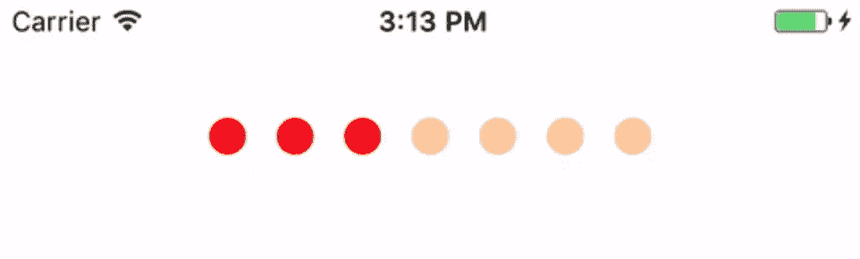
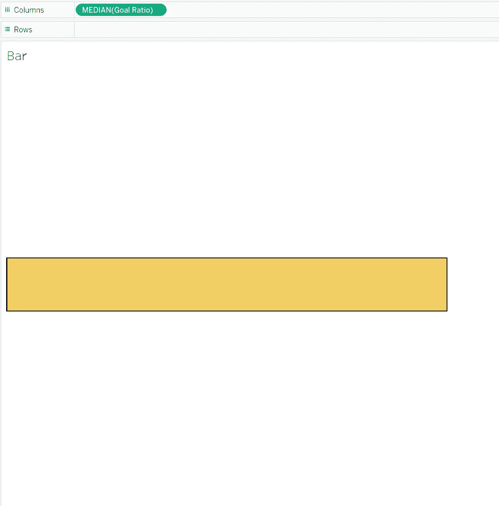
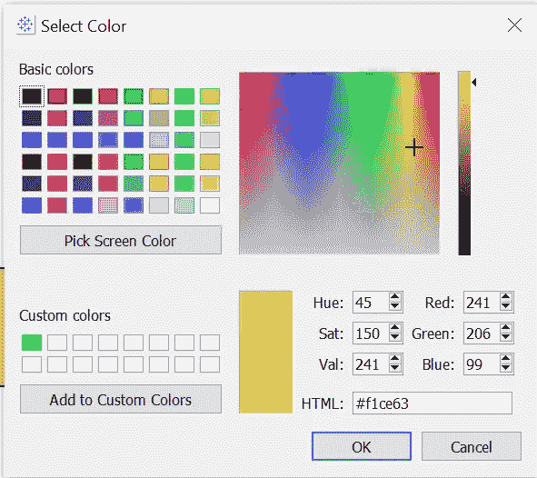
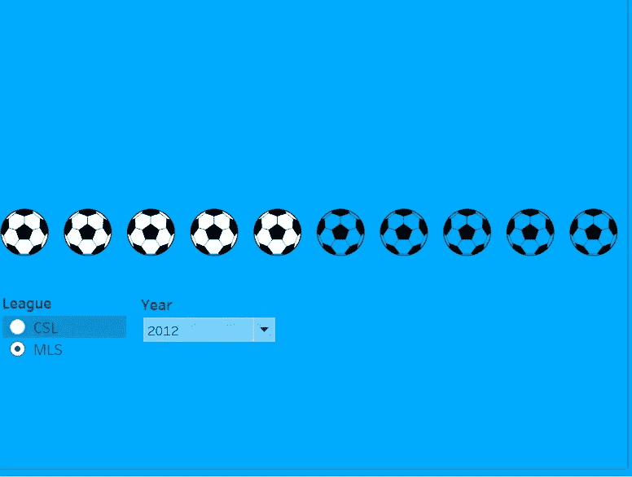

# 让您的仪表板脱颖而出-虚线进度图

> 原文：<https://pub.towardsai.net/make-your-dashboard-stand-out-dotted-progress-chart-69b6a064a7d4?source=collection_archive---------2----------------------->

图片由 Tableau.com 拍摄

## [数据可视化](https://towardsai.net/p/category/data-visualization)

## 打动你的客户和老板！

对我来说，Tableau 是唯一一种允许我作为艺术家进行数据科学研究的工具。然而，如果每个人都用 Tableau 做同样的可视化，那就没什么意思了。这篇文章是我的系列文章“让你的仪表板脱颖而出”中的一集，该系列文章为你提供了一些精彩但非默认的可视化想法。如果你对我来说是新的，一定要看看下面的文章:

 [## 让你的仪表板脱颖而出-华夫格图

### 打动你的客户和老板！

pub.towardsai.net](/make-your-dashboard-stand-out-waffle-chart-70232488ebba)  [## 让您的仪表板脱颖而出—平铺地图

### 让您的仪表板脱颖而出—平铺地图

让您的仪表板脱颖而出—瓷砖 Mappub.towardsai.net](/make-your-dashboard-stand-out-tile-map-e5d0b19387e8)  [## 让您的仪表板脱颖而出—填充百分比球图

### 打动你的观众和老板！

anzhemeng.medium.com](https://anzhemeng.medium.com/make-your-dashboard-stand-out-fill-percentage-ball-chart-cd9484b4f37f)  [## 让你的仪表盘脱颖而出——哑铃图表

### 让你的仪表盘脱颖而出——哑铃图表

让你的仪表盘脱颖而出——哑铃 Chartpub.towardsai.net](/make-your-dashboard-stand-out-dumbbell-chart-ae36d399e85) 

(*未完待续*

在这篇文章中，我将向你展示另一种显示百分比数据的方法:**虚线进度条**。

图片来自[尼古拉·科里亚](https://www.cocoacontrols.com/authors/nikola9core)

# 主意

让我们看看上面的图像，7 个点中有 3 个是红色的，而其余的不是。所以读者很容易理解，这个图表代表着某样东西占了整体的 3/7。事实上，我们可以认为这是一个红色的水平条形图，代表 3/7，不知何故被屏蔽了，分成三部分，看起来像三个点。考虑到这一点，我们可以简单地将这个问题分解为 2 个步骤:创建一个条形图和构建覆盖图。

# **条形图**

显示一个条形图并不困难，你需要注意的是，现在你需要通过选择某种颜色来确保彩色点具有你想要的颜色。请注意，您应该将测量放在“列”遮蔽物上，使其水平。

作者图片

# 覆盖物

假设我们要在上图所示的条形图上重叠一些东西，使它看起来像一个点状图。首先，叠加应该有*透明的*圆圈，使点出现。此外，覆盖层的颜色应该与背景相同。在 Tableau 中，你可以随时点击色卡上的“更多颜色”，复制某种颜色的 HTML 代码，并将其粘贴到你的照片修改软件中，以确保两者看起来没有什么不同。

色卡上的“更多颜色”选项(图片由作者提供)

我用来使条形图看起来像点的遮罩。我还为他们制作了足球，因为我的最新项目与足球分析有关。(图片由作者提供)

# 最终作品

作者图片

看起来很酷，对吧？现在你可以更好地展示你的条形图结果了。希望你能打动你的观众！

具体可以查看我的公共[图库](https://public.tableau.com/profile/memphis4346#!/vizhome/DottedBarChart/Dashboard1?publish=yes)。

 [## Tableau 公共

### 编辑描述

public.tableau.com](https://public.tableau.com/profile/memphis4346#!/vizhome/DottedBarChart/Dashboard1?publish=yes) 

享受数据可视化！