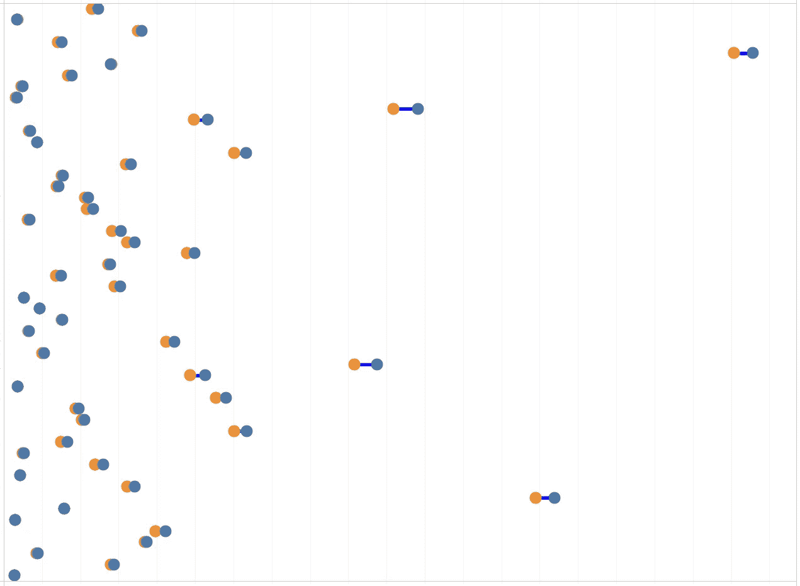
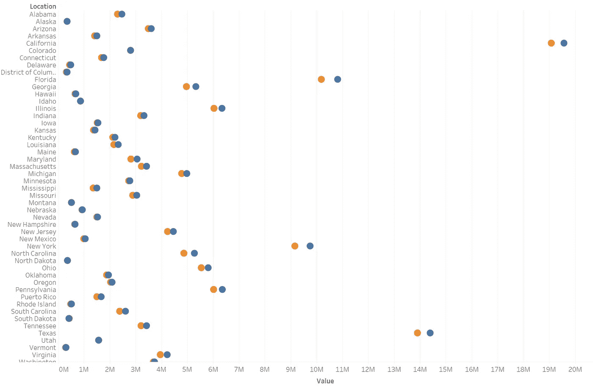
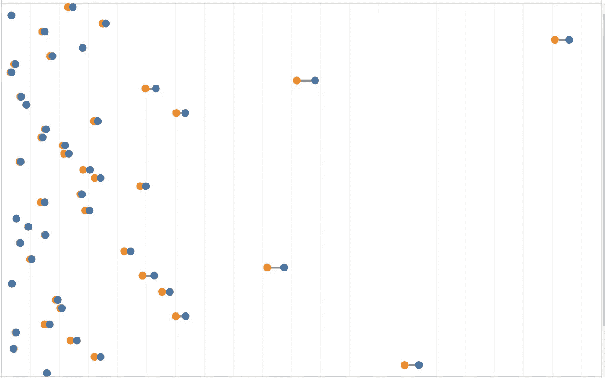
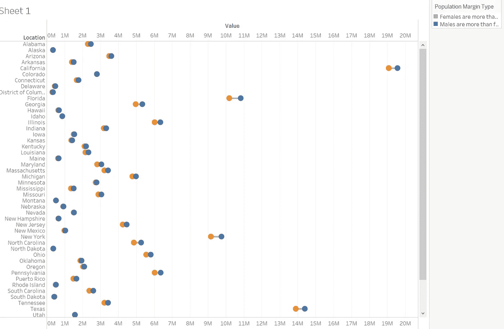
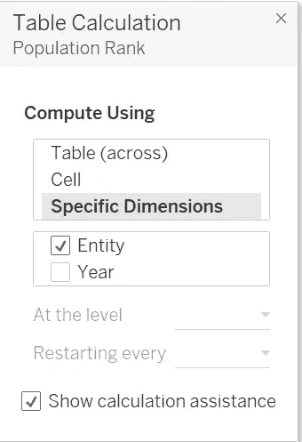
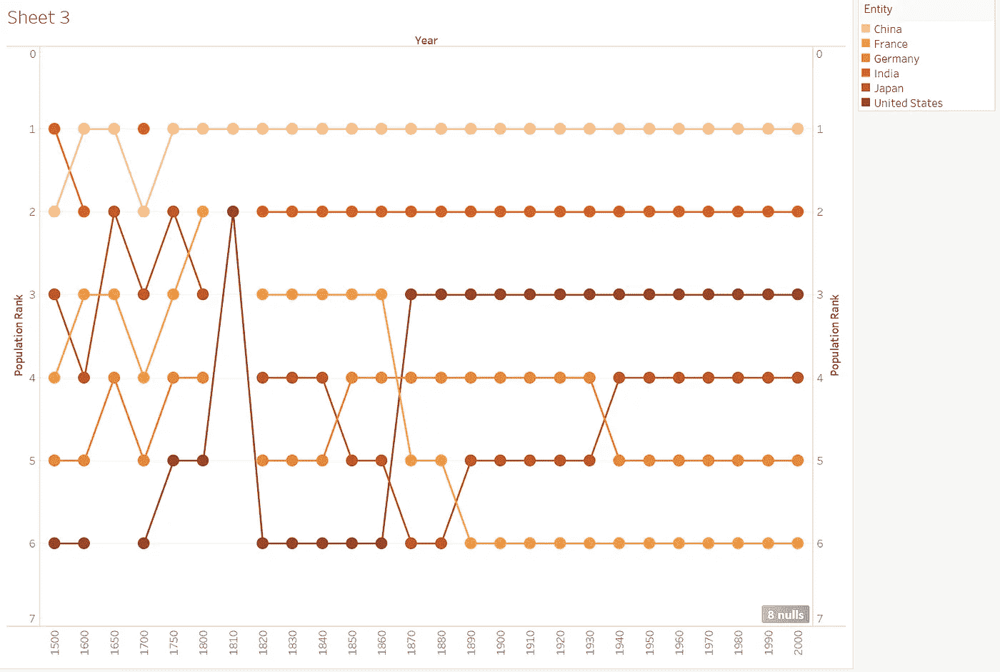

# 让你的仪表盘脱颖而出——哑铃图表

> 原文：<https://pub.towardsai.net/make-your-dashboard-stand-out-dumbbell-chart-ae36d399e85?source=collection_archive---------3----------------------->


图片由 tableau.com 拍摄

## [数据可视化](https://towardsai.net/p/category/data-visualization)

## 打动你的观众和老板！

对我来说，Tableau 是唯一一种允许我作为艺术家进行数据科学研究的工具。然而，如果每个人都用 Tableau 做同样的可视化，那就没什么意思了。这篇文章是我的系列文章“让你的仪表板脱颖而出”中的一集，该系列文章为你提供了一些精彩但非默认的可视化想法。如果你对我来说是新的，一定要看看下面的文章:

[](/make-your-dashboard-stand-out-fill-percentage-ball-chart-cd9484b4f37f) [## 让您的仪表板脱颖而出—填充百分比球图

### 打动你的观众和老板！

pub.towardsai.net](/make-your-dashboard-stand-out-fill-percentage-ball-chart-cd9484b4f37f) [](/make-your-dashboard-stand-out-dotted-progress-chart-69b6a064a7d4) [## 让您的仪表板脱颖而出-虚线进度图

### 用一种创造性的选择打动你的观众！

pub.towardsai.net](/make-your-dashboard-stand-out-dotted-progress-chart-69b6a064a7d4) [](/make-your-dashboard-stand-out-tile-map-e5d0b19387e8) [## 让您的仪表板脱颖而出—平铺地图

### 让您的仪表板脱颖而出—平铺地图

让您的仪表板脱颖而出—瓷砖 Mappub.towardsai.net](/make-your-dashboard-stand-out-tile-map-e5d0b19387e8) [](/make-your-dashboard-stand-out-waffle-chart-70232488ebba) [## 让你的仪表板脱颖而出-华夫格图

### 打动你的客户和老板！

pub.towardsai.net](/make-your-dashboard-stand-out-waffle-chart-70232488ebba) 

(*未完待续*

在这篇文章中，我将向您展示一个理想的选项来说明分类/二进制数据之间的比较— **哑铃图**。

GIF By [MightyMike](https://giphy.com/TeamTO/)

# 主意

很容易推断出它的名字来自哪里；如果没有，就想象下面的图表是由一堆堆叠着重量铃的棍子合成的。



作者图片

从形态上看，“钟”可以看作是 Tableau 中的圆圈标记，而“棒”则是路径。所以对于细节，我们开始吧！

# 履行

首先，我将展示全国性别人口的数字差距，这是数据源的样子:

首先，我将“Location”维度和“Measure Values”维度拖放到行层和列层。因为将要显示的只是男性和女性的数量，所以除了“总和(男性)”和“总和(女性)”之外的任何其他维度都应该从卡片中去掉。

接下来，将标记的形状从“自动”转换为“圆形”。此时你可能会考虑放大蛋蛋。然后将“测量名称”从**细节**拖至**颜色**。



作者图片

至此，哑铃部分完成。虽然看起来这么直观，但是实现棒子部分就没那么容易了。由于合成图的性质，双轴技术是必要的。为此，我再次拖动"测量值"到架子上，使其轴双重化并与第一组同步。在**标记**卡片中，将其中一张**标记**卡片(除了**所有**)中的标记样式从“循环”切换到“线条”，并将相应卡片中的“测量名称”从“颜色”拖动到“路径”。现在是时候让你看到完整的哑铃了。



作者图片

# 预先的

如果我们只能想出一个选择，那就没有意思了！在这个图表上，一个简单但令人印象深刻的改进是突出显示与两个实体的关系相对应的棒的颜色。例如，如果在一个状态下，女性的数量大于男性，那么用红色显示该棒；否则(虽然在美国似乎不存在)，用另一种颜色显示。

关键是我们应该有一个计算字段来比较每个州两种性别的人口。公式如下:

```
IF {FIXED [Location] : SUM([Female])} > 
{FIXED [Location] : SUM([Male])} 
THEN “Females are more than males”
ELSE “Males are more than females” END
```

我们姑且称这个领域为“人口边际型”。将该字段拖动到卡片的**标记颜色**处，其中数据的样式用线条表示。因为在美国，男人不太可能比女人多，所以你可以给这种类型分配一种更醒目的颜色，而给对应的颜色分配一种不太明显的颜色(如灰色)。



作者图片

Dumbell 图表的另一个变体可以用来反映排名的变化。我以几个世纪以来一些国家的人口为例。我想要的是他们在人口方面的排名，而不是简单的价值，在这段时间里发生了什么变化。让我们看一下数据:

为了简化问题，我只考虑了一些目前人口最多的国家，包括中国、印度、美国、法国、德国和日本，从 1500 年到 2000 年。现在，创建一个新的计算字段，根据人口统计数据对国家进行排名:

```
RANK_UNIQUE(SUM([Population by Country]), 'desc')
```

确保“年”是离散的，并将其放入**栏**架中。将我们刚刚创建的字段(我们称之为“人口排名”)拖放到**行**中。有可能该字段自动由任何形状表示；如果不循环，转换到它。此外，将“实体”或“代码”拖放到**标记-颜色**。

请注意，您需要在此编辑针对**人口等级**的表格计算。原因是该字段不分年份对所有国家人口进行排名，而我们应该对不同世纪的人口进行排名。它的地址是右击**排**架上的**人口等级**药丸。选择“编辑表格计算”。当弹出选择窗口时，使其能够使用特定维度进行计算，该维度需要是“实体”或“代码”。



确保你按照实体而不是年份来排列人口(图片由作者提供)

将另一个**人口等级**药丸拖到**排**架子上，重复最后一段的全部步骤。还是那句话，需要双轴。垂直轴同步反转后，将任一**标记卡**的标记形状由循环转换为直线。

到目前为止，你一定能看到一个很棒的图表，上面有一些锯齿形的哑铃。我承认它看起来很像用符号装饰的折线图，但它们之间最大的区别是，非水平哑铃图的垂直范围是固定的，从 1 到唯一实体的总数，而折线图的垂直范围通常不是固定的。因此，这样的图表将非常有助于分析师形象化某个事物排名的动态变化(虽然大部分是时间，但尝试其他的如状态、类别、*等也无妨。*)。



作者图片

# 在我走之前…

谢谢你坚持到这里！你的耐心阅读是对我最大的鼓励！如果你对我的原创作品感兴趣，去看看我的[公众画廊](https://public.tableau.com/profile/memphis4346#!/vizhome/DumbbellChart_16199172245490/Peak?publish=yes)！

 [## Tableau 公共

### 编辑描述

public.tableau.com](https://public.tableau.com/profile/memphis4346#!/vizhome/DumbbellChart_16199172245490/Peak)