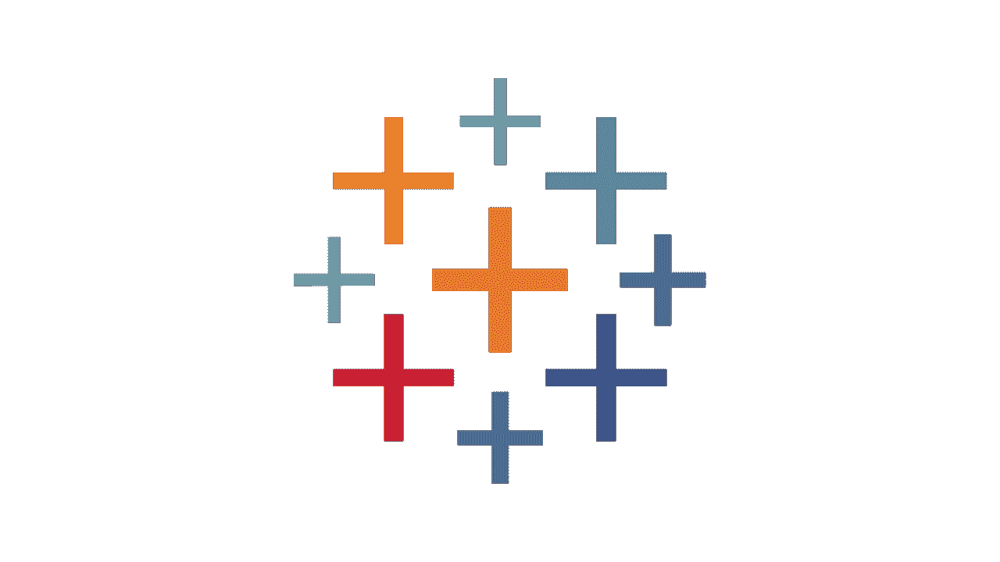
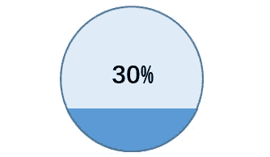
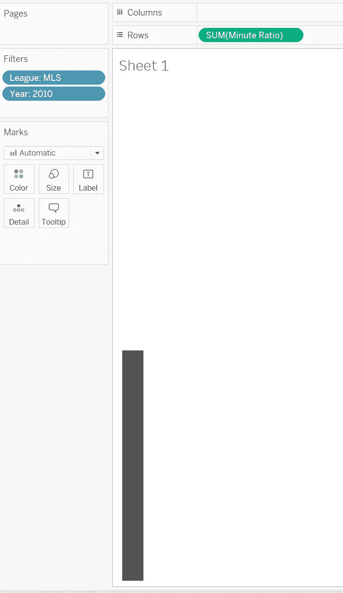
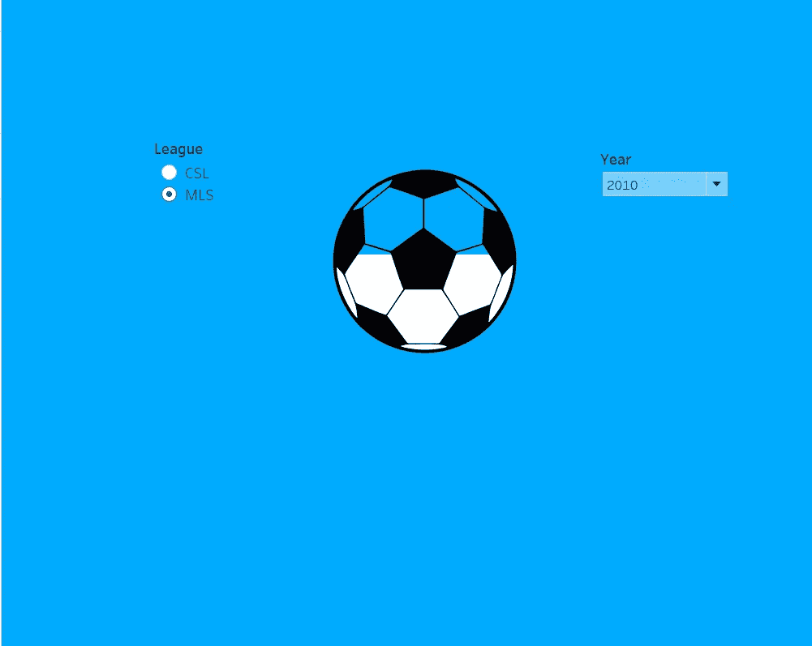

# 让您的仪表板脱颖而出—填充百分比球图

> 原文：<https://pub.towardsai.net/make-your-dashboard-stand-out-fill-percentage-ball-chart-cd9484b4f37f?source=collection_archive---------3----------------------->

图片由 tableau.com 拍摄

## [数据可视化](https://towardsai.net/p/category/data-visualization)

## 打动你的观众和老板！

对我来说，Tableau 是唯一一种允许我作为艺术家进行数据科学研究的工具。然而，如果每个人都用 Tableau 做同样的可视化，那就没什么意思了。这篇文章是我的系列文章“让你的仪表板脱颖而出”中的一集，该系列文章为你提供了一些精彩但非默认的可视化想法。如果你对我来说是新的，一定要看看下面的文章:

 [## 让你的仪表板脱颖而出-华夫格图

### 打动你的客户和老板！

pub.towardsai.net](/make-your-dashboard-stand-out-waffle-chart-70232488ebba)  [## 让您的仪表板脱颖而出—平铺地图

### 让您的仪表板脱颖而出—平铺地图

让您的仪表板脱颖而出—瓷砖 Mappub.towardsai.net](/make-your-dashboard-stand-out-tile-map-e5d0b19387e8)  [## 让您的仪表板脱颖而出-虚线进度图

### 用一种创造性的选择打动你的观众！

pub.towardsai.net](/make-your-dashboard-stand-out-dotted-progress-chart-69b6a064a7d4)  [## 让你的仪表盘脱颖而出——哑铃图表

### 让你的仪表盘脱颖而出——哑铃图表

让你的仪表盘脱颖而出——哑铃 Chartpub.towardsai.net](/make-your-dashboard-stand-out-dumbbell-chart-ae36d399e85) 

(*未完待续*

在这篇文章中，我将采用一种新的方式来描述完成情况:**填充百分比球图**！

图片由[https://www . extend office . com/excel/excel-charts/excel-percentage-ball-chart . html](https://www.extendoffice.com/excel/excel-charts/excel-percentage-ball-chart.html)

# 主意

如果你关注了我的[上一篇文章](/make-your-dashboard-stand-out-dotted-progress-chart-69b6a064a7d4)，你会看到类似于进度点的百分比球图。

 [## 让您的仪表板脱颖而出-虚线进度图

### 用一种创造性的选择打动你的观众！

pub.towardsai.net](/make-your-dashboard-stand-out-dotted-progress-chart-69b6a064a7d4) 

基本上，我们可以认为它是一个由透明球图像叠加而成的条形图。然后，它可以解释为两个步骤:创建一个条形图和建立一个球的形象。

# 条形图

显示一个条形图并不困难，你需要知道的是，你需要通过选择某种颜色来确保球有你想要的颜色。

作者图片

# 覆盖物

同样，我们需要一个图像，其中的项目是透明的，而背景是固体。老实说，照片版不在我的技能范围内，我所做的是向一个了解它的朋友寻求帮助。对不起我的观众！希望你们都有我这样的朋友。

图片由作者提供(白色面板保持透明，以便可以看到酒吧的高度。确保背景与您的仪表板格式相同)

# 最终作品

作者图片

霍雷。我们又成功了！现在，我猜你有了另一个装饰你的条形图的解决方案！是时候做一些令人印象深刻的 vizzes 了！

详情请查看我的[图库](https://public.tableau.com/profile/memphis4346#!/vizhome/FillPercentageBallChart/Dashboard1):

 [## Tableau 公共

### 编辑描述

public.tableau.com](https://public.tableau.com/profile/memphis4346#!/vizhome/FillPercentageBallChart/Dashboard1)