# 让您的仪表板脱颖而出—李克特图表(第 1 部分)

> 原文：<https://pub.towardsai.net/make-your-dashboard-stand-out-likert-chart-part-1-f8613f204c1a?source=collection_archive---------1----------------------->


图片由 Tableau.com 拍摄

## [数据可视化](https://towardsai.net/p/category/data-visualization)

## 打动你的观众和老板！

对我来说，Tableau 是唯一一种能让我像艺术家一样做数据科学的工具。然而，如果每个人都用 Tableau 做同样的可视化，那就没什么意思了。这篇文章是我的系列文章“让你的仪表板脱颖而出”中的一集，该系列文章为你提供了一些精彩但非默认的可视化想法。如果你对我来说是新的，一定要看看下面的文章:

[](/make-your-dashboard-stand-out-slope-chart-7b565a0bb35b) [## 让您的仪表盘脱颖而出—斜率图表

### 打动你的观众和老板！

pub.towardsai.net](/make-your-dashboard-stand-out-slope-chart-7b565a0bb35b) [](/make-your-dashboard-stand-out-dumbbell-chart-ae36d399e85) [## 让你的仪表盘脱颖而出——哑铃图表

### 让你的仪表盘脱颖而出——哑铃图表

让你的仪表盘脱颖而出——哑铃 Chartpub.towardsai.net](/make-your-dashboard-stand-out-dumbbell-chart-ae36d399e85) [](/make-your-dashboard-stand-out-waffle-chart-70232488ebba) [## 让你的仪表板脱颖而出-华夫格图

### 打动你的客户和老板！

pub.towardsai.net](/make-your-dashboard-stand-out-waffle-chart-70232488ebba) [](/make-your-dashboard-stand-out-sankey-diagram-c2ead0201aa6) [## 让您的仪表板脱颖而出—桑基图

pub.towardsai.net](/make-your-dashboard-stand-out-sankey-diagram-c2ead0201aa6) [](/make-your-dashboard-stand-out-fill-percentage-ball-chart-cd9484b4f37f) [## 让您的仪表板脱颖而出—填充百分比球图

### 打动你的观众和老板！

pub.towardsai.net](/make-your-dashboard-stand-out-fill-percentage-ball-chart-cd9484b4f37f) 

(*未完待续*

在本帖中，我要介绍一个折线图的变量:**李克特图**。


照片由[Raul santín](https://unsplash.com/@rsantin?utm_source=unsplash&utm_medium=referral&utm_content=creditCopyText)在 [Unsplash](https://unsplash.com/s/photos/spectrum?utm_source=unsplash&utm_medium=referral&utm_content=creditCopyText) 上拍摄

# 主意

你可能不熟悉李克特图表，但我相信你一定听说过或使用过调查。当你在做调查问卷时，最常见的问题形式之一是单选量表，它是为被调查者设计的，用来衡量他们对某事的态度。这被称为李克特量表。根据[维基百科](https://en.wikipedia.org/wiki/Likert_scale)，李克特量表*是一种心理测量量表，通常用于采用问卷调查的研究中，也是调查研究中最广泛使用的测量回答的方法。*

回到李克特图表，就我而言，这是任何李克特量表调查结果的一种可视化。你也许能说出许多简单的方法来说明它，如饼图、条形图或折线图。但它们都有某种程度的不足。例如，饼状图对于显示一个以上问题的结果没有用，而条形图会使 viz 过于繁忙。只有在不同时间做的相同的题目时，才可能使用折线图。

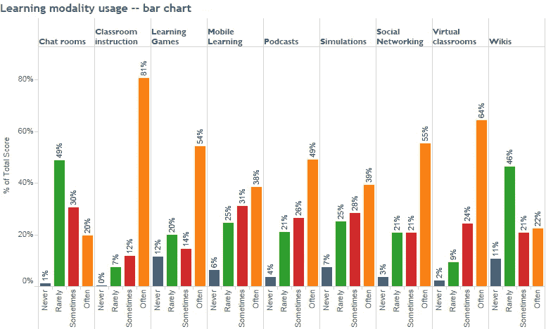

不是一次成功的试验，你能在不把头向左倾斜的情况下阅读底部轴上的项目吗？(图片来源:[https://www . tableau . com/about/blog/2016/1/how-visualize-情操-倾向-48534](https://www.tableau.com/about/blog/2016/1/how-visualize-sentiment-and-inclination-48534) )

与上面提到的三个不同，李克特图表是丰富多彩的，但不是忙碌的丰富多彩，它足够强大，可以应用于时间相关的场景和非时间相关的场景。它被认为是一组堆叠的条形图，显示了不同选项的频谱，但合成的本质是使附加组件可用，以便提供更多信息。

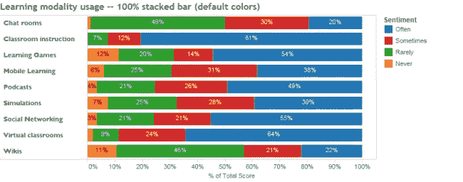

现在看起来好多了，还有改进的空间。(图片来源:[https://www . tableau . com/about/blog/2016/1/how-visualize-情操-倾向-48534](https://www.tableau.com/about/blog/2016/1/how-visualize-sentiment-and-inclination-48534) )

# 履行

我要用的数据来源是从 kaggle.com[获得的](https://www.kaggle.com/miroslavsabo/young-people-survey)，是关于英国[FSEV](https://fses.uniba.sk/en/)对年轻人对一些文化现象的喜好所做的调查结果。


原始数据来源(图片来源:[https://www.kaggle.com/miroslavsabo/young-people-survey?select=responses.csv](https://www.kaggle.com/miroslavsabo/young-people-survey?select=responses.csv) )

为了便于演示，我简化了数据集，只提取了几个与音乐相关的列，并插入了一个新列，用 Excel 表示回答者 ID。

因此，当您将数据导入 Tableau 时，您应该做的第一件事就是旋转表格。在我的例子中，我选择了列*乡村、舞蹈、民谣、硬摇滚金属、流行、摇滚、慢歌或快歌*,所以我所要做的就是按住 control 键并单击它们，然后右键选择 pivot。

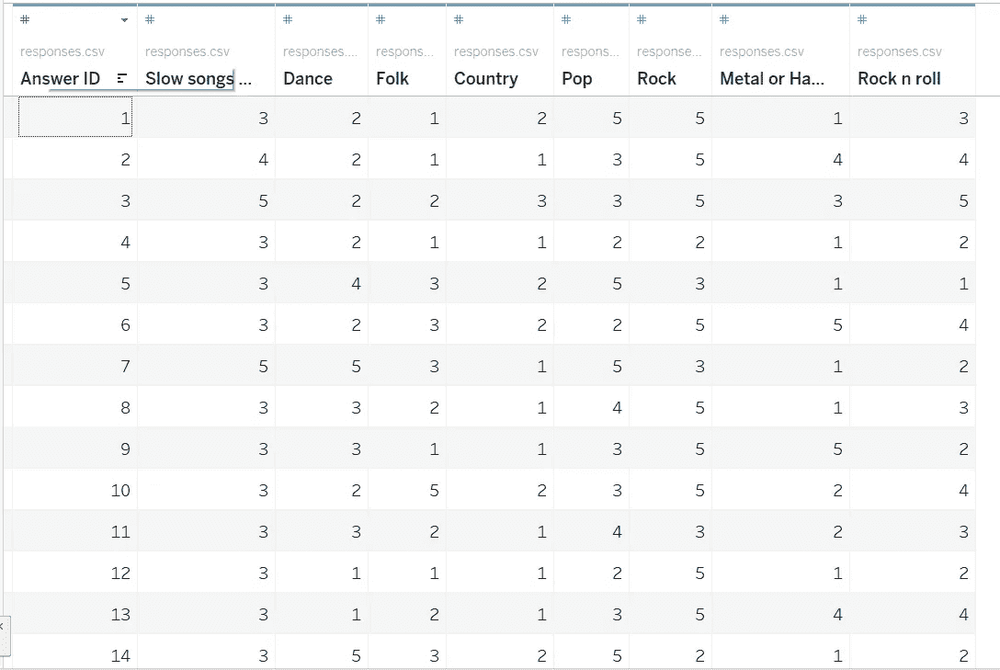

旋转前的样子(图片由作者提供)

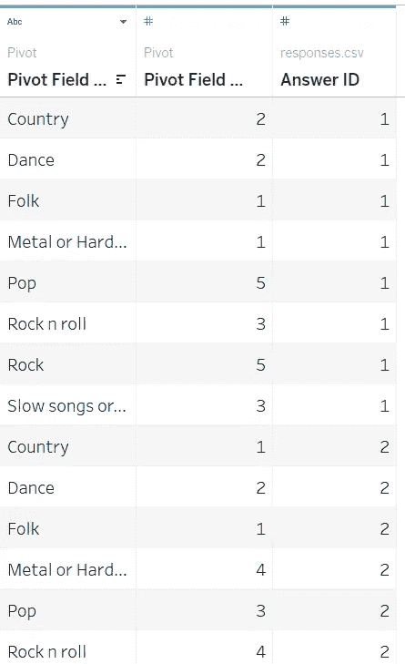

旋转后的外观(图片由作者提供)

数据集的当前版本代表每个不同的人对每个音乐流派的偏好程度。值得注意的是，为了方便将来的操作，您可能希望重命名前两列。

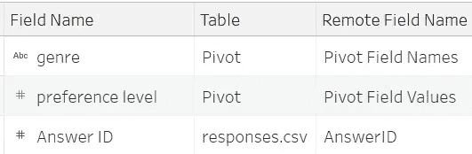

列的新名称(作者图片)

正如我提到的，Likert 图表是堆叠条形图的一种变体，因此我们将从完成条形图开始，将数据行的计数和流派胶囊分别拖动到列和行卡。

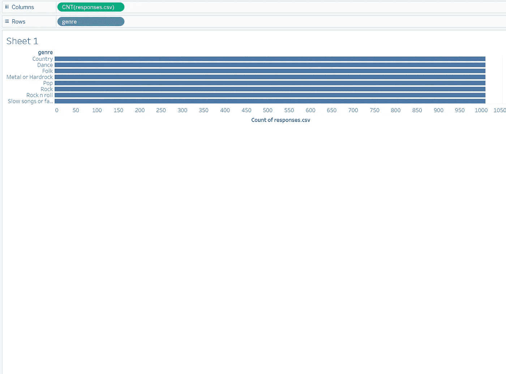

作者图片

现在，当您将“偏好级别”(确保是 Dimension)胶囊拖到色标卡上时，您将看到不同流派的不同等级分布。

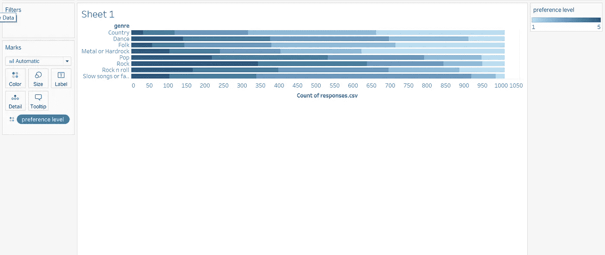

作者图片

好吧！有几件事可以让它看起来更好。首先，调整可视化的大小。第二，分配合适的色谱来更好地象征人们对物品的情感。

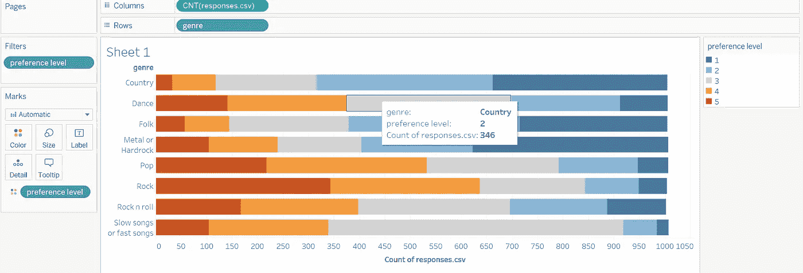

作者图片

第三，设计每个首选项级别的别名，并对图例上的级别进行排序，以使度量值的跨度易于理解。


作者图片

然后，用相应的比例来标记该条的每个骰子。为此，创建一个名为“比例”的新计算字段(如下所示)，并将其拖至文本标记卡。将其“计算使用”属性修改为“单元格”,并使其格式符合百分比。

```
Proportion:COUNT([responses.csv]) / TOTAL(COUNT([responses.csv]))
```

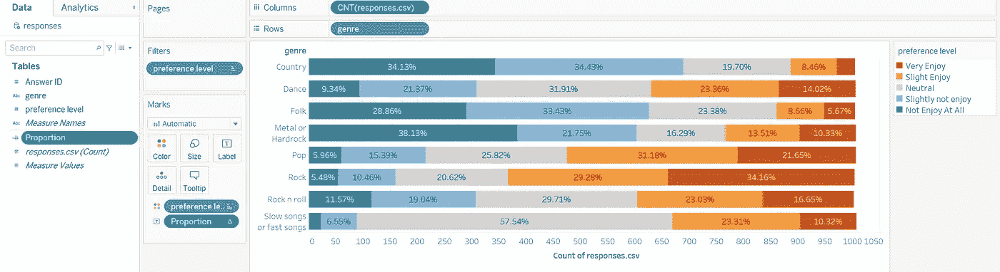

作者图片

这就对了。现在，我们已经创建了一个基本的李克特图表，是时候看看一些替代方案了。信不信由你，在之前的图表中，条形的长度是不一样的，因为差别太小了，根本注意不到。当数据样本中不同问题的问卷接受者数量不同时，这可能会产生巨大的差异。抵消明显差距的一种方法是将条形图调整为一个百分比。换句话说，一根棒线的累积长度总和为 100%，并且它将是一致的。这很简单，你要做的就是在列卡的编号 *response.csv* 上添加一个表计算，这是“使用表(跨)的总计算的百分比”。

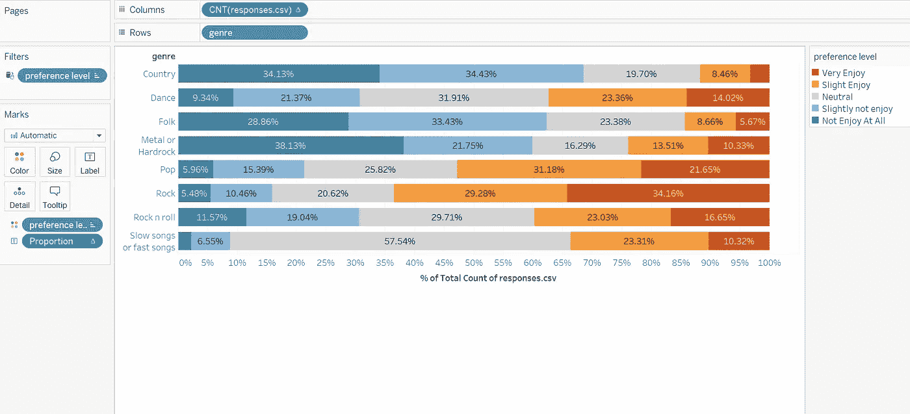

作者图片

做完这些后，是时候想想我们可以用它来讲述什么故事了。我个人更倾向于在 50%的尺度上加一条不变的线，标注每道题的平均分，来抓取数据的一些聚合信息。这是因为通过比较平均值和中值的位置可以获得对数据分布的总体理解，因为被中间线穿过的区域代表某个问题的中值。

在现有的 viz 上插入一条不变的线是很直观的，但是我们所要做的就是计算出每根棒线上的平均线。我的解决方案是使用 Average(首选级别)创建一个新的甘特图，然后合并两个图表的轴，这样两个图表可以显示在一个地方。

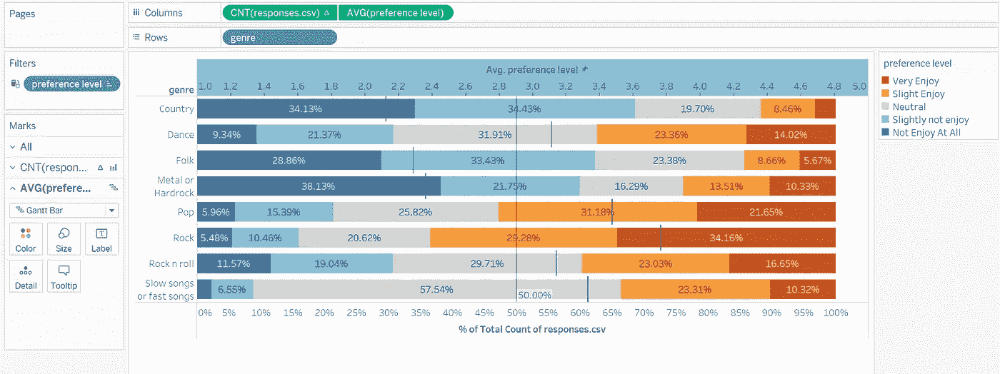

作者图片

如果你想让它看起来像这样，你应该知道:

1.  始终将平均值(偏好级别)放在 CNT(response.csv)的右边；
2.  看一看平均分数卡(偏好等级)，什么都不需要；
3.  编辑轴，使其固定在 1 和 5(刻度的原始跨度)之间。

# 在我走之前…

好吧，是时候让我…哦，等等！已经结束了。李克特图表有很多变体，我很高兴尽可能多地与你分享。但是我知道你的时间很宝贵，我不会一次占用你太多时间。

在下一篇文章中，我将介绍李克特图表中最有趣和最重要的孪生姐妹之一。敬请期待！

练习册可以在这里找到⬇⬇⬇:

[https://public . tableau . com/app/profile/Memphis 4346/viz/LikertChart _ 16263693757630/barlength isconsistent](https://public.tableau.com/app/profile/memphis4346/viz/LikertChart_16263693757630/barlengthisconsistent)

# 编辑

如果你现在正在读这篇文章，你是幸运的！第二部分在这里:

[](/make-your-dashboard-stand-out-likert-chart-part-2-a1216d8c8015) [## 让你的仪表盘脱颖而出——李克特图表(第二部分)

### 打动你的观众和老板！

pub.towardsai.net](/make-your-dashboard-stand-out-likert-chart-part-2-a1216d8c8015)