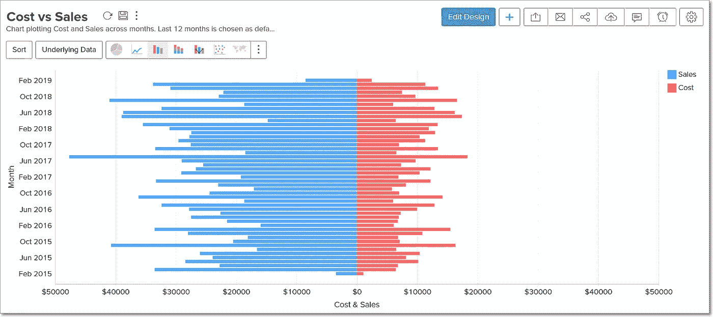
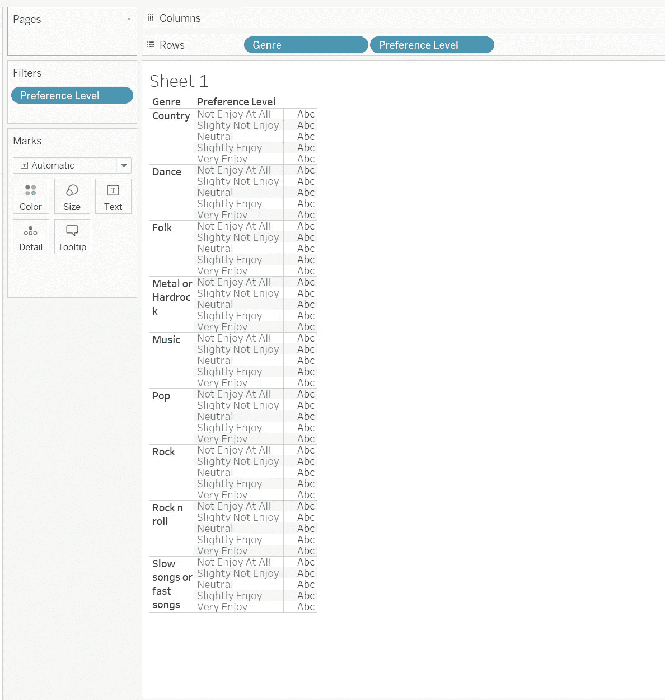
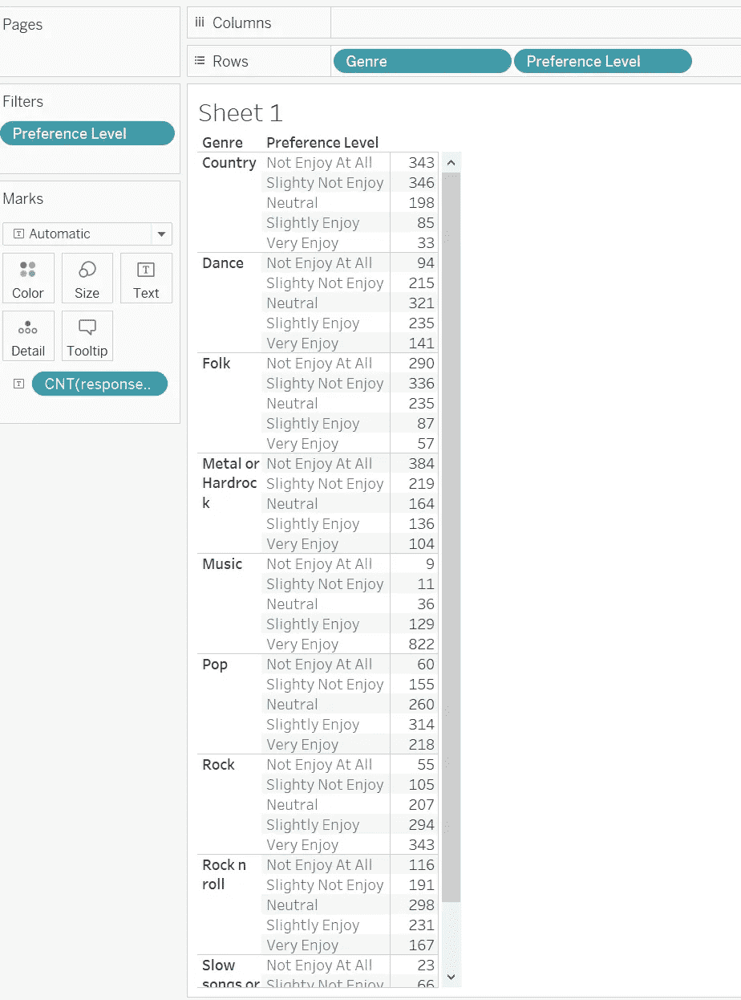
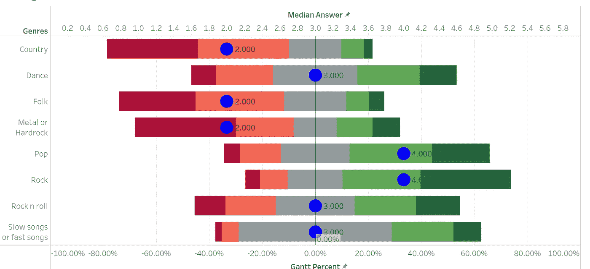
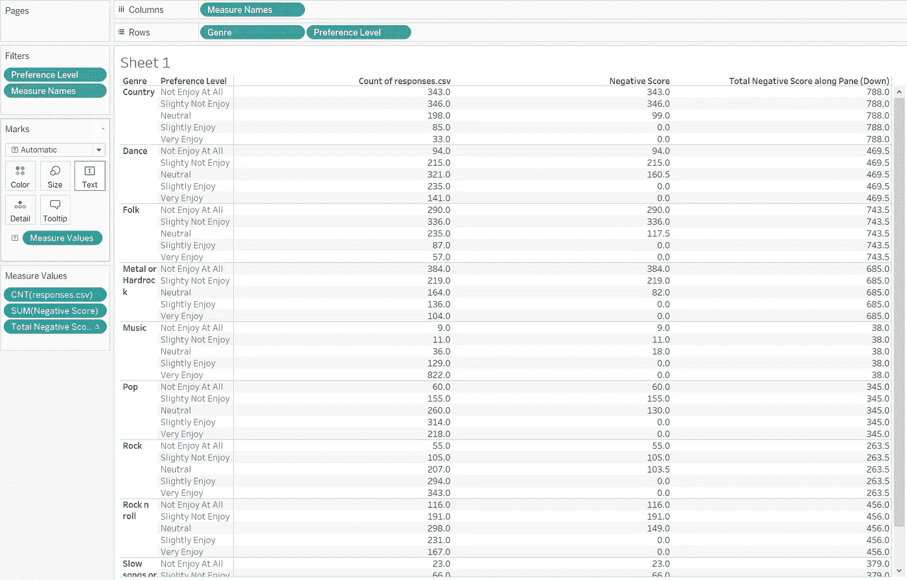
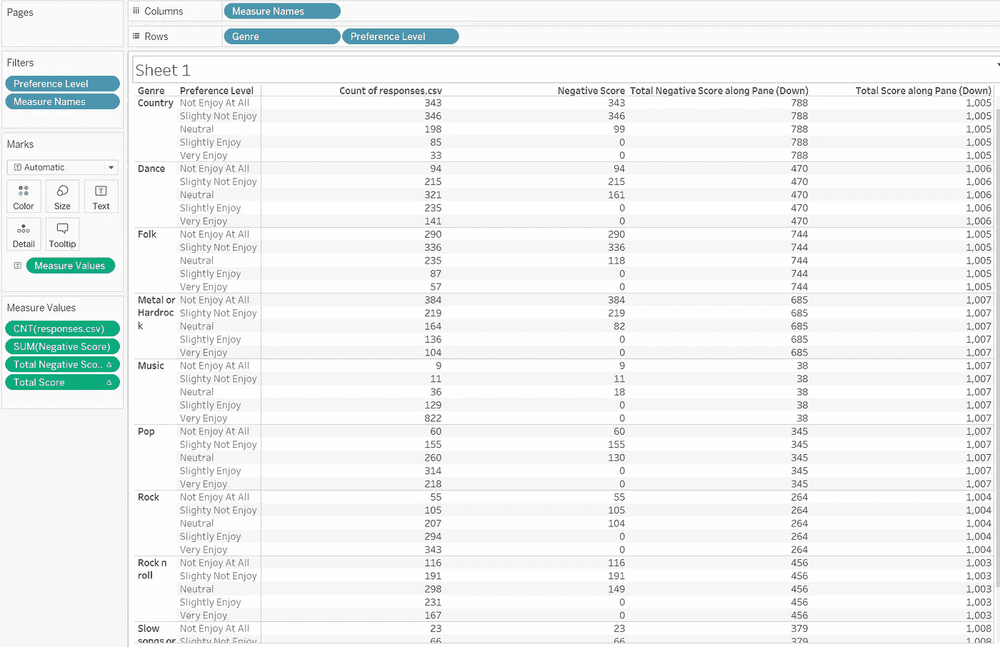
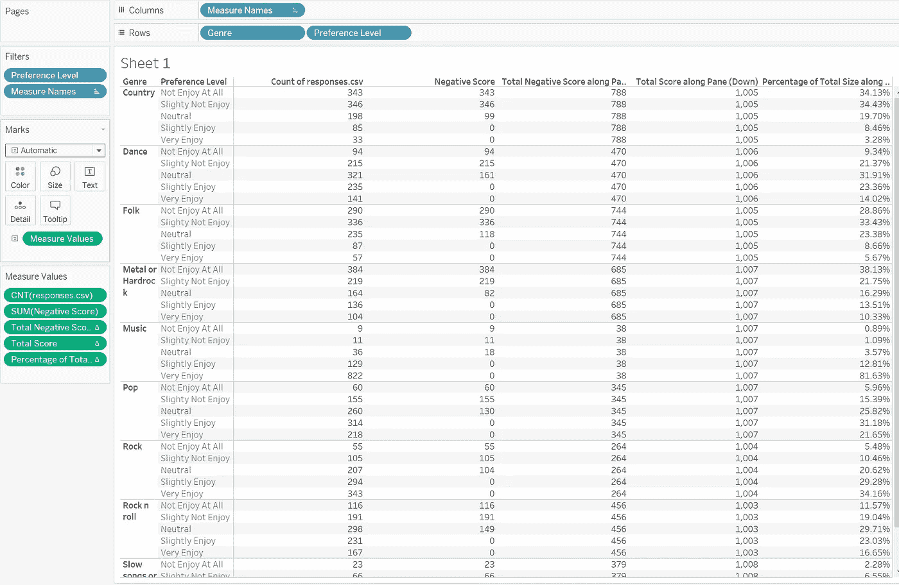
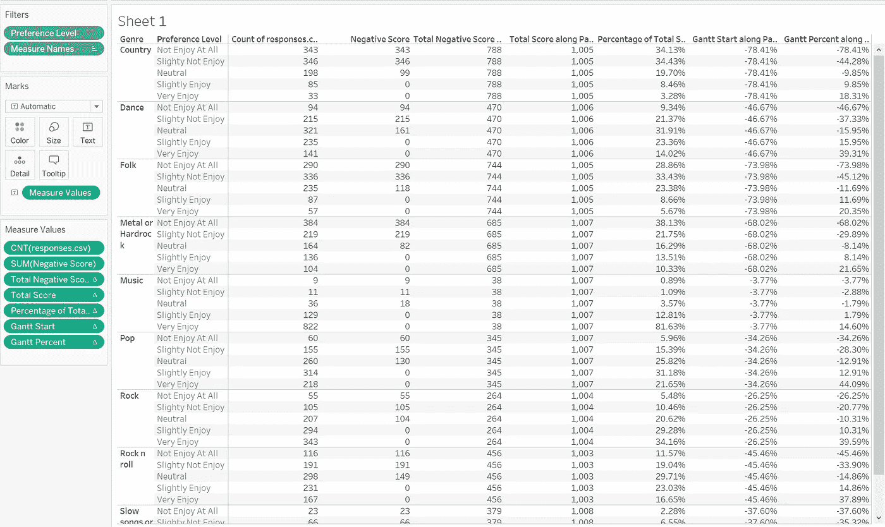
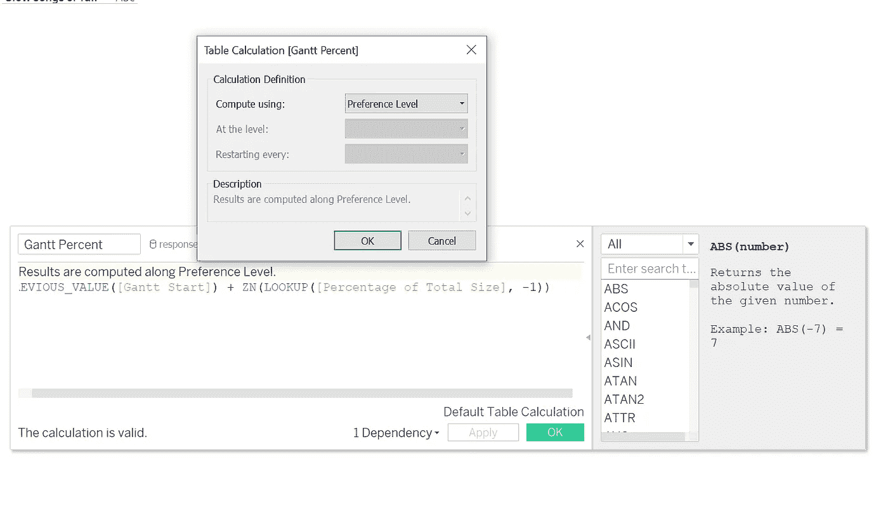
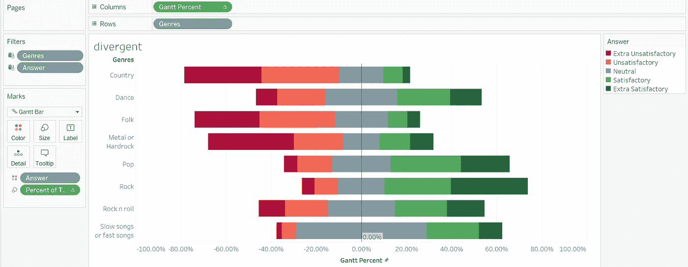

# 让你的仪表盘脱颖而出——李克特图表(第二部分)

> 原文：<https://pub.towardsai.net/make-your-dashboard-stand-out-likert-chart-part-2-a1216d8c8015?source=collection_archive---------2----------------------->


图片由 Tableau.com 拍摄

## [数据可视化](https://towardsai.net/p/category/data-visualization)

## 打动你的观众和老板！

对我来说，Tableau 是唯一一种能让我像艺术家一样做数据科学的工具。然而，如果每个人都用 Tableau 做同样的可视化，那就没什么意思了。这篇文章是我的系列文章“让你的仪表板脱颖而出”中的一集，该系列文章为你提供了一些精彩但非默认的可视化想法。如果你对我来说是新的，一定要看看下面的文章:

[](/make-your-dashboard-stand-out-slope-chart-7b565a0bb35b) [## 让您的仪表盘脱颖而出—斜率图表

### 打动你的观众和老板！

pub.towardsai.net](/make-your-dashboard-stand-out-slope-chart-7b565a0bb35b) [](/make-your-dashboard-stand-out-dumbbell-chart-ae36d399e85) [## 让你的仪表盘脱颖而出——哑铃图表

### 让你的仪表盘脱颖而出——哑铃图表

让你的仪表盘脱颖而出——哑铃 Chartpub.towardsai.net](/make-your-dashboard-stand-out-dumbbell-chart-ae36d399e85) [](/make-your-dashboard-stand-out-waffle-chart-70232488ebba) [## 让你的仪表板脱颖而出-华夫格图

### 打动你的客户和老板！

pub.towardsai.net](/make-your-dashboard-stand-out-waffle-chart-70232488ebba) [](/make-your-dashboard-stand-out-sankey-diagram-c2ead0201aa6) [## 让您的仪表板脱颖而出—桑基图

pub.towardsai.net](/make-your-dashboard-stand-out-sankey-diagram-c2ead0201aa6) [](/make-your-dashboard-stand-out-fill-percentage-ball-chart-cd9484b4f37f) [## 让您的仪表板脱颖而出—填充百分比球图

### 打动你的观众和老板！

pub.towardsai.net](/make-your-dashboard-stand-out-fill-percentage-ball-chart-cd9484b4f37f) 

(*未完待续*

今天我们要继续探索**李克特图表**。

# 主意

在[第 1 部分](/make-your-dashboard-stand-out-likert-chart-part-1-f8613f204c1a)中，我已经介绍过李克特图表是一种堆叠条形图，它可视化了调查受访者对调查问题的可能性或态度的分布。有时，如果答案选项大致是二元的，我们可能想看看被调查者更倾向于哪一方。在这种情况下，**蝶形图**很好用。

作为李克特图表的一个重要变体，它将数据序列分成并排的两部分。它让我们快速了解数据是如何被扭曲的，以便我们可以做进一步的分析，例如，人们对调查对象的情绪或态度。



基本的 Buttery 图表(来源:[https://www . manage engine . com . au/analytics-plus/help/Chart/butterfly-charts . html](https://www.manageengine.com.au/analytics-plus/help/chart/butterfly-charts.html))

在这篇文章中，我将向您展示如何将我们现有的李克特图表显示为一只蝴蝶。


照片由 [Vivek Doshi](https://unsplash.com/@vivekdoshi?utm_source=unsplash&utm_medium=referral&utm_content=creditCopyText) 在 [Unsplash](https://unsplash.com/s/photos/butterfly-chart?utm_source=unsplash&utm_medium=referral&utm_content=creditCopyText) 上拍摄

# 履行

基本上，蝴蝶图的实现是一个通过创建一堆新的计算字段来弄脏我们的手的过程。为了更好地展示我的想法，我将从一个包含所有新字段的表开始。



作者图片

我们首先需要的无疑是每个问题选项的回答人数。我们下面的操作将主要基于这个基本领域。



作者图片

在我们继续之前，让我们看看我们的最终作品，这样我可以更好地解释。在我看来，那些享受的人应该反对那些不享受的人，不管他们的学历如何。然而，因为在所有问题中存在中性选项，我们可以简单地将这个组分成两组，每组站在不同的一边。



作者图片

为此，我们需要创建接下来的两个度量:“*负得分*和“*总负得分*”。“*负分*的主要作用是将“中性”的那组答案分离出来，这样“*总负分*就可以得到 0%刻度上左边应该反映的人的总量。

```
Negative Score:IF [Preference Level] < 3 THEN 1
ELSEIF [Preference Level] = 3 THEN 0.5
ELSE 0
ENDTotal Negative Score:TOTAL(SUM([Negative Score]))
```

注意，当没有“中性”选项时，“*负分数*的声明是可选的。您可以简单地累计选择否定答案的人数，以获得“*总否定分数*”。此外，需要使用**窗格(向下)**计算“*总负分*”。



作者图片

第三，我们必须合计每个问题的回答者总数。这是因为我们需要一个完整的数据视图，而不是消极回应的人。

```
Total Score:TOTAL(COUNT([responses.csv]))
```



同样，应该使用 Pane(向下)来计算。(图片由作者提供)

完成后，我们可以很容易地得到在每个问题中选择不同答案的回答者的比例。如果你所能看到的都是 0，你不应该担心，因为这一列中的值应该总是在 0~1 之间，作为一种更好的显示方式，你可能希望它的格式符合百分比。

```
Percentage of Total Size:COUNT([responses.csv]) / [Total Score]
```



然后，因为小节不会从音阶的起点开始，所以有必要用另一个小节来记录它应该从哪里开始。我的解决方法是想象该条从 0%刻度开始，它所经过的最左边的位置(条的起点)应该与“*总负分*”显示的一样远。

```
Gantt Start:-[Total negative score] / [Total Score]
```

在此之后，我们可以通过分别堆叠百分比来获得不同组的起点:

```
Gantt Percent:PREVIOUS_VALUE([Gantt Start]) + ZN(LOOKUP([Percentage of Total Size], -1))
```



作者图片

好吧！我们现在已经有了蝴蝶图的一切。让我们看看我们能做些什么来聚合它。

有一件事我应该早点让你知道:只要计算字段使用表计算，你应该总是改变它的默认计算使用“首选级别”。



作者图片

然后，只要你将“偏好级别”、“甘特图百分比”、“流派”分别拖动到颜色、列和行，一切都设置好了。



作者图片

# 在我走之前…

你成功了！在这个由两部分组成的系列文章中，我确信你已经看到了李克特图表的美丽。现在是时候让你发挥创造力，成为一名数据即故事讲述者了！

对于我的工作的细节，随时查看这里⬇⬇⬇:

[https://public . tableau . com/app/profile/Memphis 4346/viz/LikertChart _ 16263693757630/divergent？发布=是](https://public.tableau.com/app/profile/memphis4346/viz/LikertChart_16263693757630/divergent?publish=yes)