# 让您的仪表盘脱颖而出—雷达图

> 原文：<https://pub.towardsai.net/make-your-dashboard-stand-out-radar-chart-34d0497eddb8?source=collection_archive---------1----------------------->


图片由 tableau.com 拍摄

## [数据可视化](https://towardsai.net/p/category/data-visualization)

## 打动你的观众和老板！

对我来说，Tableau 是唯一一种能让我像艺术家一样做数据科学的工具。然而，如果每个人都用 Tableau 做同样的可视化，那就没什么意思了。这篇文章是我的系列文章“让你的仪表板脱颖而出”中的一集，该系列文章为你提供了一些精彩但非默认的可视化想法。如果你对我来说是新的，一定要看看下面的文章:

[](/make-your-dashboard-stand-out-likert-chart-part-1-f8613f204c1a) [## 让您的仪表板脱颖而出—李克特图表(第 1 部分)

### 打动你的观众和老板！

pub.towardsai.net](/make-your-dashboard-stand-out-likert-chart-part-1-f8613f204c1a) [](/make-your-dashboard-stand-out-likert-chart-part-2-a1216d8c8015) [## 让你的仪表盘脱颖而出——李克特图表(第二部分)

### 打动你的观众和老板！

pub.towardsai.net](/make-your-dashboard-stand-out-likert-chart-part-2-a1216d8c8015) [](/make-your-dashboard-stand-out-word-cloud-8426255df94a) [## 让您的仪表盘脱颖而出— Word Cloud

### 打动你的观众和老板！

pub.towardsai.net](/make-your-dashboard-stand-out-word-cloud-8426255df94a) [](/make-your-dashboard-stand-out-sankey-diagram-c2ead0201aa6) [## 让您的仪表板脱颖而出—桑基图

pub.towardsai.net](/make-your-dashboard-stand-out-sankey-diagram-c2ead0201aa6) [](/make-your-dashboard-stand-out-waffle-chart-70232488ebba) [## 让你的仪表板脱颖而出-华夫格图

### 打动你的客户和老板！

pub.towardsai.net](/make-your-dashboard-stand-out-waffle-chart-70232488ebba) 

(*未完待续*

在本帖中，我将展示**雷达图**的配置。


照片由[丹尼尔·弗兰奇](https://unsplash.com/@daniele_franchi?utm_source=unsplash&utm_medium=referral&utm_content=creditCopyText)在 [Unsplash](https://unsplash.com/s/photos/radar?utm_source=unsplash&utm_medium=referral&utm_content=creditCopyText) 上拍摄

# 主意

雷达图，又名蜘蛛网图，是显示多元变量的图形效果。变量在各自轴上的相对位置可以共同反映研究对象的属性。

通常，变量的数量预计不会超过 10 个，以避免过多和无信息。


它看起来确实像雷达图。(罗伯特·安纳西在 [Unsplash](https://unsplash.com/s/photos/spider-web?utm_source=unsplash&utm_medium=referral&utm_content=creditCopyText) 上拍摄)

一般来说，当比较不同的实体时，人们倾向于使用雷达图。例如，在进行全球大学排名时，需要几个衡量标准。如果我们要同时在这些指标中反映学院/大学的表现，雷达图将是我们的选择。

这将是这个故事的主题。

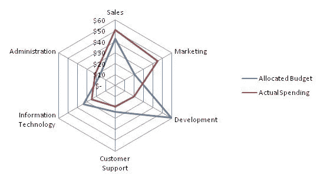

雷达图示例(图片来自[维基百科](https://en.wikipedia.org/wiki/Radar_chart)

# 履行

将要使用的是从 [Kaggle 世界大学排名](https://www.kaggle.com/mylesoneill/world-university-rankings)下载的数据集。我将研究上海排名指数，在继续之前，我添加了 4 个虚拟数据行，如下图所示。这将在下面的部分解释。

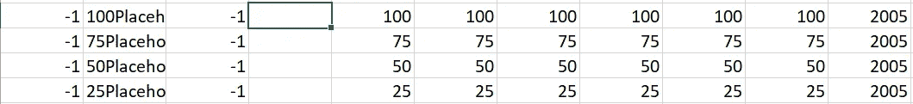

作者图片

当我们完成导入数据时，我们应该做的第一件事是透视度量。您可能想要隐藏不相关的列，所以在我的例子中，它看起来像这样:

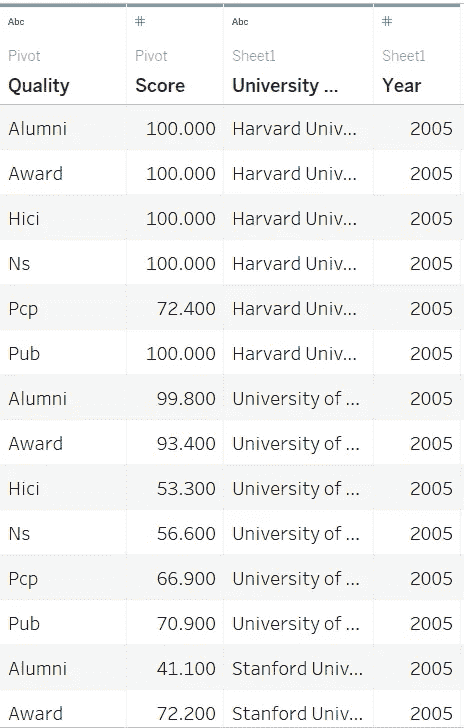

作者图片

因为我们可以想象雷达图是正六边形的子集，而雷达图的每个端点都落在连接六边形的角点和中心点的线上。因此，我们应该引入[三角学](https://en.wikipedia.org/wiki/Trigonometry)来指示端点的位置。

假设中心点的坐标为(0，0)，那么端点的坐标为角度的正弦值，x 坐标为角度的余弦值。有 6 个方面被考虑，所以六边形应该被等分成 6 个相同的扇区，它们的圆心角都是 60 度。


乔纳森·特拉科维奇

```
Y:CASE [Quality]
WHEN 'Alumni' THEN [Score]*(1/2)
WHEN 'Award' THEN [Score]*1
WHEN 'Hici' THEN [Score]*(1/2)
WHEN 'Ns' THEN [Score]*(-1/2)
WHEN 'Pub' THEN [Score]*-1
WHEN 'Pcp' THEN [Score]*(-1/2)
ENDX:CASE [Quality]
WHEN 'Alumni' THEN [Score]*(SQRT(3)/2)
WHEN 'Award' THEN 0
WHEN 'Hici' THEN [Score]*(-SQRT(3)/2)
WHEN 'Ns' THEN [Score]*(-SQRT(3)/2)
WHEN 'Pub' THEN 0
WHEN 'Pcp' THEN [Score]*(SQRT(3)/2)
END
```

接下来，我们还需要分配哪个端点属于什么质量。计算字段"*路径*"定义特定质量应位于的行。

```
Path:CASE [Quality]
WHEN 'Alumni' THEN 1
WHEN 'Award' THEN 2
WHEN 'Hici' THEN 3
WHEN 'Ns' THEN 4
WHEN 'Pub' THEN 5
WHEN 'Pcp' THEN 6
END
```

我们的数据集收集了多年的数据，为了进行演示，我任意过滤了 Year 列。此外，雷达应该一次象征一所大学，因此大学名称也应该包含在过滤器中。

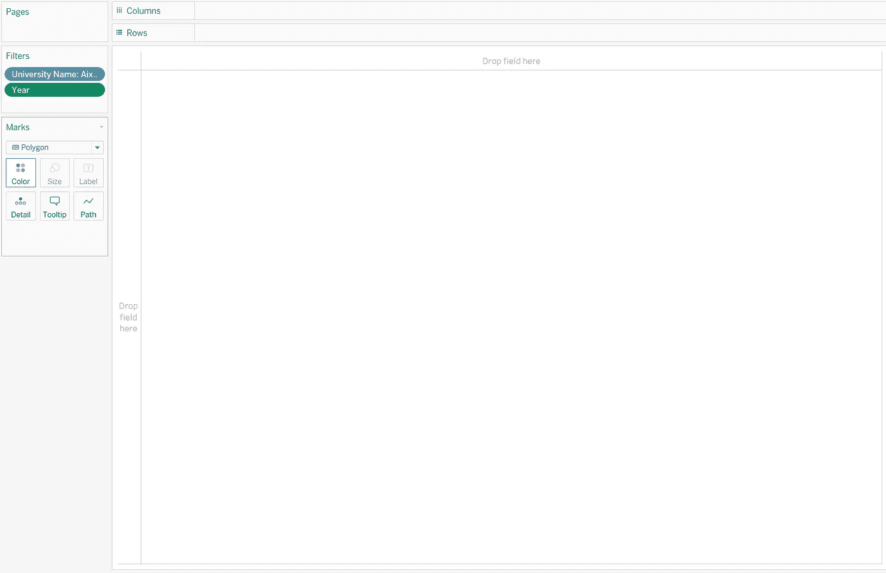

作者图片

接下来，将 *X* & *Y* 拖放到列和行中。

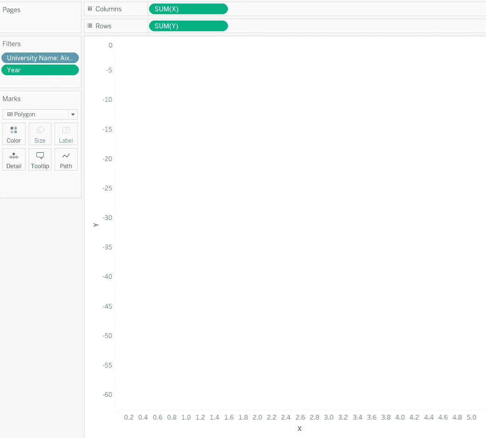

作者图片

为了显示我们想要看到的，将标记样式切换为多边形，并将*质量*拖放到**细节**，*总和(路径)*拖放到**路径**。现在，您可以在工作手册中看到一个简单而基本的雷达图。

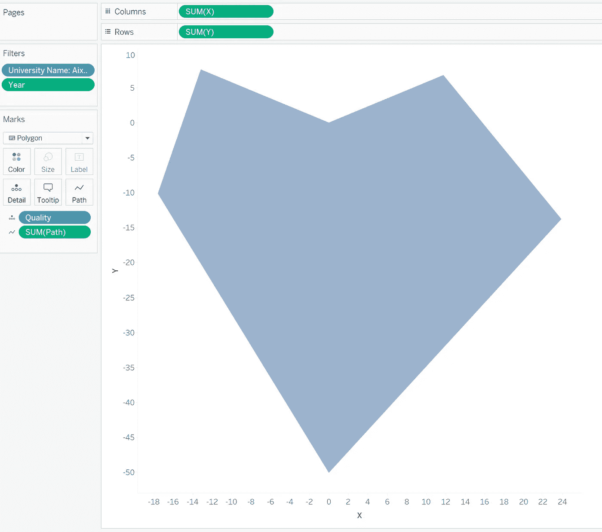

作者图片

# 预先的

从简单的雷达图中很难推断出什么。相反，背景像蜘蛛网一样的网格会非常有用。我的解决方法是**在每个分位数配置完全规则的六边形**。这就是我必须提前添加 4 个虚拟数据行的原因。要做到这一点，大多数步骤都是相同的，而轴应该对准相同的范围。此外，确保网格是带边框的白色，但没有背景壁纸。因此，当您创建一个仪表板并将它们全部(以浮动方式)拖动到其中时，请确保 Layout 选项卡中的 x、y、w 和 h 的值都相同，您将得到如下效果。

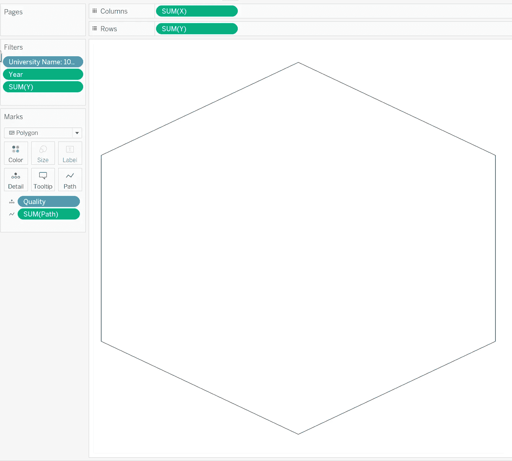

单一网格(图片由作者提供)

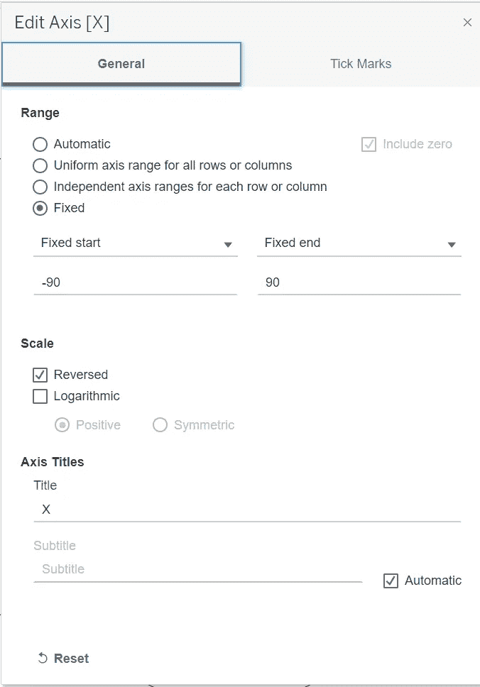

X 坐标的范围(图片由作者提供)

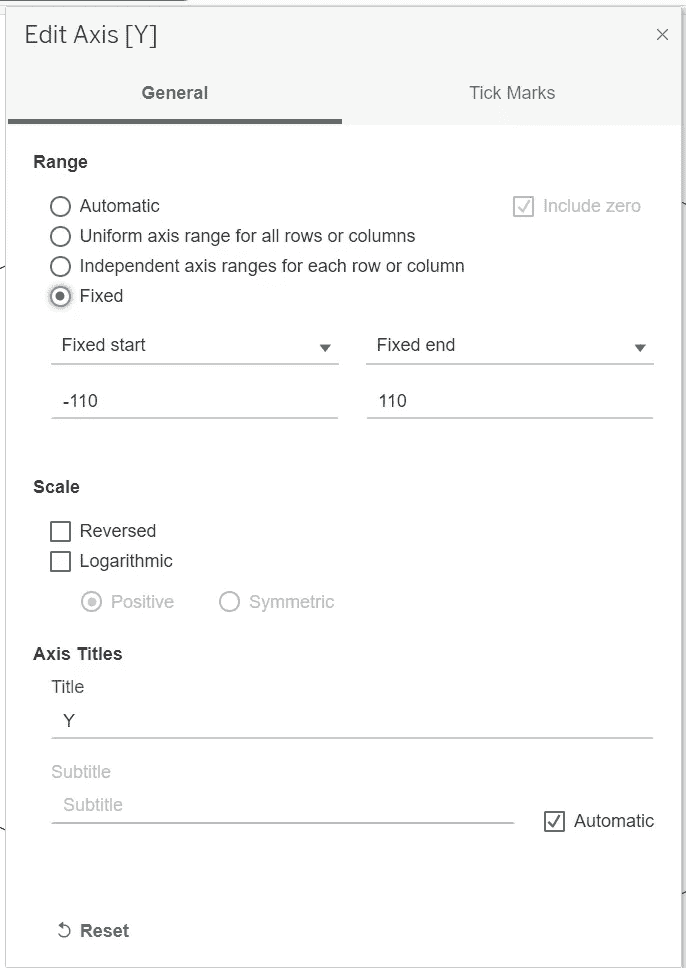

Y 坐标的范围(图片由作者提供)

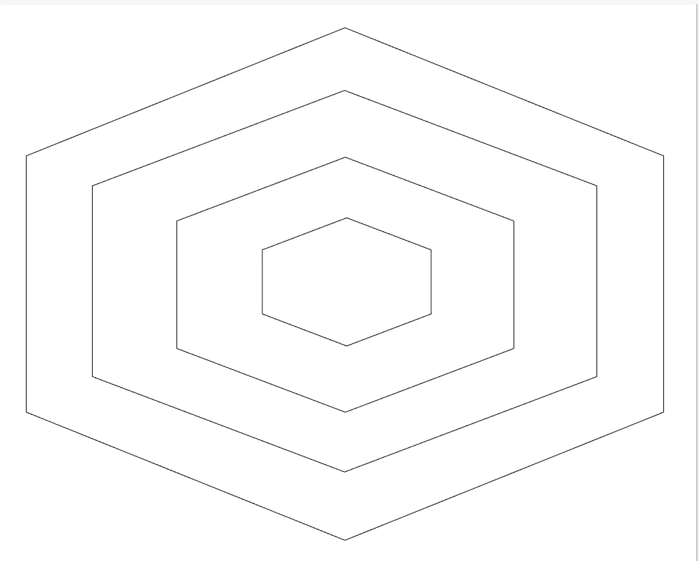

按工作簿堆叠的仪表板效果(按作者排列的图像)

回到我们的雷达图，如果我们去掉所有的网格线、壁纸和某种程度的不透明度，效果会更好。当您将它放在仪表板上时，它的 w、h、x、y 和坐标范围也应该与其他块相同。

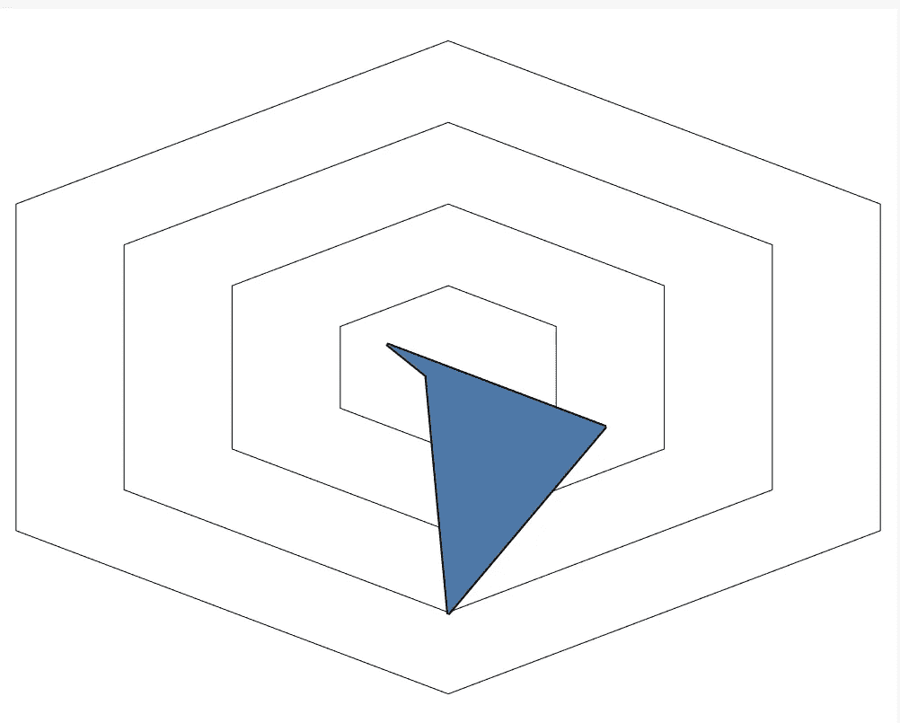

作者图片

另一个改进是用相应的度量来标记每个端点。我的解决方案是在与 radar 相同的页面中创建另一个可视化，但这次它的样式应该是圆形或方形。所以设置好了，你要做的就是双轴，同步它们。

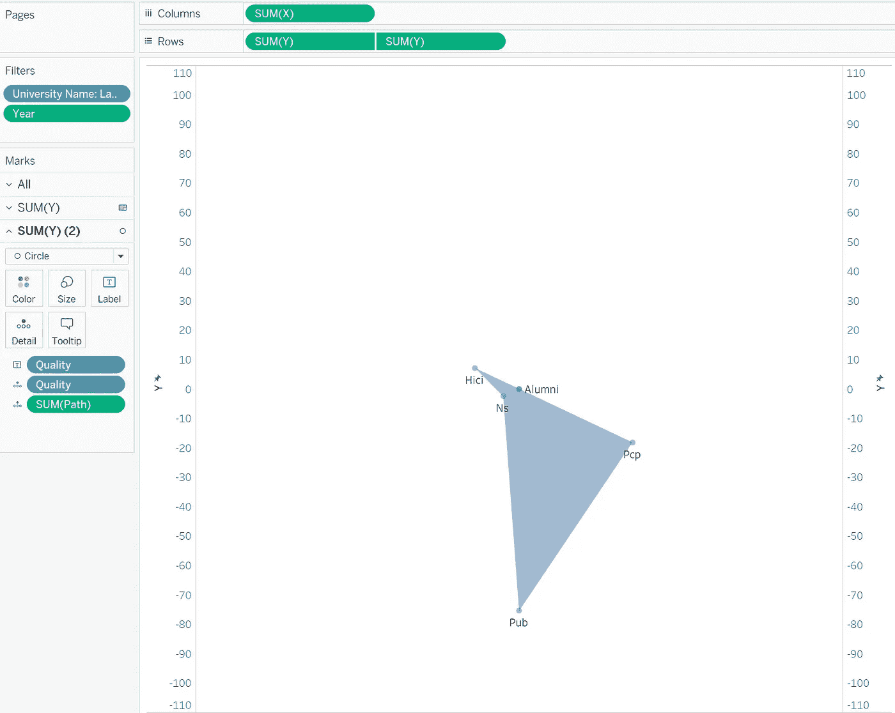

另一种质量药丸需要放在第二个标签选项中，即(图片由作者提供)

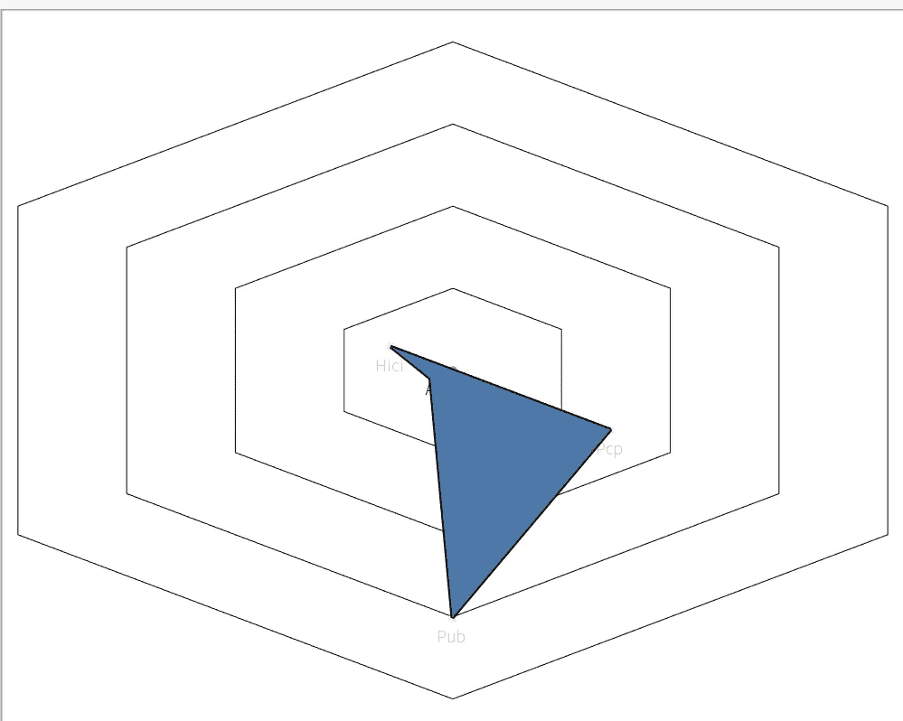

作者图片

将 University_Name 引入过滤器，这样您就可以看到机构、学院和大学之间的能力差异。

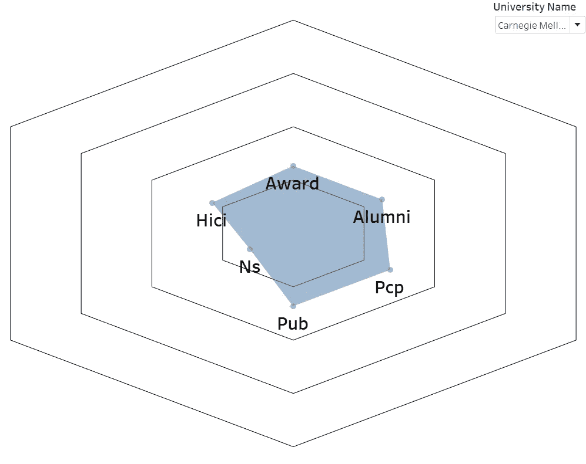

作者图片

# 最后的话…

很难说再见，但又到了时间！如果你有什么有趣的或者更好的想法，请在评论里告诉我！

查看我的作品:

[https://public . tableau . com/app/profile/Memphis 4346/viz/Radar _ 16274503579090/dashboard 1？发布=是](https://public.tableau.com/app/profile/memphis4346/viz/Radar_16274503579090/Dashboard1?publish=yes)