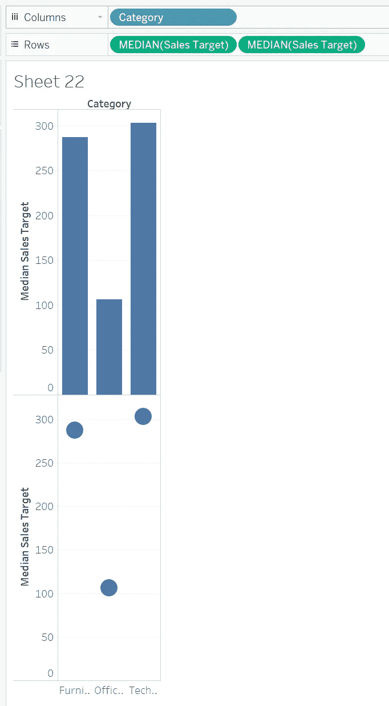
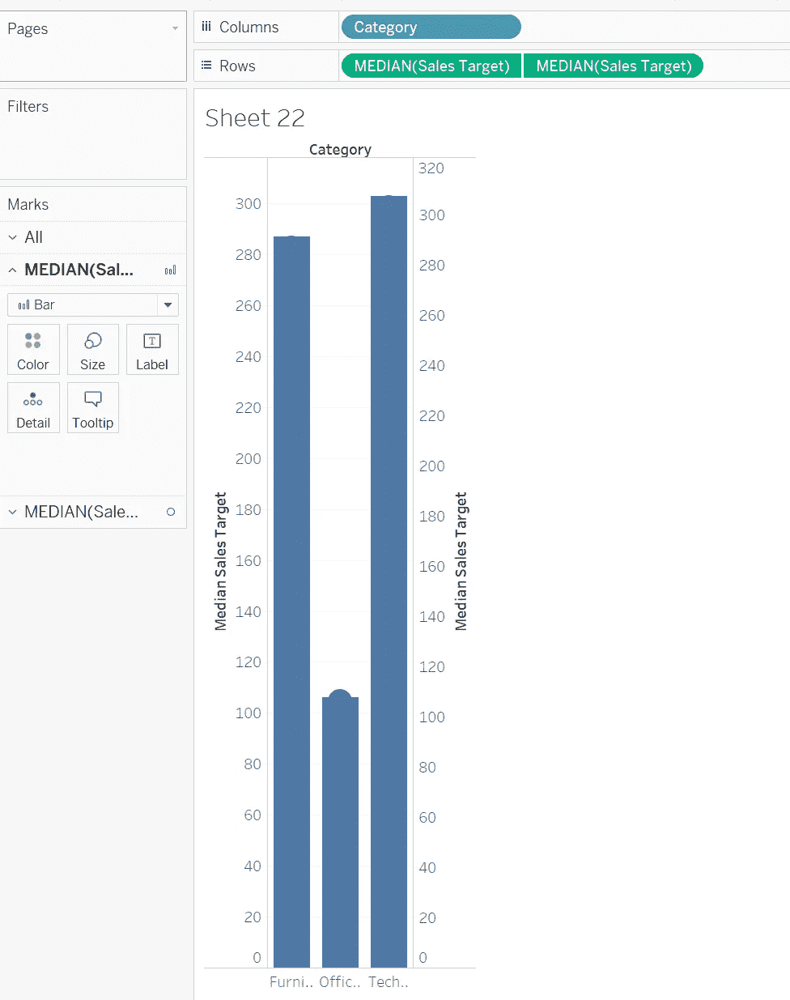
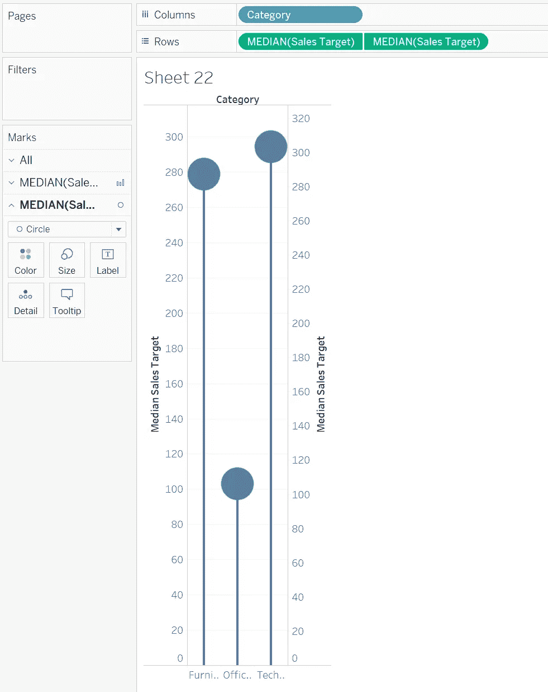
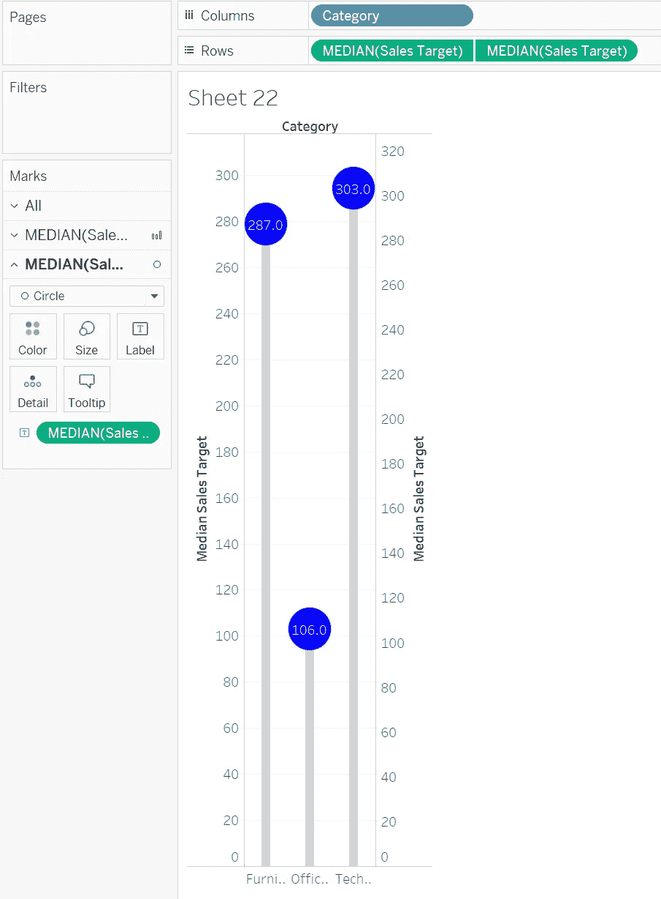

# 让您的仪表板脱颖而出—棒棒糖图表

> 原文：<https://pub.towardsai.net/make-your-dashboard-stand-out-radial-pie-guage-chart-482ecc7c80f8?source=collection_archive---------1----------------------->

## [数据可视化](https://towardsai.net/p/category/data-visualization)

## 打动你的客户和老板！

对我来说，Tableau 是唯一一种允许我作为艺术家进行数据科学研究的工具。然而，如果每个人都用 Tableau 做同样的可视化，那就没什么意思了。这篇文章是我的系列文章“让你的仪表板脱颖而出”中的一集，该系列文章为你提供了一些精彩但非默认的可视化想法。如果你对我来说是新的，一定要看看下面的文章:

 [## 让您的仪表盘脱颖而出—放射状饼图

### 打动你的客户和老板！

pub.towardsai.net](/make-your-dashboard-stand-out-radial-pie-guage-chart-db052e5909b3)  [## 让您的仪表板脱颖而出—桑基图

pub.towardsai.net](/make-your-dashboard-stand-out-sankey-diagram-c2ead0201aa6)  [## 让您的仪表板脱颖而出—填充百分比球图

### 打动你的观众和老板！

pub.towardsai.net](/make-your-dashboard-stand-out-fill-percentage-ball-chart-cd9484b4f37f)  [## 让您的仪表盘脱颖而出—雷达图

### 打动你的观众和老板！

pub.towardsai.net](/make-your-dashboard-stand-out-radar-chart-34d0497eddb8)  [## 让您的仪表板脱颖而出—瀑布图

### 打动你的观众和老板！

pub.towardsai.net](/make-your-dashboard-stand-out-waterfall-chart-7aa090653e7d) 

(*未完待续*

在本帖中，我要介绍好吃的**棒棒糖图**。

图片来自 [Pixabay](https://pixabay.com/?utm_source=link-attribution&utm_medium=referral&utm_campaign=image&utm_content=1961539) 的[дарьяяковлева](https://pixabay.com/users/daria-yakovleva-3938704/?utm_source=link-attribution&utm_medium=referral&utm_campaign=image&utm_content=1961539)

# 主意

很难确定棒棒糖排行榜的起源这个类似鸡蛋的问题。首先，可能是一些受棒棒糖形状启发的人制作了刮刮乐。另一方面，一些人碰巧想到了这个未命名的可视化想法，后来当他们嘴里有一个棒棒糖时，就把它叫做棒棒糖。

无论如何，棒棒糖图是条形图和点/圆图的变体。解释完之后，你可以考虑从构建条形图和圆形图开始。

# 履行

我将使用示例工作簿*超级商场*详细说明这些步骤。我想要的是每个类别在几个月内的销售目标中值。我说过，我们首先需要的是条形图和圆形图。

作者图片

接下来，双轴两个可视化。

作者图片

快到了！现在想象一下棒棒糖的样子。它是一根顶端有一个球的细棍，对吗？换句话说，只要我们修改两个图表的大小，那么我们就可以看到棒棒糖的理想身材。

作者图片

就是这样！你得到了你的第一张棒棒糖图表！

为了美化棒棒糖，我通常用两种方法。首先，我把颜色改成想要的颜色。第二，把数字放到糖果区。

作者图片

这让你的图表更丰富！

# 在我走之前…

在你成为视觉禅的路上，你得到了另一个令人兴奋的提示！如果你有任何改进棒棒糖图表的好主意，请在评论中告诉我！