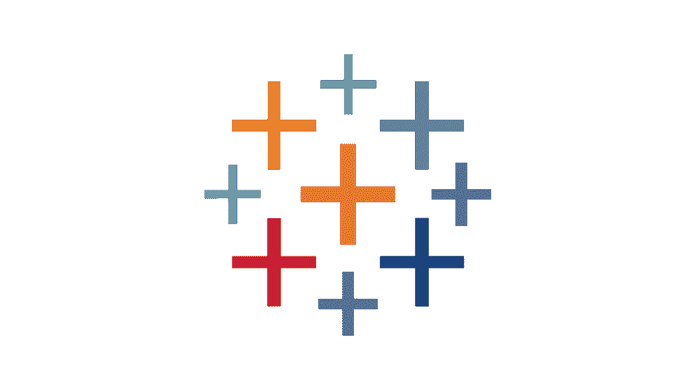
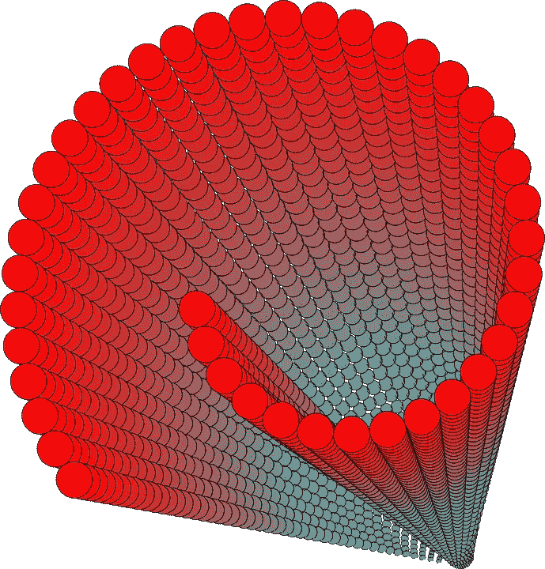
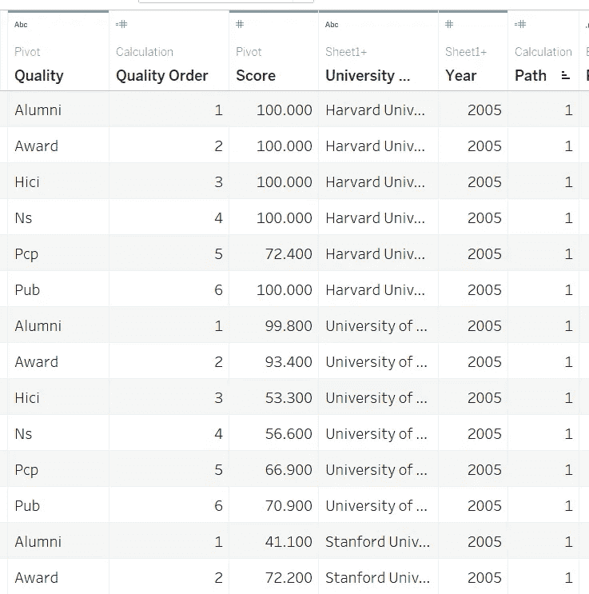
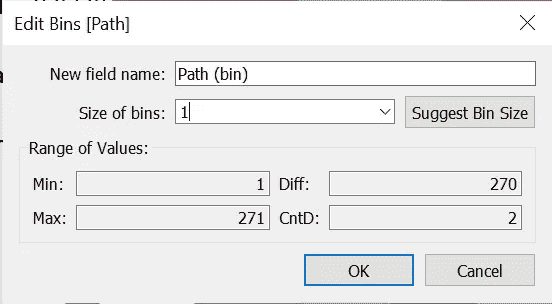
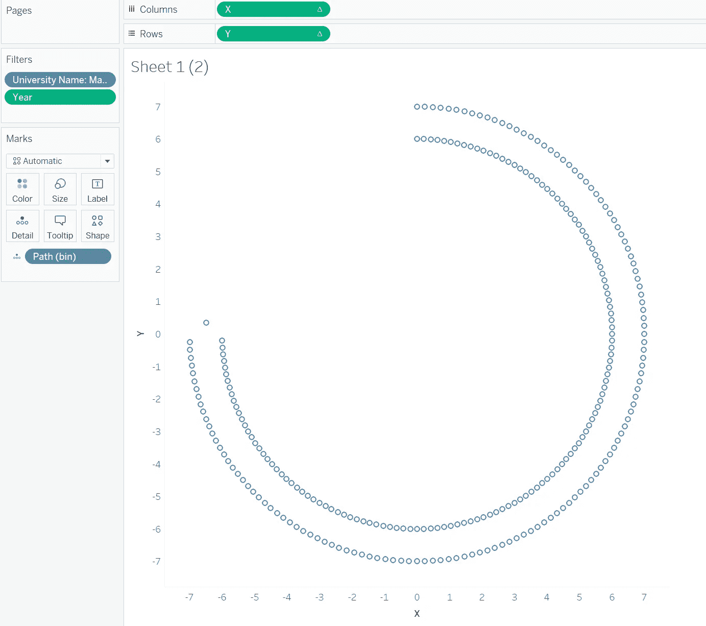
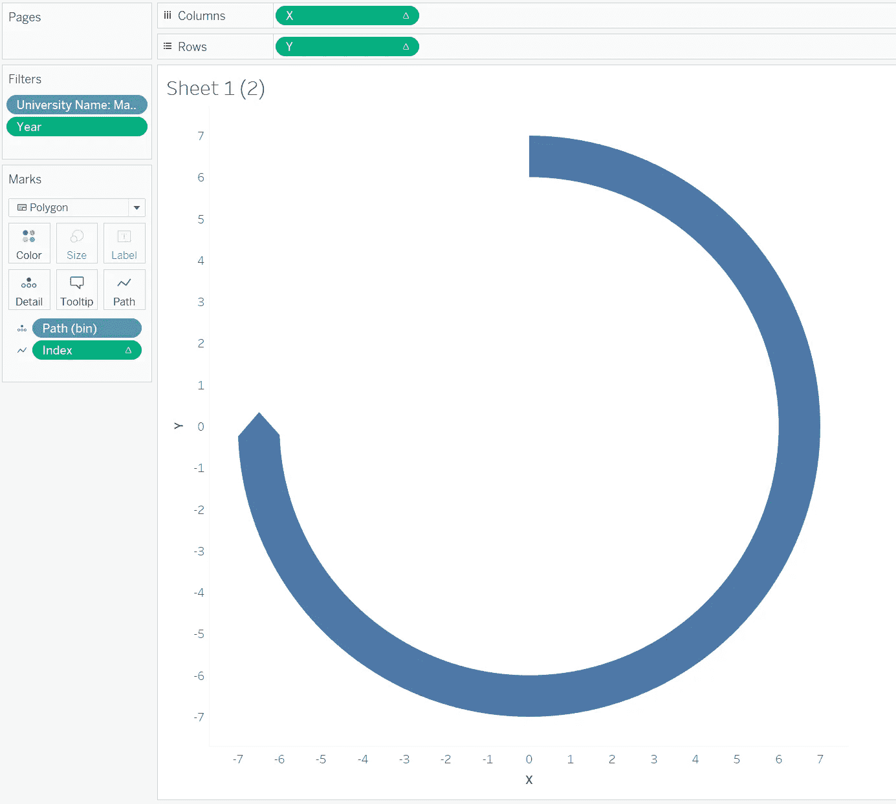
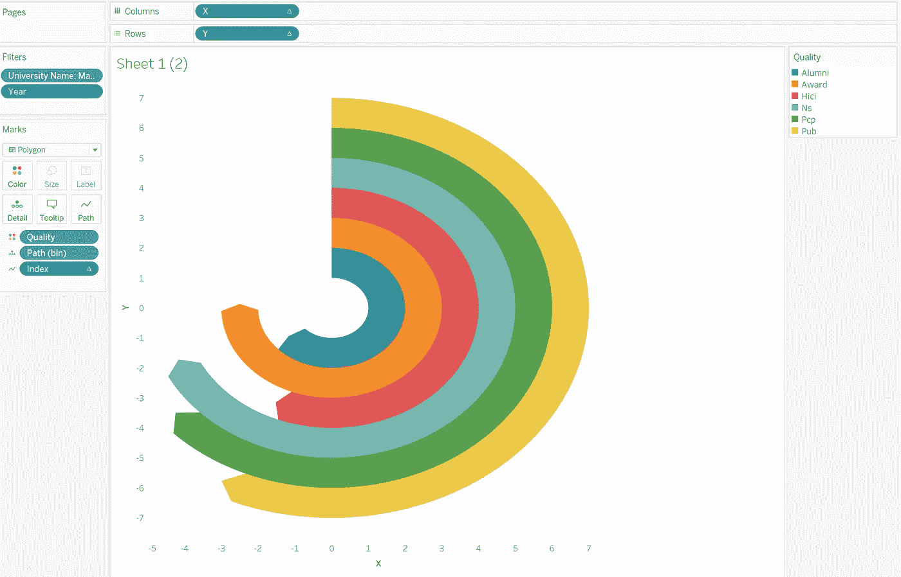
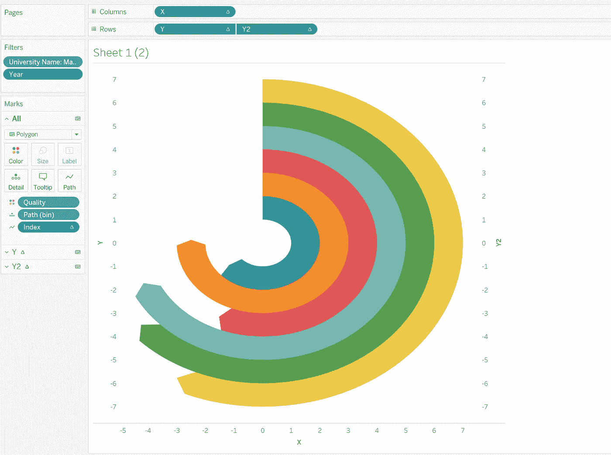
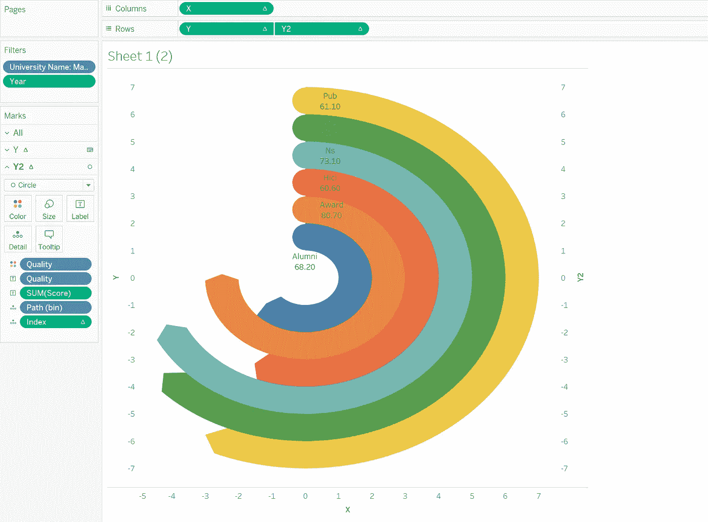
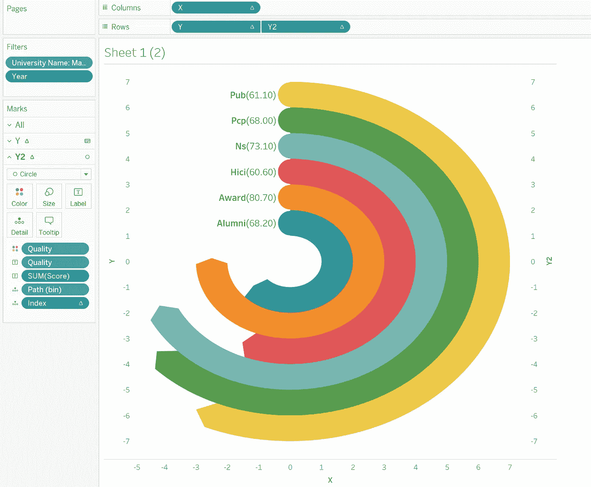

# 让您的仪表盘脱颖而出—放射状饼图

> 原文：<https://pub.towardsai.net/make-your-dashboard-stand-out-radial-pie-guage-chart-db052e5909b3?source=collection_archive---------2----------------------->



图片由 Tableau.com 拍摄

## [数据可视化](https://towardsai.net/p/category/data-visualization)

## 打动你的客户和老板！

对我来说，Tableau 是唯一一种允许我作为艺术家进行数据科学研究的工具。然而，如果每个人都用 Tableau 做同样的可视化，那就没什么意思了。本文是我的系列文章“*让你的仪表盘脱颖而出*”中的一集，该系列文章为你提供了一些出色但非默认的可视化想法。如果你对我来说是新的，一定要看看下面的文章:

[](/make-your-dashboard-stand-out-donut-chart-bdfa82c25be) [## 让您的仪表板脱颖而出-圆环图

### 打动你的客户和老板！

pub.towardsai.net](/make-your-dashboard-stand-out-donut-chart-bdfa82c25be) [](/make-your-dashboard-stand-out-tile-map-e5d0b19387e8) [## 让您的仪表板脱颖而出—平铺地图

### 让您的仪表板脱颖而出—平铺地图

让您的仪表板脱颖而出—瓷砖 Mappub.towardsai.net](/make-your-dashboard-stand-out-tile-map-e5d0b19387e8) [](/make-your-dashboard-stand-out-sankey-diagram-c2ead0201aa6) [## 让您的仪表板脱颖而出—桑基图

pub.towardsai.net](/make-your-dashboard-stand-out-sankey-diagram-c2ead0201aa6) [](/make-your-dashboard-stand-out-likert-chart-part-1-f8613f204c1a) [## 让您的仪表板脱颖而出—李克特图表(第 1 部分)

### 打动你的观众和老板！

pub.towardsai.net](/make-your-dashboard-stand-out-likert-chart-part-1-f8613f204c1a) [](/make-your-dashboard-stand-out-fill-percentage-ball-chart-cd9484b4f37f) [## 让您的仪表板脱颖而出—填充百分比球图

### 打动你的观众和老板！

pub.towardsai.net](/make-your-dashboard-stand-out-fill-percentage-ball-chart-cd9484b4f37f) [](/make-your-dashboard-stand-out-waterfall-chart-7aa090653e7d) [## 让您的仪表板脱颖而出—瀑布图

### 打动你的观众和老板！

pub.towardsai.net](/make-your-dashboard-stand-out-waterfall-chart-7aa090653e7d) 

(*未完待续*

今天，我将讨论如何以一种不那么枯燥的方式显示条形图:**放射状饼状图**。

# 主意

条形图可以说是一种信息丰富且简单的方式来说明不同对象的相对差异，尽管人们可能会因为过度使用而厌倦它。

为了缓解这种审美疲劳，径向饼状图，又名。*圆形条形图*形成。它能使你对图表的选择多样化，更灵活地展示信息。



图片由 [OpenClipart-Vectors](https://pixabay.com/users/openclipart-vectors-30363/?utm_source=link-attribution&utm_medium=referral&utm_campaign=image&utm_content=149791) 从 [Pixabay](https://pixabay.com/?utm_source=link-attribution&utm_medium=referral&utm_campaign=image&utm_content=149791)

我看不到它的任何缺点，除了你可能不知道如何创建一个。这就是我接下来要展示给你们的。

# 履行

该演示将基于从 [Kaggle](/make-your-dashboard-stand-out-radar-chart-34d0497eddb8) 收集的大学排名数据集。如果你熟悉我之前的帖子，你应该记得也是在[这篇文章](/make-your-dashboard-stand-out-radar-chart-34d0497eddb8)里。类似地，对数据的预处理将与那个基本相同。


作者图片

还要做的一步是将这个数据源转换成一个包含两个自身的联合。然后创建一个列*路径*来区分数据行来自哪个表。我选择 271 作为路径标识符之一的原因是，出于美观的原因，圆形条形图从来都不是一个完整的圆或环。

```
Path: IF ([Table Name] = 'Sheet1') THEN 1
ELSE 271
END
```

接下来，我们还要创建几个计算字段:

1.  ***质量订单*** 。这是一个索引列，它将质量值从字符串转换为整数，这样我们可以有一个更灵活的操作

```
IF ([Quality] = 'Alumni') THEN
1
ELSEIF ([Quality] = 'Award') THEN
2
ELSEIF ([Quality] = 'Hici') THEN
3
ELSEIF ([Quality] = 'Ns') THEN
4
ELSEIF ([Quality] = 'Pcp') THEN
5
ELSE 6
END
```



数据集在当前步骤中的外观(图片由作者提供)

3. ***指标*** 。

```
(INDEX() - 1) * 2
```

4.**Max _ Score。这是用来找出一所大学在任何一年的六项指标中的最大值。**

```
{ FIXED [University Name], [Year] : MAX([Score])}
```

5.**WC _ Percentage。由于径向饼图用于显示环之间的相对差异，我们应该设置一个值作为始终不变的基准。现在，基准将成为每所大学/学院一年中最大的测量值。**

```
WINDOW_MAX(MAX([Score] / [Max_Score]))
```

6. ***WC_PI*** 。窗口计算中的 PI。

```
WINDOW_MAX(MAX(PI()))
```

7.**WC _ Start。每个测量的起点。想象一下，我们将要为编号为 1、2、3、4、5 和 6 的运动员绘制一条田径跑道。这是一个帮助我们组织运动员如何在起跑线后袖手旁观的功能。**

```
WINDOW_MAX(MAX([Quality Order]))
```

8. ***【路径(bin)*** 。只需用现有的列*路径*创建一个 bin。确保大小为 1。



作者图片

9.**X。**

```
IF [Index] < 270 THEN
SIN([Index] * [WC_Percentage]* [WC_PI] / 180) * [WC_Start]
ELSEIF [Index] > 270 THEN
SIN((540 - [Index]) * [WC_Percentage]* [WC_PI] / 180) * ([WC_Start] + 1)
ELSE
SIN(([Index] * [WC_Percentage] + 3)* [WC_PI] / 180) * ([WC_Start] + 0.5)
END
```

10. ***Y*** 。

```
IF [Index] < 270 THEN
COS([Index] * [WC_Percentage]* [WC_PI] / 180) * [WC_Start]
ELSEIF [Index] > 270 THEN
COS((540 - [Index]) * [WC_Percentage]* [WC_PI] / 180) * ([WC_Start] + 1)
ELSE
COS(([Index] * [WC_Percentage] + 3)* [WC_PI] / 180) * ([WC_Start] + 0.5)
END
```

以上是我们要准备的全部。现在是时候通过将它们拖动到相应的工作簿来配置它了。顺便说一下，为了演示，我过滤了数据，只包含了麻省理工学院 2015 年的分数。

首先，拖动 ***路径【bin】***到明细卡片。同时，将 ***X & Y*** 分别放入列和行。你看不到任何令人愉快的东西，直到你用 Path(bin)调整 X 和 Y 来计算。



作者图片

将 viz 样式从“自动”调整为“多边形”。另外，将之前定义的 ***索引*** 拖动到路径卡上，对上图中的小圆进行排序。



作者图片

要查看不同措施之间的对比，只需将 ***质量*** 放入色卡即可。



作者图片

到目前为止，你可以有把握地说，你有一个基本的径向饼状图。然而，它不能提供足够的信息，因为人们不知道每个环中的分数是多少。因此，有必要在圆的起点插入名称记号。我的解决方案是创建新的可视化，并用一个双轴将它们结合在一起。因此，现在第一步是创建一个新的计算字段，在画布上定位刻度:

```
Y2:[WC_Start] + 0.5
```

将 Y2 设置为行，并使 Y 轴为双轴且同步。现在不用担心！在您取消所有色卡中的 ***措施名称*** 之前，您肯定看不到任何东西。



作者图片

将 Y2 的样式转换为圆形。将圆形的大小调整为与环形轨道的宽度一样大。最后，你可以把质量和分数一起放入 Y2 的标签卡中。



作者图片

尽管去是好的，但我还是强烈建议你去



标签放在左边看起来总是更好，这就是为什么我们从来没有让一个仪表完成一个完整的环。(图片由作者提供)

# 在我走之前…

如果你想模仿我的作品，可以看看下面的链接，让我们一起成为更好的数据艺术家！下次见！

[https://public . tableau . com/app/profile/Memphis 4346/viz/RADIALPIEGAUGECHART _ 16277654524230/sheet 1？发布=是](https://public.tableau.com/app/profile/memphis4346/viz/RADIALPIEGAUGECHART_16277654524230/Sheet1?publish=yes)