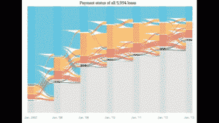
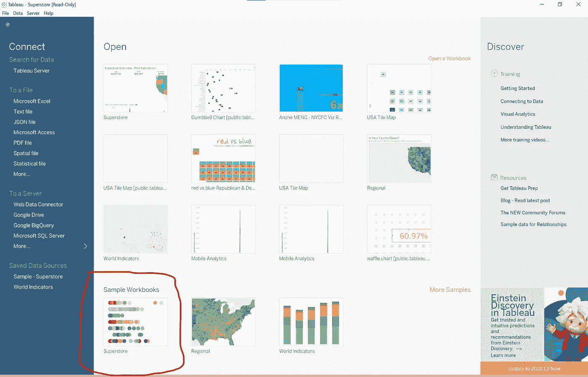
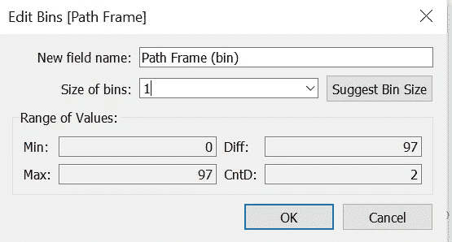
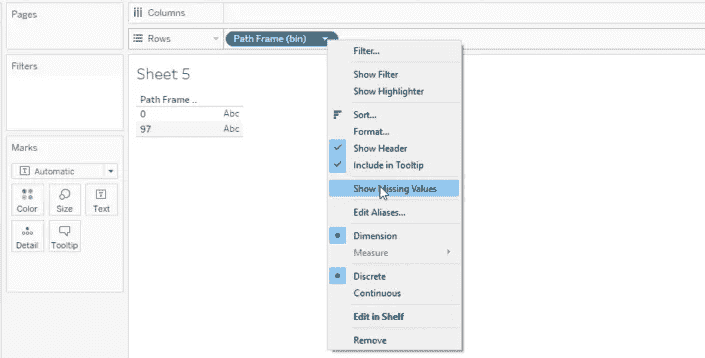
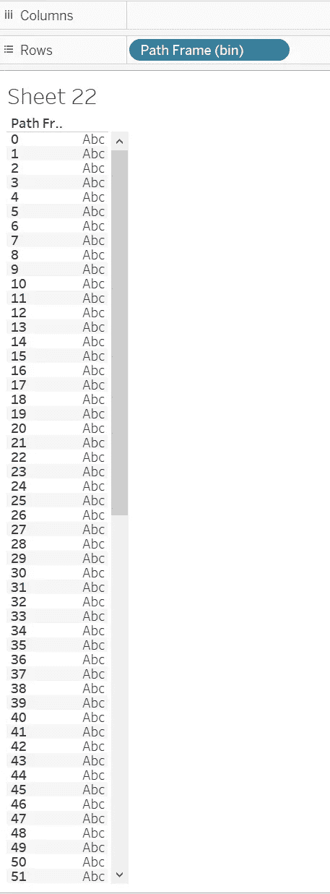
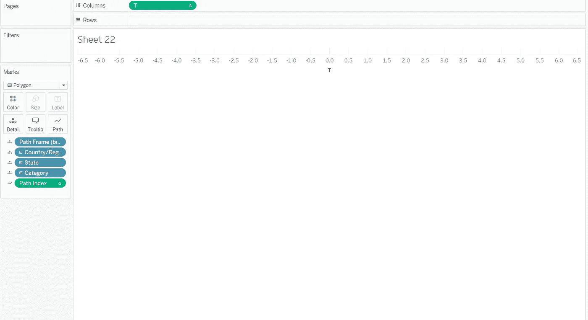
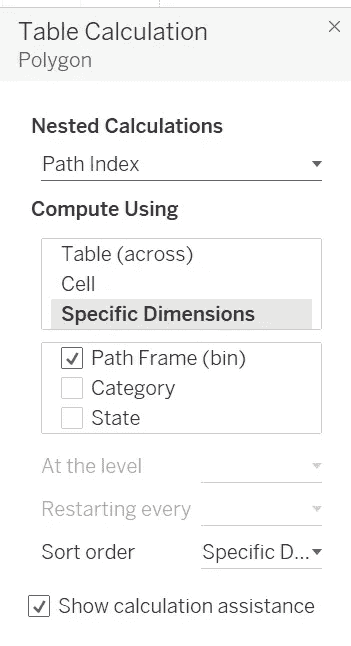
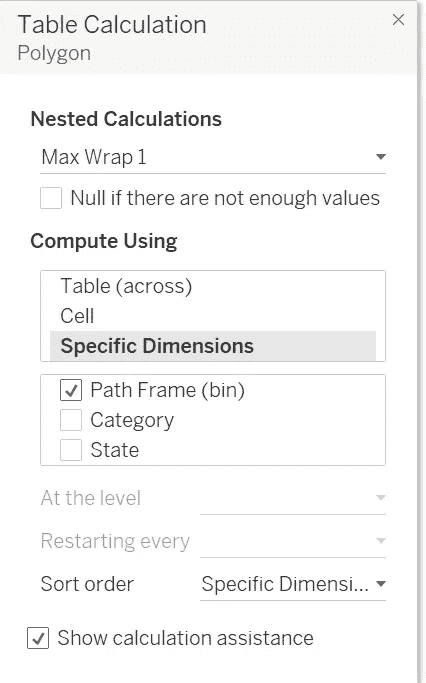
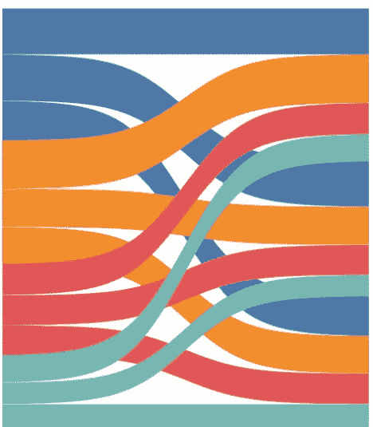

# 让您的仪表板脱颖而出—桑基图

> 原文：<https://pub.towardsai.net/make-your-dashboard-stand-out-sankey-diagram-c2ead0201aa6?source=collection_archive---------0----------------------->

图片由 tableau.com 拍摄

## [数据可视化](https://towardsai.net/p/category/data-visualization)

## 打动你的观众和老板！

对我来说，Tableau 是唯一一种允许我作为艺术家进行数据科学研究的工具。然而，如果每个人都用 Tableau 做同样的可视化，那就没什么意思了。这篇文章是我的系列文章“让你的仪表板脱颖而出”中的一集，该系列文章为你提供了一些精彩但非默认的可视化想法。如果你对我来说是新的，一定要看看下面的文章:

 [## 让你的仪表盘脱颖而出——哑铃图表

### 让你的仪表盘脱颖而出——哑铃图表

让你的仪表盘脱颖而出——哑铃 Chartpub.towardsai.net](/make-your-dashboard-stand-out-dumbbell-chart-ae36d399e85)  [## 让您的仪表板脱颖而出—填充百分比球图

### 打动你的观众和老板！

pub.towardsai.net](/make-your-dashboard-stand-out-fill-percentage-ball-chart-cd9484b4f37f)  [## 让您的仪表板脱颖而出-虚线进度图

### 用一种创造性的选择打动你的观众！

pub.towardsai.net](/make-your-dashboard-stand-out-dotted-progress-chart-69b6a064a7d4)  [## 让您的仪表板脱颖而出—平铺地图

### 让您的仪表板脱颖而出—平铺地图

让您的仪表板脱颖而出—瓷砖 Mappub.towardsai.net](/make-your-dashboard-stand-out-tile-map-e5d0b19387e8)  [## 让你的仪表板脱颖而出-华夫格图

### 打动你的客户和老板！

pub.towardsai.net](/make-your-dashboard-stand-out-waffle-chart-70232488ebba) 

(*未完待续*

在这篇文章中，我将向您展示一个理想的选项来说明多个类别下不同实体之间的数量关系— **桑基图**。

GIF by [@wsj](https://giphy.com/wsj)

# 主意

首先，这篇文章非常感谢精彩的 YouTuber [*可视化艺术*](https://www.artofvisualization.com) 。没有他们精彩的解释，我几乎看不到桑基图的美。本文将在视频中详细阐述他们的步骤。希望你看了能有更好的学习体验！

根据 [*维基百科*](https://en.wikipedia.org/wiki/Sankey_diagram)；桑基图有

> 一种流程图，其中箭头的宽度与流速成比例。

换句话说，一个桑基图至少有两种用途:

1.  组件之间的关系被可视化；
2.  强调了重要流程。

# 履行

整个演示将使用 Tableau 提供的数据集作为示例工作簿之一:Superstore。您也可以在打开 Tableau 桌面软件时点击它来使用它:

作者图片

这个数据源主要由 3 个数据表组成:订单、人员和退货。在演示中，我将显示类别和州之间的销售关系。

## 步骤 1:创建数据加密框架

为了确保两个数据点来悬挂我们的数据增密，我们需要将我们的测量与测量的固定最小值进行比较。请注意，度量应该是“销售额”，因为我们需要可视化的是不同类别的销售额在不同的州发生了多少。因此，让我们创建一个名为“路径框架”的计算字段:

> **路径帧**
> 
> IF[Sales]= { FIXED:MIN([Sales])} th EN 0 ELSE 97 END

然后将其转换为直方图仓:

作者图片

## 第二步:索引

我们需要一个索引来测量路径上的箱的顺序。它纯粹是默认的 Index()函数，但是当您需要它时，一个特定的名称会很有帮助。

> **路径索引**
> 
> 索引()

## 步骤 3:设置 sigmoid 曲线

没有理由，我们只是喜欢看到 viz 看起来像一个 s 形。要做到这一点，我们必须有两个变量。

> **T**
> 
> 如果[路径索引] < 50
> 那么(([路径索引]-1)% 49)/4–6
> 否则 12—(([路径索引]-1)% 49)/4–6
> 结束
> 
> **乙状结肠**
> 
> 1/(1+EXP(1)^-[T])

## 步骤 4:定义流宽度的大小

优选地，我们用测量值的累积百分比来表示桑基图中手臂的力量。

> **尺寸**
> 
> SUM([销售额])/TOTAL(SUM([销售额]))

## 步骤 5:定义流的位置和大小

不同的“手臂”从下往上叠放。以下函数计算流的当前宽度、流的顶线和底线。

> **宽度**
> 
> RUNNING _ SUM([大小])

复制[Width],因此我们能够为两个维度分别创建两个最大包裹:

> **最大缠绕 1**
> 
> WINDOW _ SUM([宽度 1])
> 
> **最大缠绕 2**
> 
> WINDOW _ SUM([宽度 2])

同样，对底线定义做同样的事情:

> **最小包装 1**
> 
> WINDOW _ SUM(RUNNING _ SUM([Width 3]-[Size])
> 
> **Min Wrap 2**
> 
> WINDOW _ SUM(RUNNING _ SUM([Width 4]-[Size])

## 第六步:计算桑基图的多边形

一旦设置正确，该计算将上述所有内容结合在一起。它显示曲线的形状:

> **多边形**
> 
> 如果[Path Index] > 49
> ，则[Max Wrap]+([Max Wrap]-[Max Wrap])*[Sigmoid]
> ELSE[Min Wrap]+([Min Wrap]-[Min Wrap])*[Sigmoid]
> 结束

## 第七步:准备床单

将路径框架(框)放到行上，右键单击选择“显示缺失值”(如果未选择)。

作者图片

理想情况下，您可以看到类似这样的内容:

作者图片

然后移动路径框架(bin)到细节以及“类别”和“状态”。接下来，将[T]放在列上。最后，将标记类型更改为多边形，并将[路径索引]添加到标记卡的“路径”中。请注意，您确保[T]和[路径索引]需要使用路径框架(bin)来计算。这应该会给您留下这样的内容:

作者图片

## 步骤 8:添加多边形

将[多边形]添加到行中。我认为在设置确定之前，你看不到你想看的东西:

作者图片

作者图片

所以现在，希望你能看到这样的东西:

作者图片

# 在我走之前…

谢谢你坚持到最后！我希望你能复制我展示给你的东西，并在你的作品中加入一些创意！:)