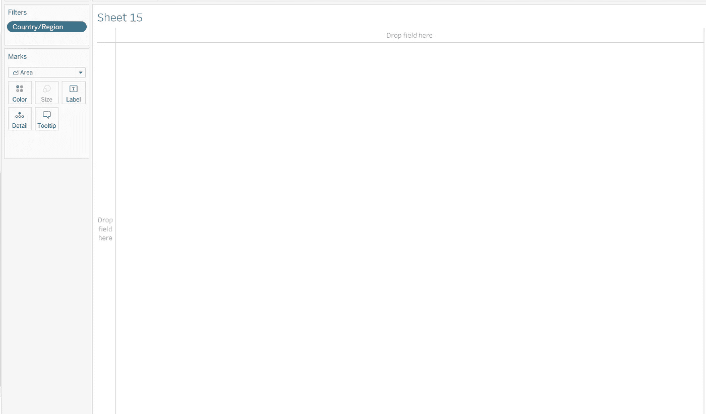
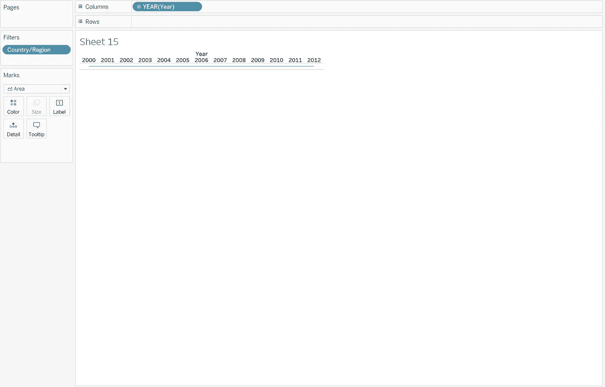
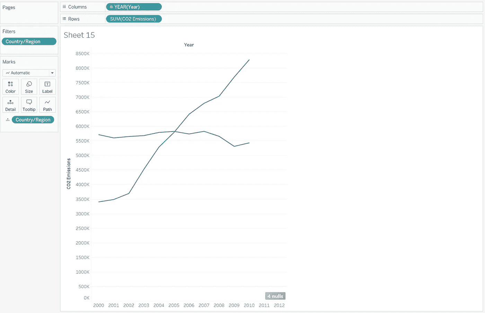
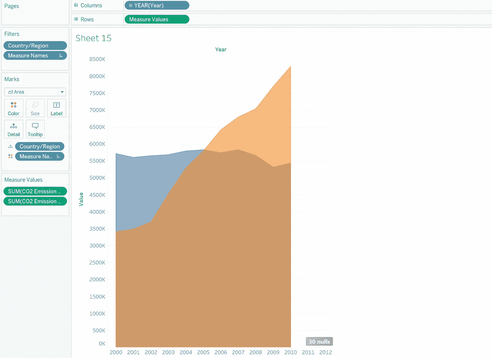
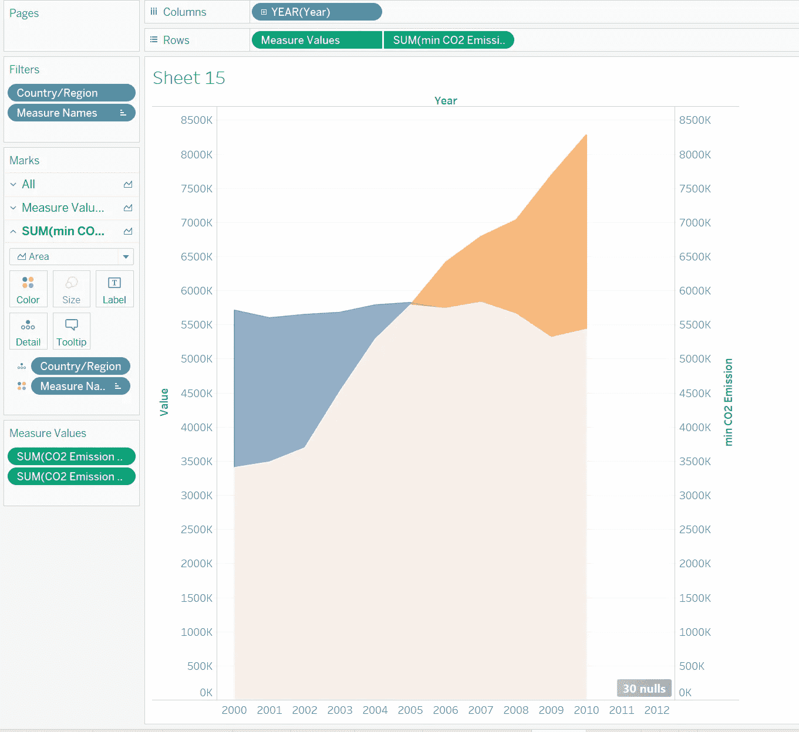
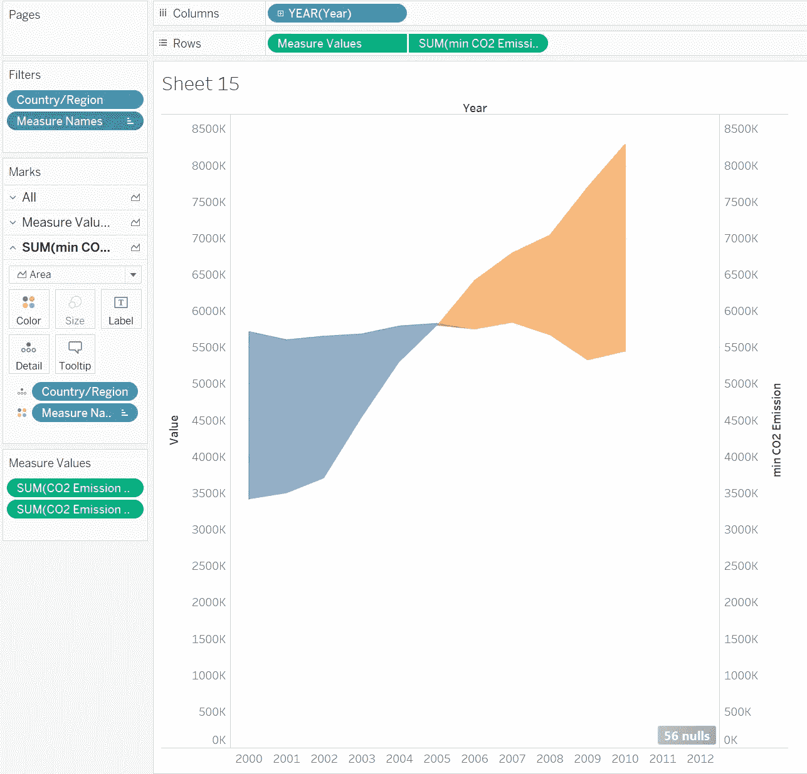

# 让您的仪表盘脱颖而出—斜率图表

> 原文：<https://pub.towardsai.net/make-your-dashboard-stand-out-slope-chart-7b565a0bb35b?source=collection_archive---------0----------------------->


图片由 Tableau.com 拍摄

## [数据可视化](https://towardsai.net/p/category/data-visualization)

## 打动你的观众和老板！

对我来说，Tableau 是唯一一种能让我像艺术家一样做数据科学的工具。然而，如果每个人都用 Tableau 做同样的可视化，那就没什么意思了。本文是我的系列文章“*让你的仪表盘脱颖而出*”中的一集，该系列文章为你提供了一些出色但非默认的可视化想法。如果你对我来说是新的，一定要看看下面的文章:

[](/make-your-dashboard-stand-out-word-cloud-8426255df94a) [## 让您的仪表盘脱颖而出— Word Cloud

### 打动你的观众和老板！

pub.towardsai.net](/make-your-dashboard-stand-out-word-cloud-8426255df94a) [](/make-your-dashboard-stand-out-fill-percentage-ball-chart-cd9484b4f37f) [## 让您的仪表板脱颖而出—填充百分比球图

### 打动你的观众和老板！

pub.towardsai.net](/make-your-dashboard-stand-out-fill-percentage-ball-chart-cd9484b4f37f) [](/make-your-dashboard-stand-out-dumbbell-chart-ae36d399e85) [## 让你的仪表盘脱颖而出——哑铃图表

### 让你的仪表盘脱颖而出——哑铃图表

让你的仪表盘脱颖而出——哑铃 Chartpub.towardsai.net](/make-your-dashboard-stand-out-dumbbell-chart-ae36d399e85) [](/make-your-dashboard-stand-out-waffle-chart-70232488ebba) [## 让你的仪表板脱颖而出-华夫格图

### 打动你的客户和老板！

pub.towardsai.net](/make-your-dashboard-stand-out-waffle-chart-70232488ebba) [](/make-your-dashboard-stand-out-dumbbell-chart-ae36d399e85) [## 让你的仪表盘脱颖而出——哑铃图表

### 让你的仪表盘脱颖而出——哑铃图表

让你的仪表盘脱颖而出——哑铃 Chartpub.towardsai.net](/make-your-dashboard-stand-out-dumbbell-chart-ae36d399e85) 

(*未完待续*

在本帖中，我要介绍一个折线图的变量:**斜率图**。


由[**@ justviralnet**](https://giphy.com/channel/justviralnet)**上**[**giphy.com**](https://giphy.com/)

# 主意

我们都喜欢有一个尽可能信息丰富的图表。作为显示一个度量(即时间)的趋势的常用可视化方法，如果在一个图表中放置多条线，折线图很容易说明不同变量之间的相对差异。然而，这些差异的差别并不明显。

例如，我们想在一个孩子被称为年轻人之前，比较他和他妈妈的身高。很有可能孩子在 16 岁生日之前不会垂直超过他的母亲，这可以通过一个双线图表很容易地可视化。但是我们能知道什么时候差距缩小得最厉害吗？是的，我们能，但是它需要我们多一点努力。

所以斜率表是像我这样视力不好的人的救星。它突出了两条线之间的差距，这样我们就可以更容易地看到这种差异在一年、一个月或一周内是如何变化的。

# 履行

你首先需要打开默认数据集“世界指示器”。我们的目标是可视化不同国家/地区多年来二氧化碳排放的变化。为了便于演示，我只选择了中国和美国作为我们余下工作的两个国家。

首先，我们应该创建两个新的计算字段: *CO2 排放量 CN* 和 *CO2 排放量 US* 。这两个数字分别代表这两个国家每年累积的二氧化碳排放量。

```
CO2 Emission CN:IF [Country/Region] = 'China' THEN
[CO2 Emissions]
ENDCO2 Emission US:IF [Country/Region] = 'United States' THEN
[CO2 Emissions]
END
```

然后将药丸“*国家/地区*”拖入过滤卡，勾选“中国”和“美国”。



作者图片

因为变化应该反映在时间上，“年”是 x 轴的变量。换句话说，把它放进列架里。



作者图片

将另一个“国家/地区”从数据窗格拖到行架上。为了分别显示中国和美国，您还应该在详细标记卡中填写“国家/地区”。



作者图片

因为我们需要展示线条之间的间隙，所以这里需要面积图，接下来您需要做的是将图形样式从“自动”切换到“面积”。请注意，您可能需要通过设置“分析”选项卡下的“堆叠标记”来确保面积图没有堆叠。



作者图片

接下来，只要我们用背景的相同颜色覆盖区域的重叠部分，就只会显示“间隙”。因此，我们的解决方案是创建另一个计算场，首先测量中美之间二氧化碳排放量的最小值，然后操纵这个变量的颜色。

```
min CO2 Emission:
{FIXED YEAR([Year]): MIN(SUM([CO2 Emission CN]), SUM([CO2 Emission US]))}
```

再次拖动该变量至行，确保**双轴+同步轴**启用。



作者图片

在这里，我们非常接近我们的最终工作，但还有一件事要记住:不要忘记设置不透明度为 100%。如果您按照我介绍的那样做，您可能会看到以下效果:



作者图片

# 在我走之前…

如果你能再一次在这里成功，那就太棒了！现在留给你的是选择想要的颜色来代表该地区的赤字和盈余，并在此之外做一些事情。想一想:我们能做些什么来比较中国、印度和美国的排放量呢？