# 让您的仪表盘脱颖而出—阳光图表

> 原文：<https://pub.towardsai.net/make-your-dashboard-stand-out-sunshine-chart-7e6049d6b5a7?source=collection_archive---------4----------------------->


图片由 Tableau.com 拍摄

## [数据可视化](https://towardsai.net/p/category/data-visualization)

## 打动你的观众和老板！

对我来说，Tableau 是唯一一种能让我像艺术家一样做数据科学的工具。然而，如果每个人都用 Tableau 做同样的可视化，那就没什么意思了。这篇文章是我的系列文章“让你的仪表板脱颖而出”中的一集，该系列文章为你提供了一些精彩但非默认的可视化想法。如果你对我来说是新的，一定要看看下面的文章:

[](/make-your-dashboard-stand-out-waterfall-chart-7aa090653e7d) [## 让您的仪表板脱颖而出—瀑布图

### 打动你的观众和老板！

pub.towardsai.net](/make-your-dashboard-stand-out-waterfall-chart-7aa090653e7d) [](/make-your-dashboard-stand-out-dotted-progress-chart-69b6a064a7d4) [## 让您的仪表板脱颖而出-虚线进度图

### 用一种创造性的选择打动你的观众！

pub.towardsai.net](/make-your-dashboard-stand-out-dotted-progress-chart-69b6a064a7d4) [](/make-your-dashboard-stand-out-waffle-chart-70232488ebba) [## 让你的仪表板脱颖而出-华夫格图

### 打动你的客户和老板！

pub.towardsai.net](/make-your-dashboard-stand-out-waffle-chart-70232488ebba) [](/make-your-dashboard-stand-out-radial-pie-guage-chart-482ecc7c80f8) [## 让您的仪表板脱颖而出—棒棒糖图表

### 打动你的客户和老板！

pub.towardsai.net](/make-your-dashboard-stand-out-radial-pie-guage-chart-482ecc7c80f8) [](/make-your-dashboard-stand-out-dumbbell-chart-ae36d399e85) [## 让你的仪表盘脱颖而出——哑铃图表

### 让你的仪表盘脱颖而出——哑铃图表

让你的仪表盘脱颖而出——哑铃 Chartpub.towardsai.net](/make-your-dashboard-stand-out-dumbbell-chart-ae36d399e85) 

(*未完待续*

在这篇文章中，我将为你的画面带来阳光！

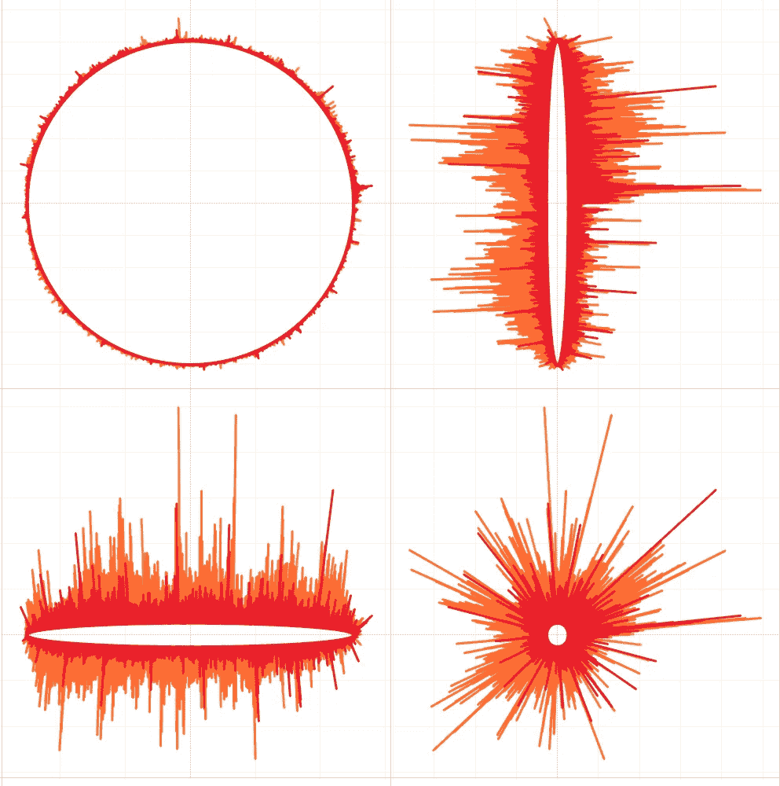

作者图片

# 主意

坦率地说，我真的不知道是否有人将这种图表命名为“阳光”。也许有些人更喜欢称之为径向条形图，因为它们的性质。然而，这可能是不明确的，因为[径向管规图](/make-your-dashboard-stand-out-radial-pie-guage-chart-db052e5909b3)也可能是相关的。所以我个人更倾向于称之为我的方式，这样大家更容易记住。

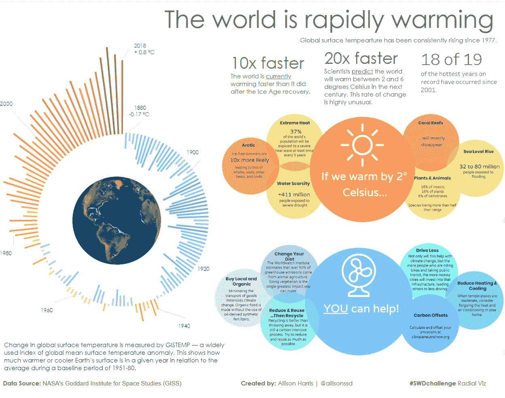

日照图的一个非凡例子(图片由[艾莉森·哈里斯](https://public.tableau.com/app/profile/allison6190)拍摄)

正如我提到的，它们是一堆围绕一个圆圈的柱状图。现在，在下一节中，我将介绍将水平条形图绑定到圆形条形图的方法。该指令将通过解释如何分别实现一个*基本条形图*和*堆叠一个*来显示。


这就是为什么我把它命名为“阳光”的灵感(图片由 [ipicgr](https://pixabay.com/users/ipicgr-2249158/?utm_source=link-attribution&utm_medium=referral&utm_campaign=image&utm_content=1492818) 来自 [Pixabay](https://pixabay.com/?utm_source=link-attribution&utm_medium=referral&utm_campaign=image&utm_content=1492818) )

# 履行

像往常一样，我使用 Tableau 提供的示例数据源“股票”,您可以在示例工作簿“世界指标”中找到它。

有了数据源，我们首先要做的就是联盟本身。老实说，我真的不知道如何在 Tableau 中简单地做到这一点，我字面上导出到一个 CSV 文件，并复制现有的行。

然后创建一个新列来区分该行是原始的还是复制的。这一步将帮助我们定位酒吧的每个部分。

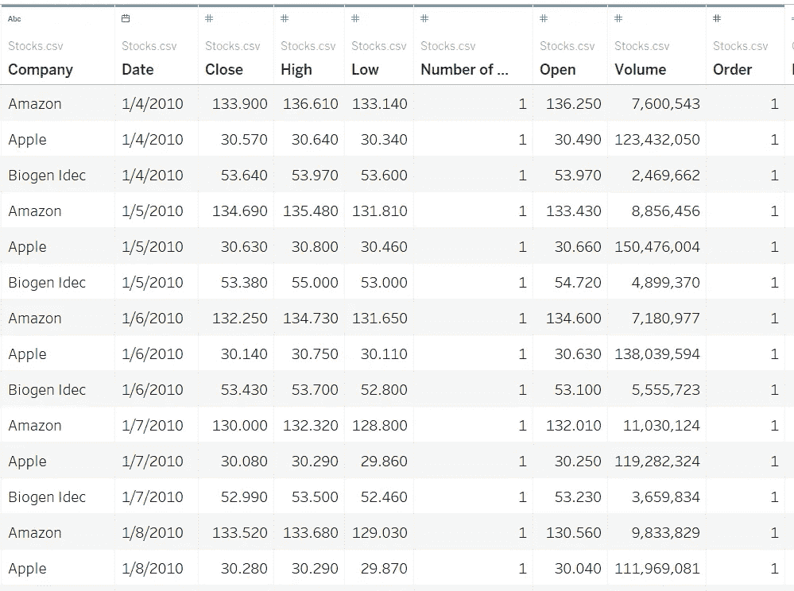

目前，这是我们的表的样子，同时有一个新的列指示它的行是原始的还是重复的。(图片由作者提供)

## 基本条形图

先说基础条形图。这里需要两个参数。

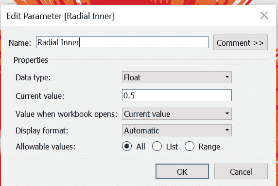

作者图片

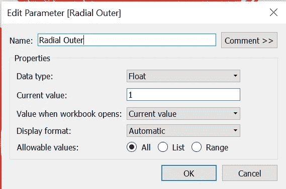

作者图片

“径向内”可以被认为是“太阳”(内圆)的径向长度，“径向外”是“射线”(外圆)的最大可能长度。

做完这些，我们就能定义射线的长度。因此，这是唯一可添加的数字，我只是用“*卷*一栏来演示。

```
Radial Length:[Radial Inner] + IIF(ATTR([Order])=0,0,SUM([Volume]) / TOTAL(SUM([Volume])))
```

计算字段“径向长度”反映了每天股票交易量的绝对差异。当行中有“径向长度”,列中有“Index()-1 ”,颜色为“公司”时，应该是这样的:

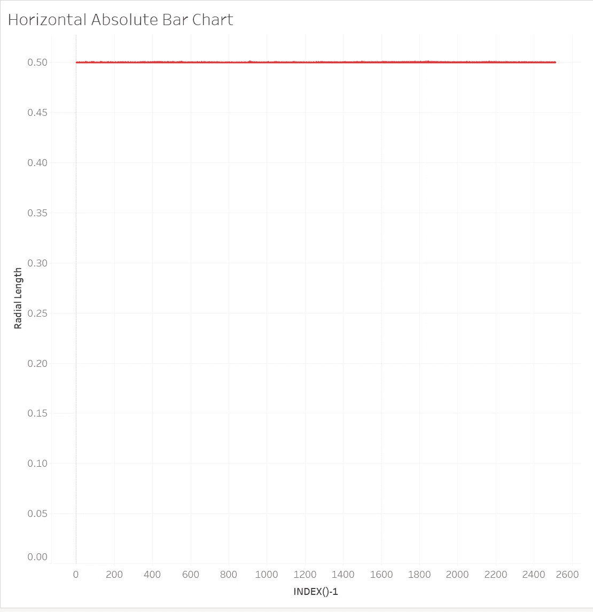

小节之所以不从 0.0 开始，是因为我考虑到了“径向内”。这将有助于圆形图表完成时的视觉效果。(图片由作者提供)

接下来，我定义了另一个计算字段“径向角度”，并根据行索引顺时针放置数据:

```
Radial Angle:
(INDEX() - 1) * (1/WINDOW_COUNT(COUNT([Volume]))) * 2 * PI()
```

最后，通过计算角度和长度，可以获得它们在轴空间上的 X-Y 坐标:

```
Radial X:
[Radial Normalized Length] * COS([Radial Angle])Radial Y:
[Radial Normalized Length] * SIN([Radial Angle])
```

所以现在，当你完成以下步骤时:

*   拖拽**径向 X** 到*列，*
*   拖放**径向 Y** 到*行，*
*   拖拽**公司**到*颜色，*
*   将**日期**拖放到*明细*，并将其转换为精确的**日，**
*   在标记类型中选择**线图**，拖动&下拉**命令**到*路径*
*   使用**日期** *设置**径向 X** 、**径向 Y** 进行计算；*

你应该看到这样的视觉效果:

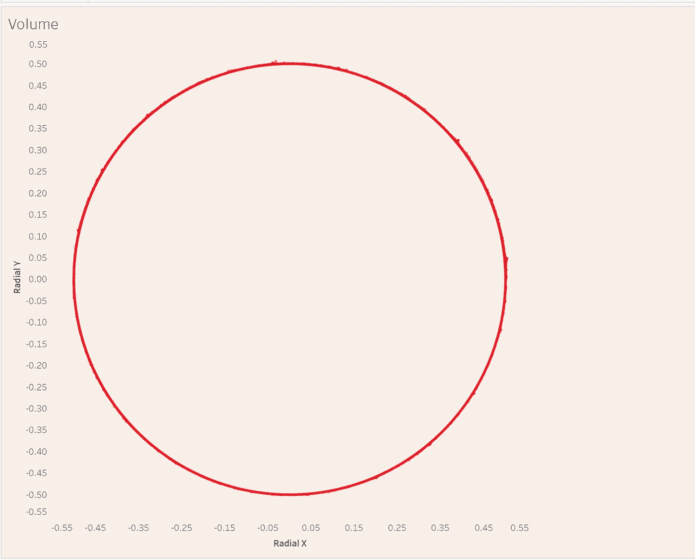

看不到日照图的美？不要担心，请继续阅读！(图片由作者提供)

## 堆积条形图

与基础的主要区别是角度的定义。这是因为现在我们将根据日期时间顺序显示数据。所以两个新变量是必要的。首先，我需要一个新的索引列，它是使用 Date(它的最深单元)计算的:

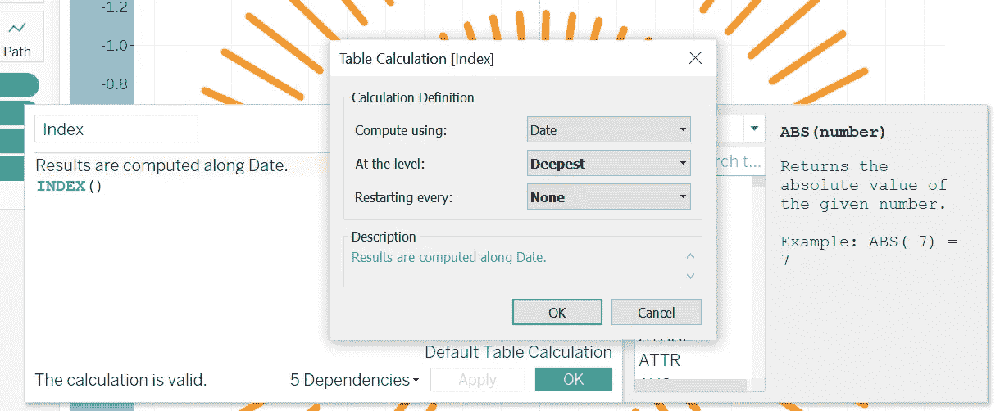

作者图片

第二，用这个指数来定义日期在一个圆内的角度:

```
Stack Angle:
([Index] - 1) / 
TOTAL(SUM(
{ FIXED YEAR([Date]) : MAX(DATEPART('week', [Date]))}
)) * 2 * PI()
```

另一方面，因为我知道我在日级别上工作，所以应该建立一些日级别的计算。

```
Amazon Volume / Day :
{FIXED DATETRUNC('day', [Date]): SUM(IF [Company] = 'Amazon' THEN [Volume] END)}Apple Volume / Day : 
{FIXED DATETRUNC('day', [Date]): SUM(IF [Company] = 'Apple' THEN [Volume] END)}Biogen Volume / Day :
{FIXED DATETRUNC('day', [Date]): SUM(IF [Company] = 'Biogen Idec' THEN [Volume] END)}Volume / Day : 
{FIXED DATETRUNC('day', [Date]): SUM([Volume])}
```

我们需要控制每个小节的开始和结束位置。这就是“*订单*创建的目的:

```
Absolute Location:

IF [Order] = 1
THEN CASE [Company]
WHEN 'Amazon' THEN 0
WHEN 'Apple' THEN [Amazon Volume / Day]
WHEN 'Biogen Idec' THEN ([Amazon Volume / Day] + [Apple Volume / Day])
END
ELSE
CASE [Company]
WHEN 'Amazon' THEN [Amazon Volume / Day]
WHEN 'Apple' THEN ([Amazon Volume / Day] + [Apple Volume / Day])
WHEN 'Biogen Idec' THEN [Volume / Day]
END
END
```

而现在既然我们已经有了“*堆叠角度*和“*绝对位置*，我们就可以快速计算出它们的坐标:

```
Stacked X:
ATTR([Absolute Location]) * COS([Stack Angle])Stacked Y:
ATTR([Absolute Location]) * SIN([Stack Angle])
```

让我们看一看。每列的分配应该参照我们在简单条形图上的做法。

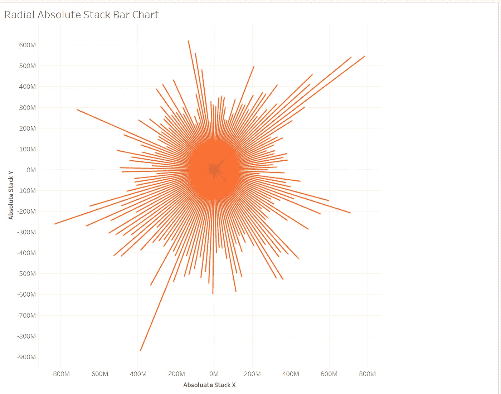

作者图片

很接近，但是我猜你可能对视觉效果不满意。尤其是不包括中圈。我的解决方案是通过硬编码距离来格式化一些漂亮的空间。

```
Absolute Location:

500000000 + 
IF [Order] = 1
THEN CASE [Company]
WHEN 'Amazon' THEN 0
WHEN 'Apple' THEN [Amazon Volume / Day] + 500000000
WHEN 'Biogen Idec' THEN ([Amazon Volume / Day] + [Apple Volume / Day]) + 500000000 * 2
END
ELSE
CASE [Company]
WHEN 'Amazon' THEN [Amazon Volume / Day]
WHEN 'Apple' THEN ([Amazon Volume / Day] + [Apple Volume / Day]) + 500000000
WHEN 'Biogen Idec' THEN [Volume / Day] + 500000000 * 2
END
END
```

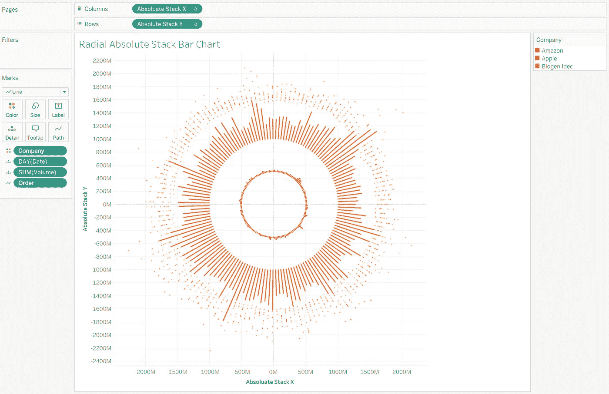

作者图片

# 改进

之前我只是谈论了如何使用阳光效果来反映数据的绝对值。然而，并不总是需要承认特定的价值。例如，在我们的案例中，也许人们只需要知道每只股票何时达到其交易量的峰值，而不管准确的股票数量；他们可能只知道一个交易日内不同股票的比例，而不知道总数。

这就是使用相对图表的情况。从本质上讲，将图表转换为相对刻度是一个标准化的问题。

## 径向相对条形图

你一定不要被那些几乎看不见棒线的绝对图表所困扰。这是因为我们的数据样本是如此之大，而没有一个单一的组成部分占很大的比例。相对条形图很有帮助，因为它比较了单个成分与其类别中总成分的比例。为此，只需要做一个改变:修改*径向长度*的公式:

```
Radial Normalized Length:
[Radial Inner] + IIF(ATTR([Order])=0,0,SUM([Volume]) / WINDOW_MAX(SUM([Volume])) * ([Radial Outer] - [Radial Inner]))
```

因为我创建了一个新字段，所以 X，Y 坐标也应该相应地更改:

```
Radial Normalized X:
[Radial Normalized Length] * COS([Radial Angle])Radial Normalized Y:
[Radial Normalized Length] * SIN([Radial Angle])
```

所以现在，viz 将提供更多信息:

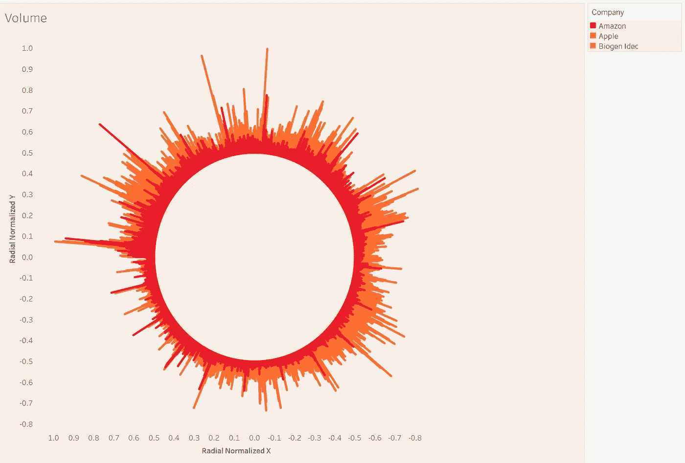

作者图片

## 径向相对堆栈条形图

与基本的不同，相对堆叠条形图中光线的最大长度是固定的(1 + [ *径向内部* ])，这需要您堆叠每个组件的百分比，而不是它们的具体值。此外，改变间隙尺寸总是非常优选的。

```
Location:
0.3 + 
IF [Order] = 1
THEN CASE [Company]
WHEN 'Amazon' THEN 0
WHEN 'Apple' THEN [Amazon Volume / Day] / [Volume / Day] + 0.3
WHEN 'Biogen Idec' THEN ([Amazon Volume / Day] + [Apple Volume / Day]) / [Volume / Day] + 0.6
END
ELSE
CASE [Company]
WHEN 'Amazon' THEN [Amazon Volume / Day] / [Volume / Day]
WHEN 'Apple' THEN ([Amazon Volume / Day] + [Apple Volume / Day]) / [Volume / Day] + 0.3
WHEN 'Biogen Idec' THEN 1 + 0.6
END
END
```

有了它，X & Y 就像:

```
Stack X:
ATTR([Location]) * COS([Stack Angle])Stack Y:
ATTR([Location]) * SIN([Stack Angle])
```

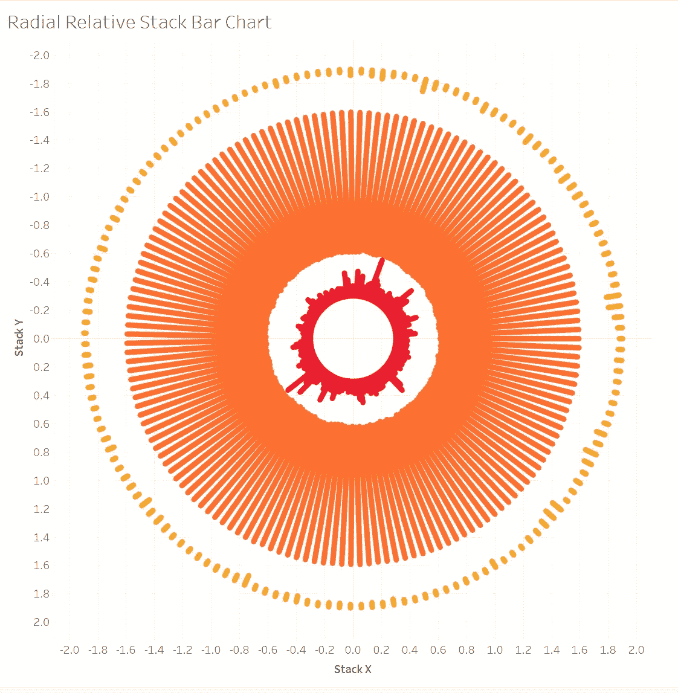

作者图片

# 结论

搞定了。你离数据禅宗之路又近了一步！如果你对我的工作有什么意见，即如何在 Tableau 上将数据源与它本身完全结合，请在评论中告诉我！

如果你对我的实际工作感兴趣，可以看看下面的链接:

[https://public . tableau . com/app/profile/Memphis 4346/viz/sunshine chart/RadialRelativeBarChart](https://public.tableau.com/views/SunshineChart/HorizontalRelativeBarChart?:language=en-US&publish=yes&:display_count=n&:origin=viz_share_link)