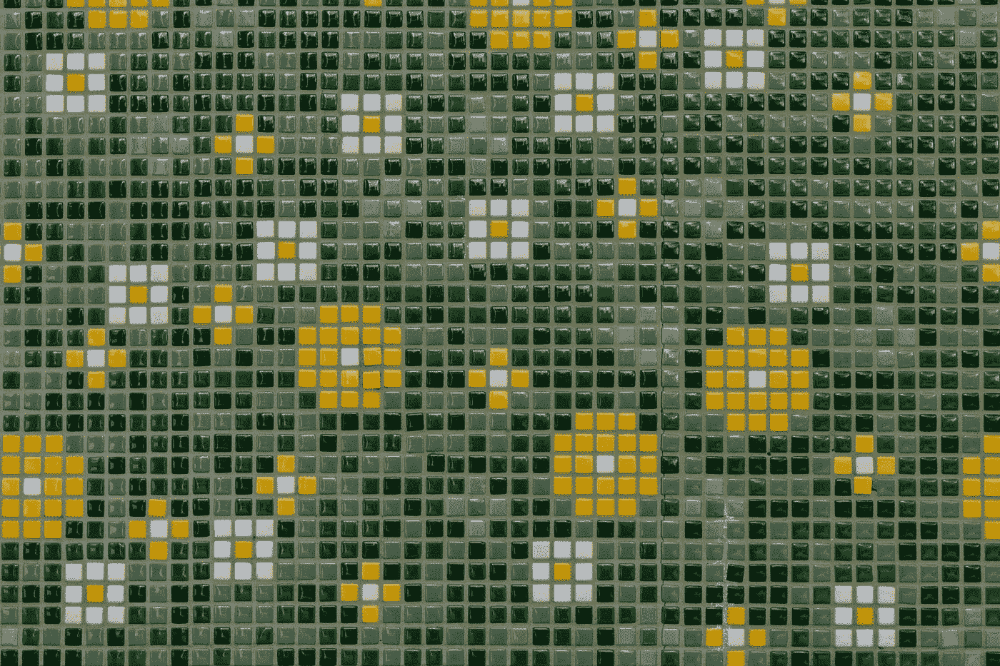
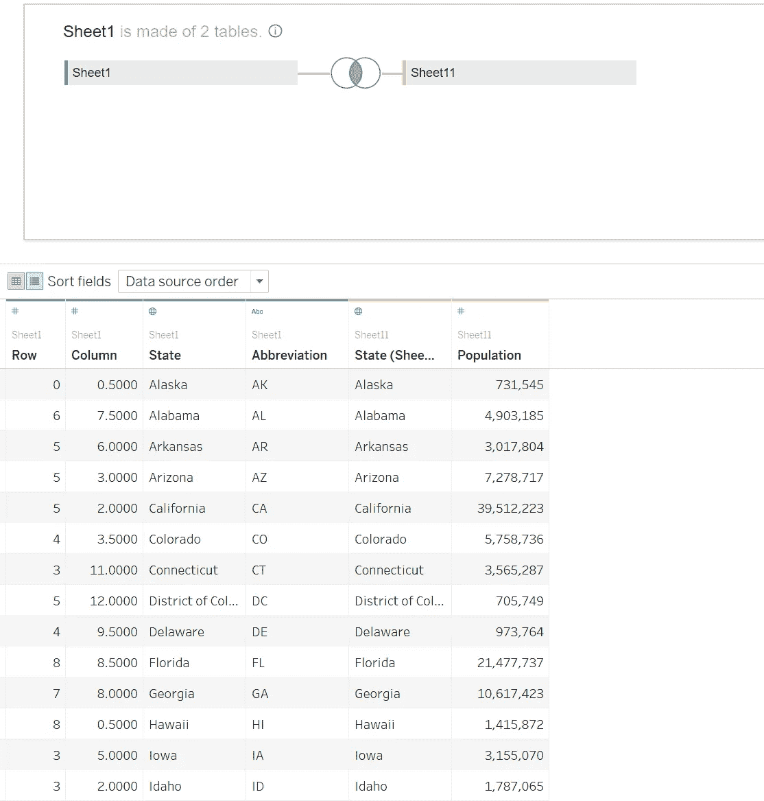
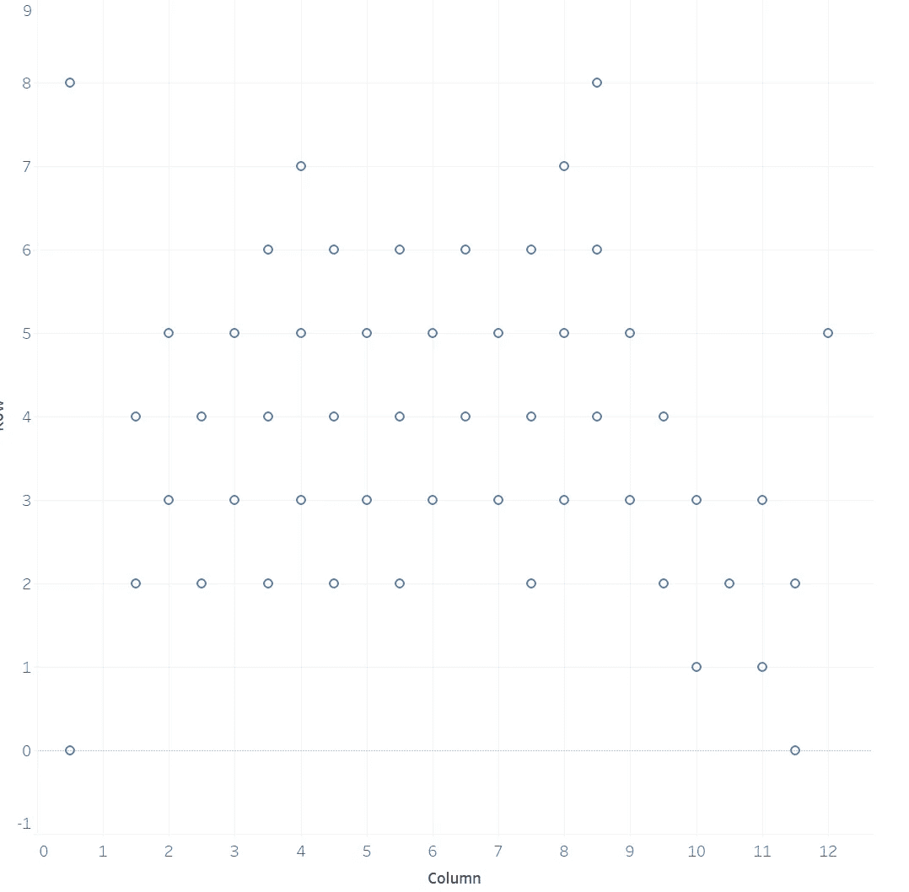
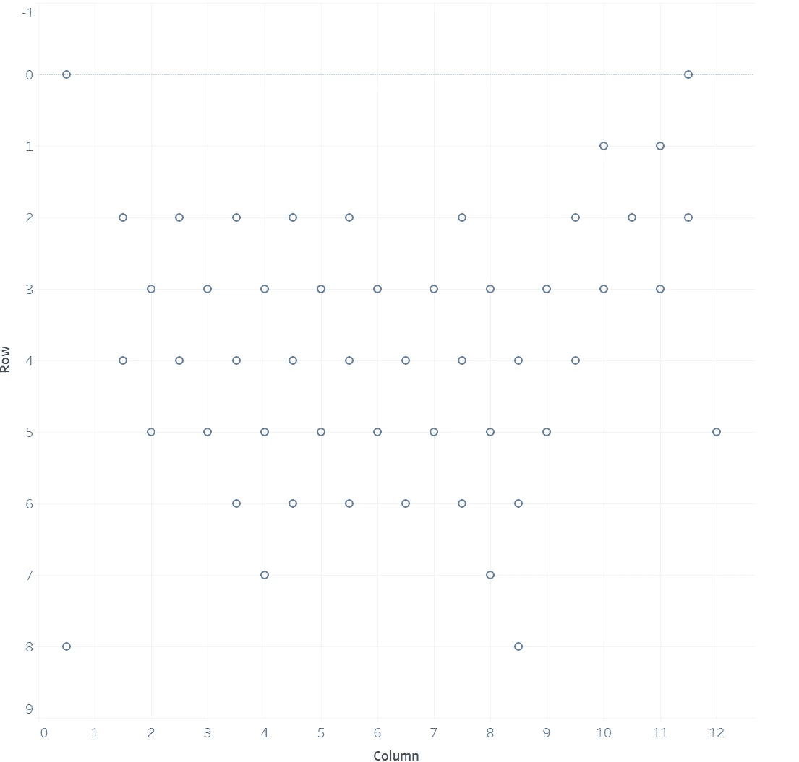
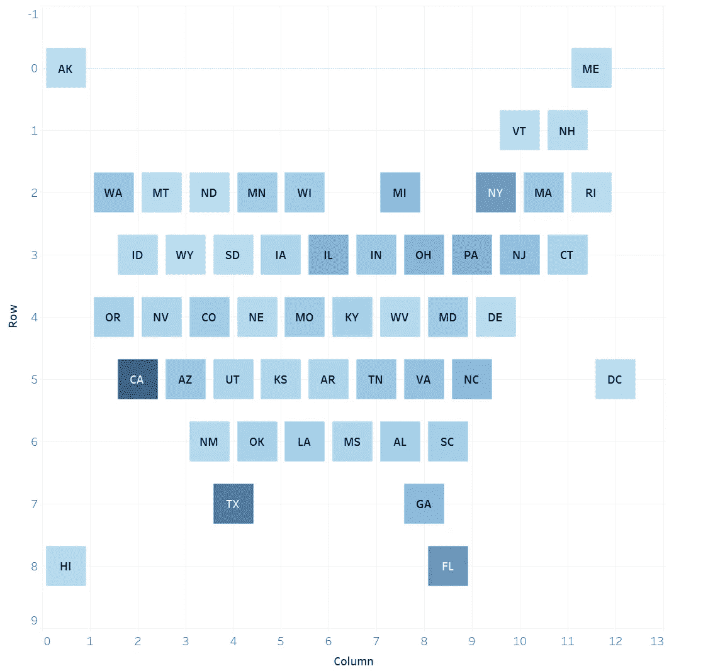
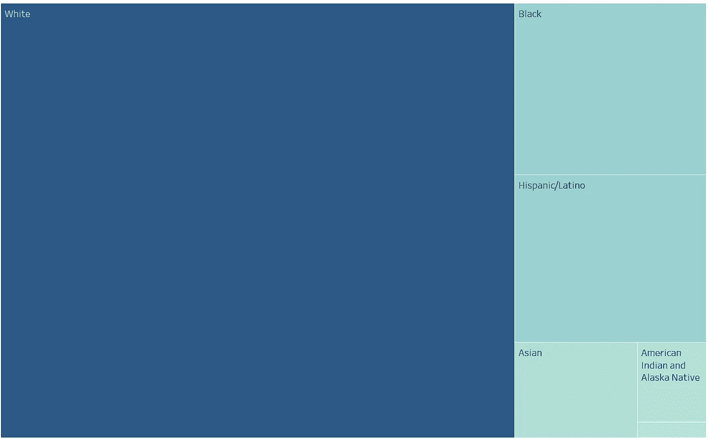
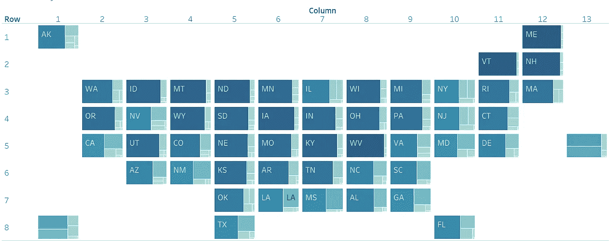

# 让您的仪表板脱颖而出—平铺地图

> 原文：<https://pub.towardsai.net/make-your-dashboard-stand-out-tile-map-e5d0b19387e8?source=collection_archive---------3----------------------->

图片由 Tableau.com 拍摄

## [数据可视化](https://towardsai.net/p/category/data-visualization)

## 打动你的客户和老板！

对我来说，Tableau 是唯一一种允许我作为艺术家进行数据科学研究的工具。然而，如果每个人都用 Tableau 做同样的可视化，那就没什么意思了。本文是我的系列文章“*让你的仪表盘脱颖而出*”中的一集，该系列文章为你提供了一些出色但非默认的可视化想法。如果你对我来说是新的，一定要看看下面的文章:

 [## 让你的仪表板脱颖而出-华夫格图

### 打动你的客户和老板！

pub.towardsai.net](/make-your-dashboard-stand-out-waffle-chart-70232488ebba)  [## 让您的仪表板脱颖而出-虚线进度图

### 用一种创造性的选择打动你的观众！

pub.towardsai.net](/make-your-dashboard-stand-out-dotted-progress-chart-69b6a064a7d4)  [## 让您的仪表板脱颖而出—填充百分比球图

### 打动你的观众和老板！

pub.towardsai.net](/make-your-dashboard-stand-out-fill-percentage-ball-chart-cd9484b4f37f)  [## 让你的仪表盘脱颖而出——哑铃图表

### 让你的仪表盘脱颖而出——哑铃图表

让你的仪表盘脱颖而出——哑铃 Chartpub.towardsai.net](/make-your-dashboard-stand-out-dumbbell-chart-ae36d399e85) 

(*未完待续*

在这篇文章中，我将向你介绍一种显示全州信息的简单方法:**平铺地图**。

照片由[米切尔罗](https://unsplash.com/@mitchel3uo?utm_source=unsplash&utm_medium=referral&utm_content=creditCopyText)在 [Unsplash](https://unsplash.com/?utm_source=unsplash&utm_medium=referral&utm_content=creditCopyText) 拍摄

# 主意

您是否曾经遇到过这样的情况:尽管地理位置不同，但您需要可视化不同州的数据？例如，您将展示每个州的居民的政治倾向，而州的形状或边界不发挥作用。

如果有，tilemap 应该有用。Tilemap 是马赛克艺术的灵感来源。想象一幅只有微小像素(或瓷砖)组成的彩色图片，有时看这样一件艺术品真的很开心！

# 履行

作为一名数据可视化专家，也就是数据科学领域的艺术家，你一定想知道这是怎么做到的。为此，首先应该有一个州位置的数据表。也就是说，这应该是一个包含模拟美国彼此相对位置的行和列的值的表。如果需要，您可以提取我的[数据](https://drive.google.com/file/d/1BCon34bNoJRQi3acfarO8DFQ3ezFFJ4P/view?usp=sharing)。

有了这些，将这个表与您自己的数据源进行内部连接。例如，我将可视化每个州的人口，人口普查数据已经可以访问。下图是我如何将两个表连接在一起的:

作者图片

接下来发生的事情与我的[华夫饼图](/make-your-dashboard-stand-out-waffle-chart-70232488ebba)帖子中的一个步骤非常相似:我将我的“行”和“列”分别拖放到**行**和**列**中，并禁用要聚合的度量。

作者图片

很接近了，是吧？现在你看到的是一张颠倒的美国地图，这是因为我提供的位置数据表将州从北到南排序，这需要你反转垂直轴。

作者图片

这就对了。你离另一个杰作只有两步之遥！为了使这种视觉愉悦，有必要调整尺寸并选择标记形状。最后，将数字数据维度(比如人口)插入色卡。

作者图片

提示:使用六边形并使它看起来像一个蜂巢也很流行。

# 要多份的

它还可以在一个地图上显示每个州的各自情况，因此，我们可以创建一堆单独的图表，同时将它们平铺在一个图表中。

例如，我想使用平铺网格地图查看每个州不同种族的比例。为了做到这一点，我们可以先从一个树状图开始，不考虑州的差异，树状图告诉我们种族在国内的分布。

作者图片

之后，需要进行“列”和“行”从度量到维度的转换。当您将维度“列”和“行”分别拖动到工具架上，并在“演示”中选择“树图”时，可以看到平铺网格中的树图集合。

作者图片

# 在我走之前…

综上所述，在平铺网格中可视化地图并不难，重要的是设计一个易于理解的定位网格。而且，这一点套用到其他任何国家或地区，都是相当直观的。

关于这篇文章的任何细节，请随时查看我的[图库](https://public.tableau.com/profile/memphis4346#!/vizhome/USATileMap_16194163153650/Sheet3?publish=yes)。