# 让你的仪表板脱颖而出-华夫格图

> 原文：<https://pub.towardsai.net/make-your-dashboard-stand-out-waffle-chart-70232488ebba?source=collection_archive---------1----------------------->

图片由 tableau.com 拍摄

## [数据可视化](https://towardsai.net/p/category/data-visualization)

## 打动你的客户和老板！

对我来说，Tableau 是唯一一种允许我作为艺术家进行数据科学研究的工具。然而，如果每个人都用 Tableau 做同样的可视化，那就没什么意思了。本文是我的系列文章“*让你的仪表盘脱颖而出*”中的一集，该系列文章为你提供了一些出色但非默认的可视化想法。如果你对我来说是新的，一定要看看下面的文章:

 [## 让您的仪表板脱颖而出—平铺地图

### 让您的仪表板脱颖而出—平铺地图

让您的仪表板脱颖而出—瓷砖 Mappub.towardsai.net](/make-your-dashboard-stand-out-tile-map-e5d0b19387e8)  [## 让您的仪表板脱颖而出-虚线进度图

### 用一种创造性的选择打动你的观众！

pub.towardsai.net](/make-your-dashboard-stand-out-dotted-progress-chart-69b6a064a7d4)  [## 让您的仪表板脱颖而出—填充百分比球图

### 打动你的观众和老板！

anzhemeng.medium.com](https://anzhemeng.medium.com/make-your-dashboard-stand-out-fill-percentage-ball-chart-cd9484b4f37f)  [## 让你的仪表盘脱颖而出——哑铃图表

### 让你的仪表盘脱颖而出——哑铃图表

让你的仪表盘脱颖而出——哑铃 Chartpub.towardsai.net](/make-your-dashboard-stand-out-dumbbell-chart-ae36d399e85) 

(*未完待续*

在这篇文章中，我将向你展示另一种显示百分比数据的方法:一个**华夫饼图**。

亚历山大·布西在 [Unsplash](/s/photos/waffle-chart?utm_source=unsplash&utm_medium=referral&utm_content=creditCopyText) 上拍摄的照片

# 主意

华夫格图是一个由小单元格组成的网格，其中的彩色单元格代表实现目标的进度或完成百分比。它之所以得名是因为如上图所示的一个显而易见的原因。

为了实现 Tableau 中的华夫饼图表，我们应该在开始时设置一个 10X10 的网格来显示每个百分比。然后我们需要相应地区分细胞。也就是说，如果有一个 *60%* 的记录，我们应该给前 60 个涂上颜色，而让其余的保持纯色。

# 履行

## 数据准备

要建立一个 10X10 的网格，需要另一个数据集分别显示行、列和百分比的索引(请参考下表)。如果你需要，请随时查看我的[数据摘录](https://drive.google.com/file/d/1X08Do6kPhNQofpEMiFszktRf4JEcM0Ni/view?usp=sharing)。

当您有了这个提取之后，请确保将其添加为新的数据源:

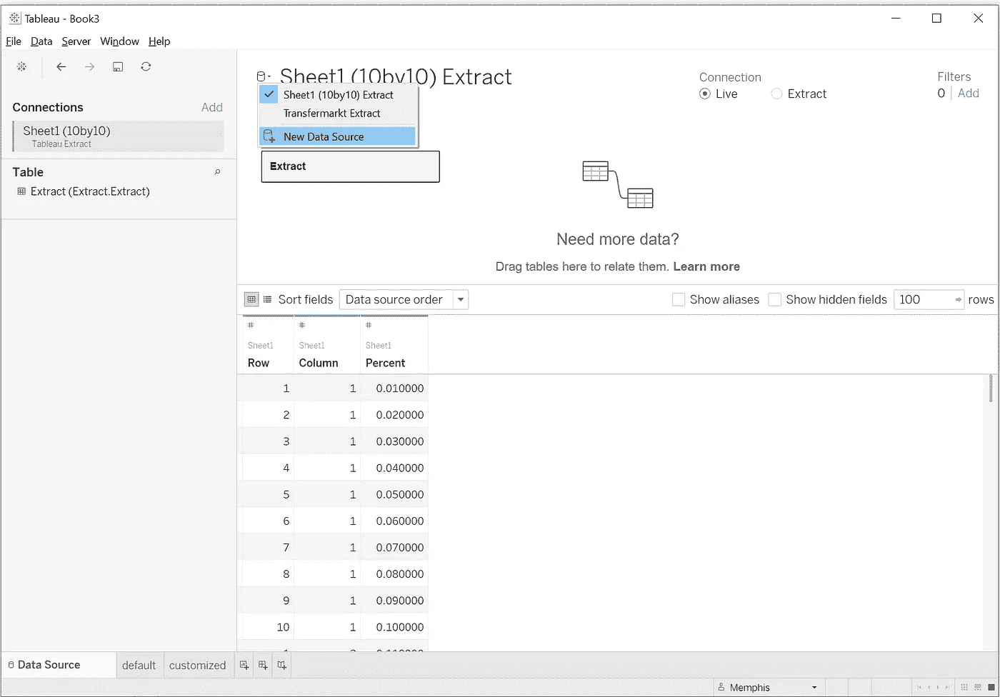

作者图片

选择“更多”在“到一个文件”栏下:

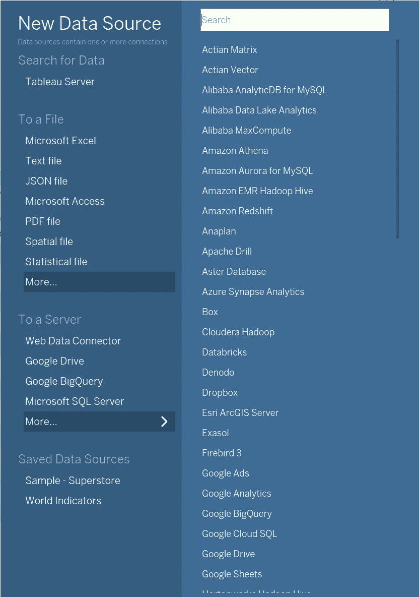

作者图片

最后，选择目录下的 tableau extract:

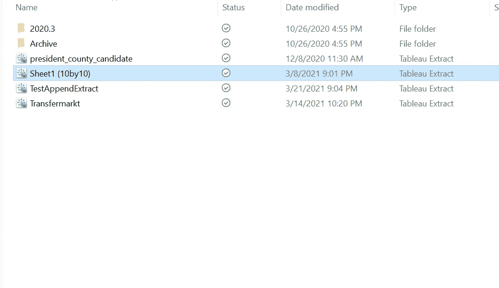

作者图片

## 格子

创建新的工作表后，将您的“行”和“列”分别拖放到**行**和**列**中。现在，您可能会看到一个聚合，即只有一个点，因此您现在需要做的是取消选择**分析**下的“聚合度量”。这将分别显示斑点。

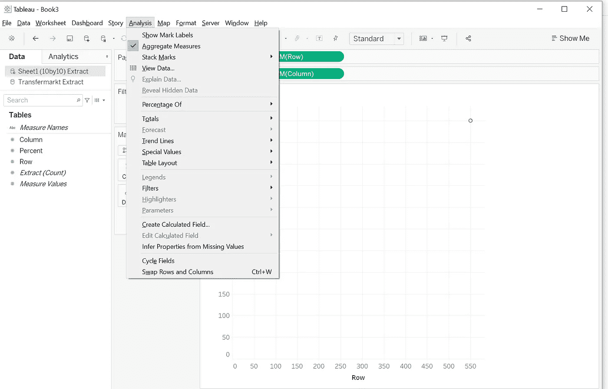

作者图片

在这里，您可以看到网格中放置了 100 个点。为了使它看起来更像华夫饼，您可以选择“形状”卡中的“正方形”标记，并增加标记的大小:

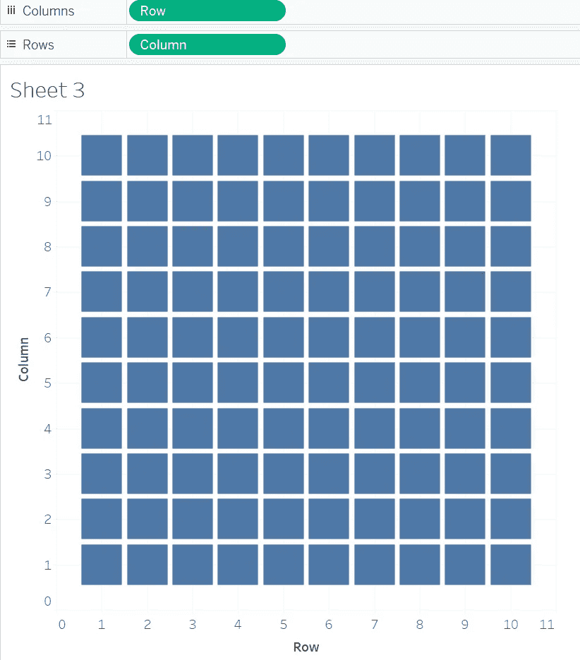

作者图片

## 显示百分比

例如，我需要展示 2010 年大联盟和 CSL 之间的平均分钟比率，下面是我的数据集的样子:

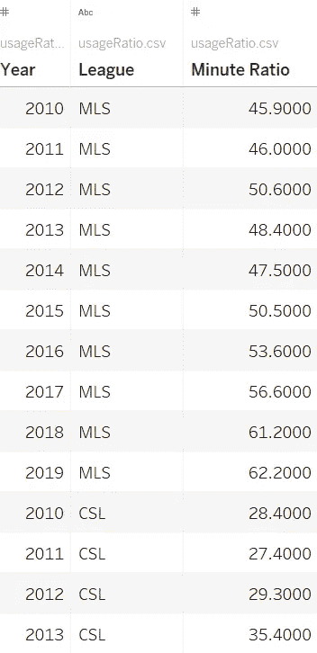

作者图片

为此，我们需要一个新的计算字段来表示标记的颜色。以下计算字段根据斑点的百分比是否小于我要显示的比率来区分斑点。

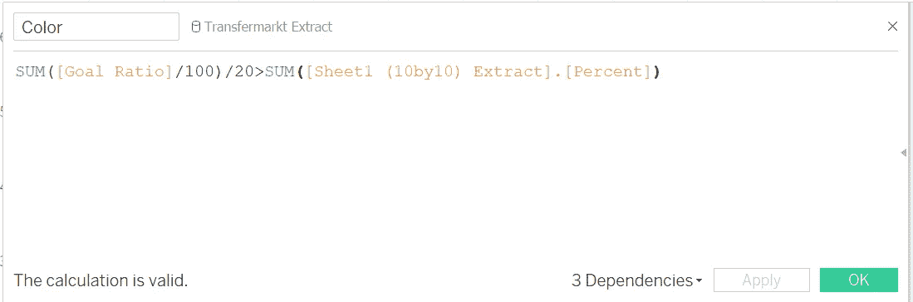

作者图片

当您将此测量拖放到色卡中时，您会看到:

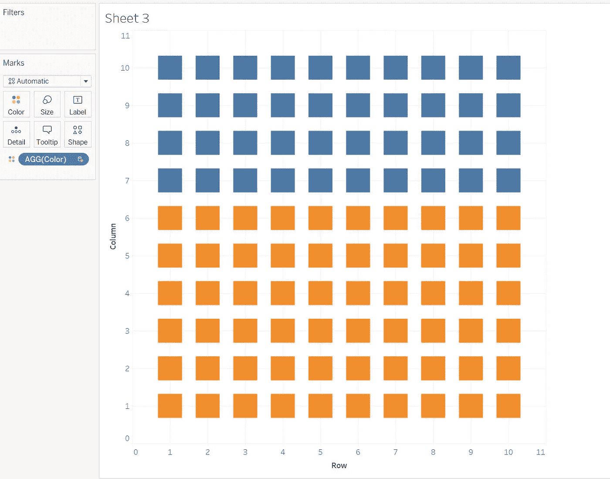

作者图片

可以肯定地说，华夫饼干图已经做得差不多了，接下来就是我们的装修了。

首先，我们可以考虑其他可以强调比例的颜色。我的选择是用浅灰色代表“*假”*，而令人愉悦的颜色代表“*真*”。

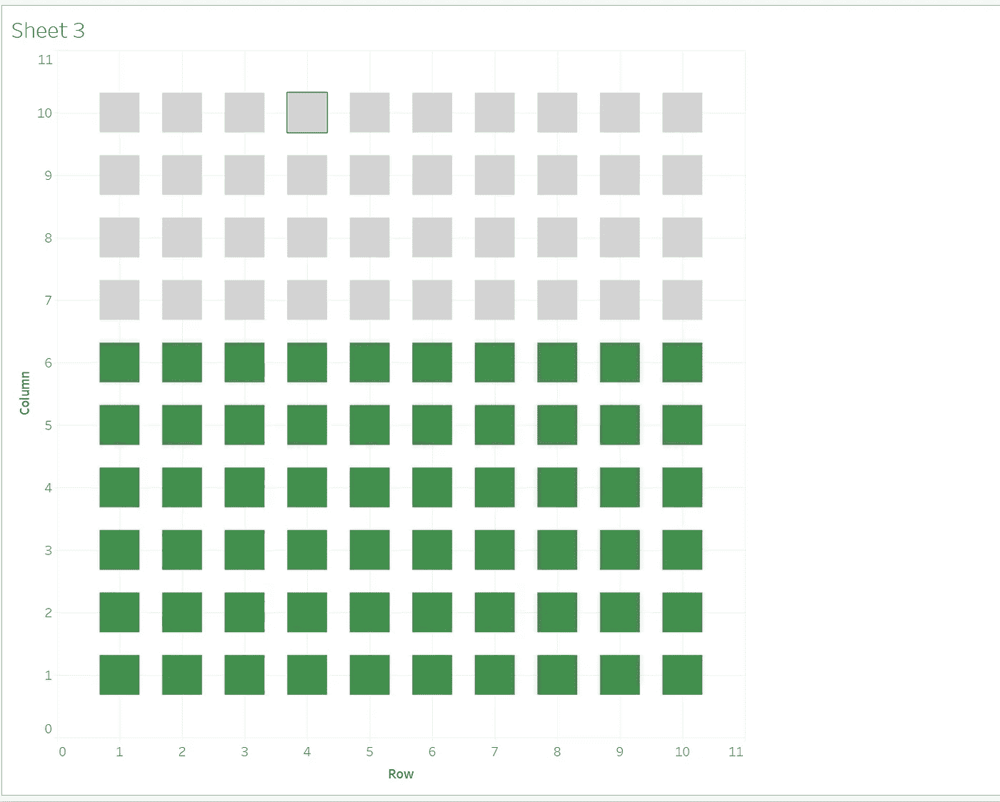

作者图片

另一方面，我们也可以通过注释在工作表上明确地打印出比例。在我的例子中，我需要将一个计算所有记录平均值的新字段放入明细卡，然后右键单击工作表中的任何灰色方块，选择“批注”下的“*标记…* ”。下面的图片是你暂时应该看到的。

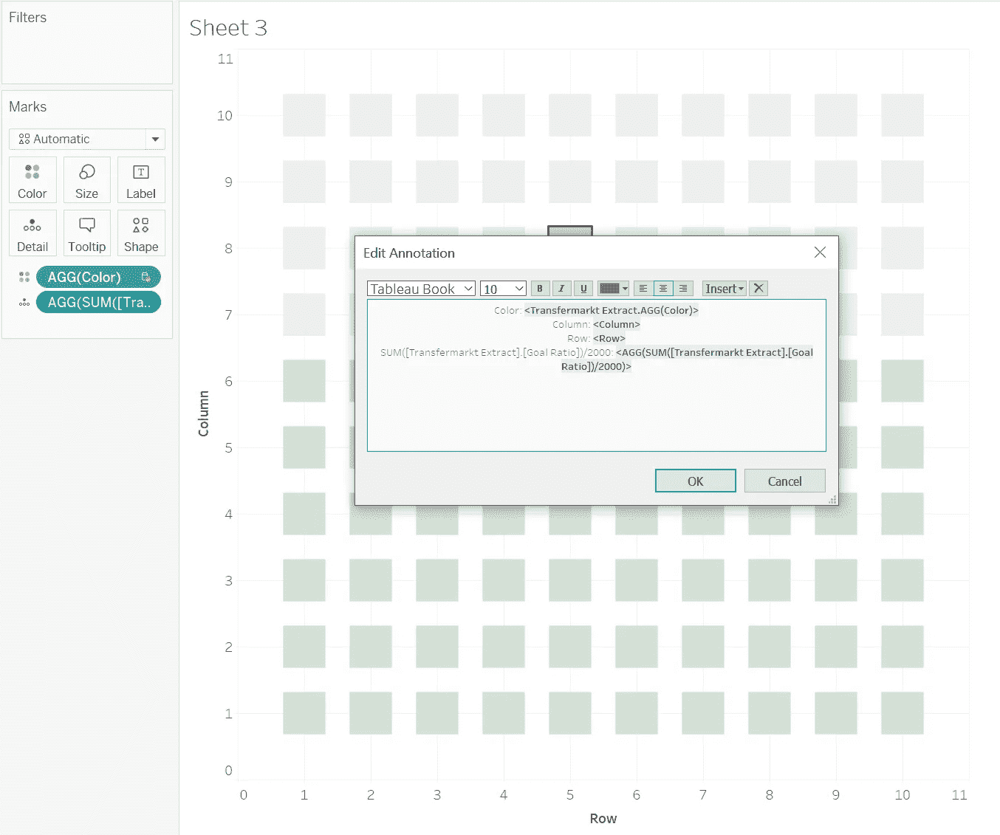

作者图片

因为只有百分比是必要的，我们可以简单地删除前三行，引入第四行。请注意，您也可以在这个阶段切换到所需的字体和大小。

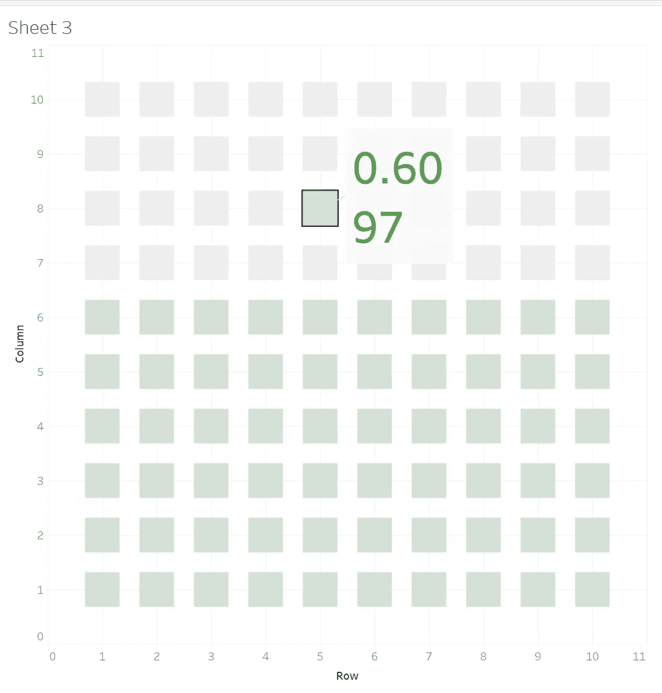

作者图片

接下来，右键单击工作表中的任意位置，将数值转换为百分比格式。选择用于显示百分比的聚合字段。切换到*窗格*选项卡，将**数字**改为百分比。

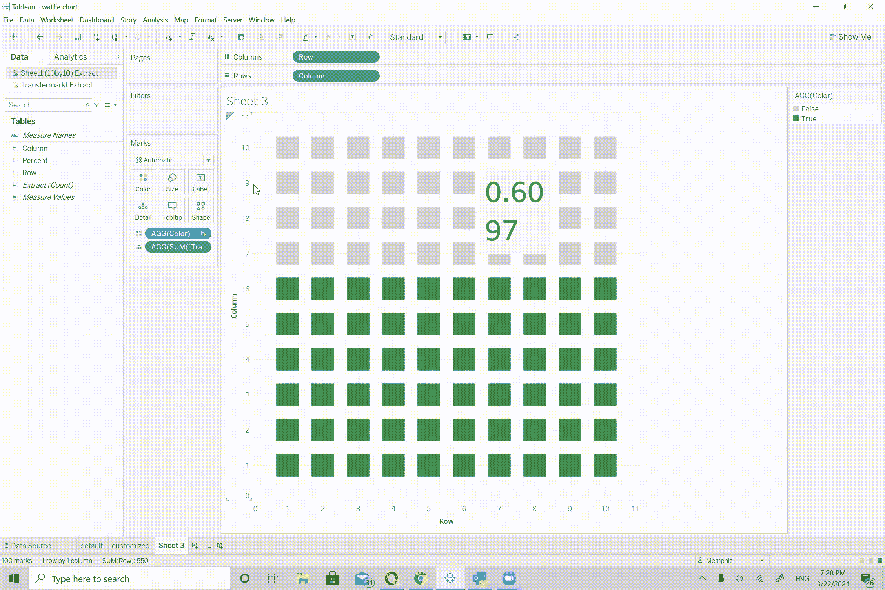

作者图片

## 定制标记

华夫饼图表也不一定要看起来像华夫饼！因此，如果你喜欢其他图标，只需在“形状”卡中选择你最喜欢的图标。然而，如果你想要两种不同颜色的定制产品，这会妨碍你。

但是在 Tableau 中没有什么是不可能的。在这一节中，我将介绍一种让图标以不同方式显示的变通方法。您所要做的就是将另一个“行”度量拖到您的“行”庇护所中，启用双轴，最后，同步轴。

作者图片

# 最终作品

就是这样！这里是我所有关于使用 Tableau 的华夫饼图表的分享。关于这篇文章的任何细节，请随意查看我的[图库](https://public.tableau.com/profile/memphis4346#!/vizhome/wafflechart_16164576218560/default?publish=yes)。

 [## Tableau 公共

### 编辑描述

public.tableau.com](https://public.tableau.com/profile/memphis4346#!/vizhome/wafflechart_16164576218560/default?publish=yes)