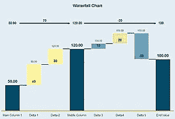
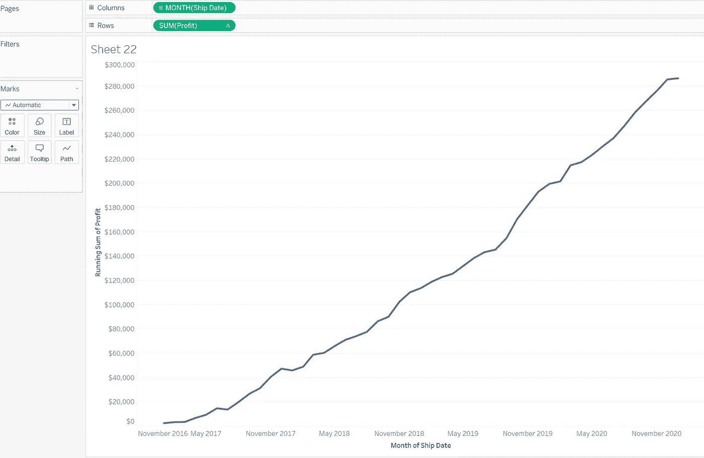
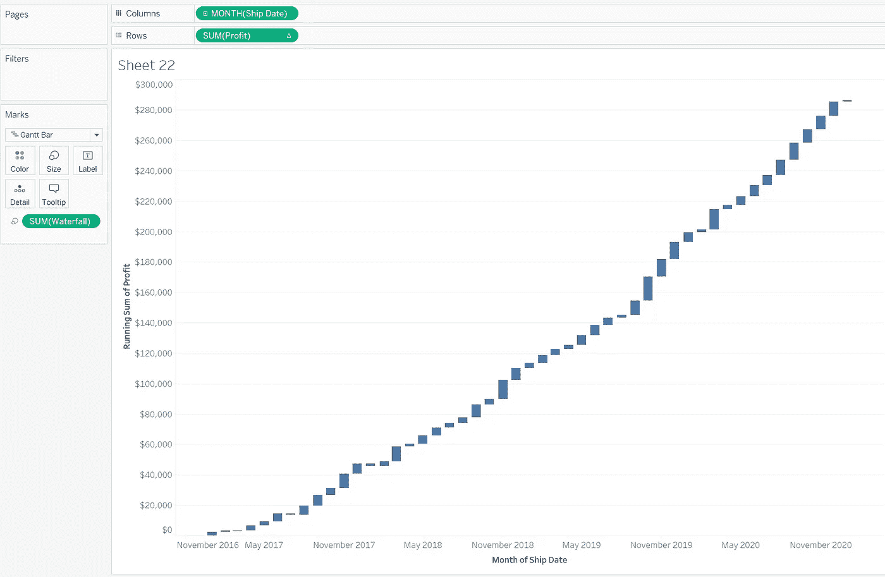
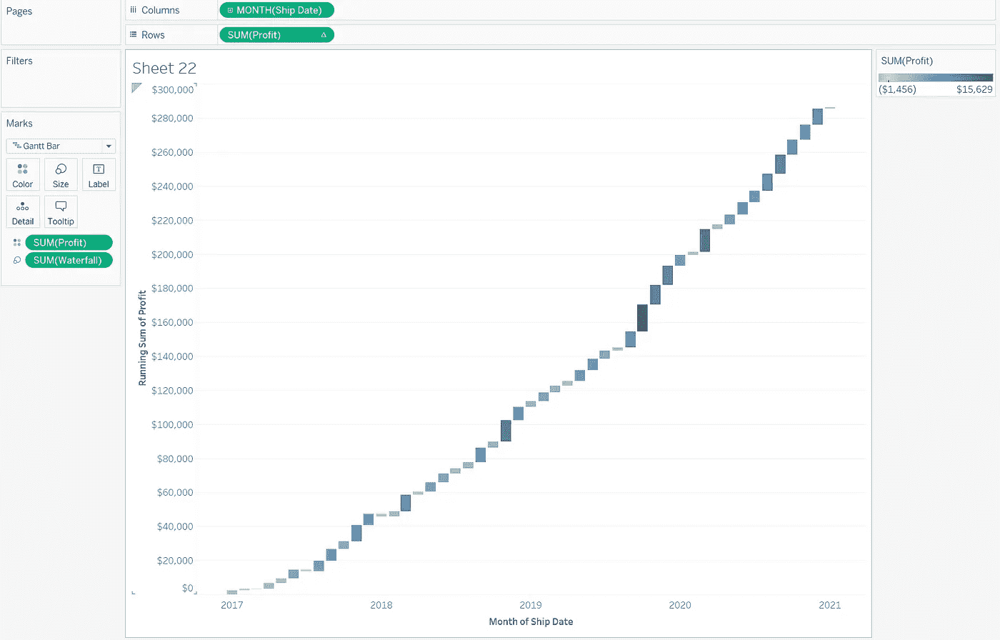
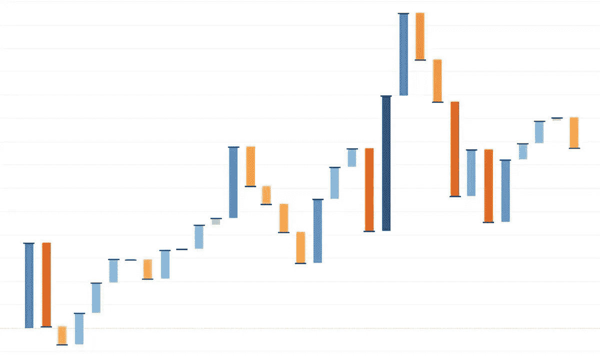
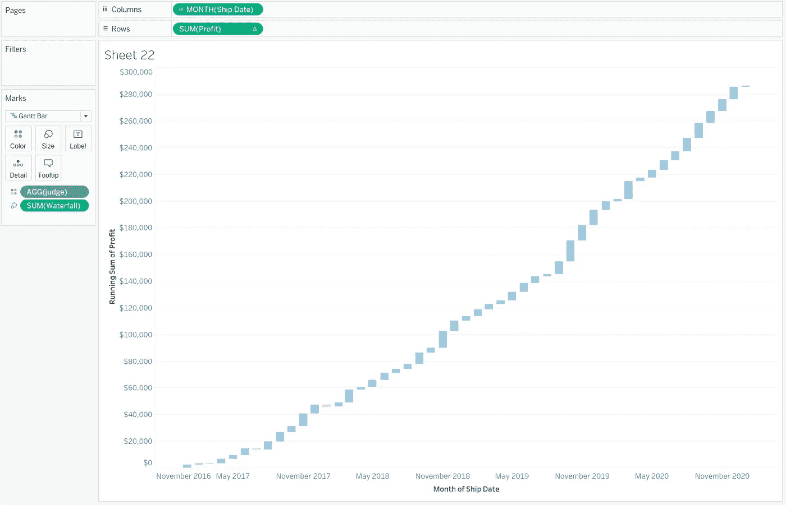

# 让您的仪表板脱颖而出—瀑布图

> 原文：<https://pub.towardsai.net/make-your-dashboard-stand-out-waterfall-chart-7aa090653e7d?source=collection_archive---------5----------------------->


图片由 Tableau.com 拍摄

## [数据可视化](https://towardsai.net/p/category/data-visualization)

## 打动你的观众和老板！

对我来说，Tableau 是唯一一种能让我像艺术家一样做数据科学的工具。然而，如果每个人都用 Tableau 做同样的可视化，那就没什么意思了。本文是我的系列文章“*让你的仪表盘脱颖而出*”中的一集，该系列文章为你提供了一些出色但非默认的可视化想法。如果你对我来说是新的，一定要看看下面的文章:

[](/make-your-dashboard-stand-out-slope-chart-7b565a0bb35b) [## 让您的仪表盘脱颖而出—斜率图表

### 打动你的观众和老板！

pub.towardsai.net](/make-your-dashboard-stand-out-slope-chart-7b565a0bb35b) [](/make-your-dashboard-stand-out-radar-chart-34d0497eddb8) [## 让您的仪表盘脱颖而出—雷达图

### 打动你的观众和老板！

pub.towardsai.net](/make-your-dashboard-stand-out-radar-chart-34d0497eddb8) [](/make-your-dashboard-stand-out-waffle-chart-70232488ebba) [## 让你的仪表板脱颖而出-华夫格图

### 打动你的客户和老板！

pub.towardsai.net](/make-your-dashboard-stand-out-waffle-chart-70232488ebba) [](/make-your-dashboard-stand-out-likert-chart-part-1-f8613f204c1a) [## 让您的仪表板脱颖而出—李克特图表(第 1 部分)

### 打动你的观众和老板！

pub.towardsai.net](/make-your-dashboard-stand-out-likert-chart-part-1-f8613f204c1a) [](/make-your-dashboard-stand-out-tile-map-e5d0b19387e8) [## 让您的仪表板脱颖而出—平铺地图

### 让您的仪表板脱颖而出—平铺地图

让您的仪表板脱颖而出—瓷砖 Mappub.towardsai.net](/make-your-dashboard-stand-out-tile-map-e5d0b19387e8) 

(*未完待续*

在这篇文章中，我将介绍**瀑布图**。


照片由 [MJ Tangonan](https://unsplash.com/@mjtangonan?utm_source=unsplash&utm_medium=referral&utm_content=creditCopyText) 在 [Unsplash](https://unsplash.com/s/photos/waterfalls?utm_source=unsplash&utm_medium=referral&utm_content=creditCopyText) 上拍摄

# 主意

瀑布图是一种隐喻性的可视化，反映了一系列(通常是时间序列)的累积效应。它通过用不同的颜色和不同的垂直堆叠方向显示正值或负值来演示增量或减量。换句话说，上涨和下跌都用两种强烈对比的颜色阴影来表示，而条形根据值而上升或下降。



图片来自[维基百科](https://en.wikipedia.org/wiki/Waterfall_chart)

一般来说，瀑布图可以被认为是条形图和折线图的结合。在本文的其余部分，我将向您展示如何在 Tableau 中构建一个。

# 履行

本例基于 Tableau 桌面默认工作簿数据源“*超市*”。实际上，我们只需要两列就可以完成了:*发货日期*和*利润*。

这个瀑布图的目的是展示利润的动态变化。因此，我们可以配置一个图表，显示一段时间内的累计利润。



确保第行中的药丸正在使用表格计算“累计”。(图片由作者提供)

信不信由你，下一步可能会出乎意料。你可以试着把它转换成条形图，但是你永远得不到想要的效果。相反，你应该寻找的效果是一个甘特图。


作者图片

甘特图中的条形图代表特定月份的总利润。假设瀑布图应该反映利润，你可以指定甘特条形图的大小来代表它。在这种情况下，您需要一个名为“*瀑布*的新计算字段，它实际上是利润的相反值。然后简单的拖拽*瀑布*囊到大小卡上。

```
waterfall:-[Profit]
```



作者图片

之后，我们需要区分有赤字的月份和没有赤字的月份。通常情况下，只要你把利润胶囊上色，你就能得到你需要的东西。



作者图片

这很好，因为你不仅可以看到哪个月赚了或没赚，还可以看到你赚了或亏了多少。然而，如果颜色的跨度太长，会使两种色调如此不同，这就有点让人不知所措了。



颜色深浅变化太大。这是我想避免的。(图片由作者提供)

我的解决方法是创建一个简单的计算字段，用于判断利润是否大于零。然后把这个字段代替纯利润放到色卡上。

```
Judge:if SUM([Profit]) > 0
THEN 1
ELSE 0
END
```



当利润更有可能缩水时，它会更有用。(图片由作者提供)

# 结论

这是另一个画面设计技巧。我希望你们都能喜欢这部电影，并且每天都能学到一些关于 Tableau 的知识。如果你有任何更好的想法，请在评论中告诉我，让 Tableau 成为我们的随身可视化工具！