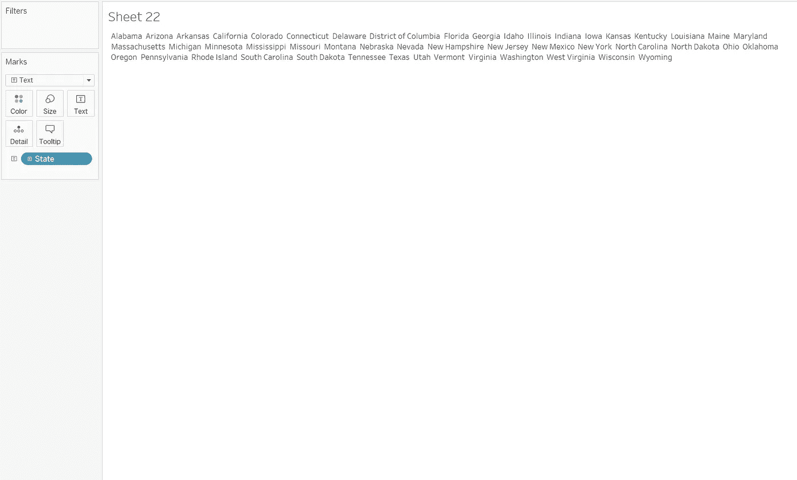
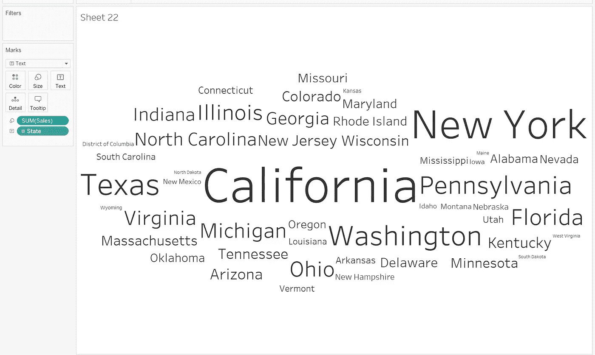
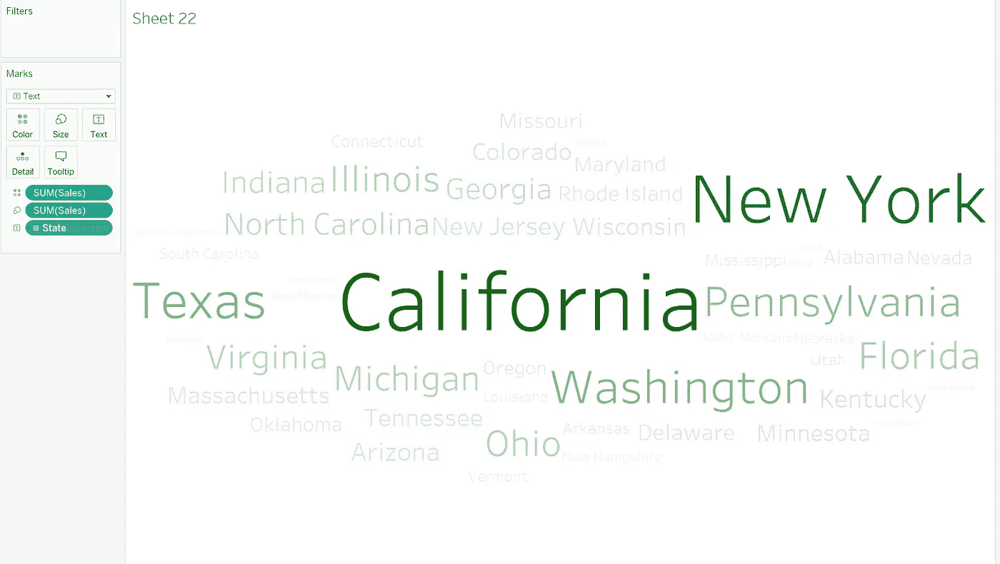

# 让您的仪表盘脱颖而出— Word Cloud

> 原文：<https://pub.towardsai.net/make-your-dashboard-stand-out-word-cloud-8426255df94a?source=collection_archive---------3----------------------->

图片由 tableau.com 拍摄

## [数据可视化](https://towardsai.net/p/category/data-visualization)

## 打动你的观众和老板！

对我来说，Tableau 是唯一一种能让我像艺术家一样做数据科学的工具。然而，如果每个人都用 Tableau 做同样的可视化，那就没什么意思了。这篇文章是我的系列文章“让你的仪表板脱颖而出”中的一集，该系列文章为你提供了一些精彩但非默认的可视化想法。如果你对我来说是新的，一定要看看下面的文章:

 [## 让您的仪表板脱颖而出—桑基图

pub.towardsai.net](/make-your-dashboard-stand-out-sankey-diagram-c2ead0201aa6)  [## 让你的仪表盘脱颖而出——哑铃图表

### 让你的仪表盘脱颖而出——哑铃图表

让你的仪表盘脱颖而出——哑铃 Chartpub.towardsai.net](/make-your-dashboard-stand-out-dumbbell-chart-ae36d399e85)  [## 让您的仪表板脱颖而出—填充百分比球图

### 打动你的观众和老板！

pub.towardsai.net](/make-your-dashboard-stand-out-fill-percentage-ball-chart-cd9484b4f37f)  [## 让您的仪表板脱颖而出-虚线进度图

### 用一种创造性的选择打动你的观众！

pub.towardsai.net](/make-your-dashboard-stand-out-dotted-progress-chart-69b6a064a7d4) 

(*未完待续*

在这篇文章中，我将介绍一个干净的，容易实现的树图的替代品:**单词云**。

[Glen Carrie](https://unsplash.com/@glencarrie?utm_source=unsplash&utm_medium=referral&utm_content=creditCopyText) 在 [Unsplash](https://unsplash.com/?utm_source=unsplash&utm_medium=referral&utm_content=creditCopyText) 上拍摄的照片

# 主意

想出用可视化来展示比较差异的想法是很直观的。这就是创建 TreeMap 的原因。但是如果你只能用这一个选项，每个人都会变得无聊。好吧，好吧，我说的每个人是指你的老板。所以为了避免惹恼你的老板，Word Cloud 应该在你的手边。

单词云是由一串单词组成的可视化，而这些单词在大小和(有时)颜色上有所不同。虽然它不是 Tableau 中的默认 viz 选项，但解决起来相当容易。

# 履行

首先，准备好你的数据集。对于这个演示，我只是简单地使用 Tableau 提供的样本数据集“superstore”。

因为我的目标是说明每个州总销售额的差异，所以我的下一步是将“state”从数据面板拖到文本标记上。

作者图片

毫不夸张地说，您现在已经完成了一半，因为当您将“sales”拖动到大小标记时，您已经可以看到字体大小的变化了。

作者图片

然而，在这一点上，我们的可视化很难显示数据中的实际差异。我们现在看到的是实际数据差和字长差的组合。这可能会导致一个不令人满意的讲故事的经历。例如，如果我们要去英国的人口，在那里*英国*通常比*北爱尔兰*人口多，然而，以这种方式，*北爱尔兰*的字母中明显的长度对于观众来说在区分这两个实体之间的不同时可能是一个麻烦。

所以回到我们的故事，我通常让颜色形状帮助我们。换句话说，我对单词使用不同的颜色，而它们的颜色代表销售额。因此，您接下来只需将另一个销售胶囊拖到颜色标记上。

作者图片

如您所见，word cloud image 的当前版本不仅可读，而且在 BI 分析场景中非常有用。

# 在我走之前…

谢谢你坚持到最后！我知道这篇文章有点短，但我仍然希望它能对你的下一个演示有所帮助。如果你有任何更有创意的想法来用 Tableau 制作令人敬畏的单词云，一定要在评论中告诉我！