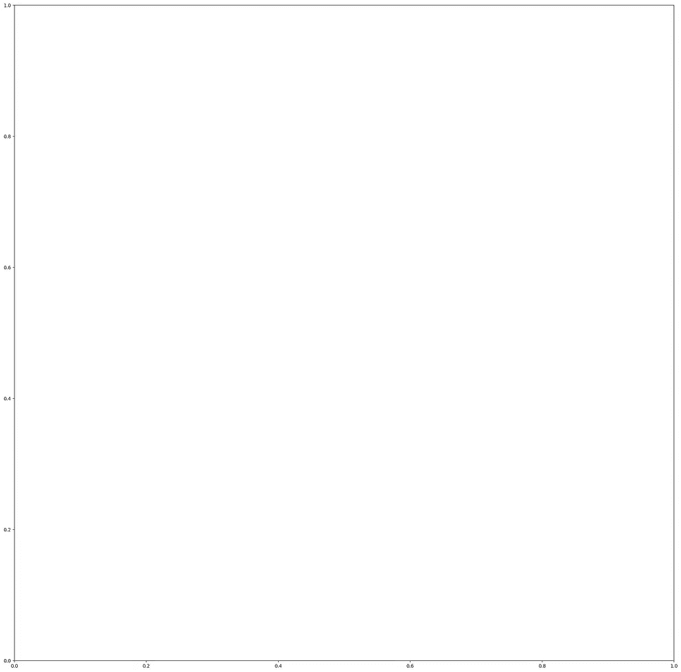
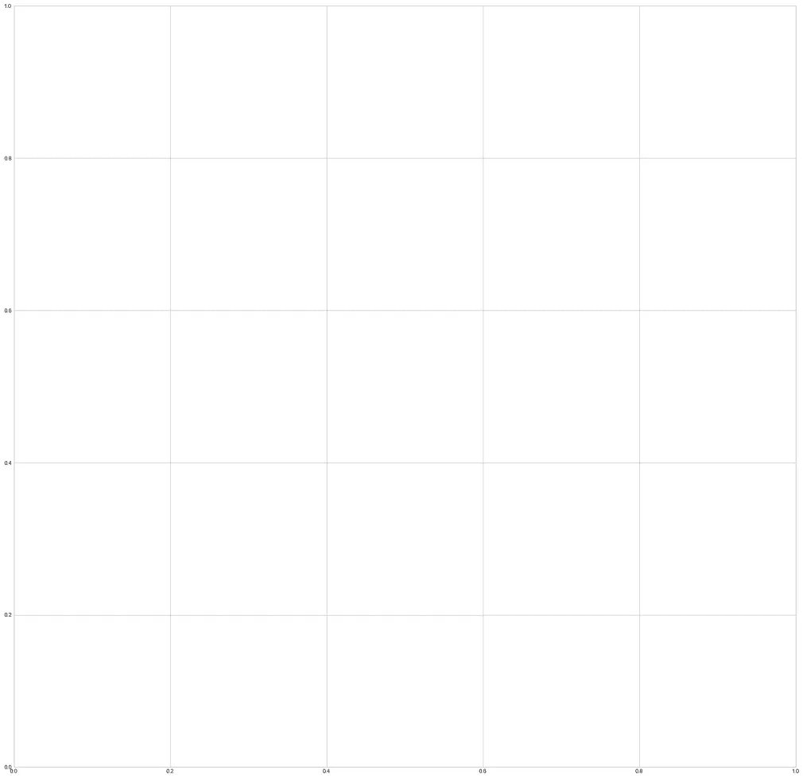
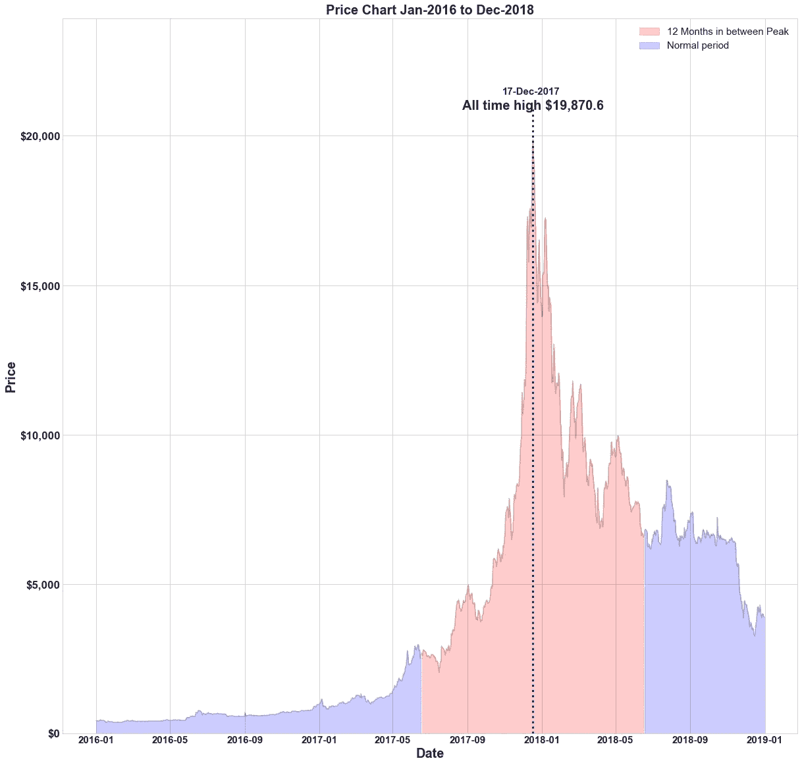
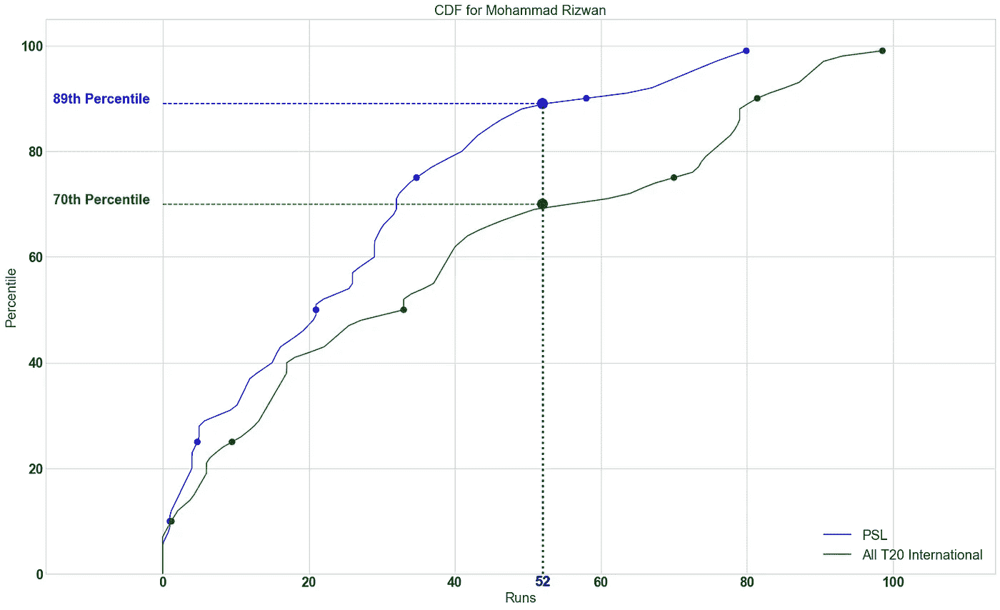
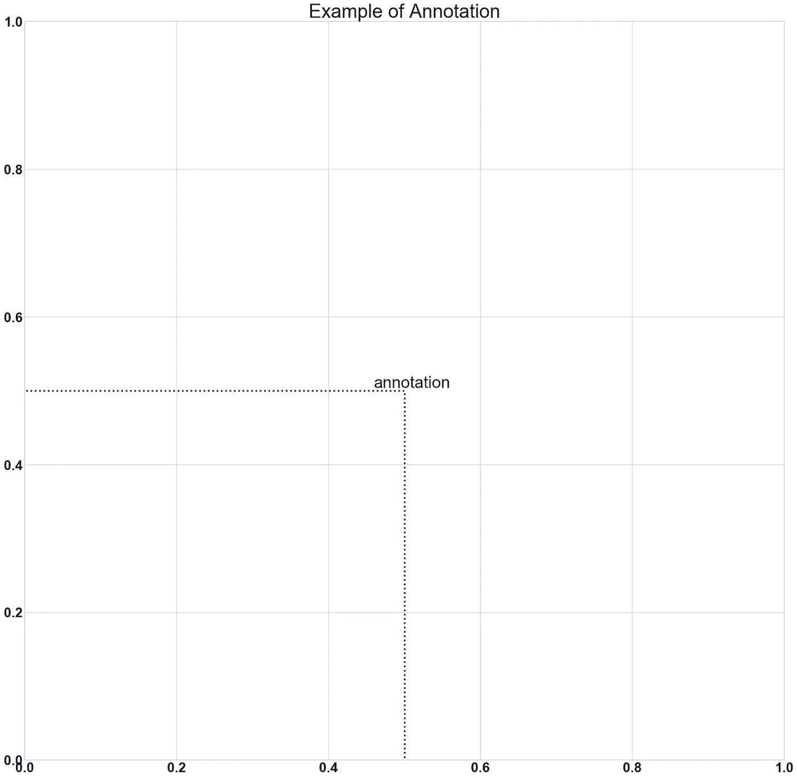
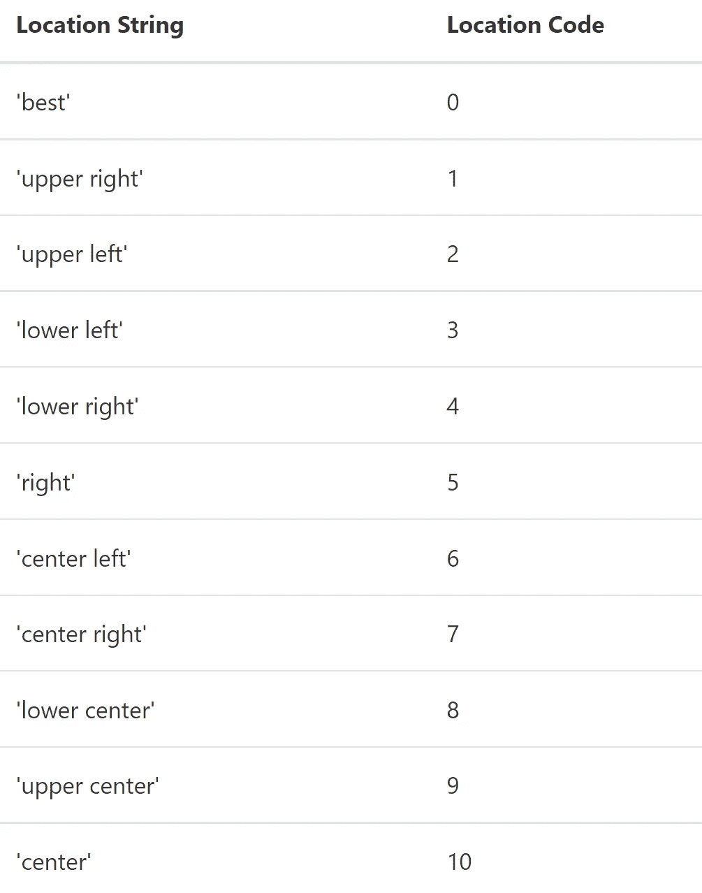
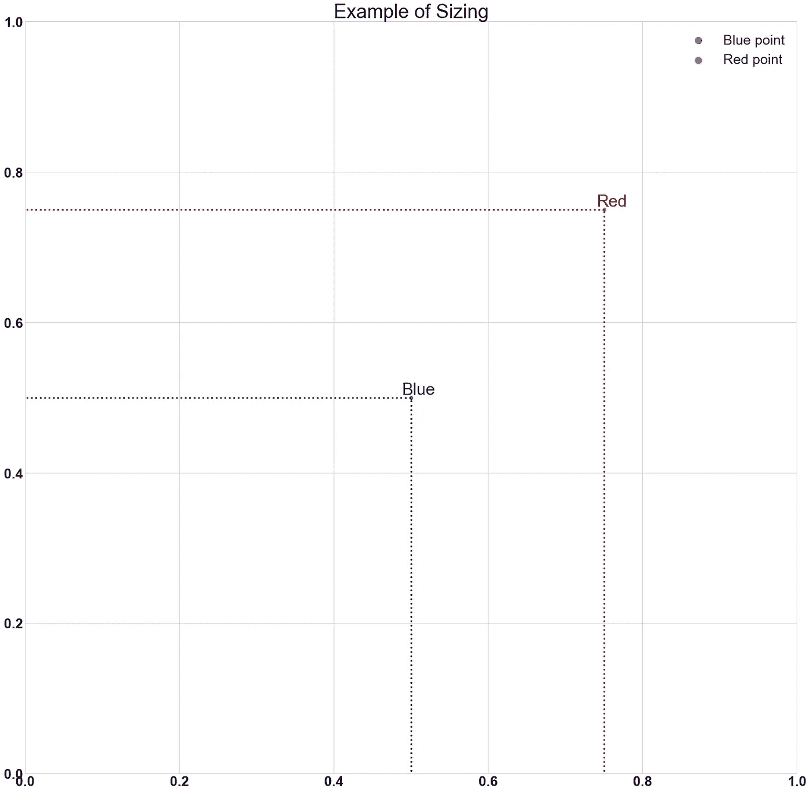

# 使用这个备忘单让你的 Matplotlib 图脱颖而出

> 原文：<https://pub.towardsai.net/make-your-matplotlib-plots-stand-out-using-this-cheat-sheet-8c666de90433?source=collection_archive---------0----------------------->

## 用于在 Matplotlib 中编辑背景、记号和注释的备忘单


亨特·哈丽特在 [Unsplash](https://unsplash.com/photos/Ype9sdOPdYc?utm_source=unsplash&utm_medium=referral&utm_content=creditShareLink) 上拍摄的图片

Matplotlib 是 python 中最广泛的绘图库，可以说是最常用的库之一。如果你和我一样，经常忘记格式化情节的精确代码，这篇文章是专门为你写的。

## 背景

让您的图形脱颖而出的最简单的方法之一是更改默认背景。我更喜欢使用“seaborn-whitegrid”，因为我认为它简单明了，而且大多数颜色在白色背景下看起来都很好。代码如下:

```
import matplotlib.pyplot as plt
**#the print statement tells all available style sheets**
print([plt.style.available](https://docs.python.org/3/library/stdtypes.html#list))
**#This line of code changes the style sheet**
plt.style.use(‘seaborn-whitegrid’)
```



左侧为默认样式，右侧为 seaborn-white grid-图片由作者提供。你可以在这里查看所有的样式表

# 标题、标签和刻度

一个好的信息图需要一个合适的标题、标签和合适的刻度线。在处理金钱时，最好使用像“$”这样的货币符号，在处理大数时，最好将它们格式化为千(K)、百万(M)、十亿(B)等。较小的数字应该四舍五入到最接近的小数，实际上不需要超过 3 位小数。我认为最理想的是小数点后两位。你还应该将频率乘以 100，使它们成为百分比，并在一个大数字的每三个数字后加上'，'，即 1000000 应该写成 1，000，000。

最后，标题和刻度必须是可见的，因此可读的大小是必要的。在下面找到完成这些事情的代码:

```
**#importing and creating figure** from matplotlib import ticker
fig,ax = plt.subplots(figsize=(20,20))**#Add title and set font size**
plt.title(‘Title’,fontsize=50)**#Add xaxis label & yaxis label, with fontsize** plt.xlabel('xlabel',fontsize=30)
plt.ylabel('ylabel',fontsize=30)**#tick-size and weight [** **'normal'** **|** **'bold'** **|** **'heavy'** **|** **'light'** **| #****'ultrabold'** **|** **'ultralight'****]**
plt.yticks(fontsize=20,weight='bold')
plt.xticks(fontsize=20,weight='bold')**#Format ticks as currency or any prefix (replace $ with your choice)**
ax.xaxis.set_major_formatter(ticker.StrMethodFormatter("${x}"))**#Format ticks as distance or any suffix (replace km with your #choice)**
ax.xaxis.set_major_formatter(ticker.StrMethodFormatter("{x} km"))**#Format ticks decimal point, the number preceding f denotes how many
# decimal points e.g use .3f for three** ax.xaxis.set_major_formatter(ticker.StrMethodFormatter("{x:.2f}"))**#Add , for large numbers e.g 10000 to 10,000**
ax.xaxis.set_major_formatter(ticker.StrMethodFormatter("{x:,}"))**#Format as a percentage** 
ax.xaxis.set_major_formatter(ticker.PercentFormatter())**#Format thousands e.g 10000 to 10.0K** ax.yaxis.set_major_formatter(ticker.FuncFormatter(lambda x,pos: format(x/1000,'1.1f')+'K'))**#Format Millions e.g 1000000 to 1.0M** ax.yaxis.set_major_formatter(ticker.FuncFormatter(lambda x,pos: format(x/1000000,'1.1f')+'M'))**#Example of combined tick mark, currency with , & 2 decimal #precision**
ax.yaxis.set_major_formatter(ticker.StrMethodFormatter("${x:,.2f}"))
```

***喜欢这个故事吗？有一个数据科学问题，需要专家来解决？考虑招聘***[***me***](https://www.upwork.com/ab/flservices/workwith/naivebayesian)***！***

# 释文

注释是突出任何特定值或点的好方法。将 h 线(水平线)和 v 线(垂直线)组合在一起，您可以指示特定点的轴标签。这里有一些你能做什么的例子。



比特币价格图表，用注释和 v 线突出显示了历史高点。在此阅读更多关于此[的内容。作者图片](https://blog.cryptostars.is/bitcoin-a-visual-history-should-you-buy-at-the-top-20067ae48a14)

喜欢这个故事吗？需要编码帮助？直接雇佣我[](https://www.upwork.com/workwith/naivebayesian)****！****

****

**分数的百分比，当前比赛成绩用注释、h 线和 v 线突出显示。点击阅读更多关于这个[的内容。作者图片](https://medium.com/mlearning-ai/money-balling-cricket-statistically-evaluating-a-match-9cda986d015e)**

**以下是添加注释的方法:**

```
**#First argument is the text, ha is horizontal alignment, va is #vertical alignment, xy is coordinates of the pojnt xytext are the #coordinates of the text (if you want the text to be away from the #point)**ax.annotate('annotation',ha='center',va='center', xy = (0.5, 0.5), xytext=(0.51,0.51),fontsize=30)**#Add v-line with xcoord, min & max ranges with y and aesthetic #properties** plt.vlines(x=0.5,ymin=-0.05,ymax=0.5,ls=':',lw=3,color='darkblue')**#Add h-line with ycoord, min & max ranges with xand aesthetic #properties** plt.hlines(y=0.5,xmin=-0.05,xmax=0.5,ls=':',lw=3,color='darkblue')**#Optional code for house keeping**
plt.xticks(fontsize=25,weight='bold')
plt.yticks(fontsize=25,weight='bold')
plt.xlim(0,1)
plt.ylim(0,1)
plt.title('Example of Annotation',fontsize=35)
```

****

**上面代码的结果，你可以添加一个点注释。图片由作者提供。**

# **尺寸、限制和图例**

**我们经常需要调整图形的大小或形状。为 x 轴和 y 轴指定限制也是谨慎的，特别是当数据中有一些不寻常的异常值时。此外，包含带有准确标签和标记大小的图例非常有用。**

**代码如下:**

```
**#Change figure size by adjusting figsize parameter**
fig,ax = plt.subplots(figsize=(25,25))**#Annotation, v-lines & h-lines as explained above**
ax.annotate(‘Blue’,ha=’center’,va=’center’, xy = (0.5, 0.5), xytext=(0.51,0.51),fontsize=30,color=’darkblue’)
plt.vlines(x=0.5,ymin=-0.05,ymax=0.5,ls=’:’,lw=3,color=’darkblue’)
plt.hlines(y=0.5,xmin=-0.05,xmax=0.5,ls=’:’,lw=3,color=’darkblue’)**#Scatter plot of one point, label parameter goes in legend 
# you can add '_no_legend_' to hide this label in the legend**ax.scatter(x=0.5,y=0.5,label=’Blue point’)**#Annotation, v-lines & h-lines as explained above** ax.annotate(‘Red’,ha=’center’,va=’center’, xy = (0.75, 0.75), xytext=(0.76,0.76),fontsize=30,color=’darkred’)
plt.vlines(x=0.75,ymin=-0.05,ymax=0.75,ls=’:’,lw=3,color=’darkred’)
plt.hlines(y=0.75,xmin=-0.05,xmax=0.75,ls=’:’,lw=3,color=’darkred’)**#Scatter plot of one point, label parameter goes in legend** ax.scatter(x=0.75,y=0.75,label=’Red point’)**#House keeping for xticks & yticks explained above**
plt.xticks(fontsize=25,weight=’bold’)
plt.yticks(fontsize=25,weight=’bold’)**#xlim specifies xaxis limits , first argument min limit & second #argument max limit**
plt.xlim(0,1)**#ylim specifies yaxis limits , first argument min limit & second #argument max limit** plt.ylim(0,1)**#loc parameter tells location explained below
#prop tells legend font properties, read more** [**here**](https://matplotlib.org/3.5.0/api/font_manager_api.html#matplotlib.font_manager.FontProperties\) **#markerscale tells how much big should the markers on the legend be #in proportion to actual markers. 2 implies twice as big**plt.legend(loc=1,prop={‘size’:25},markerscale=2)plt.title(‘Example of Sizing’,fontsize=35)
```

****

**指定图例的位置参数，您可以将图例定位在该位置。图片由作者提供。**

****

**以上代码的结果，图片由作者提供。**

**我一定会在学习的过程中添加更多的秘籍。目前，这是它，我希望你发现这个小教程有帮助。**

**请考虑跟着我！如果您对统计分析和良好的可视化感兴趣，请查看其他一些文章:**

**[](https://python.plainenglish.io/sankeying-with-plotly-90500b87d8cf) [## 与 Plotly 的“Sankeying”

### 如何在 Plotly 中制作散点图

python .平原英语. io](https://python.plainenglish.io/sankeying-with-plotly-90500b87d8cf) [](/moneyballing-cricket-predicting-centuries-base-model-d23a4c3ec0cd) [## 板球摇钱树:预测世纪——基础模型

### 数据准备&板球世纪二元分类建模

pub.towardsai.net](/moneyballing-cricket-predicting-centuries-base-model-d23a4c3ec0cd) [](https://towardsdatascience.com/money-balling-cricket-probability-of-100-using-repeated-conditioning-2fc8dbceb42e) [## 金钱球板球——使用重复条件反射的概率为 100

### 板球得分≥ 100 分的概率分析

towardsdatascience.com](https://towardsdatascience.com/money-balling-cricket-probability-of-100-using-repeated-conditioning-2fc8dbceb42e) 

谢谢大家！**