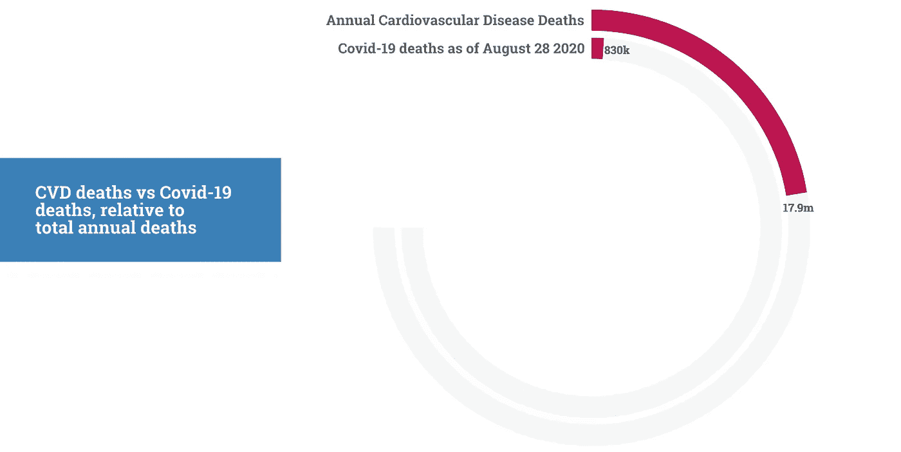
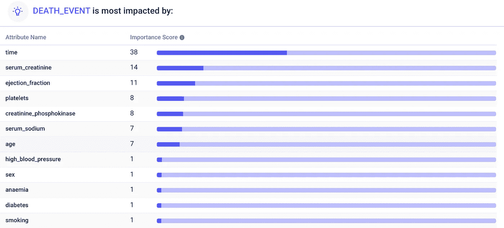
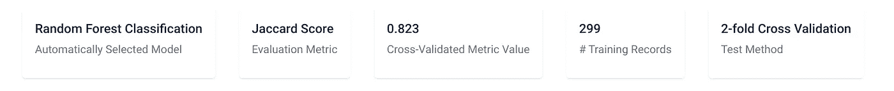
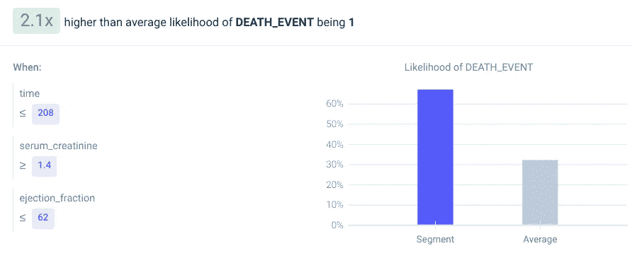

# 制造一个在心力衰竭预测上击败医生的人工智能

> 原文：<https://pub.towardsai.net/making-an-ai-that-beats-doctors-in-heart-failure-prediction-be2719516e0d?source=collection_archive---------5----------------------->

## [人工智能](https://towardsai.net/p/category/artificial-intelligence)，健康

## 在 3 分钟内构建世界级模型。❤️

照片由[裘德·贝克](https://unsplash.com/@judebeck?utm_source=medium&utm_medium=referral)在 [Unsplash](https://unsplash.com?utm_source=medium&utm_medium=referral) 拍摄

人工智能中一个普遍的神话是，你需要大量的数据和资源。虽然深度神经网络是数据密集型的，但也有许多小数据的强大人工智能用例。例如，一位分析师[用不到 100 行数据预测了 2020 年的疯狂](https://medium.com/@frederikbussler/how-one-man-predicted-2020s-insanity-e79a2a95789b)。

在这里，我将使用一个 299 行的数据集[来预测心力衰竭的死亡，基于十几个临床特征。](https://www.kaggle.com/andrewmvd/heart-failure-clinical-data)

# 背景

几乎三分之一的死亡是由心血管疾病引起的。心血管疾病通常是可以预防的，可能是由过量的糖、烟草或酒精消费——甚至是动物性饮食引起的。

鉴于每年有近 1800 万人死于心血管疾病，准确的心力衰竭早期检测模型可以挽救许多生命。

# 数据

医学研究人员分析了 299 名巴基斯坦心力衰竭患者，显示“血清肌酐”和“射血分数”是存活的强有力预测指标。血清肌酐是指当肌肉组织受损时流入血液的一种酶，而射血分数是指左心室在收缩时泵出血液的百分比。

其他特征，如贫血、高血压、糖尿病、性别和吸烟也在数据集中。

这些研究人员制作的顶级预测模型达到了 74%的准确率，超过了人类专家约 59%的表现。使用无代码 AutoML 工具 [Apteo](http://apteo.co) ，我们可以超越两者。

# 创建模型

数据已经包含了我们想要预测的列，`DEATH_EVENT` (0 表示患者存活，1 表示患者死亡)，以及 12 个其他列，或者我们可以用来预测死亡的属性。

我将数据上传到 Apteo，点击“洞察”标签，然后自动生成一个预测死亡的模型。经过一段*时间*(或简单地以天为单位的随访期)，我们确实可以看到(高)血清肌酐和(低)射血分数是死亡的最大预测因素。

虽然最初的研究人员专注于这两个特征，但包括所有其他属性会产生一个更准确的模型，准确率为 82.3%。例如，男性更容易患心力衰竭，血液中的高钠含量也会导致心力衰竭。

在背景中，产生了各种分类算法，例如决策树、Ada boost、随机森林和 MLP。其中，随机森林是最准确的。

我们还可以发现死亡风险特别高的群体。例如，与普通患者相比，那些血清肌酐为 1.4+ mg/dL 且左心室血流量低于 62%的患者的死亡几率超过 2 倍。

# 摘要

在短短几分钟内，无代码 AutoML 让我们比人类专家更准确地预测心力衰竭。这个数据集只有 299 行。有了更多关于患者的数据和属性，准确性可以进一步提高。

除了心力衰竭，人工智能还可以应用于健康[数据集](https://medium.com/towards-artificial-intelligence/20-use-cases-for-predictive-analytics-687f963ef225)中的糖尿病、医疗保健参与、皮肤癌等等。