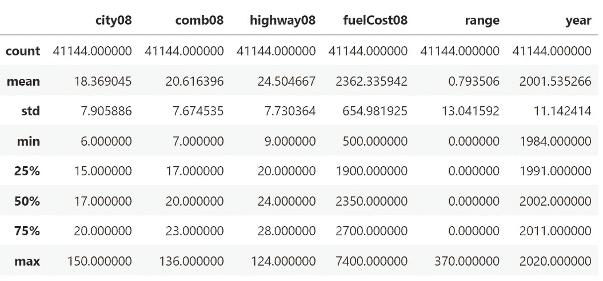
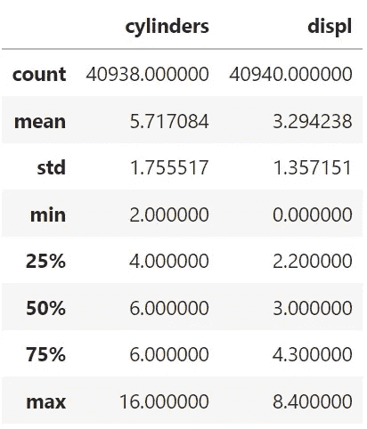
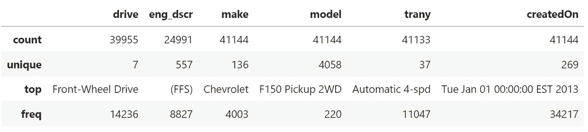

# 最大化 Pandas 性能:高效数据处理的 6 个最佳实践

> 原文：<https://pub.towardsai.net/making-pandas-fly-6-pandas-best-practices-to-save-memory-energy-8d09e9d52488?source=collection_archive---------0----------------------->

## 优化 Pandas:了解数据类型和内存使用以实现高效的数据处理


照片由[施洋许](https://unsplash.com/@ltmonster?utm_source=medium&utm_medium=referral)在 [Unsplash](https://unsplash.com?utm_source=medium&utm_medium=referral)

Pandas 是数据科学领域中一个受欢迎的库，它使得使用高效和高性能的工具处理数据变得容易。但是当处理大量数据时，熊猫会变得有限，并导致内存问题。为了克服这些问题，您可以使用其他工具，如 Dask 或 Polar。本文将为您提供一些在切换到另一个工具之前可以尝试的技巧。

Pandas 数据类型可能会令人困惑，因此在您第一次开始研究数据时检查它们是很重要的。拥有正确的数据类型将使您的分析更加准确和高效。有时候，Pandas 可能会将整数列作为浮点或对象类型读取，这可能会导致错误并耗尽额外的内存。本文将解释 Pandas 数据类型，并向您展示如何通过使用正确的数据类型来节省内存。

本文的灵感来自马特·哈里森的谈话:有效的熊猫 I 马特·哈里森 I PyData 盐湖城 Meetup。

我们将在本文中使用车辆数据:[车辆数据](https://github.com/mattharrison/datasets/blob/master/data/vehicles.csv.zip)。数据有点大，所以我们将选择几列进行实验。

# 目录

[1。读取数据](#173e)
[2。内存使用量](#15d2)
[3。熊猫数据类型](#990f)
[4。整数](#20ee)
[5。浮动](#5169)
[6。对象和类别](#1c1e)
[8。日期时间](#86af)
[9。NumPy vs 熊猫运营](#8f5a)

# 1.读取数据

如果数据首先不适合您的内存，您可以成块地读取数据并探索它。该参数实际上意味着要读入内存的行数。

研究了一小部分数据后，您现在知道什么是重要列和不重要列了。为了节省额外的内存，您只能读取重要的列。

# 2.内存使用

Pandas `info()`函数提供了关于数据帧的有价值的信息，包括每一列的数据类型、非空值的数量以及内存使用情况。该函数对于理解数据结构和优化内存使用非常有用。内存使用报告显示在`info()`函数输出的末尾。

为了充分利用内存，我们向`info()`提供了`memory_usage=”deep”`参数。

```
<class 'pandas.core.frame.DataFrame'>
RangeIndex: 41144 entries, 0 to 41143
Data columns (total 14 columns):
 #   Column      Non-Null Count  Dtype  
---  ------      --------------  -----  
 0   city08      41144 non-null  int64  
 1   comb08      41144 non-null  int64  
 2   highway08   41144 non-null  int64  
 3   cylinders   40938 non-null  float64
 4   displ       40940 non-null  float64
 5   drive       39955 non-null  object 
 6   eng_dscr    24991 non-null  object 
 7   fuelCost08  41144 non-null  int64  
 8   make        41144 non-null  object 
 9   model       41144 non-null  object 
 10  trany       41133 non-null  object 
 11  range       41144 non-null  int64  
 12  createdOn   41144 non-null  object 
 13  year        41144 non-null  int64  
dtypes: float64(2), int64(6), object(6)
memory usage: 18.7 MB
```

# 3.熊猫数据类型

当将数据导入 Pandas DataFrame 时，整个数据集被读入内存，以确定每一列的数据类型。这个过程有时会导致不正确的数据类型分配，例如假设具有整数值和缺失数据的列是浮点数据类型而不是整数。为了避免这种情况，根据需要仔细检查和调整数据类型非常重要。

要检查您的数据类型，您可以使用`.dtypes`，它将返回一系列与那里相关联的列`dtype`:

```
city08          int64
comb08          int64
highway08       int64
cylinders     float64
displ         float64
drive          object
eng_dscr       object
fuelCost08      int64
make           object
model          object
trany          object
range           int64
createdOn      object
year            int64
dtype: object
```

只有三种类型出现在我们的数据集中，但熊猫通常有 7 种类型:

*   `**object**`、`**int64**`、`**float64**`、`**category**`、**、**、`**datetime64**`、**、**都是本文将要涉及的。
*   `**bool**`:真/假值。可以是一个`NumPy` `datetime64[ns]`。
*   `**timedelta[ns]**`:两个日期时间之间的差异。

# 4.整数

整数。可以是`NumPy`、`int_`、`int8`、`int16`、`int32`、`int64`、`uint8`、`uint16`、`uint32`或`uint64`。

您可以使用`numpy.iinfo()`来检查整数类型的机器限制，并选择一个允许您在不损失精度的情况下节省内存的类型。

```
Machine parameters for int8
---------------------------------------------------------------
min = -128
max = 127
---------------------------------------------------------------
```

```
Machine parameters for int16
---------------------------------------------------------------
min = -32768
max = 32767
---------------------------------------------------------------
```

使用`pandas.select_dtypes()`选择基于特定`dtype`的列。



将 pandas 列数据转换为不同类型的最简单方法是使用`astype()`。

```
<class 'pandas.core.frame.DataFrame'>
RangeIndex: 41144 entries, 0 to 41143
Data columns (total 14 columns):
 #   Column      Non-Null Count  Dtype  
---  ------      --------------  -----  
 0   city08      41144 non-null  int16  
 1   comb08      41144 non-null  int16  
 2   highway08   41144 non-null  int8   
 3   cylinders   40938 non-null  float64
 4   displ       40940 non-null  float64
 5   drive       39955 non-null  object 
 6   eng_dscr    24991 non-null  object 
 7   fuelCost08  41144 non-null  int16  
 8   make        41144 non-null  object 
 9   model       41144 non-null  object 
 10  trany       41133 non-null  object 
 11  range       41144 non-null  int16  
 12  createdOn   41144 non-null  object 
 13  year        41144 non-null  int16  
dtypes: float64(2), int16(5), int8(1), object(6)
memory usage: 17.3 MB
```

# 5.浮动

浮点数。可以是`NumPy`、`float16`、`float32`、`float64`

您可以使用`numpy.finfo()`来检查浮点类型的机器限制，并选择一个允许您在不损失精度的情况下节省内存的类型。

```
Machine parameters for float16
---------------------------------------------------------------
precision =   3   resolution = 1.00040e-03
machep =    -10   eps =        9.76562e-04
negep =     -11   epsneg =     4.88281e-04
minexp =    -14   tiny =       6.10352e-05
maxexp =     16   max =        6.55040e+04
nexp =        5   min =        -max
---------------------------------------------------------------
```

```
Machine parameters for float32
---------------------------------------------------------------
precision =   6   resolution = 1.0000000e-06
machep =    -23   eps =        1.1920929e-07
negep =     -24   epsneg =     5.9604645e-08
minexp =   -126   tiny =       1.1754944e-38
maxexp =    128   max =        3.4028235e+38
nexp =        8   min =        -max
---------------------------------------------------------------
```



`cylinders`列应该是一个`integer` `dtype` 但是因为它缺少值，熊猫把它读成了`float` `dtype`。

```
<class 'pandas.core.frame.DataFrame'>
RangeIndex: 41144 entries, 0 to 41143
Data columns (total 14 columns):
 #   Column      Non-Null Count  Dtype  
---  ------      --------------  -----  
 0   city08      41144 non-null  int16  
 1   comb08      41144 non-null  int16  
 2   highway08   41144 non-null  int8   
 3   cylinders   41144 non-null  int8   
 4   displ       41144 non-null  float16
 5   drive       39955 non-null  object 
 6   eng_dscr    24991 non-null  object 
 7   fuelCost08  41144 non-null  int16  
 8   make        41144 non-null  object 
 9   model       41144 non-null  object 
 10  trany       41133 non-null  object 
 11  range       41144 non-null  int16  
 12  createdOn   41144 non-null  object 
 13  year        41144 non-null  int16  
dtypes: float16(1), int16(5), int8(2), object(6)
memory usage: 16.8 MB
```

# 6.对象和类别

***对象:*** 文本或混合数值和非数值。可以是`NumPy`、`string_`、`unicode_`或混合类型。

***类别*** :熊猫中的类别数据类型是一种混合数据类型。在许多情况下，它看起来和行为都像一个字符串，但在内部是由一个整数数组表示的。这允许数据以自定义顺序排序，并更有效地存储数据。



`drive`和`trany`有少量的唯一值，所以我们可以把它们转换成`category`和`dtype`

```
<class 'pandas.core.frame.DataFrame'>
RangeIndex: 41144 entries, 0 to 41143
Data columns (total 14 columns):
 #   Column      Non-Null Count  Dtype   
---  ------      --------------  -----   
 0   city08      41144 non-null  int16   
 1   comb08      41144 non-null  int16   
 2   highway08   41144 non-null  int8    
 3   cylinders   41144 non-null  int8    
 4   displ       41144 non-null  float16 
 5   drive       41144 non-null  category
 6   eng_dscr    24991 non-null  object  
 7   fuelCost08  41144 non-null  int16   
 8   make        41144 non-null  category
 9   model       41144 non-null  object  
 10  trany       41144 non-null  category
 11  range       41144 non-null  int16   
 12  createdOn   41144 non-null  object  
 13  year        41144 non-null  int16   
dtypes: category(3), float16(1), int16(5), int8(2), object(3)
memory usage: 8.8 MB
```

# 8.日期时间

日期和时间值。将我们的日期作为`datetime64`对象将允许我们通过`.dt` API 访问大量的日期和时间信息。

```
<class 'pandas.core.frame.DataFrame'>
RangeIndex: 41144 entries, 0 to 41143
Data columns (total 14 columns):
 #   Column      Non-Null Count  Dtype         
---  ------      --------------  -----         
 0   city08      41144 non-null  int16         
 1   comb08      41144 non-null  int16         
 2   highway08   41144 non-null  int8          
 3   cylinders   41144 non-null  int8          
 4   displ       41144 non-null  float16       
 5   drive       41144 non-null  category      
 6   eng_dscr    24991 non-null  object        
 7   fuelCost08  41144 non-null  int16         
 8   make        41144 non-null  category      
 9   model       41144 non-null  object        
 10  trany       41144 non-null  category      
 11  range       41144 non-null  int16         
 12  createdOn   41144 non-null  datetime64[ns]
 13  year        41144 non-null  int16         
dtypes: category(3), datetime64[ns](1), float16(1), int16(5), int8(2), object(2)
memory usage: 5.8 MB
```

# 9.NumPy vs. Pandas 运营

有时，仅仅将数据转换成 NumPy 数组就可以加速计算，就像下面的例子一样(`.values`将把数列转换成 NumPy 数组):

```
78.1 µs ± 1.29 µs per loop (mean ± std. dev. of 7 runs, 10000 loops each)
```

```
36.9 µs ± 579 ns per loop (mean ± std. dev. of 7 runs, 10000 loops each)
```

# 摘要

*   正确的数据类型分配是探索新数据集的重要步骤。
*   Pandas 通常能做出准确的数据类型推断，但是熟悉可用的转换选项以确保数据的格式正确是很重要的。
*   正确分配数据类型可以显著节省内存，潜在地减少 30%以上的内存使用。