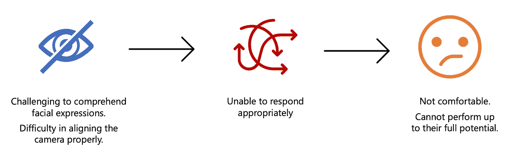
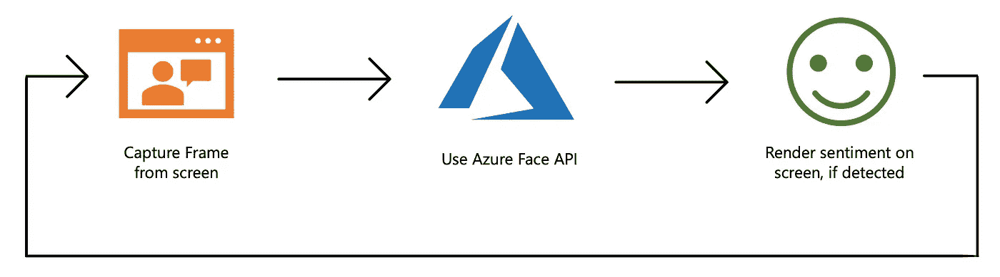
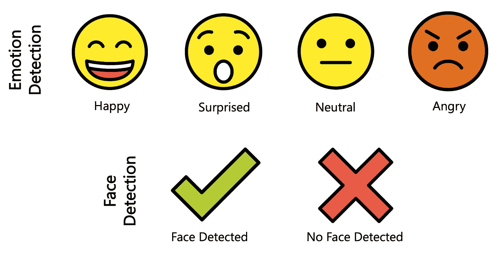
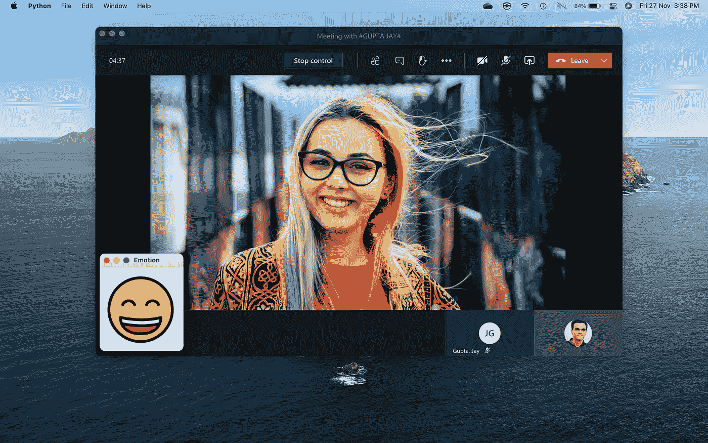

# 通过机器学习让视频会议变得更加容易

> 原文：<https://pub.towardsai.net/making-video-conferencing-more-accessible-with-machine-learning-3cfd66febd8c?source=collection_archive---------1----------------------->

## [计算机视觉](https://towardsai.net/p/category/computer-vision)，[机器学习](https://towardsai.net/p/category/machine-learning)

## 学会为视力受损或有其他障碍的人建造 Azure 供电的管道


照片由[乔希·卡拉布雷斯](https://unsplash.com/@joshcala?utm_source=medium&utm_medium=referral)在 [Unsplash](https://unsplash.com?utm_source=medium&utm_medium=referral) 上拍摄

新冠肺炎疫情把组织推到了边缘，大多数雇主求助于在家工作(WFH)安排。除了工作，随着严格的全球旅行限制，人们正在慢慢适应视频会议模式，以保持与朋友和家人的联系。这个疫情孕育了像微软团队和 Zoom 这样的平台的崛起，在过去的六个月里，这些平台已经出现了巨大的增长模式[1]。

在本文中，我们将学习构建一个基于 Microsoft Azure 的管道，实时检测 Microsoft Teams ( *Teams* )呼叫中参与者的情绪和面部表情。我们还将增加一项功能，帮助参与者在通话开始前正确对准摄像机。

> disclaimer——该项目最初是为[微软人工智能无障碍黑客马拉松](https://www.microsoftaccessibility.ai/)而构建的，后来被评为新加坡五大提交作品之一，并被微软&合作伙伴评委评为亚太地区的顶级提交作品。我要感谢我的队友们 [Aditya](https://au.linkedin.com/in/aditya-bansal-43b211195) ，[rit wik](https://sg.linkedin.com/in/ritwikkanodia)&[Vidurveer](https://my.linkedin.com/in/vidurveer-duggal-1b941b132)，没有他们，这一节选是不可能的。

# **背景**

虽然视频会议有其好处，但对于那些在各个方面有视觉障碍和视觉障碍的人来说，它严重缺乏可访问性。

对于无数的疾病，不仅限于社交情绪失认症、自闭症、阅读障碍和焦虑症，这给这些人理解他人的情绪和面部表情，并在视频会议上做出适当反应带来了挑战。在这种情况下，他们对视频电话感到不舒服，而在虚拟工作面试中，解读面试官的面部表情对他们来说至关重要。



为什么向视频会议平台添加更多辅助功能非常重要

第二个问题是，由于这些残疾，人们很难让自己意识到这样一个事实，即使他们被其他人看到，如果他们的相机对准正确。

# 管道

构建我们的管道有三个步骤，首先，我们在设定的时间间隔后，比如说每两秒钟，从视频会议中捕获帧(截图)。之后，我们将这些帧发送到 Microsoft Azure APIs，以获取通话中个人的情绪(情感)，然后，最终在屏幕上呈现检测到的情绪。



三步 Azure 驱动的管道

样板 Python 类为我们管道中的三个步骤提供了不同的方法

## 捕捉帧

该过程的第一步是在设定的持续时间后，从正在进行的视频通话中捕获帧。我们直接截取了电脑屏幕的截图，因为目前还没有直接从团队电话中获取视频的选项。

在 Python 的跨平台' *pyautogui'* 库的帮助下，截图的过程很简单。截图后，在我们的本地目录中以*‘screen . png’*保存。

方法在 Python 中截图

## 使用 Azure Face API

其次，在一帧被捕获后，我们调用 [Azure Face API](https://azure.microsoft.com/en-us/services/cognitive-services/face/) 来检测帧中人的情绪。为简单起见，我假设视频通话中只有一个人。

Face API 是认知服务的一部分，由 Azure 提供，具有一种称为“感知情感识别”的功能，可以检测感知到的面部表情，如愤怒、快乐和惊讶。Face API 是免费的，每分钟最多 20 次 API 调用，这对于我们的用例来说应该足够了。

下面提到的代码是来自 Azure Face API 的示例 JSON 响应。我们注意到 API 给出的无数情绪以及它们的置信区间。例如，我们可以在下面的 JSON 响应中看到，对于给定的样本图像，60%的置信度下“快乐”情绪最高。API 给出了更多的数据，如位置和面部特征的存在，如头发颜色、微笑和头部姿势，但我选择在这里省略这些。

```
[
   {
      "faceId":"92e6d028-188a-40bc-9696-6ccc54831ead",
      "faceRectangle":{
         "top":636,
         "left":1249,
         "width":403,
         "height":403
      },
      "faceAttributes":{
         "emotion":{
            "anger":0.0,
            "contempt":0.087,
            "disgust":0.0,
            "fear":0.0,
            "happiness":0.606,
            "neutral":0.307,
            "sadness":0.0,
            "surprise":0.0
         }
      }
   }
]
```

在 Python 中调用 API 的过程非常简单。首先，我们配置通用的 API 端点和唯一的 API 订阅密钥。这项服务在 Azure 中是免费的，按照 [Azure 文档](https://docs.microsoft.com/en-us/azure/cognitive-services/Face/Quickstarts/client-libraries?pivots=programming-language-python&tabs=visual-studio)中的“*先决条件*标签下的三个快速步骤就可以轻松获得密钥。

配置完成后，我们只需读取第一步中获取的帧，为 API 配置参数，以便只获取所需的信息并调用 API。之后，如果响应为空，则没有检测到人脸，否则，我们从 JSON 响应中返回最自信的情绪。

方法来调用 Python 中的 Azure Face API

## 在屏幕上渲染情绪

最后，在团队呼叫中检测到个体的情绪后，我们将它显示在屏幕上。在这个过程中，我使用了 *Tkinter* Python 库，但是也可以随意使用自己喜欢的库。



所有表情符号都是从 [OpenMoji](https://openmoji.org/) 获得的，这是一个 [CC BY-SA 4.0](https://creativecommons.org/licenses/by-sa/4.0/#) 表情符号库

首先，我创建了一个本地目录，其中包含不同情绪的表情图像，如上所示。该方法只是获取表情名称作为参数，并将其显示在屏幕上的正确位置。

## 驱动程序代码

最后一部分是驱动程序代码，通过它，我们结合了上面写的所有方法来运行我们的程序。您可以更改“*模式*变量，在视频会议期间检测情绪和通话开始前检测面部是否正确对齐之间切换。



团队通话中的实时面部表情检测


(从视障人士的视点故意模糊)左:脸部可见(“勾号”图标)，右:脸部不清晰(“十字”图标)

# 包裹

我们已经创建的 Azure pipeline 是一个原型，它可以潜在地集成到视频会议平台中，作为视觉障碍者和受损者的辅助功能。

我们的方法有各种各样的缺点，最突出的是缺乏这个程序与微软团队平台本身的集成。在撰写本文时，由于开发人员的限制，不可能在 Teams 或 Zoom 中构建端到端的集成解决方案。然而，正如我们所知，这些应用程序正在快速发展，在不久的将来紧密集成是可能的。第二，假设视频会议中有一个人，这通常不是事实。

请随意试验，让代码变得更好。如果你觉得还有其他改进的方法，请留下评论。

## 参考

[1]斯帕塔罗，J. (2020 年，10 月 30 日)。微软团队达到 1.15 亿 DAU 以上，这是微软 365 新的每日协作分钟数指标。

[2]赵，y，吴，s，雷诺兹，l .，&阿岑科特，S. (2018)。一个面向视觉障碍人士的人脸识别应用程序。*2018 年中国计算机学会计算系统中人的因素会议论文集——中国计算机学会* '18。土井指数:10.1145/317538363637