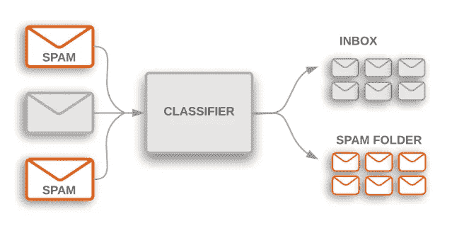
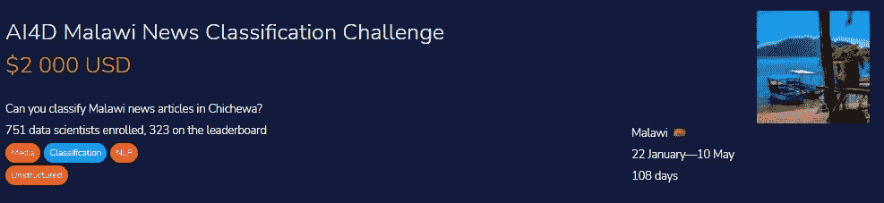
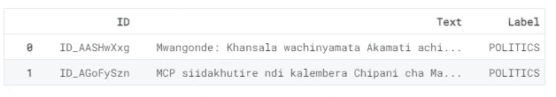
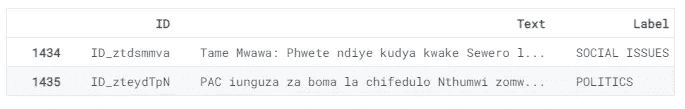
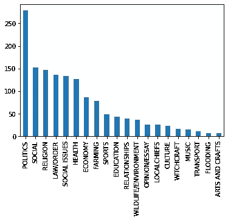
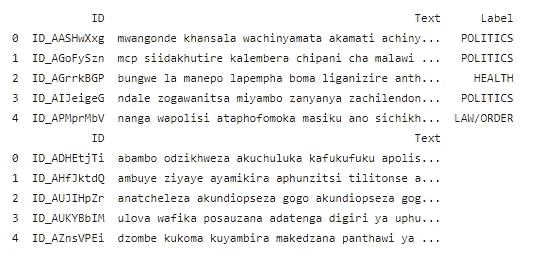
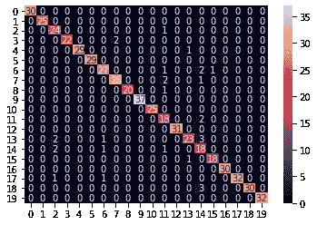
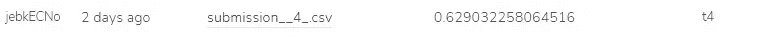

# 马拉维新闻分类 NLP 项目

> 原文：<https://pub.towardsai.net/malawi-news-classification-an-nlp-project-adfa867abfd9?source=collection_archive---------3----------------------->

## [自然语言处理](https://towardsai.net/p/category/nlp)

使用文本分类器预测马拉维新闻文章中的各种类别。


[奥比·奥尼耶多尔](https://unsplash.com/@thenewmalcolm?utm_source=medium&utm_medium=referral)在 [Unsplash](https://unsplash.com?utm_source=medium&utm_medium=referral) 上的照片

# 介绍

文本分类在我们日常使用的应用程序中很常见。例如，电子邮件提供商使用文本分类来过滤掉收件箱中的垃圾邮件。文本分类的另一个最常见的用途是在客户服务中，他们使用情感分析来区分差评和好评 [ADDI AI 2050](https://addiai.com/text-classification/) 。文本分类的现代应用已经超越了更高级的分类形式，包括多语言和多标签分类。



垃圾邮件过滤器文本分类示例| [ADDI AI 2050](https://addiai.com/text-classification/)

近年来，英语已经取得了很大的进步，但是在低资源语言和不同长度的语言上训练分类模型仍然存在困难。在这个 Zindi [竞赛](https://zindi.africa/competitions/ai4d-malawi-news-classification-challenge)中，我们获得了用 Chichewa 语言编写的新闻文章，并在多标签分类上训练我们的模型，因为有 19 个新闻类别。文本由不同长度的新闻文章组成，因此找出一个更好的模型将是一项具有挑战性的任务。 [—津迪](https://zindi.africa/competitions/ai4d-malawi-news-classification-challenge)。



[津迪竞赛](https://zindi.africa/competitions/ai4d-malawi-news-classification-challenge) | AI4D 马拉维新闻分类挑战赛

项目代码简单有效，具有竞争力。我已经用矢量器、Porter stemmer 对测试进行了预处理。我还使用了多种方法来清理我的文本，以提高整体模型性能。最后，我使用 SKlearn 随机梯度下降(SGD)分类器来预测新闻类别。我还试验了各种神经网络和梯度推进模型，但它们都失败了，因为具有最小超参数调整的简单逻辑回归在此数据上工作得很好。

# 密码

[**Deepnote**](https://deepnote.com/) 环境用于训练分类模型。

## 导入库

```
from sklearn.feature_extraction.text import TfidfVectorizer
from sklearn.metrics import accuracy_score, classification_report, confusion_matrix
from sklearn.model_selection import train_test_split
from sklearn.linear_model import SGDClassifier
from sklearn.preprocessing import LabelEncoder
from nltk.stem import WordNetLemmatizer
from imblearn.over_sampling import SMOTE
import matplotlib.pyplot as plt
import seaborn as sns
import pandas as pd
import numpy as np
import re
import warnings
warnings.filterwarnings("ignore")
```

## 读取训练/测试数据集

数据是从马拉维的各种新闻出版公司收集的。tNyasa 有限公司数据科学实验室使用了三家主要的广播公司:国家在线报纸、玛利亚电台和马拉维广播公司 [— Zindi](https://zindi.africa/competitions/ai4d-malawi-news-classification-challenge/data) 。
训练数据包含三列:

*   **ID** :唯一标识符
*   **正文**:新闻文章
*   **标签**:新闻文章的分类。

**任务**是将新闻文章分为 19 类中的一类。

如您所见，训练数据有 **1436** 个样本，而测试数据集有 **620** 个样本。

```
train_data = pd.read_csv("../input/malawi-news-classification-challenge/Train.csv")
test_data = pd.read_csv("../input/malawi-news-classification-challenge/Test.csv")
print(train_data.shape)
print(test_data.shape)**>> (1436, 3)
>> (620, 2)**
```

让我们看看最上面的两列

```
train_data.head(2)
```



让我们看看最下面的两列

```
train_data.tail(2)
```



让我们看看训练数据集标签分布

很明显，我们的类别分布不平衡，这可能会在机器学习模型训练过程中造成问题。**政治**类别在我们的训练数据集中领先。

```
train_data.Label.value_counts().plot(kind='bar');
```



作者图片|图 1

## 清理文本

*   删除特殊字符。
*   降低文本。
*   词汇词汇化。

```
wn = WordNetLemmatizer()
def text_preprocessing(review):
    review = re.sub('[^a-zA-Z]', ' ', review)
    review = review.lower()
    review = review.split()
    review = [wn.lemmatize(word) for word in review if not word in chichewa]
    review = ' '.join(review)
    return review
```

## 应用文本预处理

简单地在测试和训练数据集上应用上述函数。

```
train_data['Text'] = train_data['Text'].apply(text_preprocessing)
test_data['Text'] = test_data['Text'].apply(text_preprocessing)
print(train_data.head())
print(test_data.head())
```

**查看输出**

如您所见，我们有了更清晰的文本，可以在我们的模型上进行训练。



## 文本矢量化

术语频率逆文档频率(TFIDF)。该算法将文本数据转换成有意义的数字表示[媒介](https://medium.com/@cmukesh8688/tf-idf-vectorizer-scikit-learn-dbc0244a911a)。转换是必要的，因为机器学习模型不理解文本数据，所以我们需要将数据转换成数字格式。我们将使用 SKlearn TFIDF 转换将我们的文本数据转换为矢量，我们最终的数据形状将有 49480 列/特征。

```
vectorizer = TfidfVectorizer()
X = vectorizer.fit_transform(train_data['Text']).toarray()
training = pd.DataFrame(X, columns=vectorizer.get_feature_names())
print(training.shape)
X_test_final = vectorizer.transform(test_data['Text']).toarray()
test_new = pd.DataFrame(X_test_final, columns=vectorizer.get_feature_names())
print(test_new.shape)**>> (1436, 49480)
>> (620, 49480)**
```

## 为培训准备数据

使用我们的训练数据得到 **X** (训练特征)和 **y** (目标)。我们将使用标签编码将字符串标签转换成数字标签，如[1，2，3…]

```
X = training 
y = train_data['Label']
```

**标签编码**

```
label_encoder = LabelEncoder() 
y_label = label_encoder.fit_transform(y)
```

我们的数据相当不平衡，如图**图 1** 所示。政治类别的样本数量最多，其次是社会和宗教。数据的这种**不平衡**将导致我们的模型表现最差，因此为了提高模型性能，我们必须通过移除额外样本或使用合成少数过采样技术(SMOTE)来平衡我们的数据。SMOTE 是一种过采样技术，为少数类[(analyticsvidhya.com)](https://www.analyticsvidhya.com/blog/2020/10/overcoming-class-imbalance-using-smote-techniques/)生成合成样本。

在我们的例子中，所有的少数阶级将被合成以匹配多数阶级**政治。如你所见，所有的类都有相同数量的样本，这是完全平衡的。**

```
smote = SMOTE() 
X, y_label = smote.fit_resample(X,y_label) np.bincount(y_label)**>> array([279, 279, 279, 279, 279, 279, 279, 279, 279, 279, 279, 279, 279, 279, 279, 279, 279, 279, 279, 279])**
```

## 培训模式

**我用过:**

*   [神经网络](https://en.wikipedia.org/wiki/Neural_network)
*   [XGBoost](https://xgboost.readthedocs.io/)
*   [LGBM 分类器](https://lightgbm.readthedocs.io/en/latest/pythonapi/lightgbm.LGBMClassifier.html)
*   [Catboost](https://catboost.ai/docs/concepts/python-reference_catboostclassifier.html)
*   汽车公司
*   [逻辑回归](https://scikit-learn.org/stable/modules/generated/sklearn.linear_model.LogisticRegression.html)
*   [Tabnet](https://arxiv.org/abs/1908.07442)
*   [随机森林分类器](https://scikit-learn.org/stable/modules/generated/sklearn.ensemble.RandomForestClassifier.html)

但都比不上 SGD。简而言之，使用 SGD 分类和简单的超参数调整会得到最好的结果。该估计器通过随机梯度下降(SGD)学习 [sklearn.linear_model 实现正则化线性模型。SGD 分类器](https://scikit-learn.org/stable/modules/generated/sklearn.linear_model.SGDClassifier.html)。

*   **分成训练和测试:**10%的测试数据集
*   **使用 SGD 分类器**:使用损失函数作为铰链，其中 *alpha* =0.0004， *max_iter* =20

```
X_train, X_test, y_train, y_test = train_test_split(X, y_label, test_size=0.1, random_state=0)
model = SGDClassifier(loss='hinge', 
                      alpha=4e-4, 
                      max_iter=20, 
                      verbose=False)
model.fit(X_train, y_train)**>> SGDClassifier(alpha=0.0004, max_iter=20, verbose=False)**
```

## 估价

我们的模型用过采样技术表现得相当好。

> 没有 SMOTE 的训练模型获得了最高的 55%的准确率。

```
pred = model.predict(X_test)
print("Train Accuracy Score:",round(model.score(X_train, y_train),2))
print("Test Accuracy Score:",round(accuracy_score(y_test, pred),2))**Train Accuracy Score: 0.99****Test Accuracy Score: 0.95**
```

## 分类报告

每个班级的分类报告也很惊人，因为大多数 f1 分数都在 90%到 100%之间。

```
print(classification_report(y_test, pred)) **precision  recall  f1-score   support** 0       1.00      1.00      1.00        30
           1       1.00      1.00      1.00        25
           2       0.96      0.83      0.89        29
           3       0.92      1.00      0.96        22
           4       0.97      1.00      0.98        29
           5       1.00      1.00      1.00        29
           6       0.87      0.90      0.89        30
           7       0.90      0.93      0.92        30
           8       0.95      1.00      0.98        20
           9       1.00      1.00      1.00        37
          10       1.00      1.00      1.00        25
          11       0.90      0.75      0.82        24
          12       1.00      1.00      1.00        31
          13       0.79      0.92      0.85        25
          14       0.82      0.62      0.71        29
          15       0.95      0.95      0.95        19
          16       1.00      1.00      1.00        30
          17       0.94      1.00      0.97        32
          18       0.91      1.00      0.95        30
          19       1.00      1.00      1.00        32 accuracy                           0.95       558
   macro avg       0.94      0.94      0.94       558
weighted avg       0.95      0.95      0.94       558
```

## 混淆矩阵

我们在测试数据集上有一个几乎完美的混淆矩阵，如图 2 所示。

```
test_pred = label_encoder.inverse_transform(pred)
test_label = label_encoder.inverse_transform(y_test)
cf_matrix = confusion_matrix(test_pred, test_label)
sns.heatmap(cf_matrix, annot=True;
```



作者混淆矩阵|图 2

# 提交

是时候在测试数据库上预测并创建我们的 CVS 文件了。这个文件将被上传到 Zindi 服务器，作为隐藏测试数据集的最终分数。

```
sub_pred = model.predict(test_new)
submission = pd.DataFrame()
submission['ID'] = test_data['ID']
submission['Label'] = label_encoder.inverse_transform(sub_pred)
submission.to_csv('submission.csv', index=False)
```



作者图片

# 结论

我们在测试数据集上得到了一个相当糟糕的分数。似乎我的模型在训练和验证上都过度拟合了。这是我用过采样得到的最好的分数，尽管我的模型是过拟合的，但我用 SMOTE 和 SGDClassifier 得到了最好的结果。

我对从神经网络到 Automl 的各种机器学习模型进行了有趣的实验，但数据集非常小而且不平衡，无法获得更好的分数。

> 获胜的解决方案得分为 0.7。

关注数据应该是获得更好结果的首要任务。这篇文章非常简单，对初学者友好，所以任何人都可以使用我的代码获得前 50 名。

**项目文件:**[GitHub](https://github.com/kingabzpro/Malawi-News-Classification)|[DAGsHub](https://dagshub.com/kingabzpro/Malawi-News-Classification)|[deep note](https://deepnote.com/project/Malawi-News-Classification-ML-G_9I1JMHQFeJzyoJfCFDfg/%2FMalawi-News-Classification%2Fmalawi-news-classification.ipynb)

> 你可以在 [LinkedIn](https://www.linkedin.com/in/1abidaliawan/) 和 [Polywork](https://www.polywork.com/kingabzpro) 上关注我，我在那里发布了关于数据科学和机器学习的惊人文章。

*本文中显示的媒体不归 Analytics Vidhya 所有，由作者自行决定使用。*

*相关*

*原载于 2021 年 8 月 11 日*[*https://www.analyticsvidhya.com*](https://www.analyticsvidhya.com/blog/2021/08/malawi-news-classification-an-nlp-project)T22。