# 使用 DagsHub、GitHub Action 和 CML 管理 ML 自动化工作流

> 原文：<https://pub.towardsai.net/manage-ml-automation-workflow-with-dagshub-github-action-and-cml-a37fb50d5cb0?source=collection_archive---------1----------------------->

## 机器学习自动化是数据科学家工作的一部分

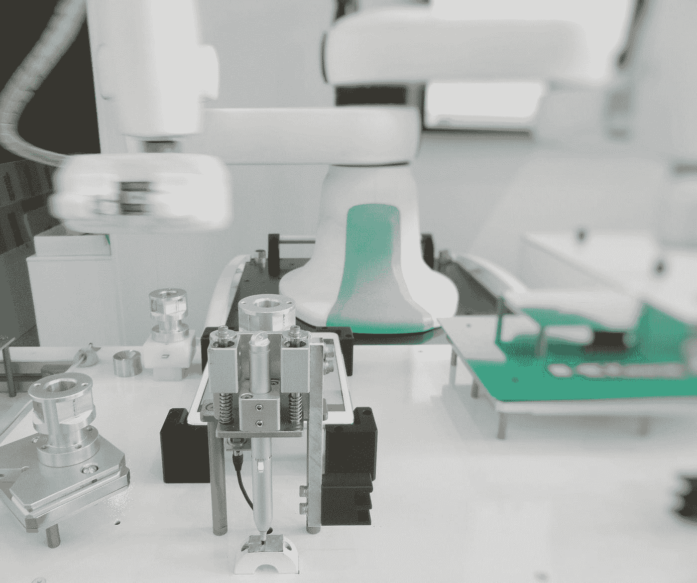

[附身摄影](https://unsplash.com/@possessedphotography?utm_source=medium&utm_medium=referral)在 [Unsplash](https://unsplash.com?utm_source=medium&utm_medium=referral) 上拍照

机器学习只有在投入生产时才有价值，然而这个过程并没有就此结束。我们的机器学习模型需要不断地被监控和自动控制。在生产中部署和维护机器学习模型的实践是 MLOps。

MLOps 的叙述来自旧的 IT 实践，叫做 [DevOps](https://en.wikipedia.org/wiki/DevOps) ，那时我们自动维护软件以提供持续的集成和交付。但是，我们把软件改成了 MLOps 的机器学习模型。

MLOps 可能很难实现，但是已经开发了各种工具来实现我们自动化项目的自动化工作流。在本文中，我想介绍一组开源工具，我们可以用它们来快速实现机器学习生产自动化。

让我们开始吧。

# **简介**

在本文中，我们将学习如何构建一个机器学习自动化项目，在这个项目中，我们将使用 DagsHub、GitHub Action 和 CML 自动进行模型再训练和实验跟踪。

在高级别中，**我们将使用以下工具**:

**DagsHub** 作为一门数据科学，我们可以利用这些平台来:

*   存储实验结果，
*   创建数据管道，
*   存储库镜像，

**GitHub 动作**为了在 GitHub 仓库上自动化工作流开发，

**CML** 在每个 GitHub Pull 请求中自动生成带有指标和图表的报告。

我们将采取步骤**启动 ML 项目**包括:

1.  用模型再训练代码和数据集初始化 GitHub 存储库，
2.  用 DagsHub 镜像 GitHub 存储库使用 DagsHub 连接并构建 DVC 管道，
3.  当推送事件发生时，用 GitHub 动作设置 ML 模型再训练工作流，
4.  使用 CML 在 Pull 请求时设置度量模型再训练输出，并在 DagsHub 上打开一个 Pull 请求，
5.  使用 GitHub 操作在 DagsHub 上设置实验跟踪，

让我详细解释一下我们在开发 ML 工作流自动化时使用的工具。

# DagsHub 连接

DagsHub 是一个类似于 GitHub 的网络平台，但是它使用各种开源平台为数据科学家提供价值。

DagsHub 中有许多令人兴奋的特性，对于**建立 ML 项目和 ML 自动化**非常有用，其中之一就是 **DagsHub 连接。**

## DagsHub 连接

什么是 DagsHub connect？DagsHub 的一个特性是连接 DagsHub 和 GitHub 库，在这里平台可以相互镜像。这种连接将确保使用两个平台的 ML 工作流更加顺畅，包括动作。

Connect 不同于 Migration，因为它允许您的 GitHub 存储库与 DagsHub 存储库相关联。你的 GitHub 库中的每一个变化都会反映在 DagsHub 中。让我们试着镜像回购。

首先，我们需要选择 Connect a Repo 选项，我们将获得以下选择。

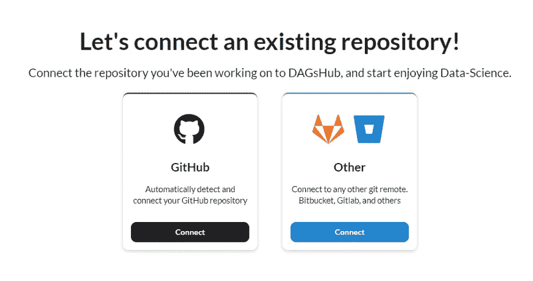

作者图片

我们的连接可能来自 GitHub 存储库或另一个 git 远程对象。在这种情况下，我们将使用标准的 GitHub 连接作为常用连接。

在连接我们的存储库之前，我们需要允许 DagsHub 访问我们的 GitHub 帐户。我们可以通过选择 Add Access to Repository 并遵循安装过程来实现。

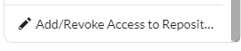

作者图片

访问完成后，连接表单会显示所有的 GitHub 存储库，如下图所示。

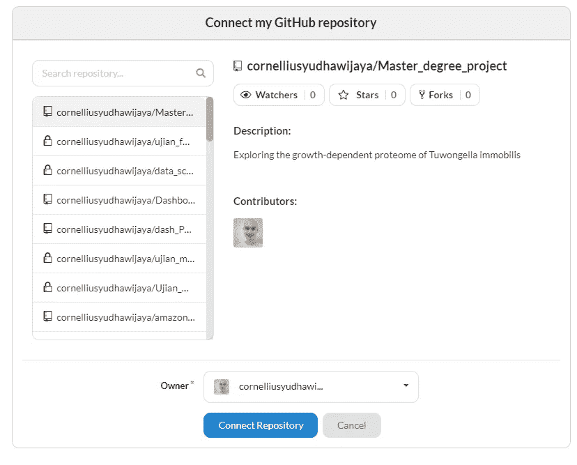

作者图片

在上面的表单中，您可以选择想要镜像到 DagsHub 存储库的 GitHub 存储库。该列表不仅限于您的公共 GitHub 库，还可以扩展到您的私有库。让我们选择任何存储库并将其镜像到 DagsHub 平台。

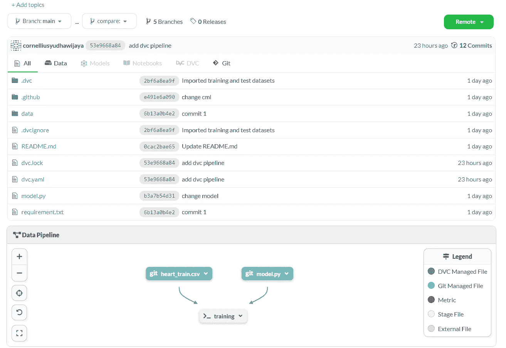

作者图片

如果您进行存储库迁移，连接的 GitHub 存储库与您的存储库类似，但有更多的细节。如果你看一下 repo 的名字，你会意识到有信息表明我们的存储库是 GitHub 存储库的镜像。

作者图片

你的 GitHub 库中的每一个变化都会在其他库中反映出来。

利用 DagsHub connects power 的一个例子是实时自动比较文件差异。每当您在 GitHub 存储库中更改数据或文件时，它都会反映在 DagsHub 中，我们可以对其进行评估。

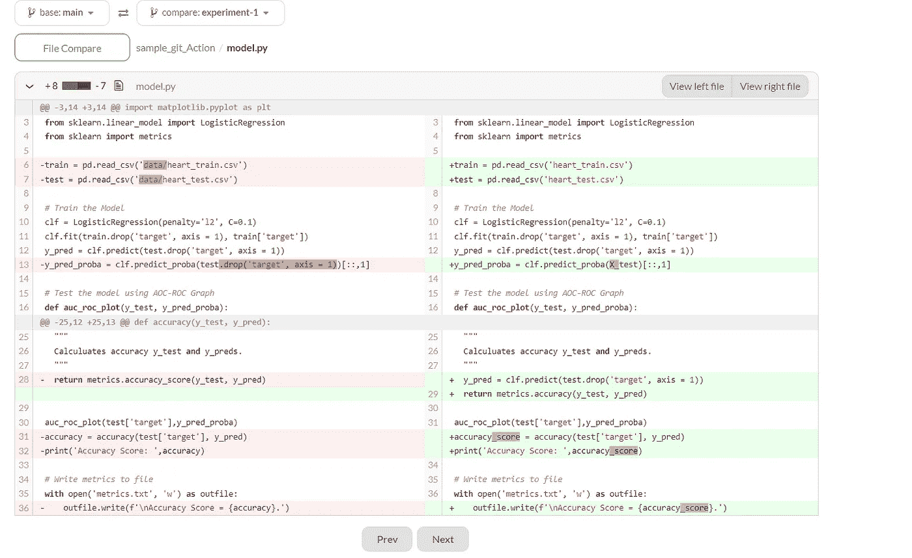

作者图片

利用 DagsHub connect 的另一个示例包括:

*   使用 GitHub 动作和 DagsHub 实验跟踪来建模部署自动化，
*   DagsHub DVC 存储与 GitHub 加载数据的操作相关联，
*   在 GitHub 操作执行期间在 DagsHub 中记录输出，并在 CML 支持下获得相同的输出

然而，在我们的例子中，我们将通过使用 GitHub 动作允许 ML 工作流自动化来进一步连接。

# **GitHub 动作**

什么是 [GitHub 动作](https://docs.github.com/en/actions)？它是 GitHub 存储库中使用的工具，用于在 GitHub 环境中自动化、定制和执行软件开发工作流。

GitHub 动作允许用户简化任何重复动作，以在工作流中提供 CI/CD。要执行或自动化的事件可以是任何事情，例如:

*   启动新的推送请求时部署代码
*   创建新问题时自动发送消息
*   推送新的实验代码时，删除旧的实验代码

以上是我们可以定制 GitHub 动作的一个例子。

那么，我们为什么需要了解 GitHub 的动作呢？难道不是用于软件开发而不是机器学习模型吗？。

接下来，我们将讨论实现 GitHub 动作的工具，但重点是 MLOps。工具是 CML。

# currentmodelogic 电流型逻辑的

[CML](https://cml.dev/) 或称连续机器学习，是 iterative.ai 提供的开源工具，用于在机器学习项目中实现 CI/CD。CML 提供了支持机器学习自动化开发工作流的能力——例如，模型训练和评估、ML 实验比较和监控数据集变化。

CML 很容易在 GitHub 或 GitLab 上使用，因为它依赖于 [GitHub 动作](https://docs.github.com/en/actions)来提供 ML 自动化工作流。让我们试着快速回顾一下如何在我们的工作中使用 CML。在下面的教程中，我假设读者知道 GitHub 存储库是如何工作的。

在我们的例子中，我们将使用来自 [Vytautas Bielinskas](https://medium.com/u/719c90f475df?source=post_page-----a37fb50d5cb0--------------------------------) 的 CML [Git 示例库](https://github.com/vb100/ml-ops-ci)。您可以克隆或派生存储库，然后我们就可以开始教程了。

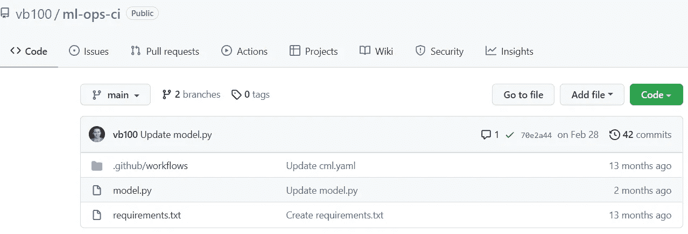

作者图片

为了理解 CML 的概念，我们需要想象我们想要在工作流程中实现什么。

例如，我们希望在发起新的推送请求时进行模型训练，并且每次训练模型时模型信息都是可用的。

我们需要为上面的工作流准备模型训练脚本和所有必需的包。在上面的例子中，我们的模型脚本训练存储在`model.py`文件中，而包需求存储在`requirements.txt`中。

该模型是一个简单的张量流回归，我们将使用 MAE 作为我们的度量。我不会深入训练过程，但是请稍后参考`model.py`文件来检查训练代码。

为了开始创建我们的 CML 工作流，我们需要在存储库中创建一个新文件。

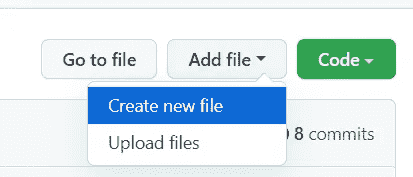

作者图片

CML 在它们的文件和位置中只取一个特定的名称，所以我们需要确保正确的路径名。我们需要键入类似下图的文件名`.github/workflows/cml.yaml`。

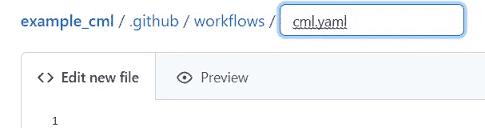

作者图片

我们需要在新文件中编写与下面代码类似的基本工作流结构。

我们在上面的代码中用几个步骤定义了 ML 培训工作流。让我们稍微分析一下代码做了什么。

*   第 1 行，我们设置了工作流名称，
*   在第 2 行，我们设置了触发工作流的条件。在这种情况下，我们在[推送]发生时设置它，
*   第 5–6 行是代码的环境，
*   第 8 行，我们使用 action/checkout 来签出存储库，这样我们的工作流就可以访问它，
*   第 12 行，我们设置了 ML 工作流，
*   第 14–15 行是我们安装需求和执行模型训练(`model.py`)的地方，
*   第 17–23 行将度量结果和模型性能发送到拉请求注释，
*   第 25 行，我们发布评论的地方。

在我们上面的代码中有两个特定的 CML 命令:

*   `cml-publish`(第 23 行)用于在 CML 报告中存放图像
*   `cml-send-comments`(第 25 行)用于以降价格式发布报告

创建新文件时，提交新文件，但要在不同于主文件的分支中。

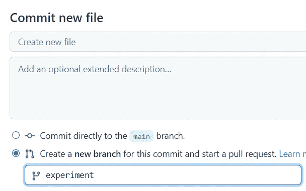

作者图片

成功提交新文件后，CML 工作流会立即执行，因为我们在推送发生时设置了实验触发器。让我们检查一下 Action 选项卡，您将在这里找到您的跑步模型的完整摘要。

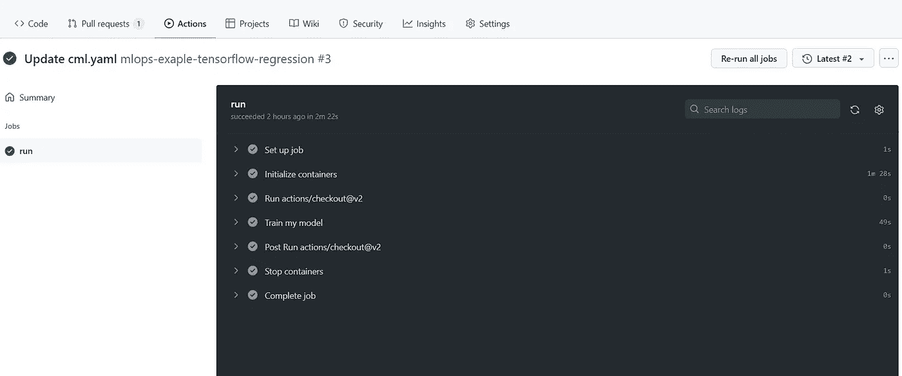

作者图片

对于我们设置的注释，它将显示在 conversation 部分的 Pull requests 选项卡上。

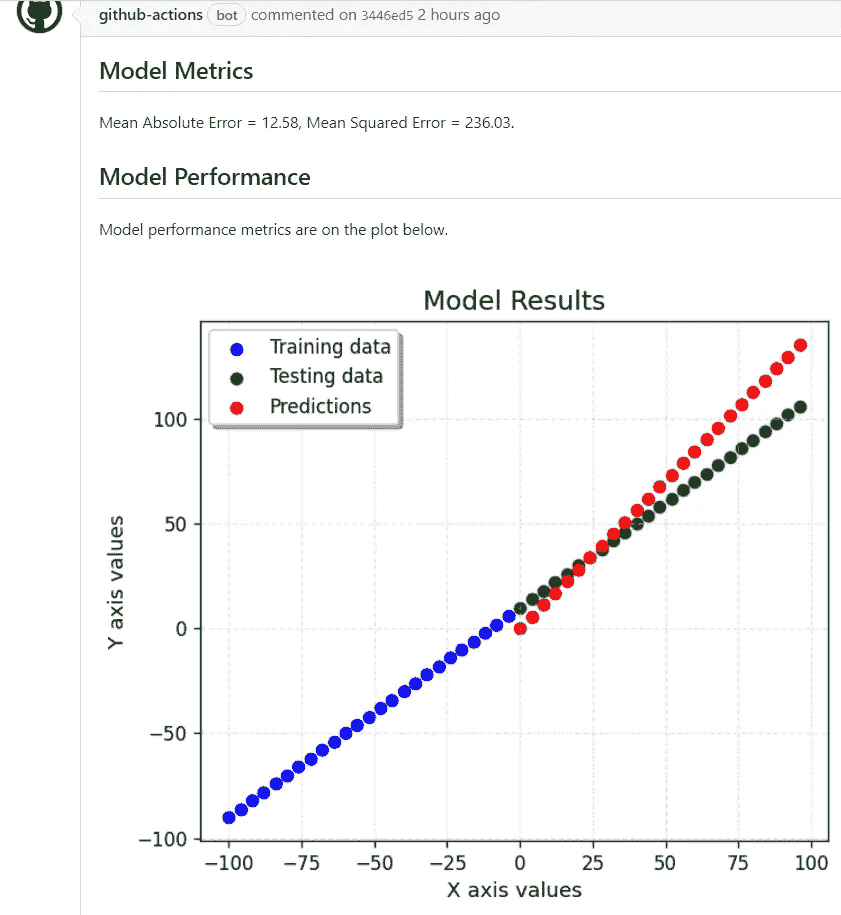

作者图片

很有意思吧？GitHub action 提供了自动化 ML 工作流的能力，CML 通过给出 ML 工作流输出的命令来支持 GitHub action。

要了解 GitHub Action 和 CML 的更多信息，请参考以下文档:

 [## 使用

### 任何 CML 项目中的关键文件都是。github/workflows/cml.yaml:上面的例子在 pull 中生成可视化报告…

cml.dev](https://cml.dev/doc/usage)  [## GitHub -迭代/设置-dvc: DVC GitHub 动作

### DVC GitHub 行动。通过在 GitHub 上创建一个帐户，为迭代/设置-dvc 开发做出贡献。

github.com](https://github.com/iterative/setup-dvc)  [## GitHub -迭代/cml: ♾️ CML -连续机器学习|用于 ml 的 CI/CD

### 什么是 CML？持续机器学习(CML)是一个开源的 CLI 工具，用于实现持续集成和

github.com](https://github.com/iterative/cml) 

# 使用 DagsHub 进一步增强工作流程

我们知道 DagsHub Connect 将允许存储库镜像，GitHub actions 将使我们能够自动化开发自动化工作流，CML 支持 ML 自动化。让我们把所有的工具放在一起。

如果你读了我以前的文章，你就会知道 DagsHub 和 GitHub 很相似。尽管如此，它们提供了许多数据科学家可以使用的功能，例如，实验跟踪和实时日志记录。你可以在我下面的文章中进一步阅读介绍。

 [## DagsHub 简介:完整的数据科学项目集成平台

### 一个屋檐下代码、实验、模型和数据集成

towardsdatascience.com](https://towardsdatascience.com/introducing-dagshub-complete-data-science-project-integration-platform-c3bec84e4e7c) 

## **CML 输出拉请求镜像**

GitHub 和 DagsHub 连接不仅允许连接存储库，还允许记录两个平台之间的所有动作。让我们看看 GitHub 和 DagsHub 之间是如何工作的。

对于这个例子，我将使用额外的库来镜像 DagsHub。下面是我的 GitHub 上的存储库。

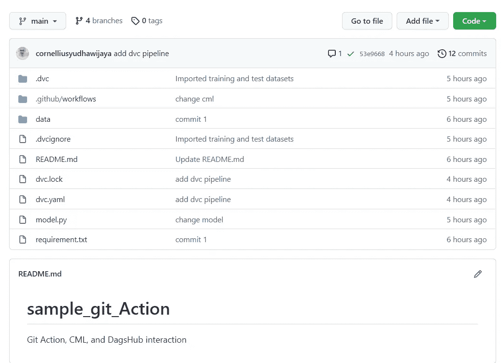

作者图片

在这个存储库中，我设置了一个 GitHub 动作，用于在 push 事件发生时对心脏病预测模型进行再训练，并在 Pull 请求中使用 CML 绘制度量图输出。

使用 DagsHub connect，我会将示例 GitHub 存储库镜像到我的 DagsHub 存储库中。此外，我将利用 DagsHub 的数据管道可视化功能，向我的所有同事通报实验是如何进行的。

DVC 管道对我们的工作流很有帮助，尤其是在应用 GitHub 动作时，因为我们知道哪个文件或工作流想要触发动作。

作者图片

我已经在我的 GitHub 存储库中触发了 GitHub 操作，CML 输出显示在 GitHub Pull 请求上。

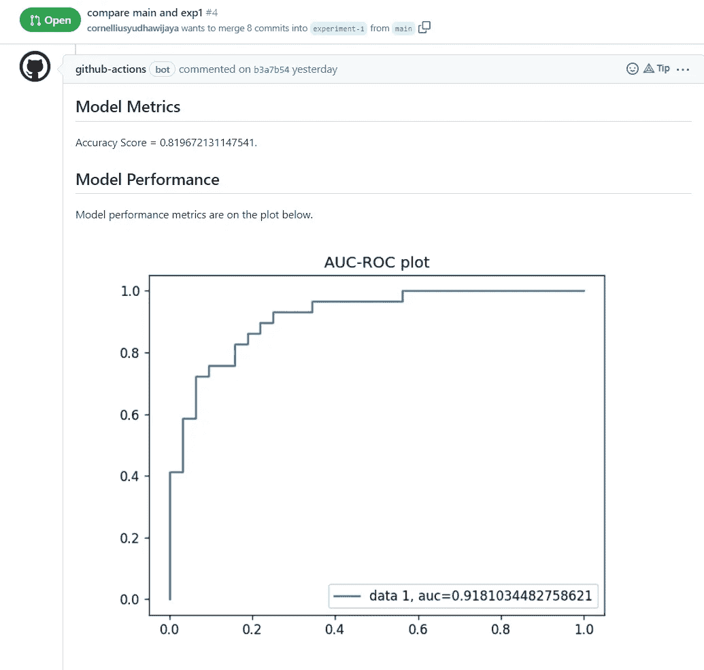

作者图片

对于 DagsHub connect，我已经提到过两个平台之间的所有操作都是连接的，包括 Pull 请求。

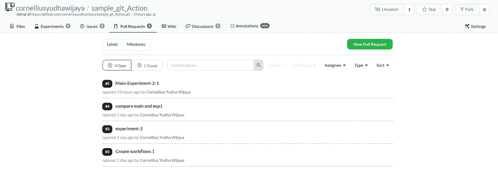

作者图片

但是，我们需要设置连接设置来链接所有 PR 注释，以便在 pull 请求中显示我们的注释。这将允许 GitHub PR 中的 CML 输出显示在 DagsHub PR 上。

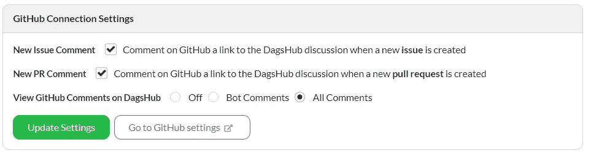

作者图片

每当我们触发 GitHub 动作时，活动输出会在 DagsHub Pull 请求上被镜像。两个平台之间的所有信息都是可用的，这样，我们可以更好地利用两个平台的功能。

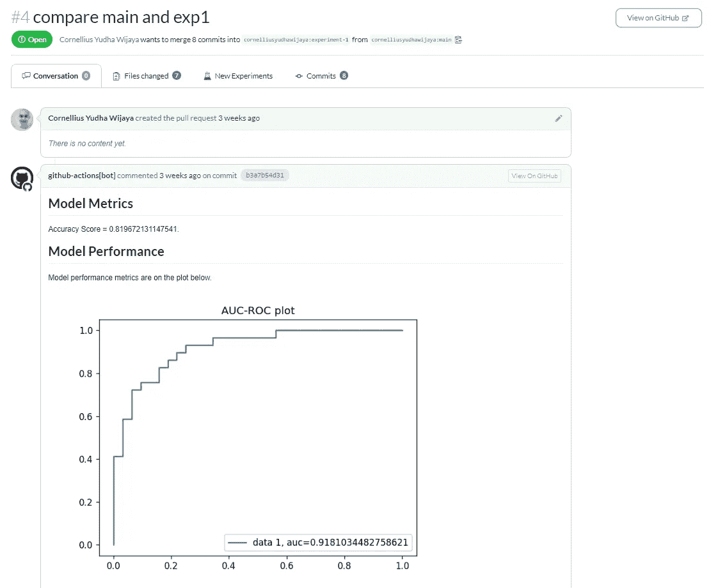

作者图片

**ML 实验跟踪**

让我举一个用例的例子，用 GitHub Action 和 DagsHub 来启发您的活动。

在我们前面的例子中，我们已经使用 GitHub action 在每次 push 活动发生时启动训练，CML 将为 pull 请求生成一个报告。让我们采取进一步的步骤**,在每次 GitHub 动作运行时，使用 DagsHub 存储库**中的 MLFlow 记录实验。

对于上面的例子，我们需要修改一些文件。首先，我们必须通过添加额外的 MLFlow 包来更改 requirements.txt 文件。

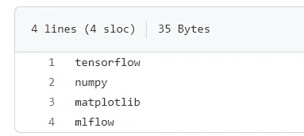

作者图片

接下来，我们需要导入 MLFlow 包，并在 model.py 文件中设置 DagsHub 凭据。

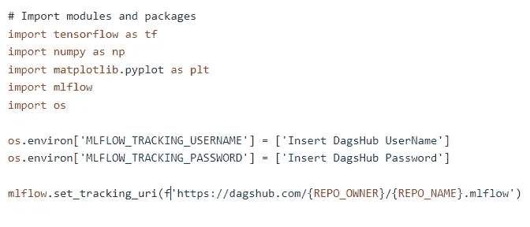

作者图片

最后，在拟合模型之前，我们添加了 MLFlow logger 跟踪器。因为我们使用 TensorFlow 来训练我们的模型，所以我们可以使用`mlflow.tensorflow.autolog()`来获取模型参数信息。

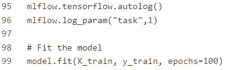

图片作者。

GitHub action 和 MLFlow 在 DagsHub 存储库上的结合将导致每次发生推送事件时实验日志记录的自动化。所有的实验日志都存储在实验选项卡中。

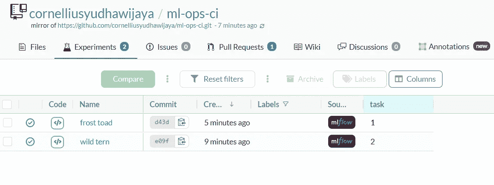

作者图片

如果我们更详细地研究结果，我们可以看到在我们的实验和指标中发生了什么。

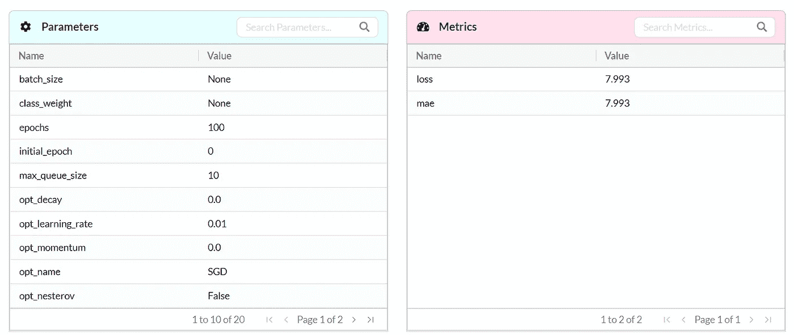

作者图片

# **结论**

GitHub Actions 是软件开发人员使用的工具，通过在 GitHub 存储库中提供 CI/CD 功能来自动化开发工作流。

使用 CML(连续机器学习),我们可以为 GitHub 动作工作流提供 ML 支持，尤其是工作流输出。

如果我们更进一步，我们可以将 GitHub 与 DagsHub 连接起来，使用 DagsHub 的特性来增强 GitHub 的操作能力。

希望有帮助！