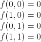
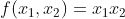
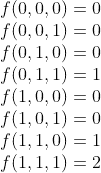
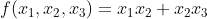
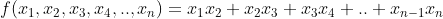
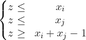
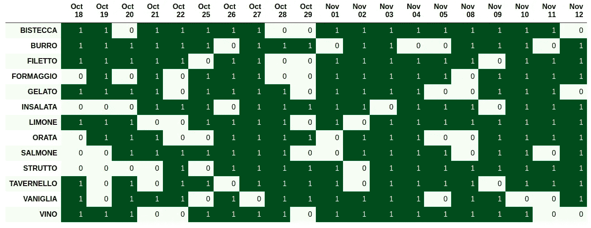
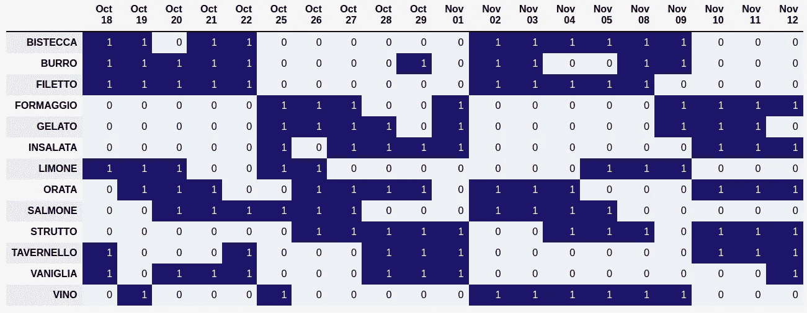

# 经理，用这个来为你的团队规划智能工作日吧！

> 原文：<https://pub.towardsai.net/managers-use-this-to-plan-the-smart-working-days-for-your-team-e457d97825ac?source=collection_archive---------3----------------------->

## [优化](https://towardsai.net/p/category/optimization)

## 一个数学优化工具来安排智能工作日和计划返回办公室

图片由[digity Marketing](https://unsplash.com/@diggitymarketing?utm_source=medium&utm_medium=referral)在 [Unsplash](https://unsplash.com?utm_source=medium&utm_medium=referral) 上拍摄

# 介绍

在新冠肺炎期间，几个团队被迫完全在家工作。幸运的是，去年情况有所改善，在许多国家，团队被允许部分返回办公室。该项目旨在为所有经理提供**工具** **，以便更好地规划员工返回办公室或未来几周的智能工作日。**

这篇文章是这样组织的:

*   *动机，*表达优化算法有助于计划和调度的原因。
*   *优化算法，*介绍数学优化的主要对象。
*   *建模，*详述优化建模的一部分是如何执行的。这是最具挑战性的部分，可以跳过。
*   *结果，*描述从算法获得的结果。
*   *结论，*收尾。

在本文中，我假设您对与数学优化相关的概念和思想有所了解。如果不是这样，我推荐看看 Coursera 上的这个免费的[课程](https://www.coursera.org/learn/discrete-optimization)。这很艰难，但是值得！

你可以在我的 [**GitHub 页面**](https://github.com/colibri17/back-to-office) 上找到**的所有细节和代码。**

# 动机

对人类来说，计划员工返回办公室可能是一项复杂的任务。**选择最佳配置极具挑战性**，尤其是要考虑许多约束条件的时候。例如，我们可能需要考虑员工的返回偏好、可用的工作站、房间的最大容量以及社交距离。对人类来说，同时考虑所有这些可能很难，**特别是如果我们的目标是找到可能的最佳配置**。

由于这些原因，**一个优化算法可以帮助**。它可以考虑不同的因素，定义硬约束以防止指定的配置，并在数学上确保识别的解决方案是最优的。

# 优化参数

优化模型由三个主要对象组成:**决策变量、目标函数和约束**。这些都可以在代码中完全定制。

*决策变量*
每个决策变量都是一个二元变量 ***xᵢⱼ* ，代表员工 I 在 j** 日是否返回办公室。

*目标函数*目标函数由不同的项组成。注意**分配给每一项的权重可以在代码中定制**,这样就可以将项从优化过程中排除。

*   *连续几天。对于一个雇员来说，在连续的工作日可能更容易回来，所以每当这种情况发生时，目标函数就增加。*
*   *同队*。同一个团队的成员更喜欢在同一天回来，所以每当这种情况发生时，目标函数就增加。
*   *目标出现。*每个员工都应该回来工作最少的天数，鼓励给办公室一些公平的回报。因此，每当员工在整个计划期间没有达到规定的平均出席率，目标函数就会增加一个惩罚。
*   *单一退货。应该鼓励员工返回办公室，因此无论何时任何员工出现在办公室，目标函数都会增加。*

*约束* 我们有两种类型的约束:

*   员工的最大和最小数量。每天返回办公室的员工人数有上限和下限。优化算法防止找到超过这些值的解。
*   *偏爱天。员工可以选择哪一天可以回来，哪一天不可以回来。优化算法找到符合这些偏好的解决方案。*

# 建模

为了解决优化问题，我们需要**根据决策变量**表达约束和目标函数的每个元素。

因为我们使用的是二进制变量，所以我们可以灵活表达。**假设我们试图表达术语*连续天数*** ，其目的是促进员工连续天数的回报。

回想一下，每个决策变量 *xᵢⱼ* 代表员工 I 在 j 日是否来办公室。现在，让我们**关注单个员工**，并考虑相关序列 *x₁* 、 *x₂* ，..、 *xⱼ* 、…、 *xₙ* 的决策变量，其中 *n* 为计划周期的天数。

如果我们考虑 *n =* 2(即我们计划 2 天)，那么我们希望找到一个 *x₁* 、 *x₂* 的函数𝑓，使得当 *x₁ = 0* 或 *x₂ = 1* 时为 0，当 *x₁ = 1* 和 *x₂ = 1:* 时为 1

这样，当员工在第 1 天和第 2 天都来到办公室时(即当 *x₁ =1* 和 *x₂= 1* )，连续天数*项为 1，目标函数增加 1。而是当这不成立时，项为 0，目标函数不增加。*

这样的函数𝑓可以很容易地表示为:

现在假设 *n =* 3(即计划 3 天)。类似地，我们希望找到 *x₁* 、 *x₂* 、 *x₃* 的函数𝑓，使得当 *x₁ = 1* 、 *x* ₂ *= 1* 、 *x₃ = 1* (即员工回来的时间为三天)时，函数为 2。 当 *x₁ = 1* 和 *x₂ = 1* 或 *x₂ = 1* 和 *x₃ = 1* 时为 1(即员工第一天和第二天或第二天和第三天回来)，否则为 0:

这种函数是前一种情况的扩展，可以表示为:

你可以看到模式。一般来说，对于 *n* 天，*连续天数*项可以表示为:

# 线性化

有一个旁注。你可能已经注意到**派生项不是线性项**。当添加到目标函数中时，它会导致目标函数非线性，反过来，这又会导致在寻找最优解时出现一些问题。实际上，**线性问题保证在数学上找到唯一最优解**。此外，几乎所有(免费)解算器只在线性优化的情况下工作。

然而，在二元产品决策变量的情况下，我们可以使用一个有趣的策略**使术语线性**。具体来说，对于每个二进制乘积，我们引入一个新的二进制变量*z =**xᵢ***xⱼ*(其中在本例中 *xᵢ* 和 *xⱼ* 是两个二进制变量)，以及一组对 *z* 的约束，它们由下式给出:

变量 *z* 表现为二进制乘积*。*当 *xᵢ* *=* 0 或 *xⱼ =* 0 时， *z* 需要小于 0，因此必须为零。当*xᵢ*t14】=1 或者 *xⱼ = 1* 时， *z* 需要大于 1，所以它必须是 1。因此，我们可以回到线性情况。

最后，请注意，为了能够详细说明整个优化问题，必须对目标函数和约束条件的每一项重复**类似的过程。**

# 结果

为了运行代码并获得结果，我们将重点放在一个特定的初始配置上，但是它可以被**完全定制以适应您的需求**。在这种情况下，我们将假设以下设置:

*   员工人数为 13 人(名为意大利食品:)
*   计划时间为 20 天(相当于 4 周，即 1 个月)
*   4 最少允许员工在同一天返回办公室。最多允许 6 名员工在同一天返回办公室。
*   计划期间的 8 天(即每周 2 天)是每个员工都应该达到或超过的目标出勤时间。
*   共有 4 个员工小组，定义如下:
    -员工编号 1、2、3
    -员工编号 4、5、6
    -员工编号 8、9、10
    -员工编号 11、12
    注意，一名员工可能属于多个小组。

最后，员工偏好报告如下。浅绿色单元格表示员工不能回到办公室的日子，在优化解决方案中必须避免这些日子。深绿色的单元格代表员工可以回到办公室的日子。

n=20 天的员工偏好(图片由作者制作)

现在，是时候运行我们的 Python [笔记本](https://github.com/colibri17/back-to-office/blob/main/optimization.ipynb)并获得结果了:

优化解决方案(图片由作者制作)

如你所见，**算法做了大量的工作**！同一个子团队的员工组成的集群在图中**清晰可见，员工确实倾向于**连续几天来办公室**。另外，请注意每天**的员工人数不超过规定的限制**，并且每个**员工在计划期间至少回来 8 天**！**

哇！热爱数学！

# 结论

在本文中，我们描述了一个工具，它可以为返回办公室或智能工作的团队确定最佳计划。**使用数学算法构建，同时考虑不同的约束和因素**。我们设置了一个初始配置，并展示了使用这种算法的好处。

请注意，该算法还有许多改进的地方，这些**最终取决于个人需求**。例如，我们可能希望员工或团队在整个计划期间更加统一，或者不鼓励一些员工连续几天返回。

然而，在**中，使用这样的工具可以非常有效地为需要为他们的团队计划返回办公室或智能工作日的经理节省时间和资源**。

希望你喜欢这篇文章，请随意评论并竖起大拇指！
留金！