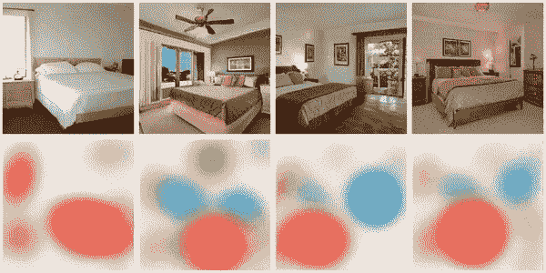
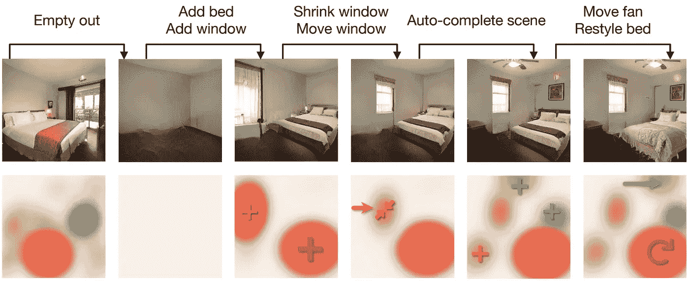
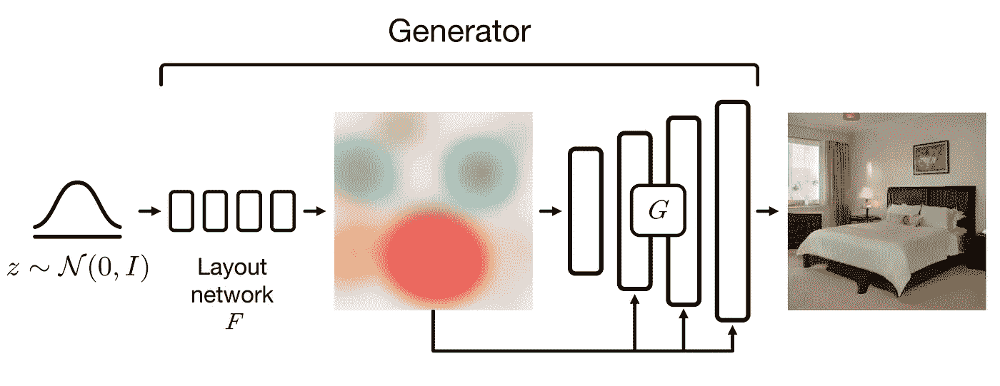
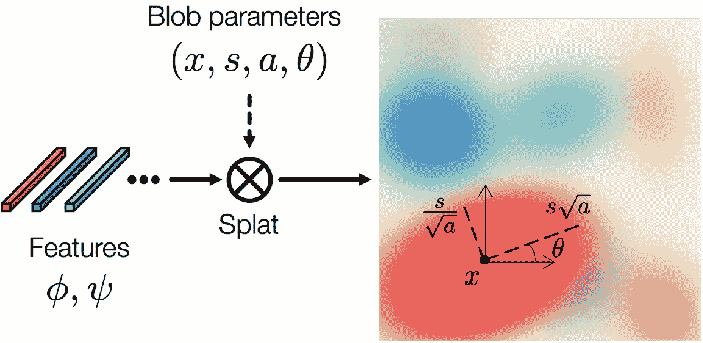
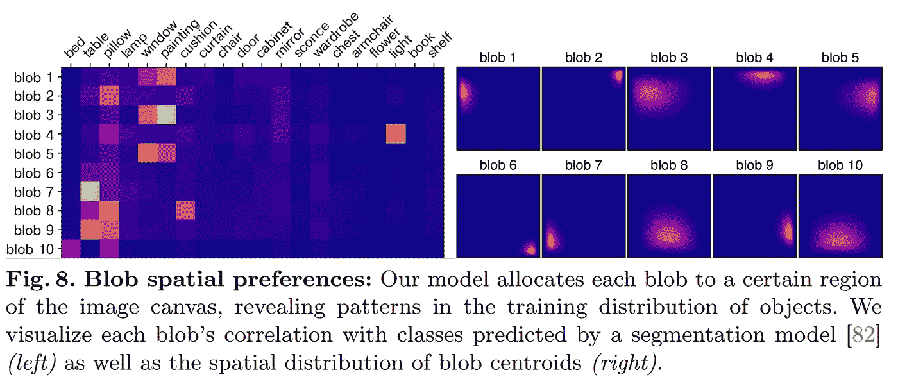

# 用斑点操纵图像！布洛根解释说

> 原文：<https://pub.towardsai.net/manipulate-images-with-blobs-blobgan-explained-fde11ea77809?source=collection_archive---------1----------------------->

## 一个 GAN 模型，使用简单的斑点来操纵图像中的对象…

> 最初发表于 [louisbouchard.ai](https://www.louisbouchard.ai/blobgan/) ，前两天在[我的博客](https://www.louisbouchard.ai/blobgan/)上读到的！

如果你认为甘斯的进步已经结束，那你就大错特错了。这是 BlobGAN，这篇新论文简直不可思议。

移动所有对象的例子。图片来自作者的[项目页面](https://dave.ml/blobgan/)。

BlobGAN 允许对图像进行不真实的操作，使得控制简单的 blobs 变得非常容易。所有这些小斑点代表一个物体，你可以四处移动它们或者让它们变大，变小，甚至移除它们，它会对它在图像中所代表的物体产生相同的效果。这太酷了。

正如作者在他们的成果中分享的那样，你甚至可以通过复制斑点来创建新颖的图像，在数据集[中创建看不见的图像，就像一个有两个吊扇的房间](https://youtu.be/mnEzjpiA_4E)！如果我错了，请纠正我，但我相信这是一篇论文，如果不是第一篇的话，让图像的修改像移动斑点一样简单，并允许在训练数据集中看不到的编辑。

和我们都知道的一些公司相比，你实际上可以玩这个！他们公开分享了他们的代码和一个你可以马上尝试的 Colab 演示。更令人兴奋的是 BlobGAN 是如何工作的，我们将在几秒钟内深入探讨。

## 观看结果:

既然你已经在视频或上面的 gif 中看到了一些结果，让我们回到我们的论文 BlobGAN:空间解纠缠的场景表示。

标题说明了一切，BlobGAN 使用 blobs 来解开场景中的对象。
这意味着模型学习将每个斑点与场景中的特定对象相关联，如床、窗户或吊扇。一旦训练完成，你就可以单独移动斑点和物体，放大或缩小它们，复制它们，甚至从图片中删除它们。当然，结果并不完全真实，但是正如一个伟大的人会说的，“想象一下这种方法的潜力，再过两篇论文”。

那些斑点。图片来自作者的论文。

更酷的是，这种训练是在无人监督的情况下进行的。这意味着你不需要像在监督训练中那样，需要每一个图像样本来训练它。一个简单的例子是，监督训练需要您在图像数据集中进行所有需要的操作，以教会斑点学习这些变换。而在无监督学习中，您不需要这些大量的数据，模型将学习自己完成这项任务，在没有显式标签的情况下，自己将斑点与对象相关联。

我们以 GAN 方式用生成器和鉴别器训练模型。我将简单地做一个快速的概述，因为我已经在许多视频中涉及到甘斯。像在 GANs 中一样，鉴别者的职责是训练生成器生成逼真的图像。该架构最重要的部分是带有 blobs 的生成器和类似 StyleGAN2 的解码器。如果您对它的工作原理感兴趣，我还在其他视频中介绍了基于 StyleGAN 的生成器。

布洛根模型的可视化。图片来自作者的论文。

但是，简而言之，我们首先创建我们的 blobs。这是通过采用随机噪声来实现的，正如在大多数生成器网络中一样，并使用第一神经网络将其映射到斑点中。这个会在训练的时候学到。然后，你需要做一件不可能的事情:用这个斑点代表创建一个真实的图像？！这就是甘神奇的地方。

斑点生成的可视化。图片来自作者的 [pape](https://dave.ml/blobgan/) r

我们需要一个类似 StyleGAN 的架构来从这些斑点中创建我们的图像。当然，我们编辑了架构，将刚刚创建的斑点作为输入，而不是通常的随机噪声。然后，我们使用鉴别器来训练我们的模型，以学习生成逼真的图像。一旦我们有了好的结果，这意味着我们的模型可以采用斑点表示而不是噪声并生成图像。

但是我们还有一个问题。我们如何解开这些斑点，并使它们与物体相匹配？

这就是我们无人监管方法的美妙之处。该模型将迭代地改进和创建逼真的结果，同时还学习如何以固定数量的斑点的形式表示这些图像。

图片来自作者的 [pape](https://dave.ml/blobgan/) r

你可以在这里看到斑点是如何经常被用来表示场景中相同的物体或者非常相似的物体的。在这里，你可以看到同样的斑点是如何被用来表现一扇窗户或者一幅画的，这很有意义。同样，你可以看到光线几乎总是出现在第四个斑点中。同样，您可以看到斑点通常表示场景中的相同区域，这肯定是由于实验所用数据集中图像的相似性。

瞧！这就是 BlobGAN 如何学习使用非常直观的 blob 表示来操纵场景！我很高兴看到结果的真实性提高，保持类似的方法。使用这样的技术，我们可以设计简单的交互式应用程序，让设计师或任何人都可以轻松地操作图像，这是非常令人兴奋的。

当然，这只是这篇新论文的概述，我强烈建议阅读他们的论文，以便更好地理解和了解他们所做的方法、实现和测试的更多细节。

正如我在文章前面说过的，他们公开分享了他们的代码和一个你可以马上尝试的 Colab 演示。所有的链接都在下面的描述中。

谢谢你一直读到最后，下周我会带着另一篇惊人的论文和你见面！欢迎在[我的视频](https://www.youtube.com/watch?v=mnEzjpiA_4E)下发表评论，或者加入我们的 Discord 社区，在那里分享你的项目，它叫做[一起学习人工智能](https://discord.gg/learnaitogether)，我很乐意在那里与你见面！

## 参考

观看视频:
EP stein，d .，Park，t .，Zhang，r .，Shechtman，e .和 Efros，A.A .，2022。BlobGAN:空间上不纠缠的场景表现。arXiv 预印本 arXiv:2205.02837。
项目链接:[https://dave.ml/blobgan/](https://dave.ml/blobgan/)
代码:[https://github.com/dave-epstein/blobgan](https://github.com/dave-epstein/blobgan)
Colab 演示:[https://Colab . research . Google . com/drive/1c lvh 28 yds 5 cvksyyengls 3 iiirlzk4xo？USP = sharing # scroll to = 0 quviyvploku](https://colab.research.google.com/drive/1clvh28Yds5CvKsYYENGLS3iIIrlZK4xO?usp=sharing#scrollTo=0QuVIyVplOKu)
我的时事通讯(每周向您的电子邮件解释一个新的人工智能应用程序！):[https://www.louisbouchard.ai/newsletter/](https://www.louisbouchard.ai/newsletter/)