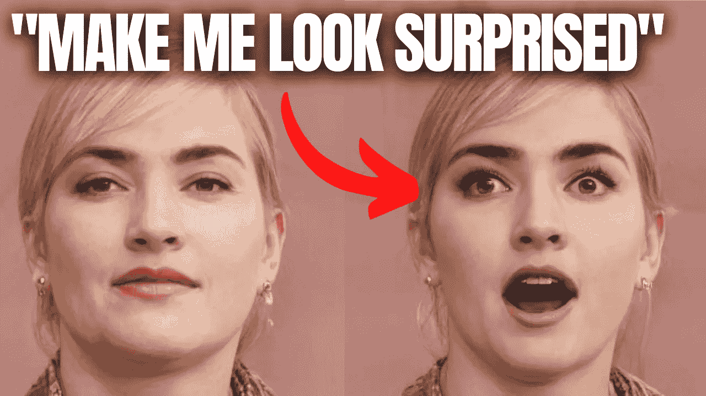
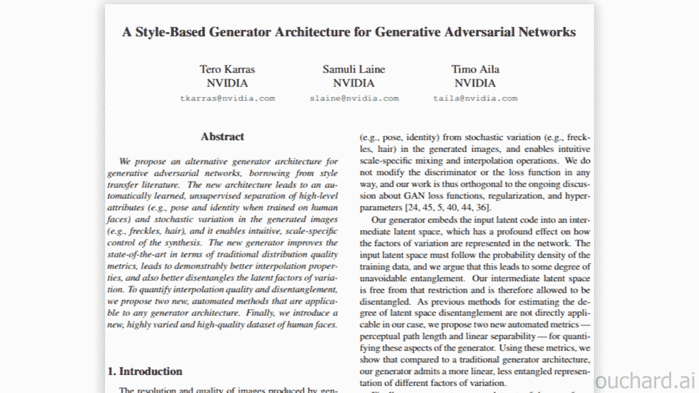
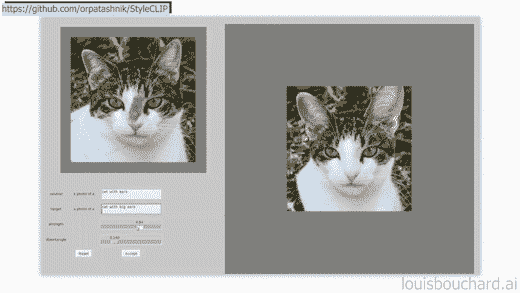
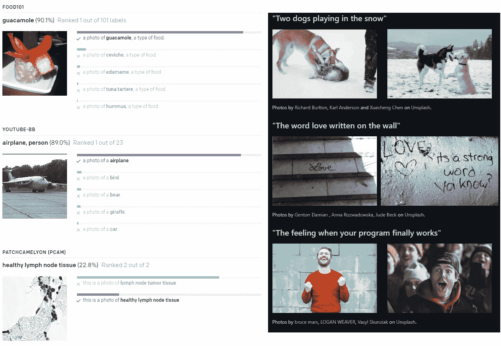
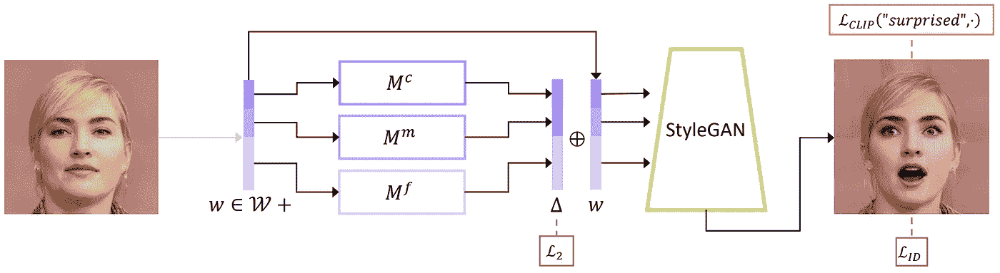

# 用文本处理真实图像

> 原文：<https://pub.towardsai.net/manipulate-real-images-with-text-25b9f583e292?source=collection_archive---------2----------------------->

## [人工智能](https://towardsai.net/p/category/artificial-intelligence)

## 创意艺术家的人工智能！StyleCLIP 解释

> 原载于 [louisbouchard.ai](https://www.louisbouchard.ai/styleclip/) ，前两天在[我的博客](https://www.louisbouchard.ai/styleclip/)上看到的！

## 观看视频并在 YouTube 上支持我:

研究人员使用人工智能来生成图像。然后，他们可以利用它来拍摄图像，并按照特定的风格进行编辑，比如将它变成卡通人物或将任何脸变成笑脸。在实现一些现实的东西之前，这需要大量的调整和模型工程以及许多试验和错误。在这个领域已经有了许多进展，主要是 StyleGAN，它具有在几乎任何领域生成逼真图像的惊人能力；现实生活中的人类、卡通、素描等。

我在以前的文章中介绍过的 StyleGAN 应用程序示例

StyleGAN 令人惊叹，但仍需要相当多的工作才能使结果看起来像预期的那样，这就是为什么许多人试图了解这些图像是如何制作的，尤其是如何控制它们。这是非常复杂的，因为我们编辑图像的表现方式对人类并不友好。它不是具有红色、贪婪和蓝色三个维度的常规图像，而是信息极其密集，因此包含数百个维度，具有关于图像可能包含的所有特征的信息。这就是为什么理解和定位我们想要改变的特征以生成相同图像的新版本需要如此多的工作。这里的关键词是“同一个图像”挑战在于只编辑想要的部分，而保持其他部分不变。如果我们改变眼睛的颜色，我们希望所有其他面部特征保持不变。

我最近介绍了各种技术，研究人员试图通过使用[几个图像示例](https://www.youtube.com/watch?v=vz_wEQkTLk0&t=1s)或[快速草图](https://www.youtube.com/watch?v=xoEkSWJSm1k)来让用户更容易地进行控制。

StyleCLIP GUI 示例，可在 [StyleCLIP 的 GitHub](https://github.com/orpatashnik/StyleCLIP) 上获得。

现在，你可以只用文本来完成。在这篇新论文中，Or Patashnik 等人创建了一个模型，能够通过简单的文本输入来控制图像生成过程。你可以发送它几乎任何面部变换和使用样式和剪辑。它会明白你想要什么，并改变它。然后，你可以调整一些参数，以获得可能的最佳结果，这需要不到一秒钟的时间。

我提到了斯泰勒根。StyleGAN 是 NVIDIA 最先进的 GAN 架构，用于图像合成或图像生成。我在各种应用里做了很多覆盖它的视频，如果你不熟悉的话绝对应该看。

(左)来自 [OpenAI 的博客](https://openai.com/blog/clip/)的剪辑示例和(右)[使用剪辑的 Unsplash 图像搜索](https://github.com/haltakov/natural-language-image-search)。

在进入细节之前，唯一要涉及的是我谈到的 StyleGAN 与之结合的另一个模型，即 CLIP。很快，CLIP 是 OpenAI 最近发布的一种强大的图像模型语言。正如我们将看到的，这个模型负责控制只使用我们的图像和文本输入对图像的修改。它接受了来自网络的大量图像-文本对的训练，基本上可以理解图像中出现的内容。由于 CLIP 是在这样的图像-文本对上训练的，它可以有效地将文本描述与现有图像进行匹配。因此，我们可以在当前的模型中使用相同的原理，将 StyleGAN 生成的图像定向到所需的文本转换。如果您想了解更多关于 CLIP 的知识，您应该阅读 OpenAI 的 Distill 文章。它在下面的参考文献中有链接。它已经被用来从文本输入和其他非常酷的应用程序中搜索 Unsplash 上的特定图像。在这种情况下，CLIP 如何有用很快就会变得非常清楚。顺便说一句，如果你觉得这很有趣，花一秒钟来分享这个乐趣，并把这篇文章发送给一个朋友。很有帮助！

正如我所说的，研究人员使用这些已经训练好的模型 StyleGAN 和 CLIP 来实现这一点。以下是如何…

它接受一个输入图像，比如这个例子中的人脸。但是它也可以是一匹马，一只猫，或者一辆车…任何你能找到的东西，一个 StyleGAN 模型，用足够的数据在这样的图像上训练。然后，这个图像用编码器编码成潜码，就像这样，这里叫 w。

样式剪辑映射模型。图片来自 Patashnik，Or，et al .(2021)，“Styleclip”。

这种潜在代码只是卷积神经网络产生的图像的浓缩表示。它包含关于图像的最有用的信息，这些信息在模型的训练期间被识别。
如果这已经太复杂了，我强烈建议你暂停阅读，看一下[我制作的一分钟短片](https://www.youtube.com/watch?v=rt-J9YJVvv4)，其中我解释了编码器部分通常是如何工作的。

这种潜在的代码，或新的图像表示，然后被发送到三个映射器网络，这些网络被训练来处理图像的期望属性，同时保留其他特征。这些网络中的每一个都负责学习如何映射特定级别的细节，从粗略到精细，这是在从网络中不同深度的编码器提取信息时决定的，正如我在 GAN 视频中解释的那样。这样，他们可以单独操作一般或精细特征。这就是剪辑模型用于操作这些映射的地方。由于训练，映射将学习相应地移动到文本输入，因为剪辑模型理解图像的内容，并且以与图像编码相同的方式编码文本。因此，CLIP 可以理解从一个文本到另一个文本的转换，如从“中性脸”到“惊讶脸”，并告诉映射网络如何将相同的转换应用到图像映射。这个变换是这里的 delta 向量，它由 CLIP 控制，并对潜在代码 w 应用相同的相对平移和旋转，就像对文本所发生的一样。然后，这个修改后的潜在代码被发送到 StyleGAN 生成器中，以创建我们转换后的图像。

样式剪辑映射模型。图片来自 Patashnik，Or，et al .(2021)，“Styleclip”。

总之，剪辑模型理解句子中发生的变化，如“**一张中性的脸**”到“**一张惊讶的脸**”，并且它们将相同的变换应用于编码图像表示。然后，这个新的转换后的潜在代码被发送到 StyleGAN 生成器，以生成新的图像。

瞧！这就是你如何发送一个图像，并根据这个新模型的一个简单的句子来改变它。他们还制作了一个 [google colab](https://colab.research.google.com/github/orpatashnik/StyleCLIP/blob/main/notebooks/StyleCLIP_global.ipynb) 和一个[本地 GUI](https://github.com/orpatashnik/StyleCLIP) 来用任何图像测试它，并使用滑块直观地控制修改，轻松地玩它。

当然，[代码](https://github.com/orpatashnik/StyleCLIP)在 GitHub 上也有。唯一的限制是你必须训练映射网络，但是他们也在论文中讨论了这个问题。为了更深入地了解它是如何工作的，并了解这两种其他技术，他们介绍了用 CLIP 控制图像生成，而不需要任何培训。我强烈建议阅读他们的论文。值得花时间！所有的链接都在下面的参考文献中。

感谢您的阅读！

如果你喜欢我的工作，并想与人工智能保持同步，你绝对应该关注我的其他社交媒体账户( [LinkedIn](https://www.linkedin.com/in/whats-ai/) ， [Twitter](https://twitter.com/Whats_AI) )，并订阅我的每周人工智能 [**简讯**](http://eepurl.com/huGLT5) ！

## 支持我:

*   支持我的最好方式是成为这个网站的会员，或者如果你喜欢视频格式，在[**YouTube**](https://www.youtube.com/channel/UCUzGQrN-lyyc0BWTYoJM_Sg)**上订阅我的频道。**
*   **在经济上支持我在 T21 的工作**
*   **跟我来这里上 [**中**](https://whats-ai.medium.com/)**

## **参考资料:**

*   **Patashnik，Or，et al .(2021)，“风格剪辑:风格图像的文本驱动操作。”，[https://arxiv.org/abs/2103.17249](https://arxiv.org/abs/2103.17249)**
*   **代码(与本地 GUI 或 colab 笔记本一起使用):[https://github.com/orpatashnik/StyleCLIP](https://github.com/orpatashnik/StyleCLIP)**
*   **演示:[https://colab . research . Google . com/github/orpatashnik/style clip/blob/main/notebooks/style clip _ global . ipynb](https://colab.research.google.com/github/orpatashnik/StyleCLIP/blob/main/notebooks/StyleCLIP_global.ipynb)**
*   **OpenAI 为 CLIP 撰写的文章:Gabriel Goh、Nick Cammarata、Chelsea Voss、Shan Carter、Michael Petrov、Ludwig Schubert、Alec 拉德福德和 Chris Olah。人工神经网络中的多模态神经元。蒸馏，[https://distill.pub/2021/multimodal-neurons/](https://distill.pub/2021/multimodal-neurons/)，2021。**