# 在 Python 中操作时间序列数据

> 原文：<https://pub.towardsai.net/manipulating-time-series-data-in-python-49aed42685a0?source=collection_archive---------0----------------------->

## Python Pandas 中时间序列数据操作的实用指南

ime 系列数据是行业中最常见的数据类型之一，在您的职业生涯中可能会用到它。因此，了解如何使用它以及如何应用分析和预测技术对于每个有抱负的数据科学家来说至关重要。在这一系列文章中，我将介绍处理时间序列数据的基本技术，从数据操作、分析和可视化开始，以了解您的数据并为其做准备，然后使用统计、机器和深度学习技术进行预测和分类。这更像是一个实践指南，我将把每个讨论和解释的概念应用到真实数据中。

这个系列将由 10 篇文章组成:

1.  [在 Python Pandas 中操作时间序列数据【实用指南】](/manipulating-time-series-data-in-python-49aed42685a0)(你来了！)
2.  [Python Pandas 中的时间序列分析【实用指南】](/time-series-data-analysis-in-python-1492ee4ca974)
3.  [用 Python 可视化时间序列数据【实用指南】](https://medium.com/towards-artificial-intelligence/time-series-data-visualization-in-python-2b1959726312)
4.  [利用 Python 中的 ARIMA 模型进行时间序列预测【第一部分】](/time-series-forecasting-with-arima-models-in-python-part-1-c2940a7dbc48)
5.  [利用 Python 中的 ARIMA 模型进行时间序列预测【第二部分】](/time-series-forecasting-with-arima-models-in-python-part-2-91a30d10efb0)
6.  [时间序列数据的机器学习【回归】](/machine-learning-for-time-series-data-in-python-regression-5e19fa2e7471)
7.  时间序列数据的机器学习[分类](即将推出)
8.  时间序列数据的深度学习[实用指南](即将推出)
9.  使用统计分析、机器学习和深度学习的时间序列预测项目(即将推出)
10.  使用统计分析、机器学习和深度学习进行时间序列分类(即将推出)

时间序列数据/照片由[克里斯·利维拉尼](https://unsplash.com/@chrisliverani?utm_source=medium&utm_medium=referral)在 [Unsplash](https://unsplash.com?utm_source=medium&utm_medium=referral) 上拍摄

# 目录:

1.  在 Pandas 中处理时间序列
2.  基本时序指标和重采样
3.  窗口功能:滚动和扩展指标
4.  构建价值加权指数

所有使用的代码和数据都可以在这个 [**呼吸**](https://github.com/youssefHosni/Time-Series-Analysis/tree/main/Manipulating%20Time%20Series%C2%A0Data) 中找到。

**如果你想免费学习数据科学和机器学习，看看这些资源:**

*   免费互动路线图，自学数据科学和机器学习。从这里开始:[https://aigents.co/learn/roadmaps/intro](https://aigents.co/learn/roadmaps/intro)
*   数据科学学习资源搜索引擎(免费)。将你最喜欢的资源加入书签，将文章标记为完整，并添加学习笔记。[https://aigents.co/learn](https://aigents.co/learn)
*   想要在导师和学习社区的支持下从头开始学习数据科学吗？免费加入这个学习圈:[https://community.aigents.co/spaces/9010170/](https://community.aigents.co/spaces/9010170/)

如果你想在数据科学&人工智能领域开始职业生涯，但你不知道如何开始。我提供数据科学指导课程和长期职业指导:

*   长期指导:[https://lnkd.in/dtdUYBrM](https://lnkd.in/dtdUYBrM)
*   辅导课程:[https://lnkd.in/dXeg3KPW](https://lnkd.in/dXeg3KPW)

***加入*** [***中等会员***](https://youssefraafat57.medium.com/membership) ***计划，只需 5 美元，继续无限制学习。如果你使用下面的链接，我会收到一小部分会员费，不需要你额外付费。***

 [## 加入我的介绍链接媒体-优素福胡斯尼

### 阅读 Youssef Hosni(以及媒体上成千上万的其他作家)的每一个故事。您的会员费直接支持…

youssefraafat57.medium.com](https://youssefraafat57.medium.com/membership) 

# 1.在 Pandas 中处理时间序列

本节为利用强大的时间序列功能奠定了基础，这些功能是通过 Pandas 表示日期(尤其是 DateTimeIndex)实现的。您将学习如何创建和操作日期信息和时间序列，以及如何使用具有时间意识的数据框架进行计算，以便及时移动数据或创建特定时期的回报。

## 1.1.如何使用熊猫的数据和时间

使用 Pandas 时间戳( **pd)在 python 中创建时间序列数据的基本构件。【时间戳)**如下例所示:

时间戳对象有许多属性，可用于检索数据的特定时间信息，如年份和工作日。在下面的示例中，检索的是数据的年份。

第二个构件是**周期**对象。period 对象有一个 freq 属性来存储频率信息。默认为每月频率，您可以从一个频率转换到另一个频率，如下例所示。

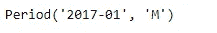

输出显示默认频率是月频率。您可以使用下面的代码将其转换为每日频率。

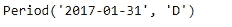

您还可以将 period 转换为 timestamp，反之亦然。如下例所示。

您可以进行基本的数据算术运算，例如，以月频率从 2017 年 1 月的 period 对象开始，只需添加数字 2 即可获得 2017 年 3 月的月周期。如下例所示。

输出如下图所示:

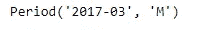

要创建时间序列，您需要创建一个日期序列。要创建时间戳序列，使用熊猫的函数 **date_range** 。您需要指定开始日期和/或结束日期，或者多个期间。默认值为每日频率。该函数将日期序列作为带有频率信息的 DateTimeindex 返回。您将认识到第一个元素是熊猫的时间戳。

如下例所示，输出如下图所示:

## 1.2.索引和重采样时间序列

基本的转换包括解析以字符串形式提供的日期，并将结果转换为匹配的名为 datetime64 的 Pandas 数据类型。它们还包括选择时间序列的子周期，以及设置或更改 DateTimeIndex 的频率。您可以将频率更改为更高或更低的值:上采样涉及增加时间频率，这需要生成新数据。下采样意味着降低时间-频率，这需要聚集数据。

为了更好地理解这些转换，我们将把它应用到 [**谷歌股票价格数据**](https://github.com/youssefHosni/Time-Series-Analysis/tree/main/Time%20Series%20Manipulation) 。首先，如果您检查日期列的类型，它是一个对象，所以我们想通过下面的代码将其转换为日期类型。

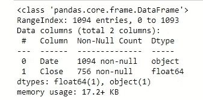

日期信息从字符串(对象)转换为 datetime64，我们还将日期列设置为数据框的索引，因为使用以下代码可以更容易地处理数据:

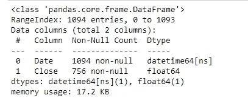

为了更直观地了解数据的样子，让我们使用下面的代码绘制价格与时间的关系图:

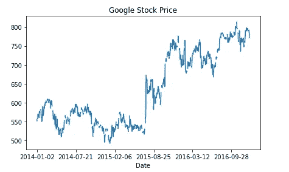

谷歌股价随时间的变化。

您还可以使用日期索引对数据进行部分索引，如下例所示:

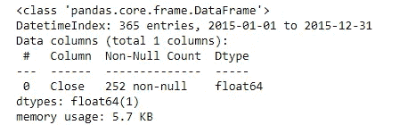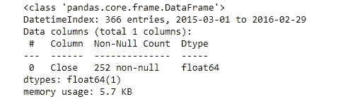

您可能已经注意到我们的 DateTimeIndex 没有频率信息。您可以使用 **dot-asfreq** 设置频率信息。别名“D”代表日历日频率。因此，DateTimeIndex 现在包含许多股票未被买入或卖出的日期。

以下示例显示了如何将 google 股票数据的 DateTimeIndex 转换为日历日频率:

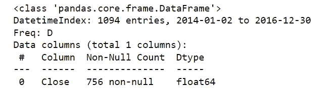

由于这种每日采样，实例数量已增加到 756 个。下面的代码打印每日重新采样数据的前五行:

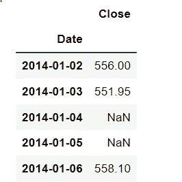

我们可以看到，由于这种每日重采样，有一些 NaN 值丢失了新数据。

我们还可以使用相同的方法将 DateTimeIndex 设置为工作日频率，但是要将。asfreq()方法。如下例所示:

如果我们打印前五行，将如下图所示:

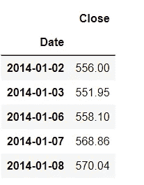

现在可用的数据只有工作日的数据。

## 1.3.股票价格序列的滞后、变化和回报

在时间上向后或向前移动或滞后值。shift():在过去和未来之间移动数据。默认值是未来的一个周期，但是您可以通过给 periods 变量指定所需的移位值来更改它。

下面显示了一个 shift 方法的示例:

输出如下图所示:

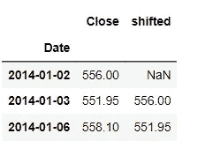

要将数据移至过去，您可以使用 **periods=-1** ，如下图所示:

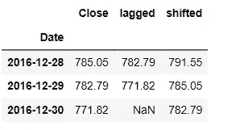

股票价格数据以及时间序列数据的一个重要属性是百分比变化。它的公式是:((X(t)/X(t-1))-1)*100。

有两种方法可以计算它，我们可以使用内置函数 **df.pct_change()** 或者使用函数 **df.div.sub()。mul()** 和都将给出相同的结果，如下例所示:

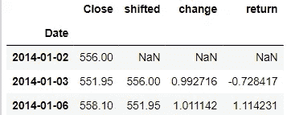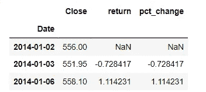

我们还可以使用 **df.pct_change()** 方法中的 **periods** 变量来获得多期回报，如下例所示。

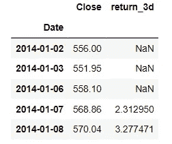

# **2。基本时间序列指标&重采样**

在这一节中，我们将深入探讨通过 pandas DataTimeIndex 提供的基本时间序列功能。我们将介绍重采样以及如何通过标准化起始点来比较不同的时间序列。

## 2.1.重采样

我们将从改变时间序列数据频率的重采样开始。这是一个非常常见的操作，因为您经常需要将两个时间序列转换到一个共同的频率来一起分析它们。当您通过将数据转换到更高的频率来进行上采样时，您会创建新的行，并且需要告诉 pandas 如何填充或插入这些行中缺失的值。当您进行下采样时，您减少了行数，并且需要告诉 pandas 如何聚合现有数据。

为了说明对数据进行上采样时会发生什么，让我们以相对较低的季度频率为 2016 年创建一个序列，其整数值为 1-4。当您选择季度频率时，pandas 默认为第四季度末的十二月，您可以通过使用带有季度别名的不同月份来修改它。

接下来，让我们看看当您使用 **dot-asfreq()** 将频率从季度转换为月度来对时间序列进行上采样时会发生什么。熊猫在现有日期之间向 DateTimeIndex 添加新的月末日期。因此，现在有几个月在 3 月和 12 月之间缺少数据。

输出如下所示:

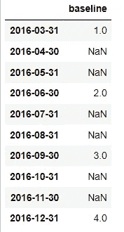

让我们比较一下熊猫在上采样时填充缺失值的三种方法。前两个选项涉及选择填充方法，向前填充或回填。第三种选择是提供全部价值。

如果比较结果，您会发现如果未来包含缺失值，正向填充会将任何值传播到未来。回填对过去做同样的事情，fill_value 只是替换缺失的值。

如果您想要覆盖全年的每月 DateTimeIndex，您可以使用**点重新索引**。Pandas 将现有数据与新的月值对齐，并在其他地方生成缺失值。您可以对**点重新索引**使用与您刚刚对**点重新索引**完全相同的填充选项。

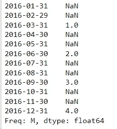

## 2.2.上采样和插值

重采样方法遵循类似于**点分组法**的逻辑:它在重采样周期内对数据进行分组，并对该组应用一种方法。它采用此方法得出的值，并在重采样周期内分配一个新的日期。新日期由所谓的偏移量确定，例如，可以在周期的开始或结束位置，也可以在自定义位置。您将使用重采样来应用在上采样时填充或内插缺失日期的方法，或者在下采样时进行聚合的方法。

我们将把重采样方法应用于 [**月失业率**](https://github.com/youssefHosni/Time-Series-Analysis/tree/main/Time%20Series%20Manipulation) 。首先，我们将使用**日期**列上传并保存它，并使它成为一个索引。

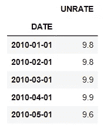

自 2010 年以来使用 read_csv 导入的 85 个数据点没有频率信息。对第一行的检查表明，数据是在每个日历月的第一天报告的。因此，让我们在每个日历月的开始使用**点重采样**和**点频率**方法对其进行重采样。

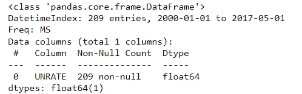

这两种方法是一样的。当按月进行重采样时，我们目前关注的是月末频率。换句话说，重采样后，新数据将被分配到每个月的最后一个日历日。但是，下表显示了相当多的替代方案:

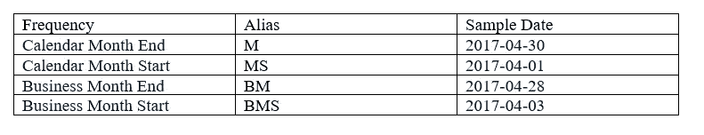

重采样周期和频率偏移

根据您的上下文，您可以重新采样到日历月或业务月的开始或结束。

重采样实现了以下逻辑:上采样时，重采样周期会比数据点多。每个重新采样周期都有一个给定的日期偏移，例如月末频率。然后您需要决定如何为新的重采样周期创建数据。新的数据点将被分配给日期偏移。相反，下采样时，数据点比重采样周期多。因此，您需要决定如何聚合数据以获得每个日期偏移的单个值。

现在让我们用一个季度序列，实际 GDP 增长。您会看到同样没有频率信息，但是前几行确认了每个季度第一天报告的数据。

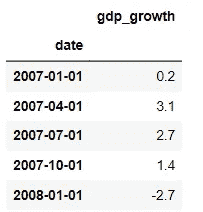

我们可以使用**点重采样**将这个序列转换为月初频率，然后向前填充逻辑来填充间隙。我们使用**点加后缀**来区分列标签和我们接下来要产生的变体。

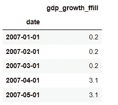

重采样还允许您对缺失的值进行插值，即填充位于现有季度增长率之间的直线上的值。看一下前几行显示了如何对平均值的现有值进行插值。

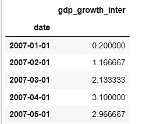

我们现在将使用熊猫**点连接**函数连接两个数据帧来合并这两个序列。使用 axis=1 使 pandas 水平连接数据帧，对齐行索引。过去两年的数据图显示了新数据点如何位于现有数据点之间的线上，而向前填充则创建了一个类似台阶的模式。

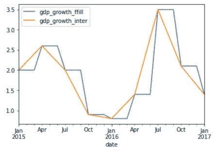

重采样 gdp_growth 图

对 GDP 增长进行重采样后，您可以根据其常见频率绘制失业率和 GDP 序列。

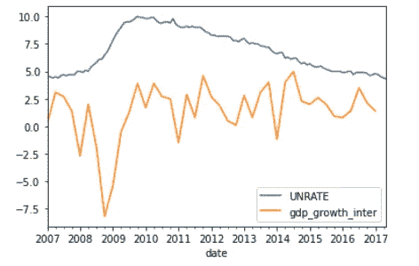

## 2.3.缩减采样和聚合

到目前为止，我们已经关注了上采样，即增加时间序列的频率，以及如何填充或插值任何缺失值。下采样则相反，是如何降低时间序列数据的频率。例如，这包括将每小时的数据转换为每天的数据，或者将每天的数据转换为每月的数据。在这种情况下，您需要决定如何汇总现有数据，因为 24 小时变成了一天。您的选择是熟悉的聚合指标，如平均值或中值，或者只是最后一个值，您的选择将取决于上下文。

我们先用 **read_csv** 从环保局导入 [**空气质量数据**](https://github.com/youssefHosni/Time-Series-Analysis/tree/main/Time%20Series%20Manipulation) 。它包含了纽约市从 2000 年开始的日平均臭氧浓度。由于导入的 DateTimeIndex 没有频率，让我们首先使用**点重采样**分配日历日频率。产生的 DateTimeIndex 有附加条目，以及预期的频率信息。

要将每日臭氧数据转换为每月频率，只需使用新的采样周期和偏移量应用重新采样方法。我们选择默认月末偏移的月度频率。接下来，应用平均值方法将每日数据聚合为单个月值。您可以看到月平均值已被分配到日历月的最后一天。

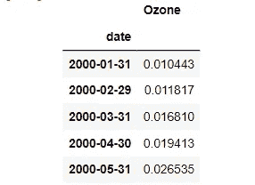

每月重新取样后的臭氧数据。

您可以以完全相同的方式应用中间值。

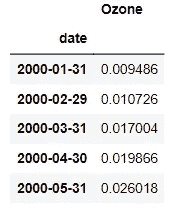

类似于 **groupby** 方法，您也可以一次应用多个聚合。

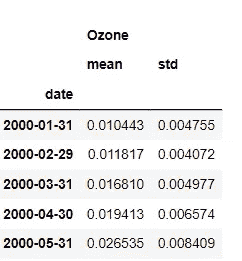

让我们以日历-每日的频率来可视化相对于原始数据的重新采样的聚合序列。我们将绘制从 2016 年开始的数据，以便您可以看到更多细节。Matplotlib 允许您通过引用包含绘图的 axes 对象在同一对象上多次绘图。

相对于原始数据的重新采样的聚合序列

第一个图是原始系列，第二个图包含带后缀的重新采样系列，以便图例反映差异。你可以看到，重新采样的数据平滑多了，因为月波动率已经被平均了。我们也来看看如何对几个系列进行重采样。

# 3.窗口功能:滚动和扩展指标

在本节中，我们将向您展示如何使用 window 函数来计算滚动和扩展窗口的时间序列指标。

## 3.1.熊猫的窗口功能

窗口函数非常有用，因为它们允许您对时间序列的子周期进行操作。特别是，窗口函数计算窗口内数据的指标。然后，这种计算的结果形成新的时间序列，其中每个数据点代表原始时间序列的几个数据点的汇总。我们将讨论两种主要类型的窗口:**滚动窗口**在时间序列上滑动时保持相同的大小，因此每个新的数据点都是给定数量的观察的结果。**扩展窗口**随着时间序列增长，因此产生新数据点的计算是所有先前数据点的结果。

让我们计算一个简单的移动平均线，看看它在实践中是如何工作的。我们将再次使用过去几年的谷歌股价数据。我们将看到两种定义滚动窗口的方法:

首先，我们应用整数窗口大小为 30 的**滚动**。这意味着窗口将包含前 30 个观察或交易日。当选择基于整数的窗口大小时，如果窗口没有缺失值，pandas 将只计算平均值。您可以通过将 min_periods 参数设置为小于窗口大小 30 的值来更改此默认值。

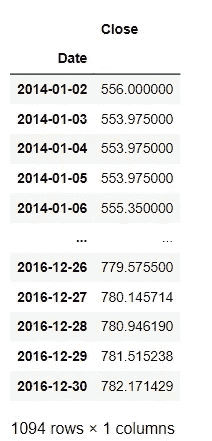

您还可以基于日期偏移创建窗口。例如，如果您选择 30D，该窗口将包含过去 30 个日历日内股票交易的天数。虽然窗口在周期长度方面是固定的，但是观察的数量将会变化。我们来看看滚动平均是什么样子的。

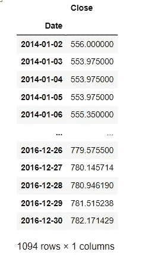

你也可以计算 90 个日历日的滚动平均值，并将其加入到股票价格中。join 方法允许您沿着轴 1(即水平方向)连接一个系列或数据帧。这只是你以前见过的使用**点连接**函数的不同方式。您可以看到新的时间序列变得更加平滑，因为每个数据点现在都是之前 90 个日历日的平均值。

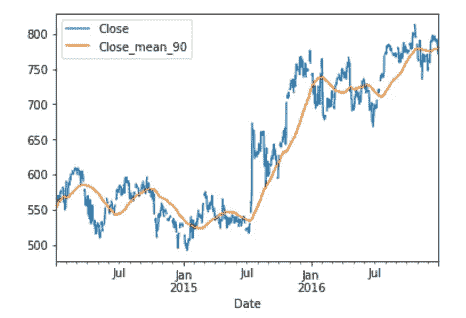

90 天内的价格与平均价格。

要了解延长时间跨度对均线的影响，让我们加上 360 日历日均线。

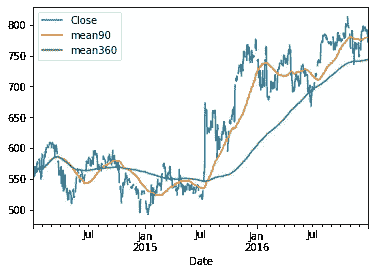

90°和 360°表示滚动平均值。

该系列现在看起来更加平滑，你可以更清楚地看到短期趋势何时偏离长期趋势，例如 2015 年 90 天平均线何时跌破 360 天平均线。

与 **dot-groupby** 类似，您也可以使用 **dot-agg** 方法同时计算多个指标。有了 90 天移动平均线和标准差，你可以很容易地辨别出波动加剧的时期。

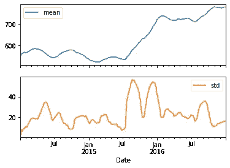

90 天移动平均线和标准差。

最后，让我们显示一个 360 个日历日的滚动中位数，或 50%的分位数，以及 10%和 90%的分位数。同样，你可以看到股票价格的范围是如何随着时间的推移而变化的，有些时期比其他时期波动更大。

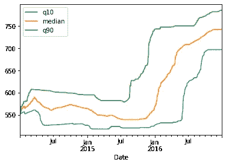

90 日历日滚动中位数，10%和 90%分位数。

## 3.2.用熊猫扩展窗口功能

我们将从滚动窗口转向扩展窗口。现在，您将计算变大的组的指标，以排除截至当前日期的所有数据。生成的时间序列的每个数据点反映了到该点为止的所有历史值。扩展窗口有助于计算累积回报率或连续最大值或最小值。在 pandas 中，您可以使用方法 expanding，它的工作方式就像 rolling，或者在一些情况下，可以使用累积和、积、最小值和最大值的简写方法。

在本节的实际例子中，我们将使用最近十年的 [**S & P500 数据**](https://github.com/youssefHosni/Time-Series-Analysis/tree/main/Time%20Series%20Manipulation) 。让我们先来看看如何计算回报:简单的期间回报只是当前价格除以最后价格减 1。几个周期的回报是所有周期回报加 1 再减 1 的乘积。

所以为了更清楚起见，周期回报是:r(t) = (p(t)/p(t-1)) -1，多周期回报是:R(T) = (1+r(1))(1+r(2))……..(1+r(T)) — 1。

熊猫使这些计算变得简单，你已经看到了百分比变化的方法。pct_change)和基础数学(。diff()，。div()，。mul())，现在您将了解累积积。

要获得 SP500 的累积或运行回报率，只需遵循上述步骤:计算有百分比变化的期间回报率，加 1 计算累积积，减 1。您可以将结果乘以 100，并以百分比形式绘制结果。这方面的代码如下所示:

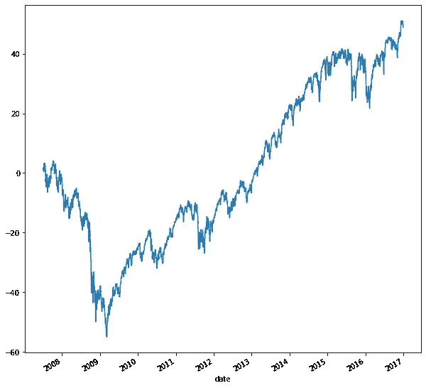

从图中，我们可以看到 SP500 自 2007 年以来上涨了 60%，尽管在 2009 年下跌了 60%。您还可以轻松计算时间序列的运行最小值和最大值:只需应用扩展方法和各自的聚合方法。

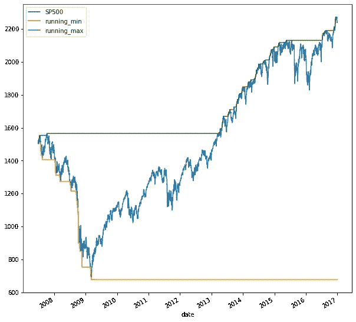

橙色和绿色线条概述了到当前日期为止每天的最小值和最大值。您还可以将滚动窗口的概念与累积计算结合起来。让我们来计算滚动年收益率，即数据覆盖的十年期间所有 360 个日历日期间的累计收益率。这种累积计算不能作为内置方法使用。但是没问题，只要定义你自己的多周期函数，并使用**应用**它来运行滚动窗口中的数据。滚动窗口中的数据作为 **numpy** 数组可用于 multi_period_return 函数。加 1 以增加所有回报，应用 **numpy** 乘积函数，并减 1 以实现上面的公式。只需在为每日回报创建 360°日历日窗口后，通过此功能进行申请。将滚动的 1 年回报率乘以 100，以百分比的形式显示，并使用等于真的支线图绘制在指数旁边。

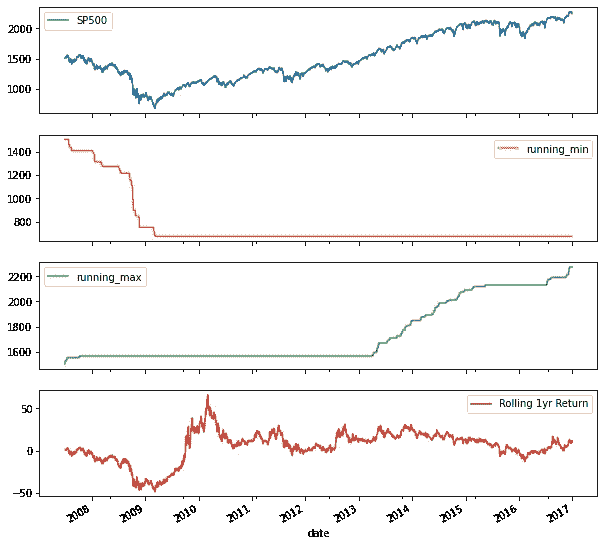

结果显示，2008 年危机之后，年度回报率出现了大幅波动。

## 3.4.随机漫步和模拟

众所周知，每日股票回报很难预测，模型通常假设它们遵循随机游走。我们将使用 NumPy 在时序上下文中生成随机数。您还将再次使用累积积从一系列退货中创建一系列价格。

在第一个例子中，我们将从钟形正态分布中生成随机数。这意味着平均值附近的值比极端值更有可能，就像股票回报的情况一样。在第二个例子中，您将随机选择实际的标准普尔 500 回报，然后模拟标准普尔 500 价格。

要生成随机数，首先从 numpy 的模块 random 导入正态分布和种子函数。此外，从 scipy 导入 norm 包来比较随机样本的正态分布。从 numpy 的正常函数生成 1000 个随机返回，除以 100 以适当地缩放值。让我们画出 1000 个随机回报的分布图，并对您的样本进行正态分布拟合。您可以看到样本非常符合正态分布的形状。

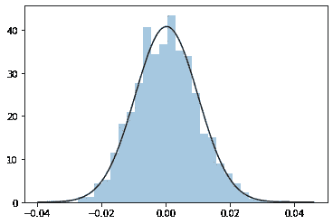

正态分布和 1000 次随机返回。

为了从你的随机回报中创建一个随机价格路径，在将 numpy 数组转换为 pandas 系列之后，我们将遵循小节中的过程。将周期回报加 1，计算累积积，然后减 1。画出累积回报乘以 100，你会看到结果价格。

随机回报。

现在让我们使用随机扩展行走来模拟 SP500。导入该指数最近 10 年的数据，删除缺失值，并将每日回报率作为新列添加到数据框架中。指数和回报系列图显示了+/-2–3%之间的典型日回报范围，以及 2008 年危机期间的一些异常值。

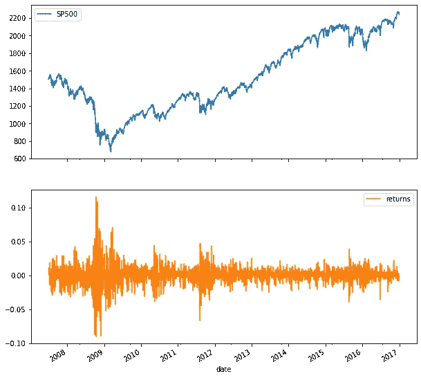

标准普尔 500 回报分布与正态分布的比较表明，它们的形状不太匹配。这是一个典型的发现，每日股票回报比正态分布更容易出现异常值。

现在让我们从实际的标准普尔 500 收益中随机选择。您将使用 Numpy 随机模块中的选择函数。它返回一个 NumPy 数组，其中包含从一个数字列表中随机抽取的样本，在我们的例子中，返回的是标准普尔 500。只需向 choice 函数提供想要的返回样本和观察次数。接下来，将 NumPy 数组转换为 pandas 系列，并将索引设置为标准普尔 500 返回的日期。你的随机漫步将从第一个标准普尔 500 价格开始。

使用带有日历日偏移的“第一个”方法来选择第一个标准普尔 500 价格。然后将随机回报加 1，并将回报序列追加到起始值。现在你已经准备好计算给定实际标准普尔 500 起始值的累积回报了。加 1，算累计积，减 1。结果是基于实际回报的随机样本的 SP500 随机游走。

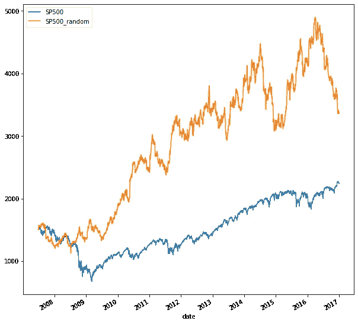

## 3.4.时间序列之间的相关性

相关性是衡量两个变量之间线性关系的关键指标。例如，在金融市场中，资产回报之间的相关性对于预测模型和风险管理非常重要。Pandas 和 seaborn 有各种工具来帮助你计算和可视化这些关系。

相关系数查看变量之间的成对关系，并测量两个变量围绕其各自平均值成对移动的相似性。这种成对的共同运动称为协方差。相关系数将该测量值除以每个变量的标准偏差的乘积。因此，系数在-1 和+1 之间变化。相关系数越接近正 1 或负 1，两个系列的配对图就越像一条直线。系数的符号意味着正的或负的关系。正相关意味着当一个变量高于其均值时，另一个变量也可能高于其均值，反之则为负相关。然而，有许多类型的非线性关系是相关系数不能捕捉的。

在本节中，我们将使用五项资产的 [**价格序列**](https://github.com/youssefHosni/Time-Series-Analysis/tree/main/Time%20Series%20Manipulation) 来分析它们之间的关系。你现在有了两个股票指数、一个债券指数、石油和黄金的 10 年数据。

Seaborn 有一个联合图，可以很容易地显示每个变量的分布以及显示联合分布的散点图。我们将使用每日收益进行分析。联合绘图采用一个数据帧，然后为每个轴采用两个列标签。例如，标准普尔 500 和债券指数具有低相关性，给出了更分散的点云和负相关性，如数据点的轻微下降趋势所示。

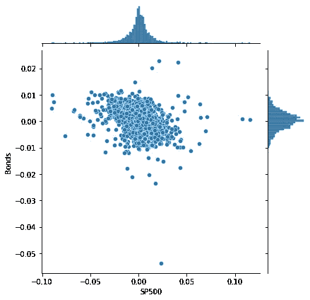

Pandas 允许你用一个叫做**点相关**的方法计算所有的成对相关系数。将它应用于返回数据帧，您将得到一个新的带有成对系数的数据帧。数据自然是围绕对角线对称的，对角线只包含值 1，因为变量与其自身的相关性当然是 1。

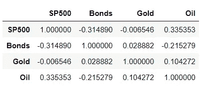

Seaborn 再次提供了一个简洁的工具来可视化成对相关系数。热图将具有相关系数的数据帧作为输入，并在反映相关值范围的色标上显示每个值。参数“不能等于真”确保相关系数的值也显示出来。你可以看到，不同资产类别之间的日收益相关性差异很大。

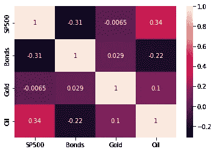

# 4.把所有这些放在一起:建立一个价值加权指数

本章结合了前面的概念，教你如何创建一个价值加权指数。该指数使用证券交易所上市公司中包含的市值数据来计算权重和 2016 年股价信息。然后将索引性能与基准进行比较，以评估您创建的索引的性能。

要建立一个基于价值的指数，你将采取几个步骤:你将使用实际的股票交易数据作为指数成分，从每个行业中选择最大的公司。然后，您将计算每家公司的股票数量，并从文件中选择匹配的股票价格系列。接下来，您将计算每个公司的权重，并基于这些计算每个时期的指数。您还将评估和比较索引性能。

## 4.1 选择索引组件和导入数据

首先，让我们使用 pandas 的 **read_excel** 函数导入公司数据。您将从特定交易所导入带有列表信息的 [**工作表**](https://github.com/youssefHosni/Time-Series-Analysis/blob/main/Time%20Series%20Manipulation/listings.xlsx) ，同时确保正确识别缺失值。

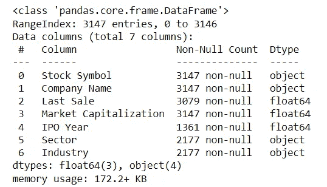

接下来，将股票代码移动到索引中。因为您将从每个行业中选择最大的公司，所以删除没有行业信息的公司。您可以使用' subset '关键字来标识一个或多个列，以过滤掉缺少的值。您已经看到了用于避免创建数据帧副本的关键字“inplace”。最后，将市值除以 100 万，以百万美元表示价值。结果是来自纽约证券交易所的 2177 家公司。

要选择每个行业中最大的公司，请按行业对这些公司进行分组，选择“市场资本总额”列，并应用带有参数 1 的方法 **nlargest** 。结果是一个多指数系列，市值以百万计。

第一个索引级别包含部门，第二个是股票代码。要从第二个指数级别中选择分笔成交点，请选择系列指数，并将方法“get_level_values”与指数名称“股票代码”一起应用。您也可以使用值 1 来选择第二个索引级别。打印代码，你会看到结果是一个单一的数据帧指数。使用方法**点对列表**获得列表形式的结果。

最后，使用 ticker list 从使用 read_csv 导入的一组更广泛的最近价格时间序列中选择您的股票。

## 4.2 构建市值加权指数

要构造市值加权指数，需要同时使用市值和最新股价来计算股票数量，因为市值只是股票数量和每股价格的乘积。接下来，您将使用历史股票价格将其转换为一系列市场价值。然后通过从 100 开始对序列进行归一化，将其转换为指数。您还将看到指数回报以及每个组成部分对结果的贡献。

要计算股数，用市值除以最后的价格就可以了。因为我们是以百万美元计算市值，所以你也以百万美元计算股票。现在，您可以将历史股价系列乘以股票数量。

结果是市场资本总额的时间序列，即每家公司的股票市场价值。通过选择这个系列的第一天和最后一天，你可以比较每家公司的市值在这一年中的变化。

现在，您差不多有了自己的指数:只需使用 sum 方法获得所有公司每期的市场价值，参数 axis 等于 1，对每一行求和。

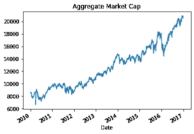

现在，您只需要将这个序列从 1 开始归一化，将这个序列除以它的第一个值，这个值是使用 **dot-iloc** 得到的。将结果乘以 100，您将得到方便的起始值 100，其中与起始值的差异是以百分比表示的变化。

## 4.3.评估索引性能

现在您已经构建了一个加权指数，可以分析它的性能了。你分析的重要因素将是:首先，看看指数回报，以及每个组成部分对结果的贡献。接下来，将你的指数与标准普尔 500 指数等基准指数进行比较，后者覆盖了更广泛的市场，也是价值加权的。您可以比较子期间的整体绩效或滚动回报。

首先，我们来看看每只股票对一年来总增值的贡献。从第一个值中减去总市值的最后一个值，可以看到指数中的公司增加了 3150 亿美元的市值。要查看每家公司对总变化的贡献，请将 diff 方法应用于每家公司和每段时间的市值系列的最后一个和第一个值。最后一行现在包含自第一天以来的总市值变化。您可以使用 dot-loc 和与最后一行相关的日期选择最后一行，或使用参数-1 选择 **iloc** 。

为了计算每个成分对指数回报的贡献，让我们首先计算成分权重。选择指数成分的市值。通过将其市值除以所有组件的市值总和来计算组件权重。如您所见，权重在 2%和 13%之间变化。现在，通过将最后一个指数值除以第一个值，减去 1，然后乘以 100 来计算总指数回报。

现在让我们继续将同期的综合指数表现与标准普尔 500 进行比较。将索引系列转换为数据框架，以便可以插入新列。像以前一样从美联储导入数据。然后归一化标准普尔 500，从 100 开始，就像你的指数一样，作为一个新列插入，然后绘制两个时间序列。你可以看到，你的指数在这段时间里提高了几个百分点。

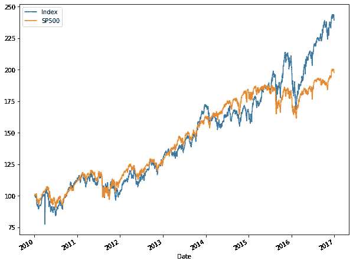

最后，为了比较不同子周期的性能，创建一个多周期回报函数，它将周期回报的 NumPy 数组复合成一个多周期回报，就像在第 3 章中所做的那样。创建您的指数和标准普尔 500 的每日回报，一个 30 个日历日的滚动窗口，并应用您的新函数。该图显示了每个系列的所有 30 天回报率，并说明了 30 天内投资于指数或标准普尔 500 哪个更好。

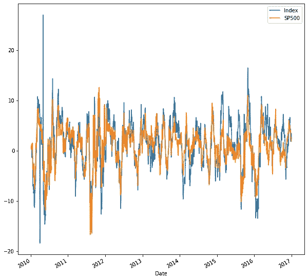 [## 加入我的介绍链接媒体-优素福胡斯尼

### 阅读 Youssef Hosni(以及媒体上成千上万的其他作家)的每一个故事。您的会员费直接支持…

youssefraafat57.medium.com](https://youssefraafat57.medium.com/membership) 

*感谢阅读！如果你喜欢这篇文章，一定要鼓掌(高达 50！)并在* [*LinkedIn*](https://www.linkedin.com/in/youssef-hosni-b2960b135/) *上与我联系，并在*[*Medium*](https://youssefraafat57.medium.com/)*上关注我的新文章。*