# 零售增长的市场篮子分析

> 原文：<https://pub.towardsai.net/market-basket-analysis-key-to-retail-growth-engine-490362d1de94?source=collection_archive---------1----------------------->

## [数据分析](https://towardsai.net/p/category/data-analytics)

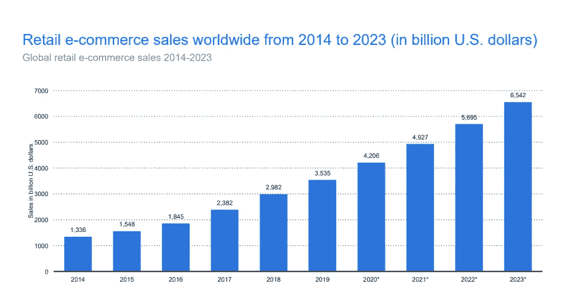

来源:图片由 [bigcommerce](https://www.bigcommerce.com/blog/ecommerce-trends/) 上的[苏珊](https://www.bigcommerce.com/blog/author/susan-meyer/)提供

这些统计数据显示，到 2023 年，电子商务销售额将达到 6.5 万亿美元。不仅是电子商务，我们还看到销售终端零售交易的增长。鉴于这一市场规模，利用零售交易数据在新领域进行创新至关重要。基于零售趋势，我们期待不同的创新，如改善客户体验的个性化。现场个性化是全球大多数零售商的目标之一。

本文将讨论大型零售商使用的“市场购物篮分析”，以了解商品之间的关联。

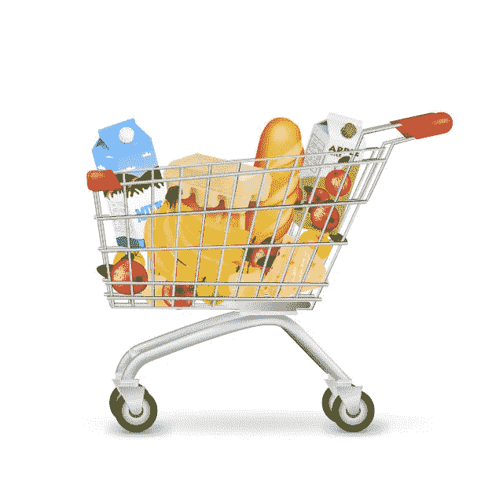

来源:图片由 [freepik](https://www.freepik.com/free-vector/realistic-supermarket-trolley-full-items_9463007.htm#page=1&query=shopping%20basket&position=16) 上的[宏向量](https://www.freepik.com/macrovector)提供

你可能在不同的电商网站看到过“*买了*这件*商品的顾客也买了*”这种方法量化了项目之间的互补和补充关系。

> **如果{面包、饼干}那么{牛奶}**

零售交易数据是在销售点终端生成的丰富信息源。如果明智地使用这些信息，可以帮助公司通过交叉促销和定价增加收入。不仅是这一点，零售商还可以使用不同的促销策略来改善顾客体验，以说服他们的顾客在他们的商店花更多的时间。现在的问题是，我们如何利用购物篮分析来增加在商店逗留的时间。我们可以使用这种优化技术来最大化顾客的步行距离。这种策略可以让顾客继续一起购买产品。通常，在商店中，产品是根据功能摆放的，但如果我们根据历史交易智能地利用数据，我们就可以以增加客户整体距离的方式来布置产品。这一举措将带来更好的客户体验和购物行为。

本文将关注购物篮分析，我们将在其中创建产品之间的关联规则。例如，使用历史数据，我们可以确定牛奶和面包是一起购买的。而是店家到底应该用牛奶来促销面包还是用面包来促销牛奶。

## 概观

在我们实现概念之前，了解它们是至关重要的。当然，零售商需要知道我们有足够的规则证据。

**支持:**是一个物品的受欢迎程度。例如，在 500 条交易记录中，牛奶出现了 200 次。那么牛奶的受欢迎程度将被计算为 200/500=0.4。简单来说就是含奶交易占总交易数的比例。我们可以类似地计算多个产品的支持度。

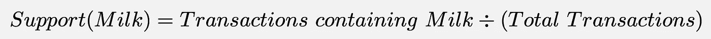

牛奶的普及(图片由作者提供)

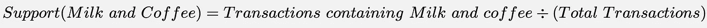

牛奶和咖啡的流行(图片由作者提供)

使用支持度，我们可以构建频繁项集，即频繁出现在一起的项集，但它不能告诉我们关联规则(如果 Y，则 Z)

**2。置信度:**该度量用于找出项目集之间的关系，并指示关系的置信度。比如从支撑上我们知道牛奶和咖啡经常一起购买，但是店家到底应该用牛奶促销咖啡还是咖啡促销牛奶。这就是信心的来源。

用数学术语来说:

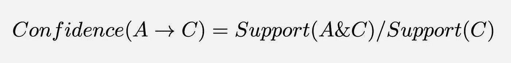

范围:[0，1](图片由作者提供)

这里我们在计算如果 A 那么 c 的置信度。

我们将左边(A)的项称为 ***先行项*** ，右边(C)的项称为 ***后行项*** 。

这个简单的公式表明在一个交易中看到一个结果的概率，假设它也包含一个前提。

**Lift:** 它衡量 A 和 C 一起出现的频率比我们随机预期的多多少。因此，提升值检查这种关系是否优于随机关系。

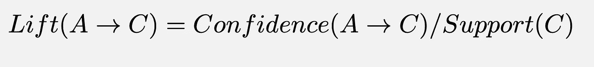

范围:[0，∞](图片由作者提供)

解释


他们之间没有这种关联。(图片由作者提供)


它们之间存在正相关关系。(图片由作者提供)


两者呈负相关。产品 A 和 C 不太可能一起购买。(图片由作者提供)

**杠杆:**这个指标类似于提升，但更容易解释。确定好规则的阈值是 0。如果你检查这里的公式，我们可以看到这个公式把 A 和 C 同时出现的概率和 A 和 C 是独立的概率之间的差异。

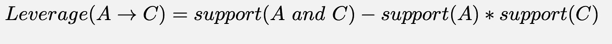

杠杆的数学公式 **(** 图片由作者提供)

这些概念对执行市场篮子分析很重要，但还有更多像信念和张度量这样的概念。张是一个重要的度量，它告诉我们关于项目的分离和关联。它介于-1(完全分离)和 1(完全结合)之间。我们不会详细讨论所有这些。

## **Apriori 算法概述**

现在我们知道了所有的概念，你可能会想我们如何计算成千上万个项目的关联规则。例如，如果你有 10000 个物品，所有可能的组合是 2 ⁰⁰⁰⁰ > 10⁸(宇宙中的原子数量)。鉴于机器的生产能力，这是不可能计算的。这就是 Apriori 算法的用武之地。

Apriori 算法通过检查最小支持度来减少规则的数量。例如，如果项目 A 不常见(使用最小支持阈值)，则忽略所有项目 A 组合。因此，这种算法将节省时间和精力。

## 实施:

零售数据集:[https://www.kaggle.com/heeraldedhia/groceries-dataset](https://www.kaggle.com/heeraldedhia/groceries-dataset)

我们将使用 mlxtend 库来实现购物篮分析。

**导入数据**

```
import pandas as pd
df = pd.read_csv("Groceries_dataset.csv",error_bad_lines=False)
df.head()
```

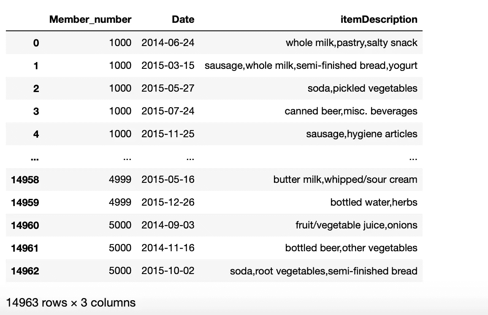

零售交易(图片由作者提供)

我们可以在这里看到，数据包含零售交易。

**探索性数据分析**

*   **绘制绝对频率**

```
import matplotlib.pyplot as plt
%matplotlib inlineplt.figure(figsize=(25,10))
grouped = df[['itemDescription']].groupby('itemDescription').size()
grouped.sort_values(ascending=False).plot(kind='bar')
```

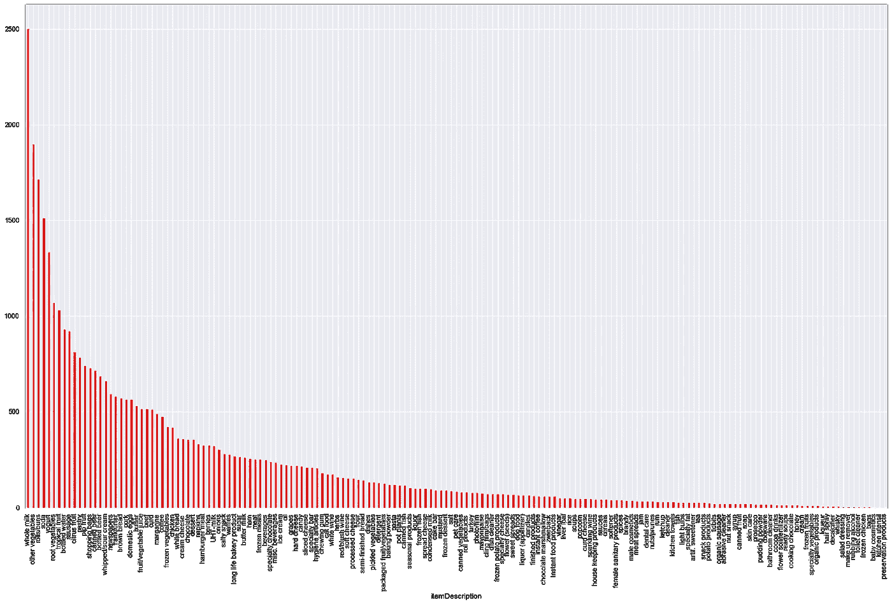

绝对频率(图片作者提供)

正如我们在这里看到的，全脂牛奶是商店里最受欢迎的商品，而加工产品是最不受欢迎的商品。同样，我们可以使用简单的 EDA 找出最喜欢和最不喜欢的。

*   **绘图相对频率**

```
rel_freq=df['itemDescription'].value_counts() / len(df)
rel_freq.sort_values(ascending=False).plot(kind='bar',color='red')
```

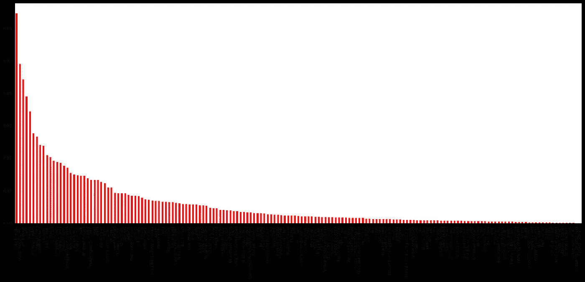

相对频率(图片由作者提供)

*   **树形图和词云**

Treemap 在分层结构图中可视化大量数据，其中矩形的大小从最大到最小组织。

```
import squarify
plt.figure(figsize = (100, 70))
squarify.plot(sizes = df.itemDescription.value_counts().values, alpha = 0.7,
              label = df.itemDescription.unique(), text_kwargs={'fontsize':50})
plt.title('Item Description', fontsize = 20)
plt.axis('off')
plt.show()
```

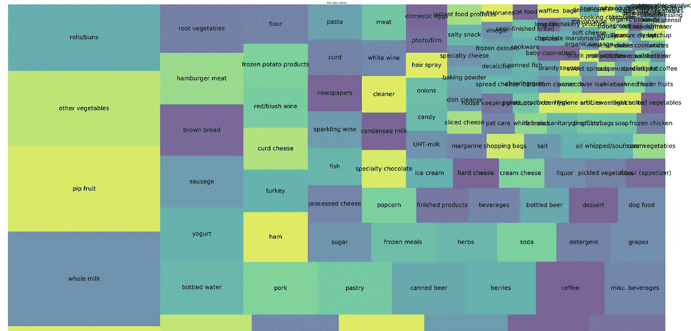

树形图(图片由作者提供)

这看起来真的很有趣，我们可以看到像全脂牛奶，水果，其他蔬菜，面包卷/小圆面包比其他产品更重要。

```
from wordcloud import WordCloud
plt.subplots(figsize=(100,70))
wordcloud = WordCloud(background_color = 'white',
                     width=500,
                     height=300).generate(','.join(df['itemDescription']))plt.imshow(wordcloud)
plt.axis('off')
```

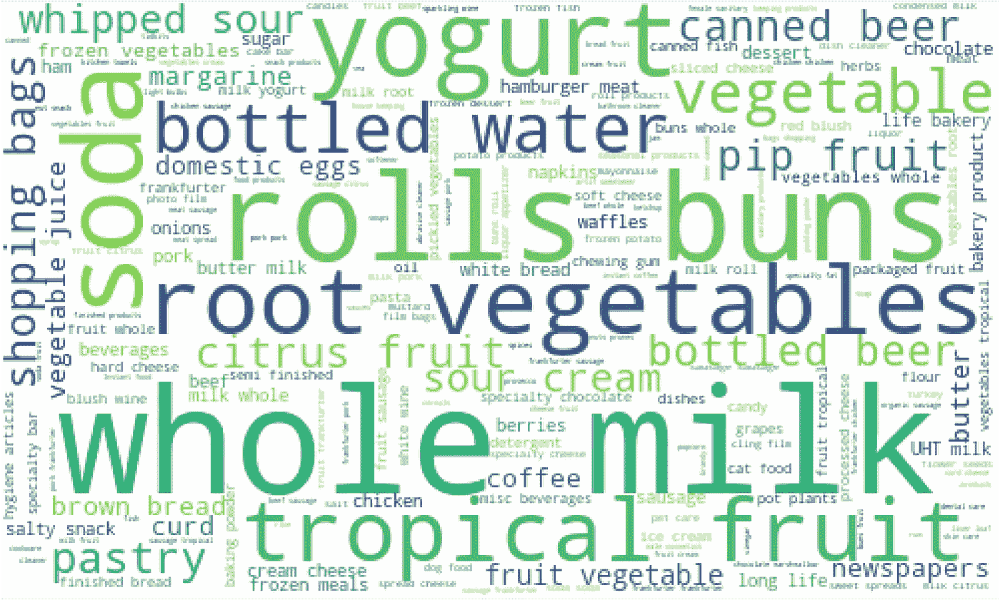

词云(图片由作者提供)

*   **每月交易量**

```
df['Date']=df['Date'].astype('datetime64[ns]')df["Year_Months"]=pd.to_datetime(df['Date'].dt.year.astype('str')+"-"+df['Date'].dt.month.astype('str')).dt.to_period('M')df[["Year_Months"]].groupby("Year_Months").size().plot(kind='bar',color='green')
```

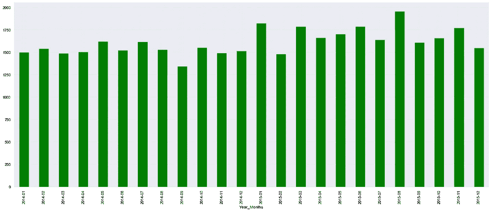

每月交易量(图片由作者提供)

最高的交易数量发生在 2015 年 1 月和 8 月。我们也可以进一步探索。

您还可以对该数据集进行不同的分析，包括畅销商品、每个会员的商品数量分布，从而得出一个概念。我会把这个留给你。

**购物篮分析的数据准备**

*   **同一顾客在同一天一起购买的商品分组**

```
df_dataprep_st1=df.groupby(['Member_number','Date'])['itemDescription'].apply(','.join).reset_index()
```

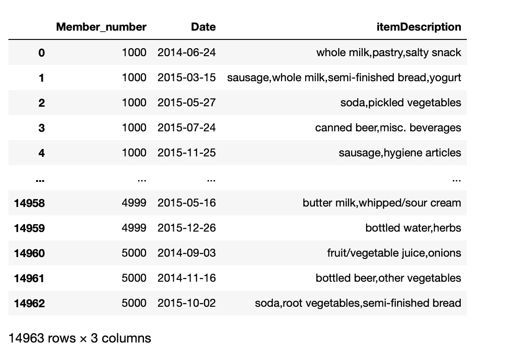

组(图片由作者提供)

现在我们可以看到，在同一天，我们有一个相同客户的商品列表。

*   **将项目集转换为 2D 数组(需要作为预处理算法的输入)**

```
itemsets=df_dataprep_st1[['itemDescription']].values
itemsets=[(''.join(i).split(",")) for i in itemsets]
```

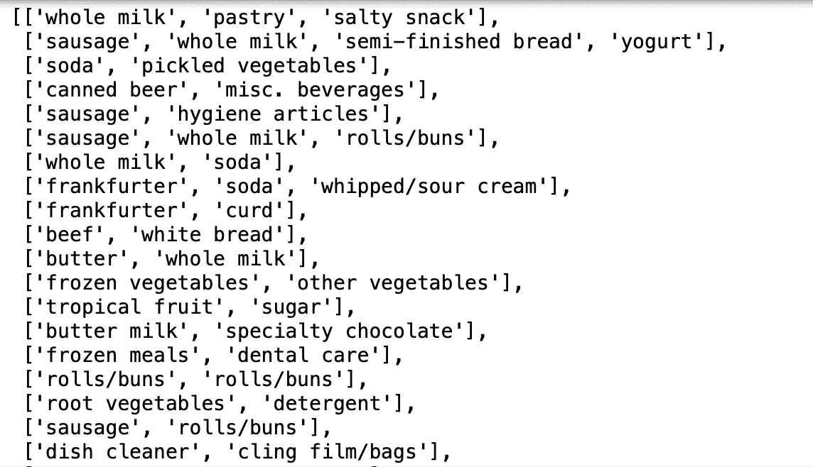

(图片由作者提供)

**3。使用 Mlxtend 事务编码器**转换为单热码

Mlxtend 期望将单热数据作为输入，因此我们需要将数据转换为单热数据格式。

```
from mlxtend.preprocessing import TransactionEncoderte = TransactionEncoder()
te_ary = te.fit(itemsets).transform(itemsets)
df_onehot = pd.DataFrame(te_ary, columns=te.columns_)
```

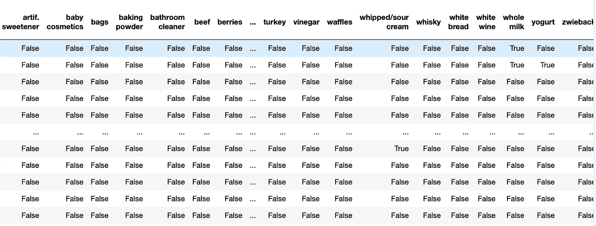

一热数据(图片由作者提供)

**挖掘频繁项集和关联规则**

让我们首先分析不同的支持度和信任度。

```
supportLevels =[0.01,0.009,0.007,0.005,0.003,0.001]
confidenceLevels=[1,0.9,0.8,0.7,0.6,0.5, 0.4, 0.3, 0.2, 0.1,0.05,0.03,0.01,0.001]dict_lengths={}
for min_support in supportLevels:
    frequent_itemsets = apriori(df_onehot, min_support=min_support, use_colnames=True)
    #length_frequent_itemsets.append(len(frequent_itemsets))
    #print(min_support)
    conf_len_rules=[]
    for min_confidence in confidenceLevels:
        rules = association_rules(frequent_itemsets, metric = "confidence",min_threshold = min_confidence)
        print(min_confidence,len(rules))
        conf_len_rules.append( (min_confidence, len(rules)) )
    #print(conf_len_rules)
    plt.plot([i[0] for i in conf_len_rules],[i[1] for i in conf_len_rules],label="Support"+str(min_support))
    plt.legend(loc="upper right")
```

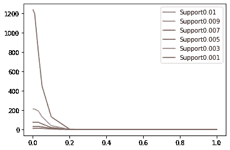

(图片由作者提供)

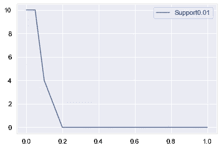

1%的支持率(图片由作者提供)

1%的支持度:我们只能找到少数几个可信度低的规则。我们不能真正选择这个支持值。

同样，对于你在图上看到的较低的支撑，我们有许多规则要分析。

**频繁项目集**

```
frequent_itemsets = apriori(df_onehot, min_support=0.001, use_colnames=True)
frequent_itemsets['length'] = frequent_itemsets['itemsets'].apply(lambda x: len(x))
```

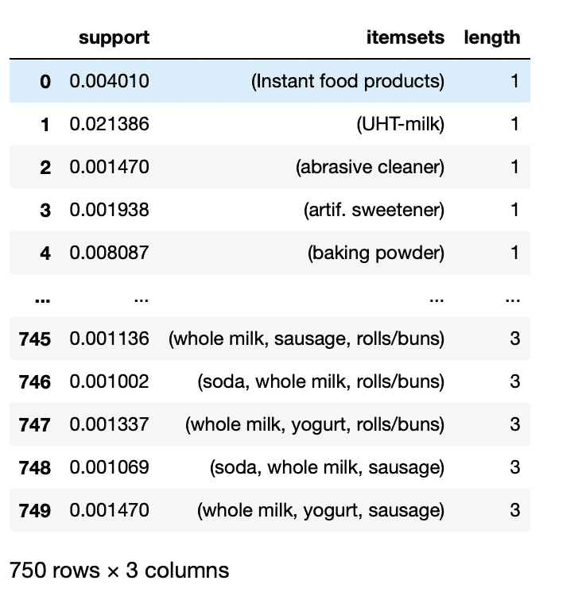

频繁项目集(作者图片)

我们现在有 750 个使用最小支持度 0.001 的频繁项集。这样，我们使用 mlxtend 库来应用 Apriori 算法。

**关联规则**

```
rules = association_rules(frequent_itemsets, metric="confidence", min_threshold=0.02)
```

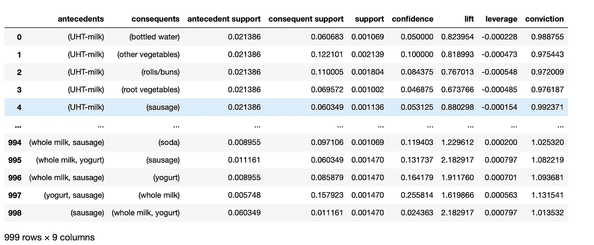

关联规则(图片由作者提供)

我们应用 0.02 的置信度阈值从我们的频繁集得到 999 条规则。现在，您可以看到我们讨论过的所有指标和规则。

**进一步过滤**

```
rules=rules[rules['lift']>1].reset_index(drop=True)
```

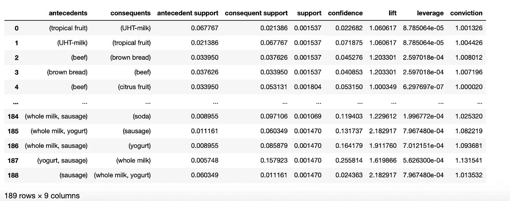

进一步过滤(图片由作者提供)

现在我们只剩下 189 条规则供进一步分析。

我们还可以找出最相关的规则，即如果{香肠}那么{全脂牛奶，酸奶}。让我们使用热图可视化来检查并验证我们的结果。

**岗位分析**

*   **热图**

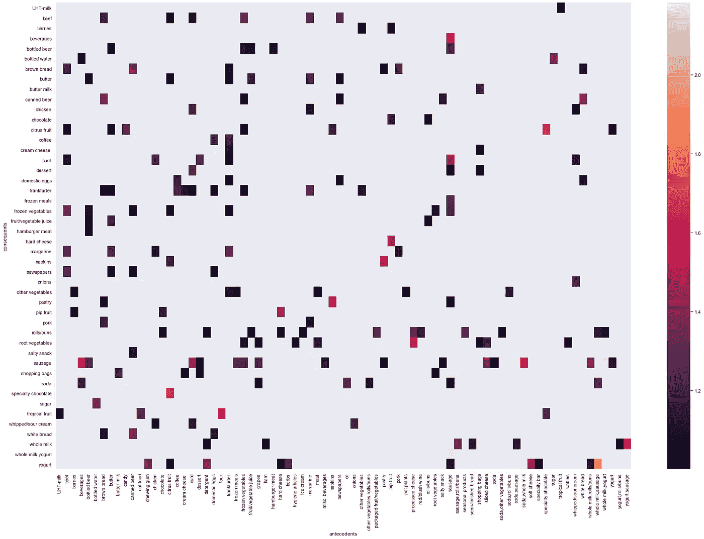

分析后热图(图片由作者提供)

正如你在这里看到的，不同规则的相互关系。从这个探索性的分析中，我们很容易发现，如果{香肠}那么{全脂牛奶，酸奶}是一个很好的开始规则。也请找到其他这样的规则作为练习。

*   **信心/支持散点图**

```
rules = association_rules(frequent_itemsets, metric = "confidence",min_threshold = 0.0)
sns.set(rc={'figure.figsize':(10,10)})
sns.scatterplot(x = "support", y = "confidence", 
                size = "lift", data = rules)
plt.show()
```


信心/支持散点图(图片由作者提供)

研究表明，最优规则位于支持度/置信度边界上。如果你看这个图，你会注意到升力在支持/信心边界总是很高。

## 结论

在本文中，我们讨论了市场篮子分析的重要性，因为市场规模巨大。我们讨论了用于识别项目集之间关系的重要度量，如支持度、置信度、提升度和杠杆。然后我们继续到实现部分，看看实现这一切有多容易。

## 参考

[1][http://www . laccei . org/laccei 2016-San Jose/referendedpapers/RP 307 . pdf](http://www.laccei.org/LACCEI2016-SanJose/RefereedPapers/RP307.pdf)

[2][http://rasbt . github . io/mlx tend/user _ guide/frequency _ patterns/association _ rules/](http://rasbt.github.io/mlxtend/user_guide/frequent_patterns/association_rules/)

[3][https://github . com/data camp/Market-Basket-Analysis-in-python-live-training](https://github.com/datacamp/Market-Basket-Analysis-in-python-live-training)

[4][http://rasbt . github . io/mlx tend/user _ guide/frequency _ patterns/apriori/](http://rasbt.github.io/mlxtend/user_guide/frequent_patterns/apriori/)

[5][https://www . ka ggle . com/hero zerp/viz-rule-mining-for-杂货-数据集](https://www.kaggle.com/cemhansenol98/python-apriori-rare-visualization)

[6][https://select-statistics . co . uk/blog/market-basket-analysis-understanding-customer-behavior/](https://select-statistics.co.uk/blog/market-basket-analysis-understanding-customer-behaviour/)