# 使用机器学习的营销分析见解

> 原文：<https://pub.towardsai.net/marketing-analytics-insights-using-machine-learning-338bb94acc14?source=collection_archive---------0----------------------->


来源:由原始照片衍生而来，照片由[萨姆·穆卡达姆](https://unsplash.com/@itssammoqadam)在 [Unsplash](https://unsplash.com/photos/KJ241ZAOYwU) 上拍摄

## [数据科学](https://towardsai.net/p/category/data-science)、[编辑](https://towardsai.net/p/category/editorial)、[编程](https://towardsai.net/p/category/programming)

## 使用数据科学通过客户细分和机器学习技术深入营销分析

**作者:** [萨妮娅·帕维兹](https://www.linkedin.com/in/saniya-parveez-b41279157/)，[罗伯特·伊里翁多](https://mktg.best/vguzs)

[](https://members.towardsai.net/) [## 加入我们吧↓ |面向人工智能成员|数据驱动的社区

### 加入人工智能，成为会员，你将不仅支持人工智能，但你将有机会…

members.towardsai.net](https://members.towardsai.net/) 

M 任何行业领先的公司都已经在使用数据科学来制定更好的决策并改进他们的营销分析。随着行业数据的扩展、资源可用性的提高、存储和处理成本的降低，组织现在可以借助多种数据科学技术来处理大量频繁的粒度数据，并获得创建复合模型、做出关键决策以及获得比以往任何时候都更准确的基本消费者洞察力所需的杠杆作用。

对于许多公司来说，在营销分析中使用数据科学原理是一种确定、经济高效、实用的方法，可以观察客户的行为、旅程，并有助于在决策过程中获得更加定制化的体验。

在本文中，我们将使用机器学习来细分客户数据，特别是数据聚类、PCA 和大规模分析的数据标准化，以利用真实数据深入了解特定的营销见解。

# 客户数据的分段

客户数据的细分是根据人口统计或行为数据将**目标客户**划分为不同群体的过程，以便营销计划可以更精确地针对每个群体进行定制。这也是正确指定营销资源的一个重要部分，因为通过锁定特定的客户群，我们的营销工作可以获得更高的投资回报(ROI)。

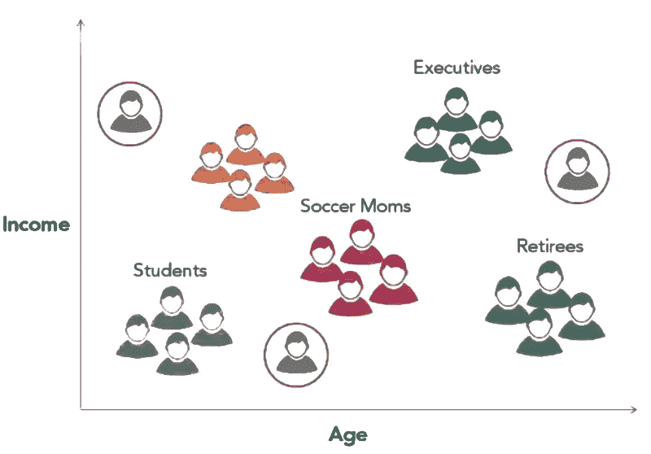

图 1:客户细分的例子。

## 客户细分—数据聚类(无监督学习)

无监督学习是一种用于执行客户数据分割的现代方法。它非常适合客户数据细分，因为它收集了彼此最有可能的数据点，并精确地将它们组合在一起。

**聚类**是一种无监督的机器学习技术，它从外部观察数据中的组或簇，提前知道它们非常有用，以下是它的一些优势:

*   它可以获得数据分析师无法预见或不熟悉的客户群。
*   它是有弹性的，可以应用于广泛的数据。
*   它减少了对客户人口统计和行为之间联系的广泛专业知识的需求。
*   这也促使我们采取行动。它可以扩展到巨大的数据集。

以下是集群的一些局限性:

*   创造的客户积累可能不容易解释。
*   如果数据不是基于消费者交付的(例如，购买的产品或服务)，那么如何使用观察到的数据聚类可能并不明显。

## 客户数据中的联系

当使用聚类进行客户细分时，确定相似性或非常注重确定哪类客户是相似的是至关重要的。

例如

如果公司想设计销售服装的营销策略，根据顾客倾向于购买的面包质量来细分顾客数据可能没有意义。

**客户行为**，比如他们过去对营销策略的反应，通常是最关键的数据。

## 标准化客户数据

当根据连续变量确定客户时，需要重新调整这些参数，以使数据处于相似的范围内。

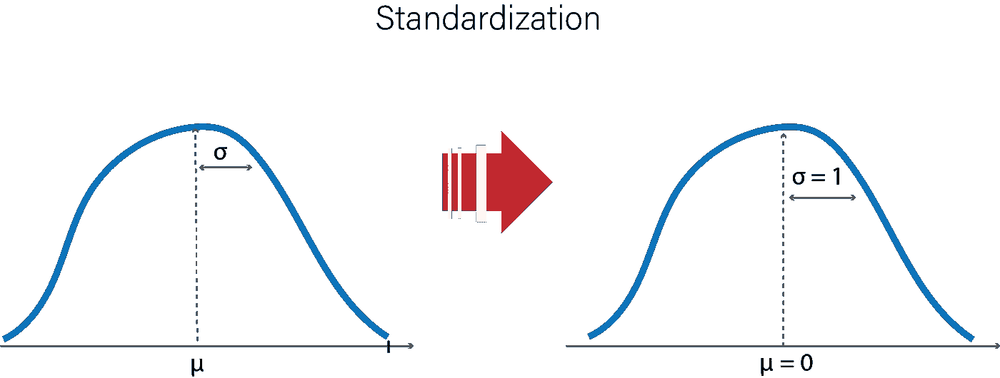

图 2:数据标准化

例如:

拿年龄和工资来说。这些加权在非常不同的计算上。一个人的工资可以是 9 万美元，年龄可以是 40 岁。因此，我们的方法需要精确了解**这些变量**中的一个变量的变化有多显著，以及在**客户关系**方面其他变量的变化。为每个变量手动制作这些类型的演示文稿可能会很有挑战性。因此，需要数据标准化来在标准范围内协调它们。

使用 **Z-score** 是通过以下步骤标准化聚类参数的一种方式:

*   减少每个数据点的数据平均值。
*   减少每个数据点的数据平均值。

标准差是对我们的分数的计算。下面显示的公式用于计算数据点的标准化值:


图 3:标准化方程。

在哪里，

zi =第 I 个标准化值

x =所有值

mean(x) =所有 x 值的平均值

STD(x)= x 值的标准偏差

## 客户年龄和收入数据标准化示例

以下 Python 代码将对客户的年龄和收入数据进行标准化。

导入所有必需的包。

```
import numpy as npimport pandas as pd
```

生成随机的客户收入和年龄数据。

```
np.random.seed(100)df = pd.DataFrame()df['salary'] = np.random.normal(80000, scale=10000, size=100)df['age'] = np.random.normal(50, scale=10, size=100)df = df.astype(int)df.head()
```

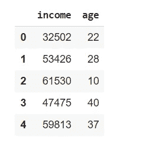

图 4:客户收入和年龄数据。

使用 std 函数同时计算两列的标准偏差。

```
df.std()
```


图 5:标准偏差。

计算两列的平均值。

```
df.mean()
```

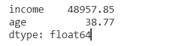

图 6:年龄和收入的平均值。

使用标准偏差和平均值标准化变量。

```
df['z_salary'] = (df['salary'] -df['salary'].mean())/df['salary'].std()df['z_age'] = (df['age'] - df['age'].mean())/df['age'].std()df.head()
```

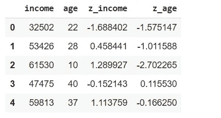

图 7:标准化变量。

检查标准化。

```
df.std()
```

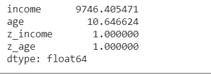

图 8:年龄和收入的标准化。

一旦数据标准化，就需要计算客户之间的相似度。这主要是通过测量特征空间中客户之间的距离来实现的。在二维散点图中，两个客户之间的**欧几里德距离**就是他们点之间的距离。

## 计算客户数据点之间的距离

让我们来计算三个客户之间的距离。

导入所有必需的包。

```
import math
```

创建年龄和收入数据。

```
ages = [50, 40, 30]salary = [50000, 60000, 40000]
```

计算第一个和第二个客户之间的距离/

```
math.sqrt((ages[0] - ages[1])**2 + (salary[0] - salary[1])**2)
```

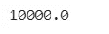

图 9:第一个和第二个客户之间的距离。

计算第一个和第三个客户之间的距离。

```
math.sqrt((ages[0] - ages[2])**2 + (salary[0] - salary[2])**2)
```

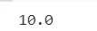

图 10:第一个和第三个客户之间的距离。

这里，第一和第三客户与第一和第二客户之间的距离在输出中是不同的。

使用平均值和标准差标准化年龄和工资。

```
z_ages = [(age - 40)/10 for age in ages]z_incomes = [(salary - 50000)/10000 for salary in salaries]
```

再次，计算第一个和第二个客户的标准化分数之间的距离。

```
math.sqrt((z_ages[0] - z_ages[1])**2 + (z_salaries[0] - z_salaries[1])**2)
```

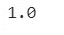

图 11:标准化后第一个和第二个客户之间的距离。

计算第一个和第三个客户的标准化分数之间的距离。

```
math.sqrt((z_ages[0] - z_ages[2])**2 + (z_salaries[0] - z_salaries[2])**2)
```


图 12:第一个和第三个客户之间的距离。

这里，标准化之后，第一和第二客户之间的距离以及第一和第三客户之间的距离是相同的。

# k 均值聚类

K-means 聚类是一种流行的无监督学习方法，有着广泛的应用。它非常简单，因为它可以扩展到大量的数据集，并且在现实世界中工作得非常好。

K-means 聚类是一种算法，它试图找到将数据点分组到 *k* 个独立组的最佳方式，其中 *k* 是算法的一个参数。然后，该算法反复工作，试图找到最佳分组。

执行该算法需要以下步骤:

*   该算法从随机选取空间中的 k 个点作为聚类的质心开始。然后，将每个数据点分配给离它最近的质心。
*   质心被刷新为指定给它们的所有数据点的平均值。然后，数据点被重新分配到离它们最近的质心。

重复第二步，直到质心更新后没有数据点改变它们被分配的质心。

## 示例:客户工资和年龄数据的 K 均值聚类

对客户工资和年龄数据执行 K 均值聚类。

导入所有必需的库。

```
import pandas as pdimport matplotlib.pyplot as pltfrom sklearn import cluster%matplotlib inline
```

导入客户的 CSV 数据。

```
df = pd.read_csv('/content/customer.csv')
df.head()
```

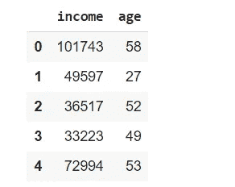

图 13:客户的数据。

为薪金和年龄值创建标准化值列，并将它们存储在 z_salary 和 z_age 变量中。

```
df['z_salary'] = (df['salary'] - df['salary'].mean())/df['salary'].std()df['z_age'] = (df['age'] - df['age'].mean())/df['age'].std()
```

绘制客户数据。

```
plt.scatter(df['salary'], df['age'])plt.xlabel('Salary')plt.ylabel('Age')plt.show()
```

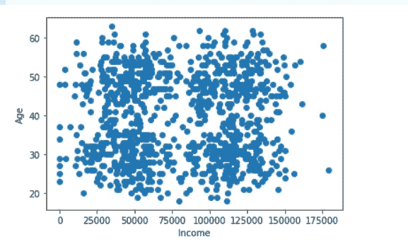

图 14:绘制客户数据。

用四个聚类执行 k-means 聚类。

```
model = cluster.KMeans(n_clusters=4, random_state=10)model.fit(df[['z_salary','z_age']])
```

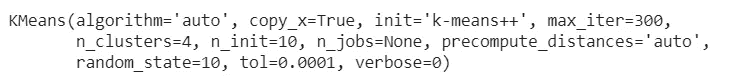

图 15: K 均值聚类。

创建一个名为 cluster 的列，其中包含每个数据点所属的分类的标签。

```
df['cluster'] = model.labels_df.head()
```

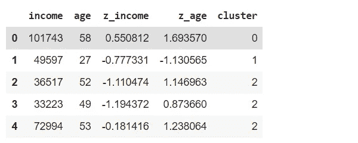

图 16:聚类后的客户数据。

绘制数据。

```
colors = ['r', 'b', 'k', 'g']markers = ['^', 'o', 'd', 's']for c in df['cluster'].unique():d = df[df['cluster'] == c]plt.scatter(d['salary'], d['age'], marker=markers[c], color=colors[c])plt.xlabel('Salary')plt.ylabel('Age')plt.show()
```

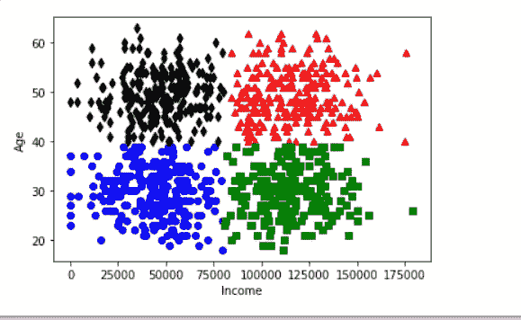

图 17:客户数据的 K 均值聚类。

在这种情况下，数据图用颜色/形状指示每个数据点被分配到哪个聚类。

# 高维数据和降维

拥有比二维更重要的数据是很常见的。如果我们了解这些客户对促销的反应，他们购买了多少产品，或者有多少人住在他们的家里，这将有更多的维度。

当数据具有额外的维度时，可视化该数据变得更加困难。因此，降维就成了问题。**降维**的目的是将多维数据降维，通常降维为二维，以达到可视化的目的，同时保持点之间的距离。

主成分分析(PCA)用于执行维数减少。PCA 是一种转换数据的方法。它采用原始维度，并创建新维度来捕获数据中的最大差异。

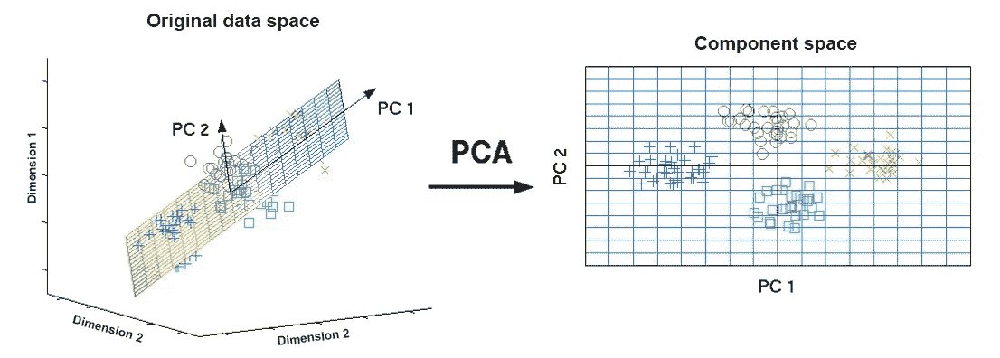

图 18: PCA 功能。

## 示例:使用 PCA 对高维数据进行降维

导入所有必需的包。

```
import pandas as pdfrom sklearn import clusterfrom sklearn import decompositionimport matplotlib.pyplot as plt%matplotlib inline
```

导入客户的 CSV 数据。

```
df = pd.read_csv('/content/pca_data.csv')df.head()
```

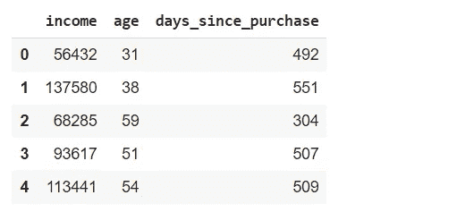

图 19:客户数据。

将三列标准化，并将标准化列的名称保存在列表中

```
cols = df.columnszcols = []for col in cols:
  df['z_' + col] = (df[col] - df[col].mean())/df[col].std()
  zcols.append('z_' + col)df.head()
```

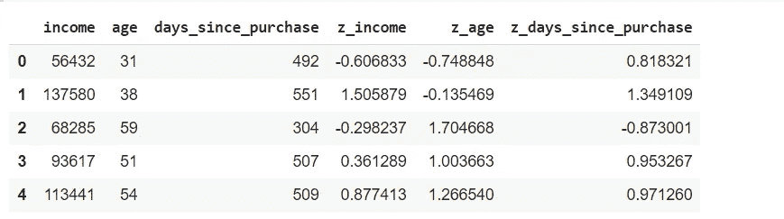

图 20:标准化数据。

对标准化分数执行 k 均值聚类。

```
model = cluster.KMeans(n_clusters=4, random_state=10)df['cluster'] = model.fit_predict(df[zcols])
```

对数据执行 PCA。

```
pca = decomposition.PCA(n_components=2)df['pc1'], df['pc2'] = zip(*pca.fit_transform(df[zcols]))
```

在降维空间中绘制聚类图。

```
colors = ['r', 'b', 'k', 'g']markers = ['^', 'o', 'd', 's']for c in df['cluster'].unique():
  d = df[df['cluster'] == c]plt.scatter(d['pc1'], d['pc2'], marker=markers[c],    color=colors[c])plt.show()
```

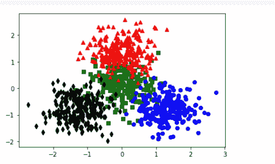

图 21:主成分分析图。

如图 21 所示，这里的 x 和 y 轴是主要成分，不容易解释。然而，通过可视化聚类，我们可以根据它们重叠的程度来了解聚类的好坏。

# 最后的想法

无监督机器学习是执行**客户细分**的优秀现代技术。在本文中，我们使用了 K-means 聚类，这是一种普遍使用的快速且易于扩展的聚类算法。此外，数据处理的调查也是任何数据科学方法论的重要组成部分。

呈现高级分析和创建可视化以使处理过程易于理解是理解客户数据的一种极好的技术。Matplotlib 和 seaborn 库是一个优秀的库，可以创建足够的可视化。当我们开发分析管道时，第一步是建立数据模型。

数据模型是对我们将要处理的数据源、它们与其他数据源的关联、特定数据源的数据将进入管道的确切位置以及格式(例如，Excel 文件、数据库、来自互联网数据源的 JSON 或 REST API)的总结。随着时间的推移，随着数据源和方法的改变，管道的数据模型逐渐出现。

传统上，营销数据包括所有三种类型的数据。最初，大多数数据点从不同的(主要是手动的)数据源开始，因此一个对象的值可能有不同的长度。由于字段名不同，一个字段的值与其他字段的值并不相等，而且一些从确切来源接收数据的行也可能忽略了一些字段的值。

然而，**结构化和半结构化数据**如今可以迅速获得，这主要归功于经常用于实现数字财产分析的技术。这种数据有两种格式——结构化和非结构化。非结构化数据是流行的，不受模式限制。数据处理和争论是数据科学管道的起点和非常有价值的部分。如果数据工程师或数据科学家通过数据清理和数据预处理来准备数据，以获得一些关于数据的领域知识，这通常是必不可少的。

数据处理也需要创新的解决方案和技术。如果数据工程师确定与项目相关的数据排列正确，那么就将它与其他数据源结合起来。此外，去掉重复的和不需要的列，最后，分配缺失的数据。执行完这些步骤后，项目数据就可以随时用于分析和建模，并且可以不可避免地放入数据科学管道中。

**免责声明:**本文所表达的观点仅代表作者个人观点，不代表与作者有直接或间接联系的任何公司的观点。这项工作并不打算成为最终产品，而是当前思想的反映，同时也是讨论和改进的催化剂。

**除非另有说明，所有图片均来自作者。**

[](https://ws.towardsai.net/shop) [## 走向人工智能

### 发布最好的技术、科学和工程|社论→https://towardsai.net/p/editorial |订阅→…

ws.towardsai.net](https://ws.towardsai.net/shop) [](https://members.towardsai.net/) [## 加入我们吧↓ |面向人工智能成员|数据驱动的社区

### 加入人工智能，成为会员，你将不仅支持人工智能，但你将有机会…

members.towardsai.net](https://members.towardsai.net/) [](https://sponsors.towardsai.net/) [## 赞助商|了解如何成为面向人工智能的赞助商

### 无论你是想以一种吸引读者的方式突出你的产品，吸引高度相关的小众受众，还是…

sponsors.towardsai.net](https://sponsors.towardsai.net/) 

## 进一步阅读

[](/descriptive-statistics-21fc0196c1df) [## 描述统计学

### 这篇文章提供了我们的书的一个样本:“使用 Python 进行数据驱动决策的描述性统计”

pub.towardsai.net](/descriptive-statistics-21fc0196c1df) [](https://news.mktg.best/natural-language-in-search-engine-optimization-seo-how-what-when-and-why-b390364b5d3d) [## 搜索引擎优化(SEO)中的自然语言——如何、做什么、何时以及为什么

新闻网](https://news.mktg.best/natural-language-in-search-engine-optimization-seo-how-what-when-and-why-b390364b5d3d) [](/machine-learning-algorithms-for-beginners-with-python-code-examples-ml-19c6afd60daa) [## 面向初学者的机器学习算法，带 Python 代码示例

### 用 Python 编写代码示例的初学者最佳机器学习算法。使用 Google 启动编码示例…

pub.towardsai.net](/machine-learning-algorithms-for-beginners-with-python-code-examples-ml-19c6afd60daa)