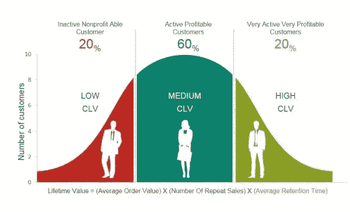
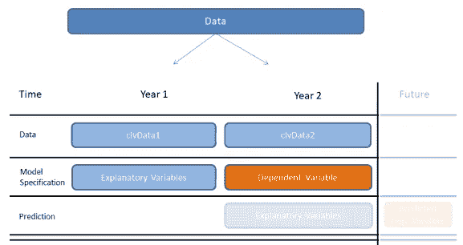
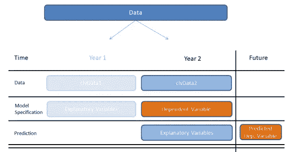
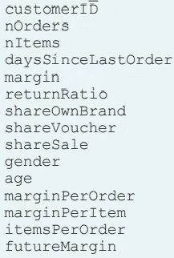
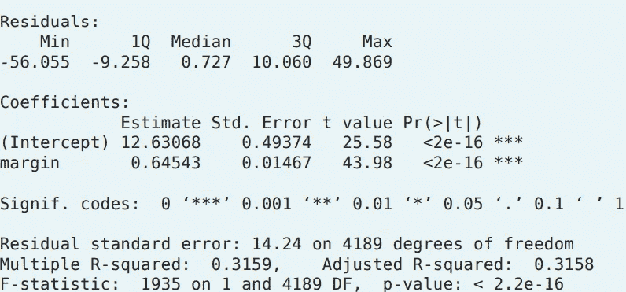
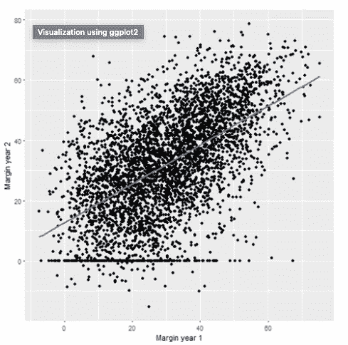

# 营销分析(第一部分)

> 原文：<https://pub.towardsai.net/marketing-analytics-part-1-3cf5891b8dbd?source=collection_archive---------1----------------------->

## 简单线性回归

## 客户终身价值(CLV)

在市场营销中，**客户终身价值** ( **CLV** 或通常的 CLTV)、**客户终身价值** (LCV)或终身价值**价值** (LTV)是对与**客户的整个未来关系所产生的净利润的预测。** [维基百科](https://en.wikipedia.org/wiki/Customer_lifetime_value)



礼貌:Slidegeek.com

为什么我们需要了解 CLV？

*   CLV 描述了公司通过与客户的关系积累的 ***【预计未来净利润】*** 。
*   帮助识别潜在的有前途的客户，他们将产生更高的净利润
*   根据未来利润，帮助锁定客户或确定客户优先级

净利润，也称为利润率，是利息的衡量标准。为此，我们必须找到影响利润幅度的驱动因素。

这有一个棘手的方面。我们必须利用当时仅有的数据来预测未来的利润。因此，我们需要一个使用当前信息来预测未来利润的模型。

## 两步程序。

我们必须采用两步程序。我们必须从`Year 1`中提取解释变量，并用它们来预测`Year 2.`的因变量，我们称之为模型规范。



指定模型后，我们将从`Year 2`获取解释变量，并对`Year 3`的未来利润进行预测



## 典型的 CLV 数据集



数据集标题

## 寻找关系

首先，我们应该找到`Year 1` 变量和预测`futureMargin`变量之间的关系。

我们可以从`stats`包中的`cor()`函数中找到相关性，并使用`corrplot`包中的`corrplot()`函数创建一个相关性图来可视化这种关系

```
library(corrplot)

clv_data1 %>% 
        select(nOrders, nItems, ... margin, futureMargin) %>%
        cor() %>%
        corrplot()
```


相关图

请注意，蓝色标出的是:

*   订单数量`nOrders`、
*   物品的数量`nItems`
*   未来保证金`futureMargin`

我们发现当前年份`margin`和`futureMargin`之间存在某种程度上更强的正相关性。

`daySinceLastOrder`和`returnRatio`与`futureMargin`呈中度负相关，用橙色标出。

# 简单线性回归

既然我们已经检查了各种变量的相关性，我们将借助`Year 1.`中的利润来预测未来的利润

既然我们已经研究了各种变量的相关性，我们将借助`Year 1`边际来估算未来的边际。

*我们选择保证金是因为两个变量之间的相关性最高*。

> 当我们仅使用一个独立变量进行预测时，我们称该模型为简单线性回归。

> 事实上，完美线性相关的理想情况，即我们可以用给定的 X 值准确预测 Y，是非常不可能的。

大多数时候，数据点是分散的。我们通过拟合一条穿过散乱数据点的直线来确定 X 和 Y 之间关系的方向。

我们使用[最小二乘估计(LSE)](https://www.mathsisfun.com/data/least-squares-regression.html) 程序来帮助我们找到回归线并返回其系数。

预测值、线上的一个点和实际值、分散的数据点上的一个数据点之差，叫做*预测误差或*。**

**我们可以在`stats`包的`lm`函数中使用一个公式对象来指定线性回归的顺序。**

```
**slm <- lm(futureMargin ~ margin, data = clv_data1) 
summary(slm)**
```

**请注意，我们将使用 clv 数据来预测作为利润函数的未来利润。我们将模型存储为`slm`，然后使用 summary 函数来获得结果的概述。**

****

**查看利润率的系数估计值，其值大约为 0.65(大于“零”)，这意味着利润率越高，我们对未来利润率的预期就越高。**

**另外，看一下*倍数 R 平方，*值约为 0.32 意味着，中的利润率可以解释未来利润率中约 30%的变化`Year 1.`**

## **关系的可视化**

**下面的`ggplot`图让我们更好地了解了`year 1`余量和`year2`余量之间的关系**

```
**ggplot(clv_data1,aes(margin,futureMargin)) +
geom_point() +
geom_smooth(method=lm,se=FALSE) +
xlab("Marginyear1") +
ylab("Marginyear2")**
```

****

**第一年利润和第二年利润的散点图**

**如果要使用线性回归建模方法，我们需要做一些假设。**

# **假设(简单线性回归模型)**

*   **因变量和自变量之间的线性关系。**
*   **自变量不应包含任何测量误差(弱外生性)**
*   **残差应该是不相关的**
*   **残差应该在零附近随机变化，并且它们的期望值应该等于零**
*   **预测误差的方差应该是常数(同质方差)**
*   **在进行统计显著性检验时，我们必须假设误差是正态分布的**

# **未完待续…**

**让我们在下一篇文章中看看如何使用多元线性回归模型更好地预测未来的利润。**