# 时间序列的马尔可夫算法

> 原文：<https://pub.towardsai.net/markov-algorithm-for-time-series-2563cad7d54c?source=collection_archive---------1----------------------->

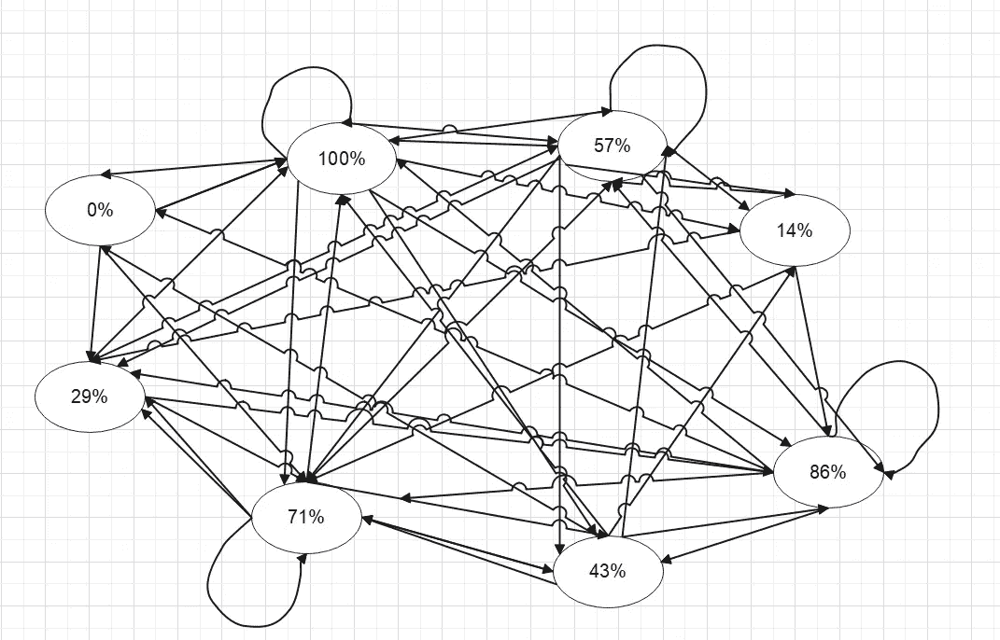

马尔可夫建模

## 目录

I .下载数据集

二。算法—从时间序列数据到离散马尔可夫建模

三。可视化误差指标

## I .下载数据集

我去了这里→[https://data.world/classyprince/arxivcombineddata](https://data.world/classyprince/arxivcombineddata)

下载了数据。该数据显示了 arXiv 每月的提交量和下载量。

在这个任务中，我将预测每月的提交。

## 二。算法——从时间序列数据到离散马尔可夫模型

为了将未离散化为某个有限数字(基本上未标准化可能是正确的说法)的数据转换为可用于状态转换建模的离散化数据集，我需要一个映射函数。

这里我将使用百分位数函数。Excel 有百分位函数。

我要做的是创建一个滚动的 8 天窗口，以获取 8 天窗口内当前值的百分比。

在这种情况下，我使用的是 excel。Excel 有百分位函数。从第 9 行开始，我可以输入以下公式:

```
=PERCENTRANK($C2:$C9,C9)
```

这个函数将给出最后 8 行的百分比。

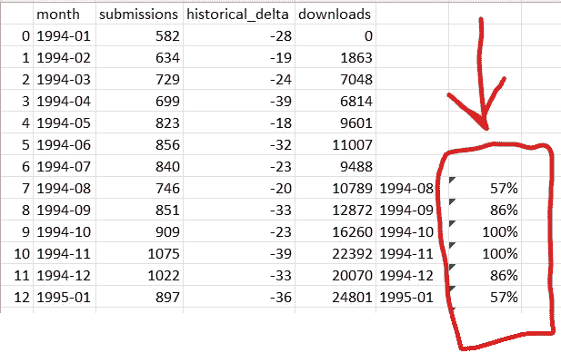

在本例中，我们看到 746 个提交位于 8 行的第 57 个百分点。我可以一直拖动这个公式，它将创建一个滚动窗口百分位，用于所有向前的数字。

现在是时候**创建一个训练数据集了。为此，我只取了前 100 行。**

现在我有了这个，然后我将百分位数列表提取到另一个表中的另一列。

我称之为“从”栏。然后，我将第 2 行的所有内容粘贴到相邻的列中，并将其命名为“to”列。

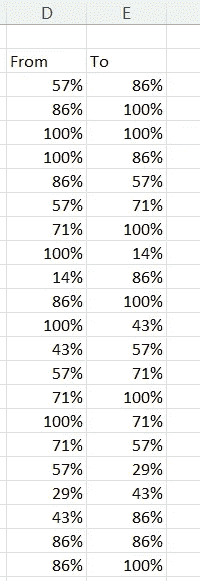

我现在有两列。第二列是第一列的下一个值。

现在我可以建立一个状态转换表。

首先，我可以获取上面的两个列表(to 和 from)，然后将这些列表复制到两个不同的列中(在本例中是 j 和 k)。接下来，我删除了两列中的重复项。**现在每一对“从”到“到”都是独一无二的。下面是这个样子的快照。我会在这张图之后解释列 1、列 2 和列 3。图中重要的一点是注意到这些对是唯一的，从而显示了到和从的唯一状态转换。**

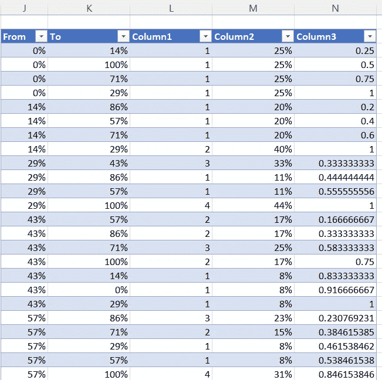

如果我们想形象化这一点，我们可以像这样建立一个状态转换图(数字没有显示)。每个箭头都指向一个目标状态，数字将被添加以表示移动到该目标状态的概率。


马尔可夫建模

现在，在第 1 列中，我统计了这些对在训练集中的出现次数。

excel 中的公式大概是这样的(D 列是 from 列(非唯一)，E 列是 to 列(非唯一))。

```
=COUNTIFS($D$3:$D$102,J3,$E$3:$E$102,K3)
```

请注意，countifs 使用了两个标准，from 和 to 列必须匹配才能算作一条记录。

> 每个递增计数意味着**在训练数据集中有一个发生转变的记录。**

现在，我想知道从那个状态转移的概率，这意味着**当时间序列的状态在我们的映射表中处于给定的百分位数时，概率上会发生什么。**

为了做到这一点，我不得不写出下面的公式，并把它拖下来。

```
=L3/SUMIF($J$3:$J$48,J3,$L$3:$L$48)
```

这个公式基本上是说:

> 把我上面计算的计数作为分子，现在用它除以**起始状态(from 状态)相同的计数之和。**

为了说明这一点，让我们看看“来自”州的第 29 个百分位数。第 29 百分位有四个“到”状态:43、86、57 和 100。

29 至 43 有 3 项记录，29 至 86 有 1 项记录，29 至 57 有 1 项记录，最后 29 至 100 有 4 项记录。3/9 是 33%。**因此，在训练数据集中，从 29%到 43%的转变发生了 33%的时间。**

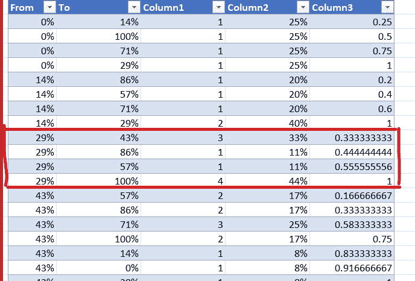

现在我有了一个状态转换表，我需要找到一些方法将它编程到我们的数据中来进行预测。

为了做到这一点，我将制作一个额外的专栏。上表中的第 3 列是加 1 的累积概率列。

> **增加各状态概率的原因是，我可以在我们的公式中创建概率桶，我们将在后面看到。**

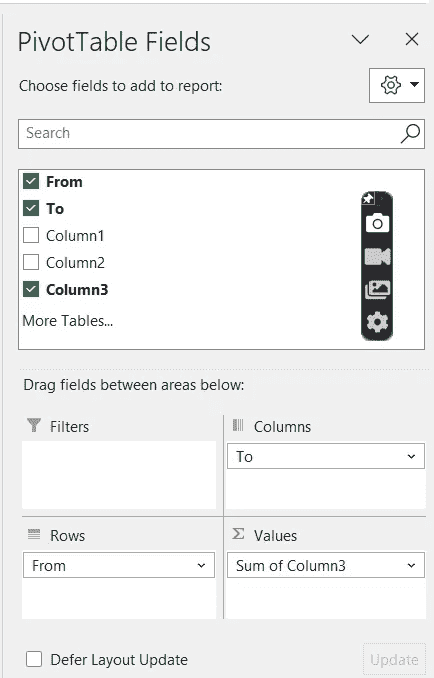

现在，让我们用一个数据透视表把它变成一个 from-to 矩阵。

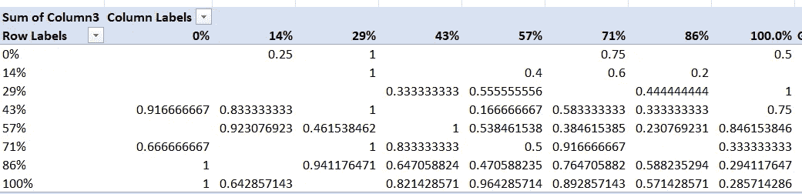

请注意，此表中的概率是累积的。

现在，我将前往我们的**训练数据集，编写我们的算法进行预测。**

首先，我将输出一个随机数来模拟概率事件。

excel 中的以下函数将输出一个介于 0 和 1 之间的连续数值。这反过来意味着，如果随机模拟进行了很多次，任何给定值和小于该值的数字都将以等于给定值%的概率出现。例如，如果输出的数字是. 20，这表示有 20%的时间，则该数字将小于或等于. 20。

```
=rand()
```

现在，为了让算法做出我们的预测:

```
=MIN(FILTER(FILTER(Sheet1!$Q$4:$X$11,Sheet1!$P$4:$P$11=arxiv_combined_submissions_and_!G109),FILTER(Sheet1!$Q$4:$X$11,Sheet1!$P$4:$P$11=arxiv_combined_submissions_and_!G109)>=H109))
```

让我从内向外分解一下。

首先，我们将此视为最深层的过滤器:

```
FILTER(Sheet1!$Q$4:$X$11,Sheet1!$P$4:$P$11=arxiv_combined_submissions_and_!G109)>=H109)
```

这里是 Sheet1！$Q$4:$X$11 表示下图中矩形内的值，这些值来自我们之前制作的矩阵。这是我们在这部分代码中过滤以获得输出的数据范围。

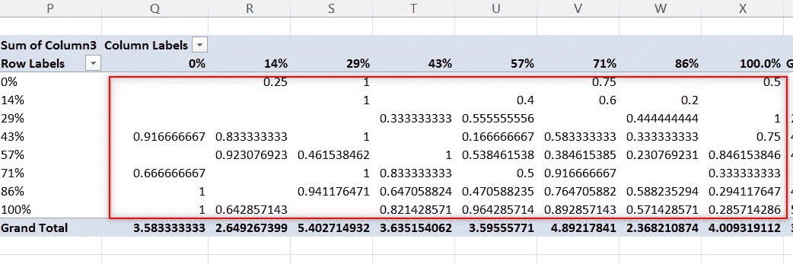

filter 参数的下一部分是 Sheet1！$ P $ 4:$ P $ 11 = arxiv _ combined _ submissions _ and _！G109)>=H109)

这是我们筛选矩阵中数据的标准。

这里，第一页！$P$4:$P$11 是我们的 pivot 的行标签。**行标签是我们的状态转换的“from”状态。**

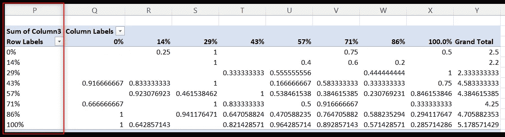

接下来，标准要求这些行标签必须等于数据的 G109。

Sheet1！$ P $ 4:$ P $ 11 = arxiv _ combined _ submissions _ and _！G109)

在前面的讨论中，我们输入了一个公式来获得滚动的 8 天百分比。这是我们的 G 柱。**概括一下，这个过滤函数到目前为止是说，在我们的数据中，有一个百分点，在数据透视表的“from”或行中查找该百分点，然后过滤掉整行。这是这个意思:**

```
FILTER(Sheet1!$Q$4:$X$11,Sheet1!$P$4:$P$11=arxiv_combined_submissions_and_!G109)
```

过滤器的这一部分将给出图中所示的行

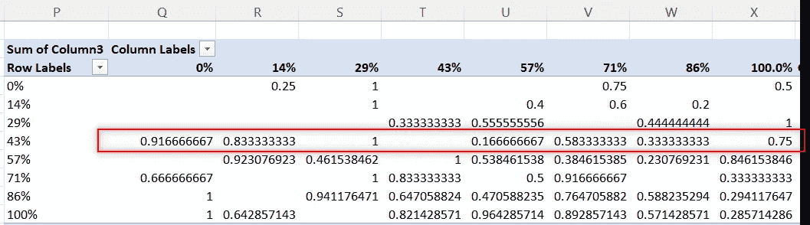

然而，我们现在必须限制数组中大于我们输出的随机数的部分。这个随机数在 H 列，所以我加了这个部分:

```
>=H109
```

这将给我数组中大于 rand()函数在该行中输出的部分。

现在，让我们继续离开我们的算法。

```
FILTER(FILTER(Sheet1!$Q$4:$X$11,Sheet1!$P$4:$P$11=arxiv_combined_submissions_and_!G109),FILTER(Sheet1!$Q$4:$X$11,Sheet1!$P$4:$P$11=arxiv_combined_submissions_and_!G109)>=H109))
```

这是外部过滤器，它包裹了我们刚刚通过的过滤器。但是，这个外部过滤器在内部使用了两个过滤条件。

在我进行分解之前，让我回顾一下 excel 中 filter 函数的参数。filter 函数将第一个参数作为要筛选的数据，第二个参数是筛选数据的条件。

在算法的这一部分，我们看到外部过滤器有这两个参数，但每个参数都是一个过滤器。第二个过滤器是 conditions，它是我们刚才提到的过滤器，用于过滤大于 rand()的值。但是，对于这个外部过滤器，我们也需要数据。

外部过滤器(第一个内部过滤器)的数据只有这一行:

```
FILTER(Sheet1!$Q$4:$X$11,Sheet1!$P$4:$P$11=arxiv_combined_submissions_and_!G109)
```

我们基本上是说，使用外部过滤器，使用第二个过滤器过滤该行上的所有值，这将值限制为仅大于输出的随机数。

现在，我们将把它放入一个 min 函数中，以给出比随机数输出更大的最小可能值:

```
=MIN(FILTER(FILTER(Sheet1!$Q$4:$X$11,Sheet1!$P$4:$P$11=arxiv_combined_submissions_and_!G109),FILTER(Sheet1!$Q$4:$X$11,Sheet1!$P$4:$P$11=arxiv_combined_submissions_and_!G109)>=H109))
```

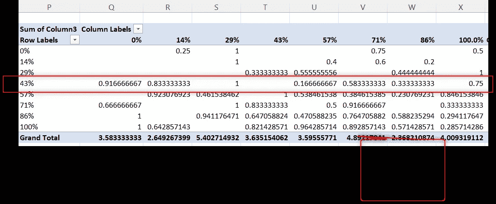

> 假设要过滤的行位于第 43 个百分点。现在想象随机数输出是 0.75。如果随机数输出是. 75，则大于该随机数输出的最小数是. 833333。

**这整个练习就好比说，当从状态 43%转换时，我们输出的随机数落在大于上一个桶的边缘的范围内，并且落在小于下一个桶的边界的桶内。让我们从另一个角度来看 43%。**

43%在“到”状态中有 7 种不同的可能性，它可以转换到“到”状态。57%的“到”状态有大约 17%的机会，86%的“到”状态有大约 17%的机会，71%的“到”状态有 25%的机会，下一个 100%的“到”状态有 17%的机会。在分布中，这意味着从数轴上的 0 开始，如果一个随机数在 0 到 0.17 之间，它有 17%的机会，我们可以将它分配到第一个“到”状态 57%，从 0.17 到大约 34% (.33333)，我们还有 17%，我们可以使用累积概率将它分配到下一个阶段 86%，以此类推。

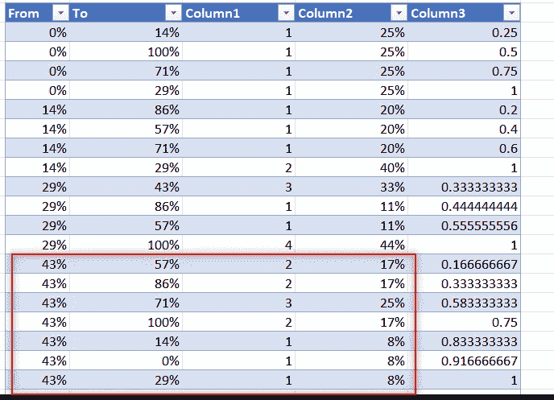

**因此，通过反向映射(查找)随机数落入的累积概率桶的“上边界”来确定“到”状态。**

现在，让我们做这个反向映射。在我们训练数据的下一列中，我们将把给出最小较高值的上一个公式的解包装到下面的筛选器中，以给出“to”状态:

```
=FILTER(Sheet1!$Q$3:$X$3,FILTER(Sheet1!$Q$4:$X$11,Sheet1!$P$4:$P$11=arxiv_combined_submissions_and_!G109)=arxiv_combined_submissions_and_!J109)
```

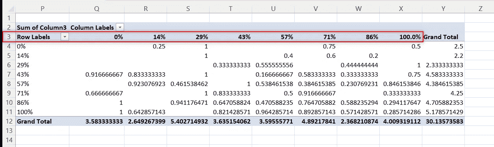

Q3 到 X3 范围是我们要筛选的数据，它是第一个参数，第二个参数是另一个筛选 Q4 到 X11 的过滤器(它是矩阵内的概率数据，当它等于我们编写的上一个算法的解时，它是这样的:

```
=MIN(FILTER(FILTER(Sheet1!$Q$4:$X$11,Sheet1!$P$4:$P$11=arxiv_combined_submissions_and_!G109),FILTER(Sheet1!$Q$4:$X$11,Sheet1!$P$4:$P$11=arxiv_combined_submissions_and_!G109)>=H109))
```

这意味着我们正在映射桶的上边界，在该边界内随机数下降到“to”状态，这在我们的数据透视表的列中。例如，数字. 83333(43%行中的第二个数字)映射到“到”状态中的 14%,依此类推。

现在我们有了“到”的百分位数，我们可以反向映射这个百分位数。

```
=PERCENTILE(C102:C109,K109)
```

请记住，百分位数是滚动的 8 天，所以当我们从百分位数返回数字时，我们必须从滚动的 8 天窗口获得数字。

在所示的百分比公式中，K109 是我们获得的“至”州百分比，然后我们从之前的 8 天窗口中获得对应于“至”州百分比的数字。

我们可以把这个公式拖下来得到数值。这是实际值与预测值的对比图:

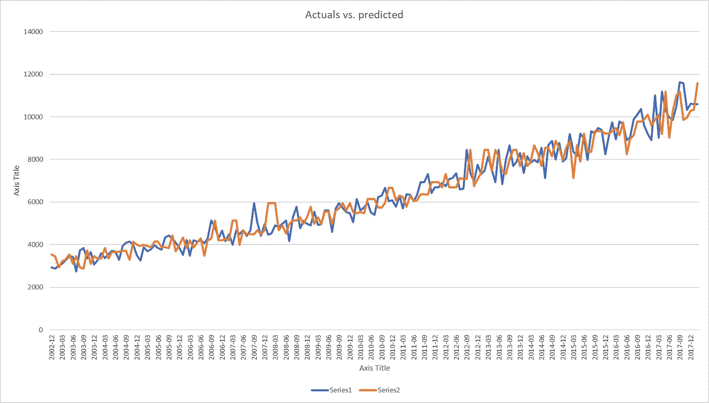

## 三。可视化误差指标

MAPE 可通过以下公式计算:

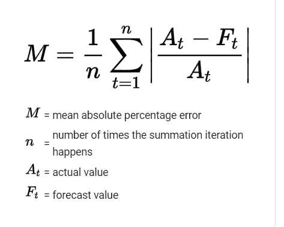

[https://en . Wikipedia . org/wiki/Mean _ absolute _ percentage _ error](https://en.wikipedia.org/wiki/Mean_absolute_percentage_error)

为此，我们可以计算每一行上的绝对误差。

```
=ABS(L109-C110)/C110
```

平均这些绝对误差，我们得到大约 6%到 7%的 MAPE。

然而，让我们想象一下这些错误是如何看起来更详细的视图。

在我们预测的测试中，有 74 次出现在 0 到 4%的绝对误差范围内，34 次在 4 到 8%的范围内，38 次在 8 到 12%的范围内，其余的误差值逐渐减小。

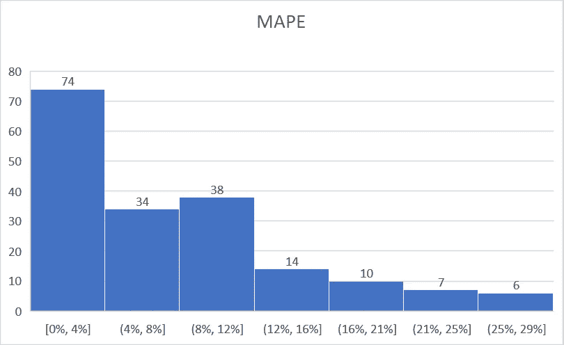

参考资料:

【https://data.world/classyprince/arxivcombineddata 1—T5