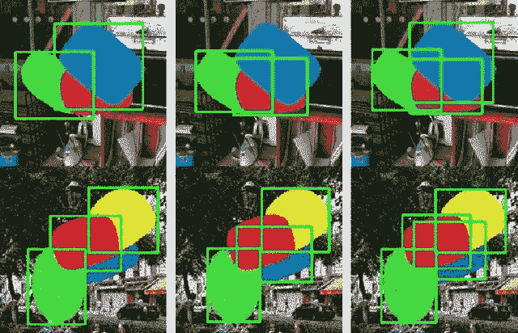
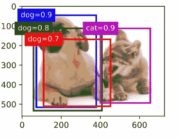
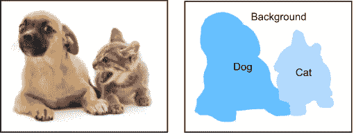

# 屏蔽 R-CNN 重叠包围盒问题

> 原文：<https://pub.towardsai.net/mask-r-cnn-overlapping-bounding-boxes-problem-a9582d41875b?source=collection_archive---------1----------------------->

[来源](https://www.researchgate.net/publication/324908056_Deep_Perm-Set_Net_Learn_to_Predict_Sets_with_Unknown_Permutation_and_Cardinality_Using_Deep_Neural_Networks) [1]

Mask R-CNN 是一种来自卷积神经网络的人工神经网络。它可以有效地检测图像中的对象，并为每个样本创建高质量的分割遮罩。

🔹更快的 R-CNN 通过在其网络中增加一个额外的分支来扩展现有的网络。

🔊你可以通过更快的 R-CNN 访问我在[之前发表的关于使用定制数据集的博文](/training-faster-r-cnn-using-tensorflow-object-detection-api-with-a-custom-dataset-88dd525666fd)。

🔹与更快的 R-CNN 不同，屏蔽 R-CNN 是为网络输入和输出之间的逐像素对齐 **(RoIAlign)** 而设计的。

🔔从零开始一步一步地创建一个掩模 R-CNN 项目；

🔔逐步在自定义数据集上创建掩膜 R-CNN 项目；

如果你已经有了一个 Mask R-CNN 项目，我想谈谈检测过程中可能出现的误差和阈值。正如我在题目中提到的， ***重叠的盒子*** 会造成区分物体的问题。如果只对一个类别和背景执行对象检测和分割，0.9 的阈值最初应该足够了。让我们一起深入了解一些配置文件。

上面的代码显示了如何创建一个示例配置类。变量***DETECTION _ MIN _ CONFIDENCE***紧跟在***STEPS _ PER _ EPOCH***变量之后，是我们的检测阈值变量。如代码中所述，如果图像中的对象以 90%或更高的概率被检测到，则给出类名。虽然这种情况有时是好的，但有时会导致不良的准确性。为此，我们应该充分了解数据，选择一个合适的阈值。

[来源](https://d2l.ai/chapter_computer-vision/anchor.html?highlight=threshold)【3】

让我们回顾一下我从《深入学习》的原始文档中获取的资料。例如，假设选择了 90%的检测置信度阈值。因此，在该图像中，仅检测到蓝色框中的狗和紫色框中的猫。因为低于 90%的阈值对象不幸将不会被检测到。

用**狗**和**猫**标签[4]分割的物体

## 屏蔽 R-CNN 重叠错误

如果您在 Mask R-CNN 项目中使用多个类，您很可能会得到与这些阈值相关的错误。我在下面添加了我之前在模特训练中得到的尺寸误差，供您查看。

1️⃣ **错误 1:**

> **IndexError** :布尔索引与维度 0 上的索引数组不匹配；

根据我对 Stackoverlow 的研究，我发现了这样一个解决方法:

👁‍🗨While 不是核心问题的修复，您仍然可以通过将 _idx 重新分配给正确长度的传入类 id 并将它们转换为 numpy 布尔类型来运行和训练代码。

2️⃣ **错误 2:**

另一个错误是 *AssertionError* 。在某些情况下，我们会面临由 **visualize** 函数引起的错误。误差的最大来源；
*** *没有实例可显示*****

🧵解决这种情况的方法很简单。您可以通过增加图形大小来可视化遮罩，如下所示。

3️⃣ **错误 3:**

如果你的问题仍然没有解决，我可以推荐以下 3 个解决方案。

在第一步中，应该降低☑️检测阈值。

☑️使用的 Scipy 库版本应该降级。

☑️️另外，mrcnn 文件夹中 utils.py 文件的[第 866 行应该修改。您在代码的第一行看到的 shift 变量应该替换为下面的行。](https://github.com/matterport/Mask_RCNN/blob/3deaec5d902d16e1daf56b62d5971d428dc920bc/mrcnn/utils.py#L866)

📣这样，所有的问题都解决了。祝你健康美好的日子。

🎉更多内容可以关注我的 [GitHub](https://github.com/BuseYaren) 、 [YouTube](https://www.youtube.com/channel/UCzAODG3wgdKtRov8VvyXvtw) 和 [Twitter](https://twitter.com/BuseYarenTekin) 。

## 参考

1.  深度 Perm-Set 网络:学习使用深度神经网络预测未知排列和基数的集合。
2.  He，k .，Gkioxari，g .，Dollár，p .，& Girshick，R. (2017 年)。屏蔽 r-cnn。IEEE 计算机视觉国际会议论文集(第 2961-2969 页)。
3.  [潜入深度学习，锚盒，https://d2l.ai/chapter_computer-vision/anchor.html?高亮=阈值](https://d2l.ai/chapter_computer-vision/anchor.html?highlight=threshold)。
4.  深入学习，语义分割，[https://d2l . ai/chapter _ computer-vision/Semantic-Segmentation-and-dataset . html](https://d2l.ai/chapter_computer-vision/semantic-segmentation-and-dataset.html)