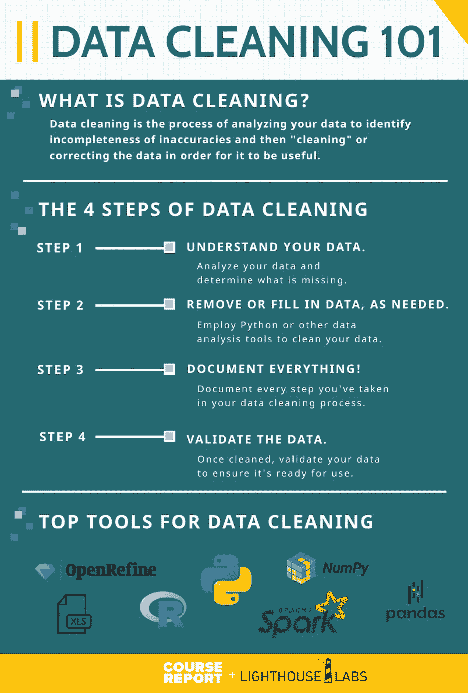
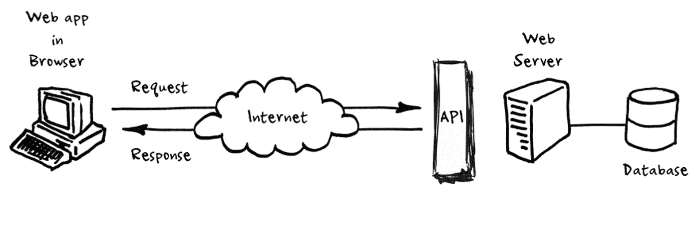
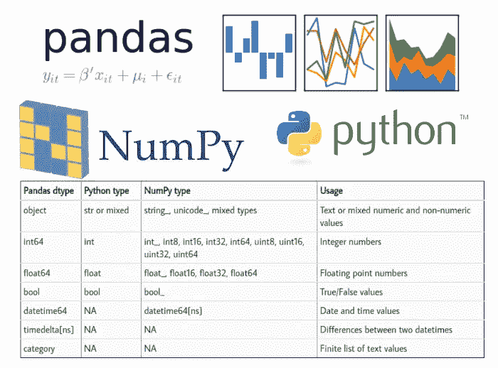
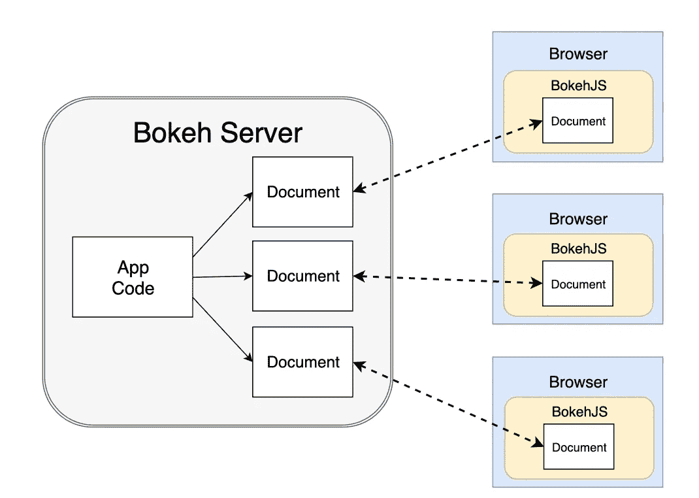

# 主数据争论第一:20 大 Python 库+最佳实践

> 原文：<https://pub.towardsai.net/master-data-wrangling-first-top-20-python-libraries-15-best-practices-a07ac7a26efd?source=collection_archive---------0----------------------->

## 过程、方法、前 20 名库，以及重要的最佳实践——如何使用 Python 完成这一切

由来自 Pexels 的 [Pixabay](https://www.pexels.com/@pixabay/)

# **定义数据角力**

数据争论是将数据从一种格式转换成另一种格式。Python 是处理数据争论的强大工具。

# **数据争论的程序步骤(持续更新)**

1.从各种来源导入数据

2.通过识别和删除无效或不正确的值来清理数据

数据清理。https://www . course report . com/blog/ultimate-guide-to-data-cleaning-with-python-light house-labs

3.格式化数据以便于使用和保持一致

4.通过添加导出值或计算值来丰富数据

5.整合来自多个来源的数据

6.标准化数据以校正单位或案例中的差异

7.重塑数据以促进分析

8.将数据分成训练集和测试集

9.汇总数据以对其进行总结或描述

10.可视化数据以探索和理解它

# **用于数据争论的途径或方法**

1.Web 抓取:从网站中提取数据。它可以手动完成，但通常是使用自动工具，如网络爬虫。

API。由[https://www . educative . io/answers/how-to-make-API-calls-in-python](https://www.educative.io/answers/how-to-make-api-calls-in-python)

2.API 调用:这是使用应用程序编程接口(API)从网站或应用程序请求数据的过程。

3.数据清理:识别和处理不正确、不完整或需要改进的数据的过程。

4.数据标准化:这确保了不同来源的数据是一致的和标准化的。

5.数据转换:将数据从一种格式转换成另一种格式，比如从 CSV 转换成 JSON。

6.数据聚合:将来自多个来源的数据整合到一个数据集中。

7.数据可视化:创建数据的可视化表示，如图表和图形。

8.数据分析:检查数据以发现趋势、模式和见解。

9.机器学习:使用算法从数据中学习并做出预测。

10.报告:基于数据创建报告。

由[https://pbpython.com/pandas_dtypes.html](https://pbpython.com/pandas_dtypes.html)

# **数据争论的十大 Python 库**

1.Pandas: Pandas 是一个强大的 Python 数据分析工具包，提供了许多处理数据的特性。它包括一个强大的 dataframe 对象，可用于数据争论。

2.Numpy: Numpy 是一个基本的 Python 科学计算包。它提供了一个高效的数组对象，对于数据争论特别有用。

3.Scipy: Scipy 是一个用于科学计算的 Python 库，它提供了大量处理数据的工具。它包括几个对数据争论有用的数值例程。

4.Statsmodels: Statsmodels 是一个用于统计分析的 Python 包，它提供了大量处理数据的工具。这对于将统计模型与数据进行拟合特别有用。

5.Scikit-learn: Scikit-learn 是一个 Python 的机器学习库，它提供了一系列处理数据的算法。它对于数据争论任务特别有用，例如特征提取和维数减少。

6.Matplotlib: Matplotlib 是一个 Python 绘图库，提供了各种处理数据的绘图函数。它对于创建数据的可视化很方便。

7.Seaborn: Seaborn 是一个 Python 数据可视化库，提供了各种绘图函数来处理数据。它有利于创建漂亮的可视化数据。

由[https://docs . bokeh . org/en/latest/docs/user _ guide/server . html](https://docs.bokeh.org/en/latest/docs/user_guide/server.html)

8.Bokeh: Bokeh 是一个 Python 数据可视化库，它为处理数据提供了各种交互式绘图功能。它有利于创建数据的交互式可视化。

9.Ggplot2: Ggplot2 是一个流行的 Python 数据可视化库，它提供了各种处理数据的函数。它有利于创建优雅的数据可视化。

10.Plotly: Plotly 是一个 Python 数据可视化库，提供了各种交互式绘图功能来处理数据。它可以方便地创建丰富的、交互式的数据可视化。

来自 Pexels 的 [SevenStorm JUHASZIMRUS](https://www.pexels.com/@sevenstormphotography/)

# **使用 Python 为数据争论引入了额外的库/方法**(持续更新)

1.使用 Python 库 Pandas 从各种来源(例如 CSV 文件、Excel 文件、数据库)读入数据，然后处理这些数据以更好地满足您的需求。

2.Re 模块解析字符串并从中提取您需要的数据。

3.CSV 模块来读写 CSV 文件。

4.JSON [5]库来读写 JSON 文件。

5.XML 处理模块[6]读写 XML 文件。

6.SQLite 库来读写 SQLite 数据库[7]。

7.Psycopg 库读写 PostgreSQL 数据库[8]。

8.PyMongo Python 发行版[9]来读写 MongoDB 数据库。

9.PIL 图书馆[10]解析和处理图像。

10.Pygments 库解析并突出显示源代码[11]。

来自 Pexels 的 Anna Nekrashevich

# **数据争论最佳实践**(持续更新)

1.为工作使用正确的工具:为手头的工作选择正确的工具。Python 有各种各样的库和工具来处理数据，允许有许多选项来选择最适合您需求的一个。

2.了解你的数据:在你开始争论之前，了解你的数据是很重要的。这意味着理解数据的结构、值的含义以及不同字段之间的关系。

3.小心处理丢失的数据:丢失的数据可能是争论数据时的一个问题。确保以适合您的数据和分析的方式处理缺失的数据。

4.保持数据整洁:整洁的数据更容易处理，并使您的分析更具可重复性。当争论数据时，尽量保持你的数据整洁。

5.智能地转换数据:只以对您的分析有意义的方式转换数据。避免不必要的转换，并确保记录您所做的所有转换，以便您的分析是可重复的。

6.不要忘记异常值:异常值会显著影响您的数据和分析。因此，确保以适合您的数据和分析的方式检测和处理异常值。

7.尽可能自动化:自动化您的数据争论步骤可以节省您的时间和精力。如果可能，尽可能多地自动化数据争论过程。

来自佩克斯的尼古拉·伊万诺夫

8.记录一切:记录对于数据争论是至关重要的，就像对于任何其他过程一样。记录您的数据、争论过程和分析。

9.使用版本控制:版本控制可能是数据争论的有用工具。它可以帮助您跟踪数据的变化，并保持争论过程的可重复性。

10.想想效率:数据争论可能是一个耗时的过程。当争论数据时，想想让你的过程更有效率的方法。

11.使用合适的格式:你的数据格式会影响你的争论过程。选择一种非常适合手头任务的格式。

12.预处理您的数据:预处理您的数据可以在争论过程中节省您的时间和精力。确保以适合您需求的方式预处理您的数据。

13.测试你的争论代码:像任何其他代码一样，测试你的数据争论代码。这将有助于确保您的代码按预期工作，并有助于捕捉任何错误。

14.优化您的代码:优化您的代码可以使您的数据争论过程更加有效。请确保针对速度和内存使用优化您的代码。

15.剖析你的代码:剖析你的代码可以帮助你识别数据争论过程中的瓶颈。请确保对您的代码进行概要分析，以优化其性能。

来自 Pexels 的 Kristina Paukshtite

# **Python 在数据角力中大放异彩的原因**

1)标准库丰富且可移植[2]，使其成为数据争论的优秀语言。

2) Python 的“包含电池”[1]方法意味着许多有用的数据争论库开箱即用。

3)语法清晰简洁，便于代码的读写。

4)面向对象，便于将数据角力代码封装成可重用的类和库。

5) Python 的动态类型化系统允许数据角力代码被容易地扩展和修改。

6)异常处理系统[3]可以轻松优雅地处理错误和意外数据。

7) Python 的缩进规则[4]使代码易于阅读和理解。

8)对多种编程范例的支持使得编写可维护且高效的代码变得容易。

9)大量的标准库和第三方库意味着用 Python 无法完成的任务不在少数。

10)免费开源，易于获取和使用。

11) Python 可以很容易地与其他软件集成，使其成为一个强大的数据分析和可视化工具。

12)代码可以在很多平台上运行，具有很高的可移植性。

13) Python 代码通常比用其他语言编写的代码更短、更简单，更易于维护和调试。

14)数据结构和运算使得简洁高效地表达算法变得容易。

15) Python 的解释器可以嵌入到其他软件中，使得使用 Python 进行脚本编写和软件自动化成为可能。

如果您有任何编辑/修改建议或关于进一步扩展此主题的建议，请考虑与我分享您的想法。

# **另外，请考虑订阅我的每周简讯:**

 [## 周日报告#1

### 设计思维与 AI 的共生关系设计思维能向 AI 揭示什么，AI 又能如何拥抱…

pventures.substack.com](https://pventures.substack.com/) 

*参考文献:*

*【1】。包括电池。*[*http://CSC . UC Davis . edu/~ CMG/Group/readings/python issue _ 1of 4 . pdf*](http://csc.ucdavis.edu/~cmg/Group/readings/pythonissue_1of4.pdf)

*【2】。丰富便携。*[*https://slide to doc . com/windows-system-programming-using-python-mark-Hammond-mhammondskippinet/*](https://slidetodoc.com/windows-system-programming-using-python-mark-hammond-mhammondskippinet/)

*【3】。异常处理。*

**【4】。缩进规则。*[*https://srini MF . com/2019/10/13/python-code-indentation-rules-handy-guide/*](https://srinimf.com/2019/10/13/python-code-indentation-rules-handy-guide/)*

**【5】。JSON。*[*https://www.w3schools.com/python/python_json.asp*](https://www.w3schools.com/python/python_json.asp)*

**【6】。XML。*[【https://docs.python.org/3/library/xml.html】T21](https://docs.python.org/3/library/xml.html)*

**【7】。SQLite。*[*https://www.sqlitetutorial.net/sqlite-python/*](https://www.sqlitetutorial.net/sqlite-python/)*

**【8】。心理警察。*[*https://pypi.org/project/psycopg2/*](https://pypi.org/project/psycopg2/)*

**【9】。PyMongo Python 发行版。*[*https://pymongo.readthedocs.io/en/stable/*](https://pymongo.readthedocs.io/en/stable/)*

**【10】。枕头(PIL)。*[*https://pillow.readthedocs.io/en/stable/*](https://pillow.readthedocs.io/en/stable/)*

**【11】。色素沉着。*[*https://pygments.org*](https://pygments.org/)*