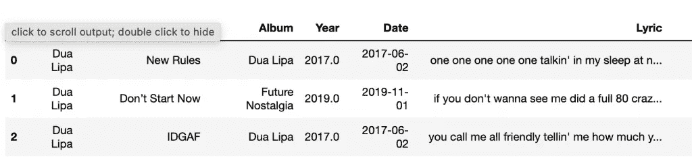
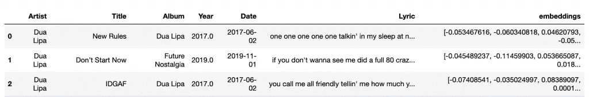
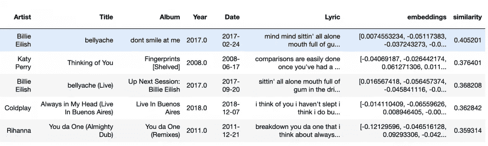
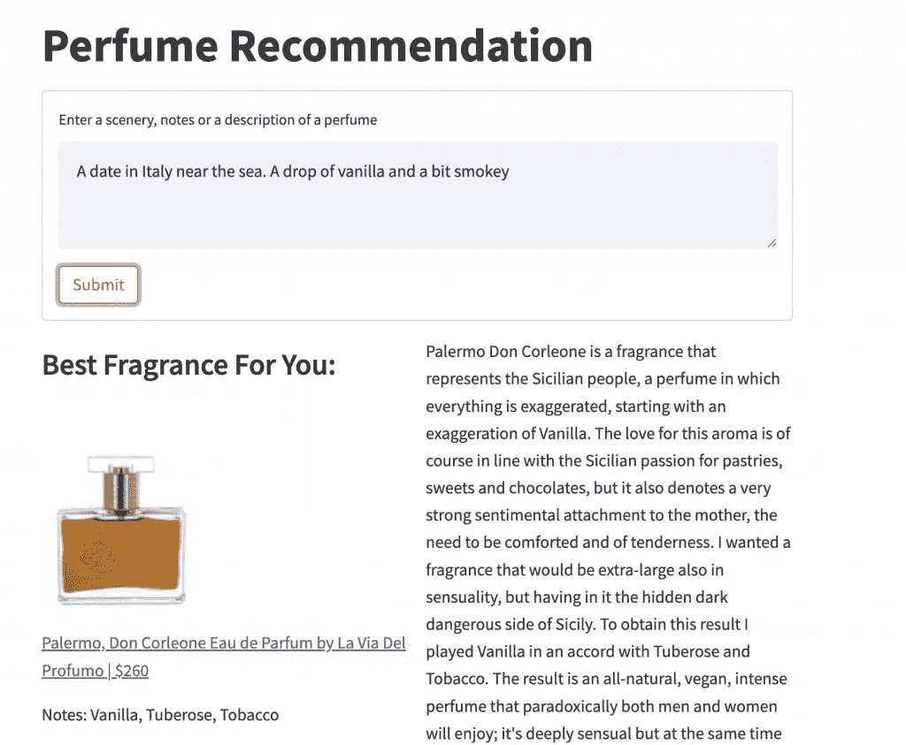
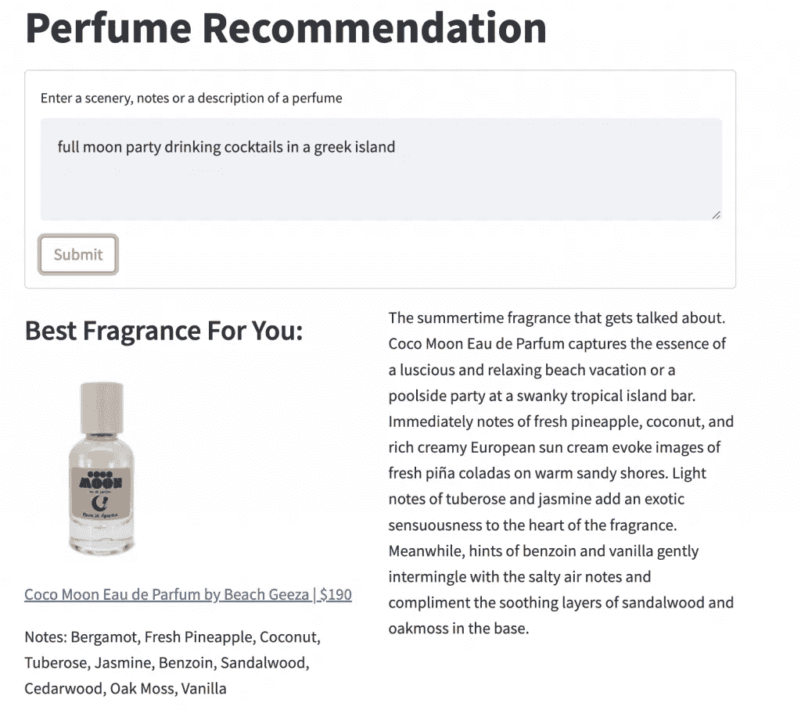

# 掌握句子相似性的句子转换工具

> 原文：<https://pub.towardsai.net/mastering-sentence-transformers-for-sentence-similarity-342beb562d45?source=collection_archive---------2----------------------->

## 根据语义在 Python 中找到最相似的句子


帕特里克·托马索在 Unsplash[上的照片](https://unsplash.com/s/photos/text?utm_source=unsplash&utm_medium=referral&utm_content=creditCopyText)

句子转换器是一个 Python 框架，用于句子的最新矢量表示。有了空间中的句子，我们可以计算它们之间的距离，这样，我们可以根据它们的语义找到最相似的句子。

举个例子，假设我们有这两个句子:

```
Coffee makes mornings better.Morning walks tend to start and end your day in a good mood.
```

我们想找出与下面这句话最相似的句子:

```
i like a nice cup of tea in the morning.
```

最接近的句子是“咖啡让早晨更美好。”因为他们都在谈论早上的饮料。即使他们不使用相同的单词，他们的矢量表示也会彼此接近。

# 余弦相似性

为了获得两个句子向量的相似度，我们使用余弦相似度(1-余弦距离)。这是因为向量的方向在它们的语义中起着巨大的作用。例如，“咖啡”和“茶”的向量可能指向大致对应于“早晨饮料”的方向。现在，假设我们有向量 a=[1，1，-1]，b=2a=[2，2，-2]。这两个向量大小不同，但方向相同。它们的余弦距离是 0，但它们的欧几里德距离，不考虑方向，是 4.58，在完全不同的方向上，很容易找到另一个距离更小的向量。

# 最相似的歌词

在本帖中，我们将使用 Kaggle 提供的[歌曲歌词数据集](https://www.kaggle.com/datasets/deepshah16/song-lyrics-dataset?resource=download)，给定文本输入，我们将找到歌词最相似的歌曲。

管道如下:

1.  获取数据集中每个歌词的嵌入
2.  获取文本输入的嵌入
3.  计算文本输入与每个歌词的余弦相似度
4.  返回相似度最高的歌曲

首先，你需要安装句子转换器。

`pip install -U sentence-transformers`

然后，导入必要的库。

```
import pandas as pd
import numpy as np
from scipy import spatial
from sentence_transformers import SentenceTransformer

model = SentenceTransformer('sentence-transformers/all-MiniLM-L6-v2')
```

我们使用的是“ **all-MiniLM-L6-v2** ”相关模型，但是您可以在 [SBERT 模型页面](https://www.sbert.net/docs/pretrained_models.html)上找到更多的句子转换器。

我们来读一读，看看数据。

```
df.read_csv('lyrics.csv')
df.head(3)
```



现在，为了获得歌词的嵌入，我们使用了 **model.encode** 函数。

```
df=df.assign(embeddings=df['Lyric'].apply(lambda x: model.encode(x)))
df.head(3)
```



如您所见，我们得到了一个数据集，其中包含歌曲的属性以及歌词嵌入。

最后，我们创建了一个函数来获取输入的嵌入，然后计算余弦相似度，即 1-余弦距离，然后返回具有最高余弦相似度的 5 首歌曲。

```
def closest_lyrics(inp):
    data=df.copy()
    inp_vector=model.encode(inp)
    s=data['embeddings'].apply(lambda x: 1 - spatial.distance.cosine(x, inp_vector) )
    data=data.assign(similarity=s)
    return(data.sort_values('similarity',ascending=False).head(5))
```

让我们来试试:

`closest_lyrics('thinking about you')`



如你所见，我们得到了与输入相关的歌曲。

# 示例应用

举个例子，我创建了一个[香水推荐应用](https://billybonaros-perfume-recommendations-app-xxl8yy.streamlitapp.com/)，它根据风景、笔记或对香水的描述来推荐香水。



# 总结一下

在这篇文章中，我们讨论了如何使用句子转换器来表示空间中的句子，以及如何使用余弦相似度根据语义找到最相似的句子。

# 感谢您的阅读！

*   订阅我的[简讯](https://billybonaros.medium.com/subscribe)
*   在 Linkedin 上关注我

*最初发表于*[*https://predictivehacks.com。*](https://predictivehacks.com/mastering-sentence-transformers-for-sentence-similarity/)

参考文献:
1。歌词数据集|Kaggle，许可证:CC0 公共领域。[来源](https://www.kaggle.com/datasets/deepshah16/song-lyrics-dataset?resource=download)